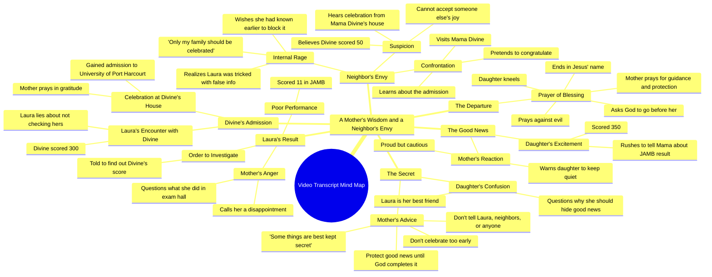

# Son Tells Mother He Passed His JAMB Exam

> 🌐 **Read this in:** **English** · [中文](../../zh-CN/2026-09/tiktok-transcript-full-story-based-on-true-life-experience-aigenerated-fyp-vir-8d87.md)

> **Creator:** [@omoai7](https://www.tiktok.com/@omoai7) · **Views:** 3.6M · **Posted:** 2026-09-12 · **Niche:** entertainment
>
> **TL;DR:** The immediate shushing and secrecy create instant intrigue and suspense.

[Watch original video →](https://vm.tiktok.com/ZN8jY6mx7/)

## Why This Went Viral

## Hook (first 3 seconds)
- Verbatim opening line: "Mama! Mama, I have good news. Shh! Lower your voice. Let's go inside."
- Hook pattern: **Contrast / interrupted excitement** (a joyful announcement immediately met with a hushed, urgent "Shh!" and a demand to go inside).
- Why it stops the scroll: The emotional mismatch is instant and unresolved. A child's excitement colliding with a parent's secrecy creates an open loop — the viewer needs to know *why* good news must be hidden. The raised "Mama!" also reads as real family drama, not scripted content, which lowers the viewer's ad-detection reflex.

## Emotional Rhythm
- **0–5s — Curiosity spike:** "Shh! Lower your voice" plants a question (why hide good news?).
- **5–20s — Pride + confusion:** The JAMB score reveal ("I scored 3:50") delivers a small payoff, then the mother's warning ("I don't want you telling this to anyone") re-opens tension.
- **20–40s — Suspense via contrast:** Cut to Laura's result ("11") and the mother's humiliation. The viewer now suspects the two families are being set up against each other.
- **40–60s — Audience self-insertion:** Divine's vague "Not yet" and "300" create dramatic irony — the viewer knows more than the characters.
- **60–90s — Resonance + prayer:** The admission celebration and prayer ("May every parent waiting for good news receive their own testimony") converts the drama into shared aspiration — the moment many viewers screenshot or comment "Amen."
- **Climax:** The neighbour's spiral — "No, no, no, no! What a useless daughter I have!... I don't want joy in any family but mine." This is the emotional peak: envy exposed in full.
- **Resolution:** The closing prayer scene reframes the story as a moral lesson, releasing tension into catharsis.

## Keyword Density
- **Mama** (highest frequency) — drives emotional pull; signals family drama to the algorithm's audience-matching.
- **JAMB / JMB** — topical keyword; anchors the video to a massive Nigerian search/interest cluster (exam results season).
- **Admission / university** — algorithmic reach; matches high-intent search terms.
- **Good news / celebrate / celebration** — emotional pull; the thematic spine.
- **Score / 3:50 / 11 / 300 / 50** — numbers; concrete, screenshot-able, comment-baiting.
- **Secret / hide / secretive** — emotional pull; the moral tension.
- **Laura / Divine** — character anchors; make the story feel real and referable.
- **Thank you / Amen / Jesus** — resonance keywords; trigger comment-section "Amen" engagement, which boosts reach.

## Why It Spreads
- **Two-family mirror structure invites comparison.** The transcript pairs Mama Divine's humble secrecy ("Protect your good news until God completes it") with Mama Laura's envy ("I don't want joy in any family but mine"). Viewers pick a side and comment — the strongest comment-driver in the video.
- **A moral lesson wrapped in a soap opera.** The line "Never celebrate too early" gives the drama a shareable takeaway, so viewers forward it as advice, not just entertainment.
- **Prayer as a share trigger.** "May every parent waiting for good news receive their own testimony" turns the ending into a blessing viewers tag friends and family into — a built-in distribution mechanic in religious/aspirational content.
- **Dramatic irony keeps retention high.** The viewer learns Divine scored 300 while Laura's mother believes "50" — the gap ("They deliberately lied to her") sustains watch time to the reveal.
- **Villain with a universal flaw.** "Why should she be celebrating when I'm not?" names envy directly. Viewers recognize someone they know, which fuels duets, stitches, and quote-tweets.

## What You Can Steal
- **Open with an emotional mismatch, not a setup.** Start mid-conflict — excitement vs. secrecy, pride vs. shame — and let the viewer's brain fill the gap. Skip the exposition.
- **Plant a "moral line" at the midpoint.** One quotable sentence ("Protect your good news until God completes it") converts your story into something viewers can repeat, caption, and share.
- **End with a blessing or a question aimed at the audience.** Replace a generic CTA with a line that invites participation ("May every parent waiting...") — it turns passive viewers into commenters and taggers.

## Mind Map

## Full Transcript (Generated by [TokTranscript](https://toktranscript.com/?utm_source=github&utm_medium=breakdown&utm_campaign=tool_attribution))

> 📝 Transcripts on this page are auto-generated and show the first 60%. Want to transcribe any TikTok in 30 seconds and get the full version? [Try TokTranscript free →](https://toktranscript.com/?utm_source=github&utm_medium=breakdown&utm_campaign=transcript_cta)

Mama! Mama, I have good news. Shh! Lower your voice. Let's go inside. Mama, what's wrong? Is everything okay? Everything is fine. Just follow me. Mama, why did you stop me? I was so excited. I couldn't wait to tell you the good news. I know. So what's the good news? Mama, I passed my JAMB. I scored 3:50. Oh, my daughter, I'm so proud of you. You've made me very happy. Mama, I can't wait to tell Laura. She'll be so happy for me. Listen to me carefully. I don't want you telling this to anyone. Not Laura, not the neighbors, nobody. Do you understand? Mama, Laura is my best friend. Why should I hide something so good from her? Because some things are best kept secret. And this is only the beginning. You passed JMB. You haven't gained admission, and you haven't entered the university. Never celebrate too early. Protect your good news until God completes it. Oh, okay, Mom. Laura, let me see your result. Mama, give it to me. 11. You scored 11, Laura. Mama, I don't understand. I answered the questions. I think they mixed up my score. Enough! Always one disappointment after another. How does someone score 11? What were you doing in that exam hall? I'm sorry, Mama. I'll do better next time. What about divine? Has she checked his? I don't know. I haven't asked. Go find out today. I want to know exactly what she scored. Okay, Mama. Divine. Divine! Hi, Laura, how are you? I'm fine. Have you checked your JMB results yet? Um. Um. Not yet. What about you? Have you checked yours? Yes. Oh really? How is it? Fine. I scored 300. Wow, 300! That's big. Thank you. When are you checking yours? Soon. Okay. Mama! Mama! What is it? My daughter? Mama, I've gained admission. I've been admitted to the university of Port Harcourt. Oh, my father, king of kings, receive all the honour. You have remembered the labour of this child. Thank you. May every parent waiting for good news receive their own testimony. May every child trusting you for open doors be remembered by your mercy. The same god who has done this for us will do it for them. Amen. What is this sound of joy and happiness I'm hearing from Mama Divine's house? What are they celebrating? Laura told me divine scored 50 in JAMB. There's no way she would gain admission with such low score. So what could they possibly be celebrating? No, something isn't right. I must find out.

*[Read the full transcript on TokTranscript →](https://toktranscript.com/plaza/tiktok-transcript-full-story-based-on-true-life-experience-aigenerated-fyp-vir-8d87?utm_source=github&utm_medium=breakdown&utm_campaign=transcript_full)*

## Browse More

- All [entertainment](../../by-niche/en/entertainment.md) breakdowns
- All [Urgent Secret](../../by-pattern/en/hook-urgent-secret.md) examples

## Video Info

| | |
|---|---|
| Creator | [@omoai7](https://www.tiktok.com/@omoai7) |
| Original video | [https://vm.tiktok.com/ZN8jY6mx7/](https://vm.tiktok.com/ZN8jY6mx7/) |
| Original title | Full story based on true life experience.#aigenerated #fyp #viralvideos  |
| Views | 3.6M (3600000) |
| Posted | 2026-09-12 |
| Duration | 0s |
| Niche | `entertainment` |
| Hook pattern | `Urgent Secret` |
| Original language | `en` |
| Available languages | en, zh-CN |
| Generated | 2026-09-14 by [TokTranscript](https://toktranscript.com/) |

---

*This breakdown is for educational analysis under fair use. Original video © [@omoai7](https://www.tiktok.com/@omoai7). All transcripts are auto-generated and may contain errors.*

*Want to analyze your own TikToks like this? [free TikTok transcript generator →](https://toktranscript.com/viral-breakdown?utm_source=github&utm_medium=breakdown&utm_campaign=footer_cta)*