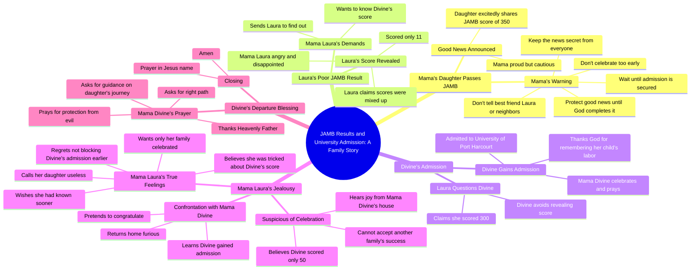

# Son Tells Mother He Passed His JAMB Exam

> 🌐 **Read this in:** **English** · [中文](../../zh-CN/2026-09/tiktok-transcript-full-story-based-on-true-life-experience-aigenerated-fyp-vir-f898.md)

> **Creator:** [@omoai7](https://www.tiktok.com/@omoai7) · **Views:** 3.6M · **Posted:** 2026-09-12 · **Niche:** entertainment
>
> **TL;DR:** The immediate shushing creates intrigue and signals a hidden conflict, compelling viewers to keep watching.

[Watch original video →](https://vm.tiktok.com/ZN8jYec3s/)

## Why This Went Viral

## Hook (first 3 seconds)
- **Verbatim:** "Mama! Mama, I have good news." — a breathless, high-energy entrance immediately followed by "Shh! Lower your voice. Let's go inside."
- **Hook pattern:** Scene + contrast (excited daughter vs. secretive, hushed mother). It opens mid-action with zero setup.
- **Why it stops the scroll:** A loud emotional spike ("I have good news") collides instantly with a suppression signal ("Shh! Lower your voice"). That contradiction — joy being *hidden* — creates an unresolved question in under 3 seconds: *why would good news need to be whispered?* The viewer's brain can't close that loop without watching.

## Emotional Rhythm
- **0–15s — Curiosity + tension:** Daughter is excited; mother shuts her down and drags her inside. The "secret" framing hooks attention.
- **15–40s — Pride → intrigue:** "I scored 3:50" (JAMB score) delivers payoff, then immediately pivots to the mother's rule: "Don't tell anyone. Not Laura, not the neighbors." Curiosity deepens.
- **40–60s — Contrast beat (Laura):** Hard cut to Laura scoring **11**. Emotional whiplash — the audience's sympathy and superiority both spike.
- **60–90s — Suspense:** Laura is sent to spy on Divine. Divine deflects ("Not yet"). The audience now *knows* something Laura doesn't — dramatic irony locks attention.
- **90–120s — Relief + resonance:** Divine gains admission. Prayer scene. Emotional release and communal payoff ("May every parent waiting… receive their own testimony").
- **120–160s — Villain reveal:** Mama Laura's monologue exposes envy: "No Celebration should happen in this compound unless it's coming from my family."
- **Climax moment:** "If only I had known on time, I would have definitely blocked it. Now it's too late. Everything is ruined." — the villain's confession of intent to sabotage. This is the peak.
- **Ending — Resolution:** The prayer over the daughter leaving for school closes the loop with peace and vindication.

## Keyword Density
- **Mama** — anchors every scene, drives relatability and family framing
- **JAMB / score / result** — the plot engine; searchable, topical, algorithmically strong in Nigerian/African short-form feeds
- **Admission / university** — the stakes; the "win" condition
- **Good news / celebrate / celebration** — the emotional thesis of the video
- **Secret / hide / keep quiet** — the tension generator
- **Laura / Divine** — character anchors for callbacks and comments
- **"If only I had known"** — the regret hook that fuels comment-section debate
- **Envy / neighbour / compound** — the social-observation keyword that makes it feel "real"

**Algorithmic reach drivers:** JAMB, admission, university, score — these are high-search, high-relevance terms in a specific regional audience, boosting distribution and rewatch.
**Emotional pull drivers:** good news, secret, celebrate, "if only I had known" — these trigger shares, comments, and "this is my aunty" tagging behavior.

## Why It Spreads
- **Dramatic irony as an attention trap.** The audience learns Divine's real score (300) before Laura does ("I scored 300… soon" vs. Laura's later claim of "50"). Viewers stay to see the lie unravel — and the payoff lands at "They deliberately lied to her."
- **A universally recognizable villain.** Mama Laura's lines — "Only my family should be celebrated, no one else" — map onto a real social archetype (the envious relative/neighbor). Viewers tag people they know, which is a primary share driver.
- **Moral payoff with a prayer.** The closing prayer ("May every parent waiting for good news receive their own testimony") converts a drama into a *blessing*, making it shareable to religious/community groups without feeling gossipy.
- **Quotable, screenshot-able lines.** "Never celebrate too early. Protect your good news until God completes it" is a standalone aphorism — perfect for captions, duets, and reposts.
- **Twist + regret ending.** "If only I had known on time, I would have definitely blocked it" gives the villain a self-incriminating confession — the exact kind of line that fuels outrage comments and re-shares.

## What You Can Steal
1. **Open mid-conflict, not mid-setup.** Start on the loudest emotional line ("Mama! I have good news") and immediately contradict it ("Shh! Lower your voice"). Skip the exposition — let the contradiction be the hook.
2. **Build with dramatic irony.** Let the audience know a truth one character doesn't. It converts passive watching into "I need to see them find out" — the strongest retention mechanic in short-form drama.
3. **End on a quotable moral or blessing.** Turn your story's lesson into one clean, shareable line ("Protect your good news until God completes it"). It gives viewers a reason to save, repost, and tag — the three actions that actually push a video.

## Mind Map

## Full Transcript (Generated by [analyze your own TikToks](https://toktranscript.com/?utm_source=github&utm_medium=breakdown&utm_campaign=tool_attribution))

> 📝 Transcripts on this page are auto-generated and show the first 60%. Want to transcribe any TikTok in 30 seconds and get the full version? [Try TokTranscript free →](https://toktranscript.com/?utm_source=github&utm_medium=breakdown&utm_campaign=transcript_cta)

Mama! Mama, I have good news. Shh! Lower your voice. Let's go inside. Mama, what's wrong? Is everything okay? Everything is fine. Just follow me. Mama, why did you stop me? I was so excited. I couldn't wait to tell you the good news. I know. So what's the good news? Mama, I passed my JAMB. I scored 3:50. Oh, my daughter, I'm so proud of you. You've made me very happy. Mama, I can't wait to tell Laura. She'll be so happy for me. Listen to me carefully. I don't want you telling this to anyone. Not Laura, not the neighbors, nobody. Do you understand? Mama, Laura is my best friend. Why should I hide something so good from her? Because some things are best kept secret. And this is only the beginning. You passed JMB. You haven't gained admission, and you haven't entered the university. Never celebrate too early. Protect your good news until God completes it. Oh, okay, Mom. Laura, let me see your result. Mama, give it to me. 11. You scored 11, Laura. Mama, I don't understand. I answered the questions. I think they mixed up my score. Enough! Always one disappointment after another. How does someone score 11? What were you doing in that exam hall? I'm sorry, Mama. I'll do better next time. What about divine? Has she checked his? I don't know. I haven't asked. Go find out today. I want to know exactly what she scored. Okay, Mama. Divine. Divine! Hi, Laura, how are you? I'm fine. Have you checked your JMB results yet? Um. Um. Not yet. What about you? Have you checked yours? Yes. Oh really? How is it? Fine. I scored 300. Wow, 300! That's big. Thank you. When are you checking yours? Soon. Okay. Mama! Mama! What is it? My daughter? Mama, I've gained admission. I've been admitted to the university of Port Harcourt. Oh, my father, king of kings, receive all the honour. You have remembered the labour of this child. Thank you. May every parent waiting for good news receive their own testimony. May every child trusting you for open doors be remembered by your mercy. The same god who has done this for us will do it for them. Amen. What is this sound of joy and happiness I'm hearing from Mama Divine's house? What are they celebrating? Laura told me divine scored 50 in JAMB. There's no way she would gain admission with such low score. So what could they possibly be celebrating? No, something isn't right. I must find out.

*[Read the full transcript on TokTranscript →](https://toktranscript.com/plaza/tiktok-transcript-full-story-based-on-true-life-experience-aigenerated-fyp-vir-f898?utm_source=github&utm_medium=breakdown&utm_campaign=transcript_full)*

## Browse More

- All [entertainment](../../by-niche/en/entertainment.md) breakdowns
- All [Urgent Secret](../../by-pattern/en/hook-urgent-secret.md) examples

## Video Info

| | |
|---|---|
| Creator | [@omoai7](https://www.tiktok.com/@omoai7) |
| Original video | [https://vm.tiktok.com/ZN8jYec3s/](https://vm.tiktok.com/ZN8jYec3s/) |
| Original title | Full story based on true life experience.#aigenerated #fyp #viralvideos  |
| Views | 3.6M (3600000) |
| Posted | 2026-09-12 |
| Duration | 0s |
| Niche | `entertainment` |
| Hook pattern | `Urgent Secret` |
| Original language | `en` |
| Available languages | en, zh-CN |
| Generated | 2026-09-13 by [TokTranscript](https://toktranscript.com/) |

---

*This breakdown is for educational analysis under fair use. Original video © [@omoai7](https://www.tiktok.com/@omoai7). All transcripts are auto-generated and may contain errors.*

*Want to analyze your own TikToks like this? [free TikTok transcript generator →](https://toktranscript.com/viral-breakdown?utm_source=github&utm_medium=breakdown&utm_campaign=footer_cta)*