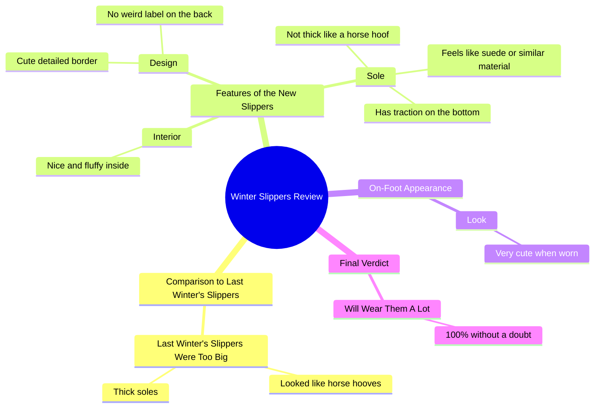

# Fluffy Winter Boots That Beat Horse Hoof Look

> 🌐 **Read this in:** **English** · [中文](../../zh-CN/2026-09/tiktok-transcript-i-will-proudly-wear-these-because-i-don-t-feel-like-a-wannab-84a8.md)

> **Creator:** [@lifesrad](https://www.tiktok.com/@lifesrad) · **Views:** 5.3M · **Posted:** 2026-09-22 · **Niche:** other
>
> **TL;DR:** Immediately contrasts with a negative past experience to highlight the improvement.

[Watch original video →](https://www.tiktok.com/@creator/video/7400401284945333550)

## Why This Went Viral

## Hook (first 3 seconds)
- Verbatim opening: "these ones are SO MUCH CUTER than the ones I had last winter"
- Hook pattern: **Contrast + bold claim** (new vs. old, with an emphatic superlative "SO MUCH CUTER")
- Why it stops the scroll: It drops the viewer mid-comparison with no setup — the brain needs the missing context ("cuter than *what*?"). The all-caps "SO MUCH" signals strong opinion, which reads as authentic rather than scripted. It also pre-qualifies the audience: anyone who bought the wrong winter boots last year is instantly hooked.

## Emotional Rhythm
- **Curiosity** — "cuter than the ones I had last winter" creates an open loop about the old pair.
- **Comic disgust / validation** — "HUGE… looked like horse hooves" is the tension beat; it's funny and relatable (buyer's remorse).
- **Relief / payoff** — "but these… nice and fluffy… cute detailed border" resolves the tension with sensory detail.
- **Micro-twist** — "no weird label on the back" and "traction on the bottom" are unexpected specifics that feel like insider intel.
- **Climax** — the try-on: "here's what they look like on so cute." Visual proof is the emotional peak.
- **Resolution / commitment** — "100% without a doubt, I will be wearing these A LOT" closes with certainty.

## Keyword Density
- **"cuter / cute"** (repeated 3x) — emotional pull; the core value proposition.
- **"horse hooves"** (2x) — the memorable, screenshot-able phrase; drives shares and comments.
- **"last winter"** (2x) — temporal anchor that makes the comparison concrete.
- **"fluffy"** — sensory/tactile keyword; drives desire.
- **"sole / thick"** — objection-handling keyword; addresses the #1 boot complaint.
- **"traction"** — utility keyword; converts skeptics.
- **"weird label"** — specificity keyword; signals "I actually inspected these."
- **"so much / a lot"** — intensity modifiers that boost emotional signal.
- **Algorithmic reach drivers:** "cute," "fluffy," "winter," "sole" — high-search, high-intent commerce terms.
- **Emotional pull drivers:** "horse hooves," "SO MUCH CUTER," "weird label" — these are what people quote in comments.

## Why It Spreads
- **The "horse hooves" line is a shareable meme.** "They literally looked like horse hooves on me" is visual, absurd, and self-deprecating — the exact kind of line people screenshot or repeat in comments.
- **It's a comparison, not a review.** Framing against "the ones I had last winter" gives viewers a before/after arc, which is inherently more watchable than a flat product description.
- **Specificity builds trust fast.** "No weird label on the back," "traction on the bottom," "feels like suede" — these micro-details read as unsponsored and honest, which lowers ad-detection defenses and boosts completion rate.
- **It answers objections before they're asked.** "The sole is not thick like a horse hoof" preempts the #1 complaint about chunky winter boots, making the video useful, not just entertaining.
- **The try-on is the payoff shot.** "Here's what they look like on" delivers the visual reward the hook promised — this is the moment that drives saves and rewatches.

## What You Can Steal
- **Open mid-comparison.** Start with "this is so much better than [the thing I used before]" instead of introducing yourself or the product. The missing context is the hook.
- **Give your old problem a nickname.** "Horse hooves" is sticky because it's a vivid image. Name your past pain point with a metaphor people will repeat.
- **Stack three specific micro-details before the reveal.** "No weird label," "traction on the bottom," "feels like suede" — small, checkable facts signal authenticity and hold attention until the try-on payoff.

## Mind Map

## Full Transcript (Generated by [TokTranscript](https://toktranscript.com/?utm_source=github&utm_medium=breakdown&utm_campaign=tool_attribution))

> 📝 Transcripts on this page are auto-generated and show the first 60%. Want to transcribe any TikTok in 30 seconds and get the full version? [Try TokTranscript free →](https://toktranscript.com/?utm_source=github&utm_medium=breakdown&utm_campaign=transcript_cta)

these ones are SO MUCH CUTER than the ones I had last winter the ones that I had last winter were HUGE they literally looked like horse hooves on me but these they are nice and fluffy on the inside they have the cute detailed border the sole is not thick like a horse hoof It does feel li

*[Read the full transcript on TokTranscript →](https://toktranscript.com/plaza/tiktok-transcript-i-will-proudly-wear-these-because-i-don-t-feel-like-a-wannab-84a8?utm_source=github&utm_medium=breakdown&utm_campaign=transcript_full)*

## Browse More

- All [other](../../by-niche/en/other.md) breakdowns
- All [Comparison Hook](../../by-pattern/en/hook-comparison-hook.md) examples

## Video Info

| | |
|---|---|
| Creator | [@lifesrad](https://www.tiktok.com/@lifesrad) |
| Original video | [https://www.tiktok.com/@creator/video/7400401284945333550](https://www.tiktok.com/@creator/video/7400401284945333550) |
| Original title | I Will Proudly Wear These Because I Don’t Feel Like A Wannabe Clydesd... |
| Views | 5.3M (5300000) |
| Posted | 2026-09-22 |
| Duration | 0s |
| Niche | `other` |
| Hook pattern | `Comparison Hook` |
| Original language | `en` |
| Available languages | en, zh-CN |
| Generated | 2026-09-23 by [TokTranscript](https://toktranscript.com/) |

---

*This breakdown is for educational analysis under fair use. Original video © [@lifesrad](https://www.tiktok.com/@lifesrad). All transcripts are auto-generated and may contain errors.*

*Want to analyze your own TikToks like this? [free TikTok transcript generator →](https://toktranscript.com/viral-breakdown?utm_source=github&utm_medium=breakdown&utm_campaign=footer_cta)*