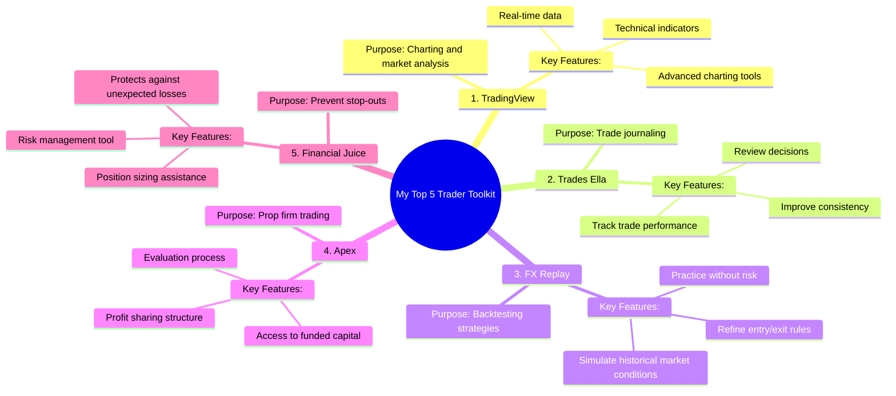

# My Top 5 Trader Toolkit Apps

> 🌐 **Read this in:** **English** · [中文](../../zh-CN/2026-09/tiktok-transcript-my-top-5-trader-toolkit-apps-43c4.md)

> **Creator:** [@Sisterhood Trading Academy](https://www.tiktok.com/@Sisterhood Trading Academy) · **Views:** 211.9K · **Posted:** 2026-09-02 · **Niche:** finance
>
> **TL;DR:** The hook promises a quick, actionable list of five tools, immediately signaling value and specificity.

[Watch original video →](https://www.facebook.com/share/r/1DeQjjHJw5/)

## Why This Went Viral

## Hook (first 3 seconds)
- **What happens verbatim:** "My top five trader toolkit" — delivered as a rapid-fire list intro with no preamble.
- **Hook pattern:** Bold claim / listicle promise ("top five") + niche authority signal ("trader").
- **Why it stops the scroll:** It front-loads a specific, actionable value proposition. The viewer instantly knows they'll get a curated list of tools (saving them research time), and the word "trader" filters for the exact target audience — making the algorithm show it to more traders, who are highly likely to stop because it's directly relevant to their daily workflow.

## Emotional Rhythm
- **Beat 1 — Curiosity (0–1s):** "My top five trader toolkit" creates an open loop; the viewer wants the list.
- **Beat 2 — Rapid Anticipation (1–4s):** Each tool is named in quick succession ("TradingView… Trades Ella… FX Replay… Apex…") — the pace builds momentum and a sense of insider knowledge being shared.
- **Beat 3 — Tension Spike (4–5s):** "…financial juice for new so I never get stopped out of a trade" — this introduces a pain point (getting stopped out) and a solution (financial juice), creating a mini "aha" moment.
- **Beat 4 — Community Call-to-Action (5s):** "Comment sister for more" — shifts from information to invitation, creating a sense of belonging and reciprocity.
- **Climax:** The phrase "so I never get stopped out of a trade" — it's the emotional payoff. It transforms a list of tools into a promise of *protection* and *competence*.

## Keyword Density
- **Trader / trading** (4x) — Drives algorithmic reach; it's the core niche keyword that signals the content category to the platform.
- **Toolkit** (1x) — Strong emotional pull; implies a curated, essential set — not random apps.
- **Journaling / backtesting** (1x each) — Algorithmic reach; these are high-intent search terms within the trading niche.
- **Never get stopped out** (1x) — Emotional pull; this is the fear-based pain point that resonates deeply with traders.
- **Comment sister** (1x) — Algorithmic reach; the explicit engagement prompt boosts distribution.
- **Apex / FX Replay / TradingView** (3x) — Algorithmic reach; brand names trigger related-topic tags and search traffic.

## Why It Spreads
- **Ultra-specific niche targeting:** The video doesn't try to appeal to everyone. It speaks directly to "traders" in the first second. This ensures high watch-through from the right audience, which the algorithm rewards. *Concrete line: "My top five trader toolkit."*
- **The pain-point payoff:** The ending line "so I never get stopped out of a trade" is a masterclass in emotional resonance. It names a universal trader fear and implies the tools are the shield. Viewers who've been stopped out feel seen and are compelled to save or share. *Concrete line: "…financial juice for new so I never get stopped out."*
- **The comment bait is a community builder:** "Comment sister for more" is a gendered, insider call — it builds a micro-community and prompts comments, which is the #1 engagement signal for virality. It also feels personal, not like a generic "like and subscribe." *Concrete line: "Comment sister for more."*
- **Pacing creates perceived value density:** The rapid-fire delivery (5 tools in 5 seconds) makes the video feel information-dense. Viewers perceive high value per second, increasing the likelihood they'll watch it multiple times or share it as a "cheat sheet." *Concrete line: The entire list delivered without pause.*
- **Brand-name stacking for searchability:** Mentioning TradingView, Apex, and FX Replay means the video gets surfaced in searches for those specific tools, expanding reach beyond just followers. *Concrete line: "TradingView for charts… FX Replay for backtesting… Apex for prop firm trading."*

## What You Can Steal
1. **Open with a "Top 5" listicle promise in your niche.** Don't warm up. Start with "My top five [niche] toolkit" and immediately list them. This pattern works because it promises a complete, actionable answer in under 10 seconds.
2. **Anchor the list to a specific fear or pain point.** Don't just list tools — explain what each one *prevents* or *solves* (e.g., "so I never get stopped out"). This transforms a boring list into an emotional solution.
3. **Use a personal, community-driven comment prompt.** Instead of "follow for more," use a phrase that creates an in-group feeling, like "Comment sister for more" or "Comment your city if you agree." This boosts comment counts and algorithmic reach because it feels like a conversation, not a broadcast.

## Mind Map

## Full Transcript (Generated by [analyze your own TikToks](https://toktranscript.com/?utm_source=github&utm_medium=breakdown&utm_campaign=tool_attribution))

> 📝 Transcripts on this page are auto-generated and show the first 60%. Want to transcribe any TikTok in 30 seconds and get the full version? [Try TokTranscript free →](https://toktranscript.com/?utm_source=github&utm_medium=breakdown&utm_campaign=transcript_cta)

My top five trader toolkit, trading view for charts, trades Ella for journaling, FX replay for backtesting, Apex for prop firm trading, 

*[Read the full transcript on TokTranscript →](https://toktranscript.com/plaza/tiktok-transcript-my-top-5-trader-toolkit-apps-43c4?utm_source=github&utm_medium=breakdown&utm_campaign=transcript_full)*

## Browse More

- All [finance](../../by-niche/en/finance.md) breakdowns
- All [Listicle teaser](../../by-pattern/en/hook-listicle-teaser.md) examples

## Video Info

| | |
|---|---|
| Creator | [@Sisterhood Trading Academy](https://www.tiktok.com/@Sisterhood Trading Academy) |
| Original video | [https://www.facebook.com/share/r/1DeQjjHJw5/](https://www.facebook.com/share/r/1DeQjjHJw5/) |
| Original title | My Top 5 Trader Toolkit Apps |
| Views | 211.9K (211946) |
| Posted | 2026-09-02 |
| Duration | 0s |
| Niche | `finance` |
| Hook pattern | `Listicle teaser` |
| Original language | `en` |
| Available languages | en, zh-CN |
| Generated | 2026-09-03 by [TokTranscript](https://toktranscript.com/) |

---

*This breakdown is for educational analysis under fair use. Original video © [@Sisterhood Trading Academy](https://www.tiktok.com/@Sisterhood Trading Academy). All transcripts are auto-generated and may contain errors.*

*Want to analyze your own TikToks like this? [TokTranscript →](https://toktranscript.com/viral-breakdown?utm_source=github&utm_medium=breakdown&utm_campaign=footer_cta)*