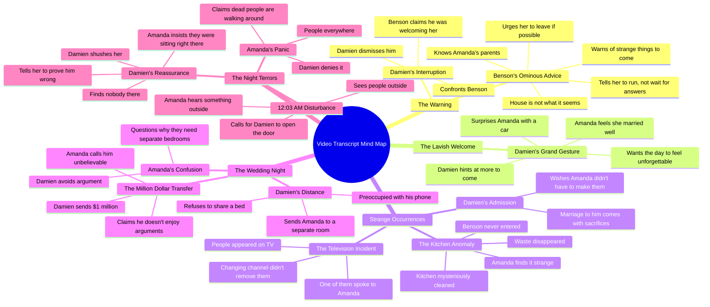

# Newlywed Warned About Her Husband's House

> 🌐 **Read this in:** **English** · [中文](../../zh-CN/2026-09/tiktok-transcript-mystery-after-my-wedding-episode-one-africanmovies-africanst-55de.md)

<a href="https://www.tiktok.com/@chief_collins_studio/video/7685858423841312022?_r=1&u_code=f465j142e3727d&preview_pb=0&sharer_language=en&_d=f16ac27dk6j77b&share_item_id=7685858423841312022&source=h5_m&timestamp=1789585244&item_author_type=2&utm_source=copy&share_enter_from=others_homepage&tt_from=copy&enable_checksum=1&utm_medium=ios&share_link_id=1BAD3AE6-5EF9-4DD3-81B6-D00353498E31&user_id=7654162232096605206&sec_user_id=MS4wLjABAAAAJg78oFVD55oylpfsTcCqCsxjw16m1L2uWTRKB56uc_8laoxVb7koecPWnsocfKR0&utm_campaign=client_share&panel_source_v2=share_panel&ug_btm=b5836,b2878&social_share_type=0&link_reflow_popup_iteration_sharer=%7B%22click_empty_to_play%22:1,%22dynamic_cover%22:1,%22follow_to_play_duration%22:-1,%22profile_clickable%22:1%7D&share_app_id=1233&sp_root_share_link_id=1BAD3AE6-5EF9-4DD3-81B6-D00353498E31&sp_root_d=f16ac27dk6j77b&sp_level=1&sp_root_u=f465j142e3727d" target="_blank"></a>

> **Creator:** [@chief_collins_studio](https://www.tiktok.com/@chief_collins_studio) · **Views:** 744.9K · **Posted:** 2026-09-16 · **Niche:** entertainment
>
> **TL;DR:** The hook immediately creates mystery and stakes by revealing a secret tied to the viewer's parents, compelling them to keep watching.

[Watch original video →](https://www.tiktok.com/@chief_collins_studio/video/7685858423841312022?_r=1&u_code=f465j142e3727d&preview_pb=0&sharer_language=en&_d=f16ac27dk6j77b&share_item_id=7685858423841312022&source=h5_m&timestamp=1789585244&item_author_type=2&utm_source=copy&share_enter_from=others_homepage&tt_from=copy&enable_checksum=1&utm_medium=ios&share_link_id=1BAD3AE6-5EF9-4DD3-81B6-D00353498E31&user_id=7654162232096605206&sec_user_id=MS4wLjABAAAAJg78oFVD55oylpfsTcCqCsxjw16m1L2uWTRKB56uc_8laoxVb7koecPWnsocfKR0&utm_campaign=client_share&panel_source_v2=share_panel&ug_btm=b5836,b2878&social_share_type=0&link_reflow_popup_iteration_sharer=%7B%22click_empty_to_play%22:1,%22dynamic_cover%22:1,%22follow_to_play_duration%22:-1,%22profile_clickable%22:1%7D&share_app_id=1233&sp_root_share_link_id=1BAD3AE6-5EF9-4DD3-81B6-D00353498E31&sp_root_d=f16ac27dk6j77b&sp_level=1&sp_root_u=f465j142e3727d)

## Why This Went Viral

## Hook (first 3 seconds)
- **Verbatim opening line:** "Madam, I know your parents. That's the only reason I'm telling you this."
- **Hook pattern:** Conspiracy/secret-warning hook (a servant leaking forbidden information to the new bride). It's a "forbidden knowledge" variant of the bold-claim pattern.
- **Why it stops the scroll:** It opens mid-conflict with zero setup. "I know your parents" implies a debt, a threat, or a hidden connection — and "the only reason I'm telling you this" promises a secret the speaker shouldn't share. The viewer is dropped into a conspiracy already in progress, so the brain needs the missing context before it can move on.

## Emotional Rhythm
- **Curiosity (0–15s):** Benson's warning — "This house is not what you think it is… Run." Unanswered questions stack: What's wrong with the house? Why does he pity her?
- **Relief / false safety (15–30s):** Damien interrupts, Benson retreats ("I was only welcoming her"). Tension resets to zero.
- **Warmth → unease (30–60s):** The car gift, "You haven't seen anything yet," "I think I married very well." Romance peaks — then the impossibly clean kitchen and "Run if you can" puncture it.
- **Dread escalation (60–90s):** People on the TV who "remained" after the channel changed; one speaks to her. Damien's vague apology ("comes with sacrifices") reframes the marriage as a transaction.
- **Tension spike (90–120s):** The separate bedroom order, the $1M transfer to shut down an argument. Money becomes a control mechanism, not affection.
- **Climax (120–150s):** 12:03 AM — knocking, "Who are these people?", "Why are dead people walking around your house?" Amanda confronts Damien; he denies everything. The final "Shh." lands as the twist — either he's silencing her, or something else is in the room.
- **Climax moment:** "Amanda, why are dead people walking around your house?" — the thesis question of the entire video, delivered as a direct accusation.

## Keyword Density
- **Strongest repeated words/phrases:** *Run / run if you can*, *Damien*, *Amanda*, *house*, *dead people*, *Benson*, *madam/wife*, *open the door*, *strange*, *$1 million*.
- **Algorithmic reach drivers:** *Run*, *dead people*, *house*, *strange* — high-emotion, high-search horror/thriller tokens that trigger recommendation clustering in the "scary story" and "toxic marriage" niches.
- **Emotional pull drivers:** *Damien*, *Amanda*, *madam*, *wife*, *married* — proper nouns and relationship terms that make viewers feel like they're watching real people, not a skit. The $1M figure adds class/wealth voyeurism.
- **Structural keyword:** *Run* appears twice (Benson and the disembodied voice), functioning as a recurring motif that trains the viewer to expect danger.

## Why It Spreads
- **Unresolved threat loop:** Benson says "Run" and never explains why. The video ends on "Shh." with zero resolution — viewers rewatch to catch clues and comment theories, which feeds the algorithm.
- **Genre-stacking:** It's simultaneously a toxic-marriage drama, a haunted-house horror, and a wealth fantasy ($1M transfer, luxury car). Each genre pulls a different audience segment into the same 2-minute clip.
- **Direct-address accusation lines:** "Why are dead people walking around your house?" and "You will not share a bed with her" are quotable, screenshot-able lines designed to be clipped and reposted.
- **POV immersion:** The camera stays on Amanda's experience — she's the audience surrogate. Every reveal (TV people, dead walkers, separate bedroom) is discovered *with* her, which sustains the "what would I do?" engagement.
- **Escalating stakes in a fixed timeline:** The 12:03 timestamp and the wedding-night framing create a ticking-clock structure. Viewers stay to see how bad the night gets, and the ending denies closure — the classic "part 1" retention play.

## What You Can Steal
- **Open with a forbidden secret, not a setup.** Start your video with a character saying something they shouldn't — "I know your parents," "Don't tell him I told you" — and let the viewer's brain fill in the missing context. No intro, no context, no greeting.
- **Plant a warning early, then let the audience forget it.** Benson's "Run" appears at second 5 and pays off at second 140. The gap is what makes the payoff feel earned. Structure your script so the first line and the last line are the same threat.
- **End on a denial, not a resolution.** "There's nobody here. Shh." gives the viewer nothing to close the loop with — which is exactly what makes them comment, rewatch, and share. Cut before the explanation, every time.

## Mind Map

## Full Transcript (Generated by [TokTranscript.com](https://toktranscript.com/?utm_source=github&utm_medium=breakdown&utm_campaign=tool_attribution))

> 📝 Transcripts on this page are auto-generated and show the first 60%. Want to transcribe any TikTok in 30 seconds and get the full version? [Try TokTranscript free →](https://toktranscript.com/?utm_source=github&utm_medium=breakdown&utm_campaign=transcript_cta)

Madam, I know your parents. That's the only reason I'm telling you this. Telling me what? This house is not what you think it is. If you get a chance to leave, take it. I just married this man. What exactly are you saying? I'm saying I pity the life you're about to live when strange things begin. Don't wait for answers. Run. Benson, what? What exactly were you telling my wife? Nothing, sir. I was only welcoming her. Good. Keep it that way. Yes, sir. Finish your duties. Damien, don't tell me that car is mine. I want today to feel unforgettable. You're going to spoil me. That's the plan. I think I married very well. You haven't seen anything yet. Benson. this kitchen was a mess a few minutes ago. Who arranged all this? Benson didn't even come in here. Even the waste is gone. This is strange. Run if you can. There were people on that television. What people? I changed the channel. They remained. One of them spoke to me. I'm sorry, Amanda. Being married to a man like me comes with sacrifices. I wish you didn't have to make them.

*[Read the full transcript on TokTranscript →](https://toktranscript.com/plaza/tiktok-transcript-mystery-after-my-wedding-episode-one-africanmovies-africanst-55de?utm_source=github&utm_medium=breakdown&utm_campaign=transcript_full)*

## Browse More

- All [entertainment](../../by-niche/en/entertainment.md) breakdowns
- All [Secret Warning](../../by-pattern/en/hook-secret-warning.md) examples

## Video Info

| | |
|---|---|
| Creator | [@chief_collins_studio](https://www.tiktok.com/@chief_collins_studio) |
| Original video | [https://www.tiktok.com/@chief_collins_studio/video/7685858423841312022?_r=1&u_code=f465j142e3727d&preview_pb=0&sharer_language=en&_d=f16ac27dk6j77b&share_item_id=7685858423841312022&source=h5_m&timestamp=1789585244&item_author_type=2&utm_source=copy&share_enter_from=others_homepage&tt_from=copy&enable_checksum=1&utm_medium=ios&share_link_id=1BAD3AE6-5EF9-4DD3-81B6-D00353498E31&user_id=7654162232096605206&sec_user_id=MS4wLjABAAAAJg78oFVD55oylpfsTcCqCsxjw16m1L2uWTRKB56uc_8laoxVb7koecPWnsocfKR0&utm_campaign=client_share&panel_source_v2=share_panel&ug_btm=b5836,b2878&social_share_type=0&link_reflow_popup_iteration_sharer=%7B%22click_empty_to_play%22:1,%22dynamic_cover%22:1,%22follow_to_play_duration%22:-1,%22profile_clickable%22:1%7D&share_app_id=1233&sp_root_share_link_id=1BAD3AE6-5EF9-4DD3-81B6-D00353498E31&sp_root_d=f16ac27dk6j77b&sp_level=1&sp_root_u=f465j142e3727d](https://www.tiktok.com/@chief_collins_studio/video/7685858423841312022?_r=1&u_code=f465j142e3727d&preview_pb=0&sharer_language=en&_d=f16ac27dk6j77b&share_item_id=7685858423841312022&source=h5_m&timestamp=1789585244&item_author_type=2&utm_source=copy&share_enter_from=others_homepage&tt_from=copy&enable_checksum=1&utm_medium=ios&share_link_id=1BAD3AE6-5EF9-4DD3-81B6-D00353498E31&user_id=7654162232096605206&sec_user_id=MS4wLjABAAAAJg78oFVD55oylpfsTcCqCsxjw16m1L2uWTRKB56uc_8laoxVb7koecPWnsocfKR0&utm_campaign=client_share&panel_source_v2=share_panel&ug_btm=b5836,b2878&social_share_type=0&link_reflow_popup_iteration_sharer=%7B%22click_empty_to_play%22:1,%22dynamic_cover%22:1,%22follow_to_play_duration%22:-1,%22profile_clickable%22:1%7D&share_app_id=1233&sp_root_share_link_id=1BAD3AE6-5EF9-4DD3-81B6-D00353498E31&sp_root_d=f16ac27dk6j77b&sp_level=1&sp_root_u=f465j142e3727d) |
| Original title | Mystery after my Wedding. Episode One #africanmovies #africanstorytel... |
| Views | 744.9K (744900) |
| Posted | 2026-09-16 |
| Duration | 0s |
| Niche | `entertainment` |
| Hook pattern | `Secret Warning` |
| Original language | `en` |
| Available languages | en, zh-CN |
| Generated | 2026-09-17 by [TokTranscript](https://toktranscript.com/) |

---

*This breakdown is for educational analysis under fair use. Original video © [@chief_collins_studio](https://www.tiktok.com/@chief_collins_studio). All transcripts are auto-generated and may contain errors.*

*Want to analyze your own TikToks like this? [free TikTok transcript generator →](https://toktranscript.com/viral-breakdown?utm_source=github&utm_medium=breakdown&utm_campaign=footer_cta)*