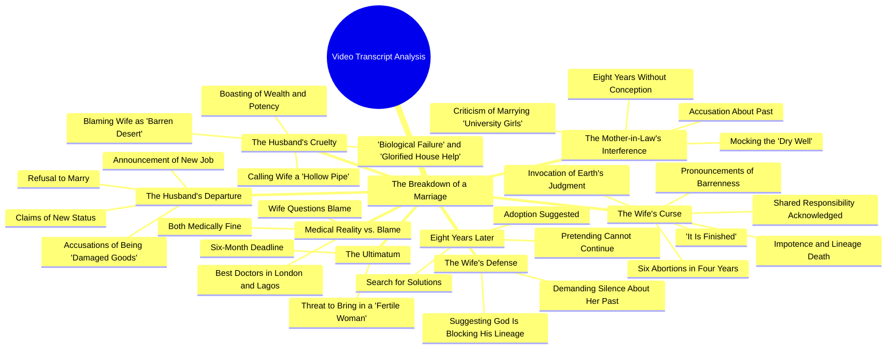

# Nigerian Drama: Woman Leaves After Job Offer and Insult

> 🌐 **Read this in:** **English** · [中文](../../zh-CN/2026-09/tiktok-transcript-part-1-the-curse-fyp-viral-naijatiktok-uktiktok-ai-2ed8.md)

> **Creator:** [@talesbyoma02](https://www.tiktok.com/@talesbyoma02) · **Views:** 5.3M · **Posted:** 2026-09-23 · **Niche:** entertainment
>
> **TL;DR:** Opens with a relatable question that immediately creates curiosity and sets up the conflict.

[Watch original video →](https://vm.tiktok.com/ZN8MVaFGf/)

## Why This Went Viral

## Hook (first 3 seconds)
- Opening line verbatim: "Are we finally moving today? Is it the job in Leki? I am moving."
- Hook pattern: **Contrast + cold-open scene** — a domestic status question ("are we finally moving?") instantly flipped by "I am moving" (singular, exclusionary).
- Why it stops the scroll: The viewer is dropped mid-argument with no setup. The pronoun shift from "we" to "I" signals betrayal in under 3 seconds, and the unresolved "is it the job in Leki?" plants a location/status question the brain wants closed.

## Emotional Rhythm
- **Beat 1 — Curiosity (0–3s):** Ambiguous "moving" question; viewer doesn't know who's leaving whom.
- **Beat 2 — Shock/tension (3–15s):** "I don't plan to marry you… damaged goods… flushed six babies." Accusation stacks fast; moral stakes spike.
- **Beat 3 — Inversion (15–30s):** "You provided the suggestion. You provided the womb." Blame flips from victim to accomplice — this is the resonance point where viewers pick a side.
- **Beat 4 — Curse/climax (30–55s):** "As the earth drank the blood of the six… so shall the earth swallow your name." The curse monologue is the **climax** — it's the most quotable, most screenshot-able, most re-stitched section.
- **Beat 5 — Time jump + new villain (55s–end):** "It has been 8 years." Second scene introduces the billionaire husband and the mother-in-law, escalating from one betrayer to a whole system (marriage, money, family, religion).
- **Relief:** None offered. The video ends on "Maybe the God you claim to serve is blocking his lineage" — deliberately unresolved, which drives comments.

## Keyword Density
- **Six babies / six pregnancies / six souls** — anchors the entire curse; highest emotional pull.
- **Barren / dry well / desert / stone womb** — the thematic spine; drives metaphor recognition and quote-sharing.
- **Billionaire / status / wealth** — algorithmic reach keyword; signals class-conflict content to recommendation systems.
- **Womb** — repeated 4+ times; the single word that carries both the medical and moral argument.
- **Useless / damaged goods / biological failure** — insult cluster; drives outrage-comments.
- **8 years / 6 months / 4 years** — numbers create false-precision credibility and timestamp the grievance.
- **London and Lagos** — geographic keyword pairing that broadens the audience across diaspora + local feeds.
- **Curse / ash / water / blood** — ritual language; emotional pull, not algorithmic.
- Algorithmic drivers: *billionaire, Lagos, London, marriage, 8 years* (searchable, category-tagging). Emotional drivers: *six babies, barren, curse, dried by the sun* (comment-triggering, quote-able).

## Why It Spreads
- **Moral ambiguity forces sides.** "You provided the suggestion. You provided the womb" makes the victim complicit — viewers cannot passively watch; they must argue in comments about who is guilty.
- **Curse as shareable artifact.** "As the earth drank the blood of the six you tore from me, so shall the earth swallow your name" is a self-contained, screenshot-ready monologue — the exact unit that gets clipped, stitched, and reposted.
- **Two-scene structure doubles the payoff.** The first scene (betrayal + curse) hooks; the second ("It has been 8 years… I am a billionaire") resets the stakes with a new antagonist, so viewers who almost dropped off get a second reason to stay and rewatch.
- **Taboo + status collision.** Fertility, abortion, wealth, and religion in one clip — each topic independently triggers algorithm boost and comment-section conflict.
- **Unresolved ending invites continuation.** "Maybe the God you claim to serve is blocking his lineage for a reason" ends on an open theological accusation — perfect setup for "Part 2" bait and duet/stitch responses.

## What You Can Steal
1. **Open mid-argument, not at the start.** Begin with a line that implies a prior conversation ("Are we finally moving today?") so the viewer feels like they walked into something real — no exposition, no setup.
2. **Engineer one "quote line" per video.** Write a single sentence designed to be screenshotted or captioned — like the curse speech — and place it at the emotional peak, not the end.
3. **Use a two-act reset.** If your video passes 40 seconds, introduce a time jump ("It has been 8 years") and a new character or stake to re-hook viewers who were about to scroll away.

## Mind Map

## Full Transcript (Generated by [analyze your own TikToks](https://toktranscript.com/?utm_source=github&utm_medium=breakdown&utm_campaign=tool_attribution))

> 📝 Transcripts on this page are auto-generated and show the first 60%. Want to transcribe any TikTok in 30 seconds and get the full version? [Try TokTranscript free →](https://toktranscript.com/?utm_source=github&utm_medium=breakdown&utm_campaign=transcript_cta)

Are we finally moving today? Is it the job in Leki? I am moving. Funky. You are staying. What do you mean? I got the job. But don't bother waiting for me. I don't plan to marry you. A woman who has flushed six babies down the drain in four years. You are damaged goods. You are no longer useful to a man of my new status. But today you forced me. You said we weren't ready. You bought the drugs. You. I provided the suggestion. You provided the womb. A virtuous woman would have said no. I have a better life ahead. And it doesn't include a graveyard. Today you made me terminate 6 pregnancies in 4 years. And now you have left me. Today you took my blood and made it water. You took my future and turned it into a curse. As the earth drank the blood of the six you tore from me, so shall the earth swallow your name. You seek a better life. May that life be as barren. Your seed is turned to ash. Your strength is turned to water. You shall marry a thousand women. And their womb shall turn to stone the moment you touch them. You will travel to the west and the doctors will find no pulse in your loins. You will remain impotent. You called me useless. You shall be the trunk of a tree that bears no fruit. A dead end in the lineage of your fathers. Until the six souls you rejected call you father, you shall remain a man who dried by the sun. It is finished today. It has been 8 years.

*[Read the full transcript on TokTranscript →](https://toktranscript.com/plaza/tiktok-transcript-part-1-the-curse-fyp-viral-naijatiktok-uktiktok-ai-2ed8?utm_source=github&utm_medium=breakdown&utm_campaign=transcript_full)*

## Browse More

- All [entertainment](../../by-niche/en/entertainment.md) breakdowns
- All [Question Hook](../../by-pattern/en/hook-question-hook.md) examples

## Video Info

| | |
|---|---|
| Creator | [@talesbyoma02](https://www.tiktok.com/@talesbyoma02) |
| Original video | [https://vm.tiktok.com/ZN8MVaFGf/](https://vm.tiktok.com/ZN8MVaFGf/) |
| Original title | PART 1: The Curse #fyp #viral #naijatiktok #uktiktok #ai  |
| Views | 5.3M (5300000) |
| Posted | 2026-09-23 |
| Duration | 0s |
| Niche | `entertainment` |
| Hook pattern | `Question Hook` |
| Original language | `en` |
| Available languages | en, zh-CN |
| Generated | 2026-09-24 by [TokTranscript](https://toktranscript.com/) |

---

*This breakdown is for educational analysis under fair use. Original video © [@talesbyoma02](https://www.tiktok.com/@talesbyoma02). All transcripts are auto-generated and may contain errors.*

*Want to analyze your own TikToks like this? [TokTranscript →](https://toktranscript.com/viral-breakdown?utm_source=github&utm_medium=breakdown&utm_campaign=footer_cta)*