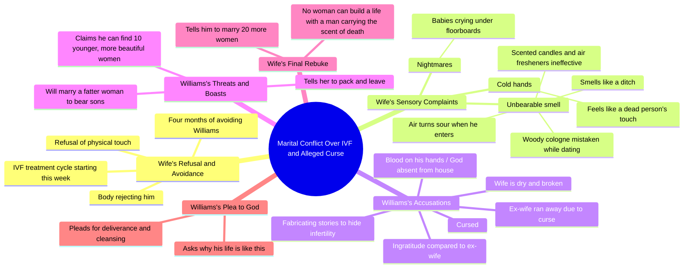

# Couple Argues Over IVF Treatment in Fate Cursed Part 2

> 🌐 **Read this in:** **English** · [中文](../../zh-CN/2026-09/tiktok-transcript-part-2-fate-cursed-aistory-aistoryteller-ai-6053.md)

> **Creator:** [@talesbyoma02](https://www.tiktok.com/@talesbyoma02) · **Views:** 414.3K · **Posted:** 2026-09-27 · **Niche:** entertainment
>
> **TL;DR:** Immediate tension and rejection create curiosity about the relationship.

[Watch original video →](https://vm.tiktok.com/ZN8ryQx6M/)

## Why This Went Viral

## Hook (first 3 seconds)
- **Verbatim opening line:** "Chinerre, look at me now, Williams, please just stay on your side. Don't come near me."
- **Hook pattern:** Scene / in-media-res conflict — the video drops you mid-argument with zero setup. A second layer: the direct-address name ("Chinerre") reads like a personal callout, which tricks the brain into thinking it's being spoken to.
- **Why it stops the scroll:** No context is given, so the brain must resolve an open loop ("why won't she let him near her?"). Physical repulsion in a marriage bed is an instantly legible, high-stakes taboo. The viewer is eavesdropping on intimacy collapsing — voyeurism plus unresolved tension.

## Emotional Rhythm
- **Curiosity** (0–5s): "Don't come near me" — why? What did he do?
- **Context / rising tension** (5–20s): IVF, 4 months of avoidance, "we are trying to have a baby" — stakes are named: a marriage and a child.
- **Reveal #1 — disgust** (~20–40s): "my skin crawls," "the smell," "it smells like a ditch." Sensory language converts abstract conflict into bodily revulsion.
- **Reveal #2 — horror escalation** (~40–55s): "your hands are always ice cold… like a dead person is holding me," "babies crying under the floorboards." This is the **twist landing** — the story shifts from marital drama to supernatural dread.
- **Climax** (~55–70s): The mutual accusation spiral — "You are cursed" / "You are the one whose body is broken" / "Your ex wife was right to run away." Both characters detonate at once; the ex-wife detail retroactively reframes everything as a pattern, not an isolated fight.
- **Relief / catharsis** (~70s–end): Williams's collapse — "God, why? What did I do? Deliver me. Cleanse me." The villain/aggressor becomes the supplicant. Emotional release through role reversal.

## Keyword Density
- **Strongest repeated terms:** *smell* (and variants: scent, sour, ditch, death), *cursed/curse*, *body* (skin, hands, broken, dry), *baby/children/sons*, *Williams* (name repetition), *leave/run away*, *bed/room/house*.
- **Algorithmic drivers:** *cursed*, *death*, *baby*, *IVF* — high-emotion, high-search tokens that trigger topic clustering around fertility, marriage conflict, and supernatural/curse content. These pull the video into multiple recommendation pools at once.
- **Emotional-pull drivers:** *smell*, *skin crawls*, *ice cold*, *dead person*, *floorboards* — these are the lines people quote in comments and stitch. Sensory + horror vocabulary is what makes the clip *shareable as a feeling*, not just a story.
- **Structural keyword:** the name *Williams* repeated as direct address keeps the monologue feeling like a confrontation, not narration — it sustains the "overheard fight" illusion.

## Why It Spreads
- **Dual-genre bait.** The first 40 seconds read as a realistic marriage/fertility drama; the back half pivots to supernatural horror ("babies crying under the floorboards," "scent of death"). Viewers who came for one genre get ambushed by the other — that mismatch is a comment magnet ("wait, is this a ghost story??").
- **Quotable, screenshot-ready lines.** "No woman can build a life with a man who carries the scent of death" and "your hands are always ice cold… like a dead person is holding me" are built for captions, duets, and reaction stitches. Virality needs portable lines; this script is dense with them.
- **Moral ambiguity forces sides.** Neither party is clean — she calls him cursed, he calls her broken and threatens to replace her with "10 girls younger and more beautiful." Comment sections split into Team Chinerre / Team Williams, and argument is the cheapest engagement engine there is.
- **Escalation loop with no resolution.** Every 10–15 seconds a new accusation tops the last (smell → cold hands → nightmares → curse → ex-wife → replacement wives). There's no calm beat to exit on, so viewers watch to the end waiting for a resolution that never comes — boosting completion rate.
- **Universal fear anchoring.** Fertility failure, a partner's disgust, and a "curse" on your bloodline are primal anxieties. The supernatural dressing makes the real fear (being unwanted and unable to fix it) safe to consume — that's why it travels beyond the drama niche.

## What You Can Steal
- **Open mid-conflict with a physical boundary.** Start on a line like "don't come near me" — a body rejecting another body. No backstory, no greeting. The audience's need to explain the rejection *is* your retention.
- **Escalate in sensory layers, not plot layers.** Don't add new events; add new *sensations* (smell → temperature → sound → dreams). Each sense deepens the same conflict instead of diluting it, and sensory lines are the ones people quote.
- **Give the aggressor the last word — then break them.** End on the character who seemed in control collapsing ("Deliver me. Cleanse me."). The reversal is the emotional payoff, and it's what makes viewers rewatch and comment rather than just scroll past.

## Mind Map

## Full Transcript (Generated by [TokTranscript](https://toktranscript.com/?utm_source=github&utm_medium=breakdown&utm_campaign=tool_attribution))

> 📝 Transcripts on this page are auto-generated and show the first 60%. Want to transcribe any TikTok in 30 seconds and get the full version? [Try TokTranscript free →](https://toktranscript.com/?utm_source=github&utm_medium=breakdown&utm_campaign=transcript_cta)

Chinerre, look at me now, Williams, please just stay on your side. Don't come near me. What is the meaning of this nonsense? For the past 4 months, you have been avoiding me. We are trying to have a baby. Remember, you agreed to the new cycle of IVF treatment starting this week. How can we make a child if you won't even let me touch your skin? Every time you come close to me in this bed, my skin crawls. It's not that I don't want to be a wife to you, but my body is rejecting you. What are you talking about? The smell, Williams. The smell. When we were dating, we were always outdoors, in open restaurants, in clubs. I thought maybe you just liked a specific woody Cologne. But living in this house, sleeping in this bed, it is unbearable. It doesn't matter how many scented candles I burn. It doesn't matter how many air fresheners the maids spray. The moment you enter the room, the air turns sour. It smells like a ditch. And when you touch me, your hands are always ice cold. It feels like a dead person is holding me. I have nightmares every single night, Williams. I dream of babies crying under the floorboards of this room. You are ungrateful, just like my ex wife. You are cursed.

*[Read the full transcript on TokTranscript →](https://toktranscript.com/plaza/tiktok-transcript-part-2-fate-cursed-aistory-aistoryteller-ai-6053?utm_source=github&utm_medium=breakdown&utm_campaign=transcript_full)*

## Browse More

- All [entertainment](../../by-niche/en/entertainment.md) breakdowns
- All [Conflict Hook](../../by-pattern/en/hook-conflict-hook.md) examples

## Video Info

| | |
|---|---|
| Creator | [@talesbyoma02](https://www.tiktok.com/@talesbyoma02) |
| Original video | [https://vm.tiktok.com/ZN8ryQx6M/](https://vm.tiktok.com/ZN8ryQx6M/) |
| Original title | PART 2: FATE CURSED #aistory #aistoryteller #ai  |
| Views | 414.3K (414300) |
| Posted | 2026-09-27 |
| Duration | 0s |
| Niche | `entertainment` |
| Hook pattern | `Conflict Hook` |
| Original language | `en` |
| Available languages | en, zh-CN |
| Generated | 2026-09-28 by [TokTranscript](https://toktranscript.com/) |

---

*This breakdown is for educational analysis under fair use. Original video © [@talesbyoma02](https://www.tiktok.com/@talesbyoma02). All transcripts are auto-generated and may contain errors.*

*Want to analyze your own TikToks like this? [try this transcription tool →](https://toktranscript.com/viral-breakdown?utm_source=github&utm_medium=breakdown&utm_campaign=footer_cta)*