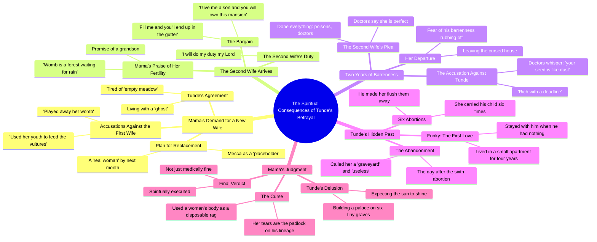

# The Curse Part 2: A Barren Wife Story

> 🌐 **Read this in:** **English** · [中文](../../zh-CN/2026-09/tiktok-transcript-part-2-the-curse-naijatiktok-viral-fyp-ai-uktiktok-3daf.md)

> **Creator:** [@talesbyoma02](https://www.tiktok.com/@talesbyoma02) · **Views:** 1.5M · **Posted:** 2026-09-27 · **Niche:** entertainment
>
> **TL;DR:** Immediately introduces a high-stakes family conflict with shocking accusations, grabbing attention.

[Watch original video →](https://vm.tiktok.com/ZN8rSmgmQ/)

## Why This Went Viral

## Hook (first 3 seconds)
- Verbatim opening line: "my son you need a new wife this one has played away her womb"
- Hook pattern: **Bold claim + taboo confession** (a mother commanding her son to discard his wife, framed as urgent advice)
- Why it stops the scroll: It opens mid-conflict with a shocking, morally loaded statement. The viewer is dropped into a private family war with no context — the brain instantly asks "wait, what did she just say?" The word "womb" signals high-stakes stakes (lineage, fertility) which is a proven retention trigger in African family-drama content.

## Emotional Rhythm
- **Beat 1 — Curiosity (0–5s):** The mother's cold command. Viewer wonders who these people are and why the wife is being discarded.
- **Beat 2 — Indignation (5–20s):** "empty meadow," "placeholder," "decorated room with no occupants" — the wife is dehumanized. Viewer starts taking sides.
- **Beat 3 — Defiance / tension spike (20–35s):** The wife fires back — "ask your son which graveyard he built his wealth upon." First real crack in the villain narrative.
- **Beat 4 — Escalation (35–60s):** New wife introduced, "womb is a forest waiting for rain," then the reveal that she too is childless after two years.
- **Beat 5 — Suspense peak (60–80s):** "your seed is like dust" — the accusation flips the entire premise. The problem was never the women.
- **Beat 6 — Climax / twist (80–100s):** The confession — "six times she carried my child, I made her flush them away." This is the emotional detonation. The "graveyard" metaphor pays off.
- **Beat 7 — Moral verdict / relief (100–110s):** "You are not just medically fine, you are spiritually executed." Justice lands. Viewer exhales.

**Climax moment:** "six times mama six times she carried my child" — the reveal that reframes every earlier insult as projection.

## Keyword Density
- **womb** — emotional pull (fertility, lineage, shame)
- **children / son / grandson** — emotional pull (legacy stakes)
- **graveyard / graves / dust** — emotional pull (spiritual consequence, the video's central metaphor)
- **barren / empty / dry** — emotional pull (insult vocabulary)
- **Mama** — emotional pull (authority + betrayal)
- **wife / woman / real woman** — algorithmic reach (relationship/family tags)
- **house / mansion / palace** — algorithmic reach (wealth/status tags)
- **poisons / doctors / medically** — algorithmic reach (fertility/medical drama tags)
- **God / spiritually / cursed** — algorithmic reach (faith-based engagement, huge in African short-form)

Algorithmic drivers: family, fertility, wealth, faith — all high-volume, high-comment categories. Emotional drivers: "graveyard," "womb," "six times" — these are the lines people quote in comments.

## Why It Spreads
- **Moral outrage bait with a delayed payoff.** The opening ("you need a new wife") makes viewers angry at the mother, then the twist ("six tiny graves") redirects that anger at the son — forcing a re-watch and a comment. The line "ask your son which graveyard he built his wealth upon" is the seed that makes the ending land.
- **Quotable metaphor density.** "Empty meadow," "womb is a forest waiting for rain," "rich with a deadline," "spiritually executed" — every 10 seconds delivers a screenshot-worthy line. These become captions, comments, and duets.
- **Taboo + faith framing.** Abortion ("flush them away"), polygamy, and spiritual consequence ("padlock on your lineage") collide. This triggers both religious engagement and moral debate — the two strongest comment drivers on short-form.
- **Villain-flip structure.** The viewer is set up to hate the mother-in-law, then the son confesses. The line "you use the woman's body like a disposable rag" reframes the entire cast. Twist endings drive shares because people send it to friends saying "wait for the end."
- **Cliffhanger pacing.** Every 15–20 seconds introduces a new character or accusation (first wife → second wife → ex-girlfriend → confession). No beat overstays. Retention stays high, which the algorithm rewards with wider distribution.

## What You Can Steal
- **Open mid-argument with a taboo command.** Don't build up — start with the most shocking line a character could say. The first 3 seconds must feel like walking into a fight already in progress.
- **Plant a metaphor early, pay it off at the climax.** "Graveyard" is mentioned casually at 25s and detonates at 90s. Seed one vivid image in Act 1 and make it the twist in Act 3.
- **Flip the villain.** Let the audience hate Character A for 60 seconds, then reveal Character B is worse. The re-watch and comment rate doubles because viewers want to re-check the earlier lines.

## Mind Map

## Full Transcript (Generated by [TokTranscript.com](https://toktranscript.com/?utm_source=github&utm_medium=breakdown&utm_campaign=tool_attribution))

> 📝 Transcripts on this page are auto-generated and show the first 60%. Want to transcribe any TikTok in 30 seconds and get the full version? [Try TokTranscript free →](https://toktranscript.com/?utm_source=github&utm_medium=breakdown&utm_campaign=transcript_cta)

my son you need a new wife this one has played away her womb she has used her youth to feed the vultures you are right Mama I'm tired of looking at her empty meadow it's like living with a ghost Mecca you are just a placeholder a decorated room with no occupants by next month a real woman will be sitting in that chair a real woman tunde you can fill this house with a thousand concubines you can marry the most fertile women in Africa go and ask your son which graveyard he built his wealth upon Tunde you aren't looking for a wife your tunde you're looking for a miracle that your wicked soul doesn't deserve keep your better life I'd rather be barren alone than spend one more day breathing the air of a man who may be spiritually important my son look at her look at those hips this one is not like that dry firewood we just threw out this one's womb is a forest waiting for rain by this time next year I will be carrying my grandson welcome Mama has told you why you are here in this house give me a son and you will own this mansion fill me and you'll end up in the gutter she will fill this house with children I will do my duty my Lord two years Mama since you brought her and yet no children as you hide Mama I have done everything I have drunk your poisons I have seen the doctors they say I am perfect two dates not me wasn't your first wife the doctors they whisper 

*[Read the full transcript on TokTranscript →](https://toktranscript.com/plaza/tiktok-transcript-part-2-the-curse-naijatiktok-viral-fyp-ai-uktiktok-3daf?utm_source=github&utm_medium=breakdown&utm_campaign=transcript_full)*

## Browse More

- All [entertainment](../../by-niche/en/entertainment.md) breakdowns
- All [Conflict Hook](../../by-pattern/en/hook-conflict-hook.md) examples

## Video Info

| | |
|---|---|
| Creator | [@talesbyoma02](https://www.tiktok.com/@talesbyoma02) |
| Original video | [https://vm.tiktok.com/ZN8rSmgmQ/](https://vm.tiktok.com/ZN8rSmgmQ/) |
| Original title | PART 2: The Curse #naijatiktok #viral #fyp #ai #uktiktok  |
| Views | 1.5M (1500000) |
| Posted | 2026-09-27 |
| Duration | 0s |
| Niche | `entertainment` |
| Hook pattern | `Conflict Hook` |
| Original language | `en` |
| Available languages | en, zh-CN |
| Generated | 2026-09-28 by [TokTranscript](https://toktranscript.com/) |

---

*This breakdown is for educational analysis under fair use. Original video © [@talesbyoma02](https://www.tiktok.com/@talesbyoma02). All transcripts are auto-generated and may contain errors.*

*Want to analyze your own TikToks like this? [TokTranscript.com →](https://toktranscript.com/viral-breakdown?utm_source=github&utm_medium=breakdown&utm_campaign=footer_cta)*