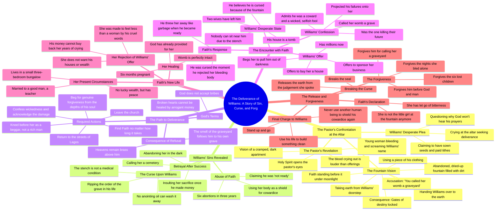

# Pastor Tells Williams His Prayers Go Unheard

> 🌐 **Read this in:** **English** · [中文](../../zh-CN/2026-09/tiktok-transcript-part-3-fate-cursed-aistoryteller-aistory-ai-a70c.md)

> **Creator:** [@talesbyoma02](https://www.tiktok.com/@talesbyoma02) · **Views:** 343.4K · **Posted:** 2026-09-29 · **Niche:** entertainment
>
> **TL;DR:** Immediately confronts the viewer with a bold spiritual claim, creating curiosity and tension.

[Watch original video →](https://vm.tiktok.com/ZN8r7v1ju/)

## Why This Went Viral

## Hook (first 3 seconds)
- **Verbatim opening line:** "Williams, the deliverance you are looking for cannot be found by crying at this altar."
- **Hook pattern:** Bold claim + direct second-person address (a prophetic rebuke). It opens mid-confrontation, in media res.
- **Why it stops the scroll:** It names a person ("Williams") and denies them the thing they want ("deliverance") in the first breath. The viewer is dropped into a private, high-stakes confrontation they weren't supposed to hear — the "overheard secret" effect. The word "deliverance" + "altar" instantly signals spiritual drama, a genre with built-in retention.

## Emotional Rhythm
- **0–10s — Curiosity + accusation:** Pastor denies deliverance, Williams protests his tithes. Question raised: *why won't God hear him?*
- **10–30s — Dread reveal:** "The blood crying out against you is louder than the money." Vision of a bleeding woman screaming his name → tension spikes.
- **30–60s — Escalating horror:** The fountain, the earth ritual, "you called her womb a graveyard." Backstory of six abortions. Suspense peaks as the sin is named.
- **60–90s — Prescription / false resolution:** Pastor orders him to find Faith and beg. Sets up the second act.
- **90–120s — Confrontation + reversal:** Williams finds Faith — she's married, pregnant, at peace. His money is worthless. **Climax lands here:** "I am six months pregnant" — the exact thing he destroyed is now thriving without him.
- **120–end — Catharsis:** Faith forgives him. "I break the seal." Emotional relief and release.

**Climax moment:** "My womb is perfectly intact. I am six months pregnant." This is the twist that reframes the entire story — the victim is whole, the abuser is broken.

## Keyword Density
- **Strongest repeated terms:** *curse / cursed*, *fountain*, *graveyard / grave / tomb*, *womb*, *blood*, *money / wealth*, *faith* (name + concept), *forgive / forgiveness*, *darkness*, *cowardice*.
- **Algorithmic reach drivers:** *curse, deliverance, tithe, anointing oil, altar, God* — these cluster into the "spiritual warfare / deliverance" niche, which has a massive, highly engaged audience that comments and shares aggressively.
- **Emotional pull drivers:** *womb, graveyard, blood, six abortions, pregnant, forgive* — these carry the moral and visceral weight; they trigger outrage, pity, and vindication, which fuel comments and rewatches.

## Why It Spreads
- **Moral clarity + taboo subject:** "You made that girl undergo six abortions" is a line engineered to provoke strong reactions on both sides — pro-life and pro-choice viewers argue in the comments, doubling engagement.
- **The reversal payoff:** "My womb is perfectly intact. I am six months pregnant" delivers the exact emotional reward viewers waited 90 seconds for — the victim thriving while the abuser begs. This is shareable vindication.
- **Genre-native structure:** It's a Nollywood-style deliverance drama compressed into short-form. The "pastor sees a vision" framing ("the Holy Spirit opened my eyes") gives permission for extreme exposition without feeling like a plot hole.
- **Quotable, screenshot-able lines:** "You called her womb a graveyard." "You handed her the matches and she lit the fire." "The heavens above you remain brass." These are designed to be clipped, captioned, and reposted.
- **Second-person address:** Constant "you" and "Williams" makes the viewer feel personally implicated and spoken to — a retention trick that keeps eyes on screen.

## What You Can Steal
1. **Open with a denial, not a question.** "The [thing you want] cannot be found by [the thing you're doing]" is a stronger hook than "Have you ever wondered…" — it creates instant conflict.
2. **Name a specific person and a specific place.** "Williams," "Lagos," "Leki," "the fountain." Specificity reads as truth and makes the story feel real, not generic.
3. **Build to a reversal, not a resolution.** Don't end with the hero winning — end with the victim already healed and the hero still broken. The twist ("I'm six months pregnant") is what makes people rewatch and share.

## Mind Map

## Full Transcript (Generated by [analyze your own TikToks](https://toktranscript.com/?utm_source=github&utm_medium=breakdown&utm_campaign=tool_attribution))

> 📝 Transcripts on this page are auto-generated and show the first 60%. Want to transcribe any TikTok in 30 seconds and get the full version? [Try TokTranscript free →](https://toktranscript.com/?utm_source=github&utm_medium=breakdown&utm_campaign=transcript_cta)

Williams, the deliverance you are looking for cannot be found by crying at this altar. God is a god of justice. Pastor, I have sowed seeds. I have given tithe to the church projects. Why won't god hear my prayers? Because the blood crying out against you is louder than the money you put in the offering basket. What? What do you mean, pastor? As you knelt here weeping, the Holy Spirit opened my eyes. I saw a cramped, dark, one room apartment compound filled with smoke and noise. And I saw a young woman sitting on a cold floor bleeding and screaming your name. The Lord took me further into the night. I saw an old abandoned fountain, dried up, filled with dirt and stagnant water. I saw that same woman stand before it under the moonlight. She took the earth from your old doorstep and a piece of your clothing and she handed you over to the earth, Williams. She said you called her womb a graveyard and so she locked the gates of your destiny. Pastor, please save me. She cursed me. Faith cursed me. No, William, she did not just curse you. You handed her the matches and she lit the fire. You made that girl undergo six abortions in three years because you claimed you were not ready. You used her body as a shield for your own cowardice. And when you finally made the money, instead of honouring her sacrifice, you insulted her pain. Called her a cemetery and abandoned her in the dark. The smell you carry, Williams, is not a medical condition. You are ripping the order of the grave in your own life. No anointing oil from this altar will wash it away. Then what do I do? Pastor, please, I will give her everything. I will buy a house in Leki. Just tell me how to break the curse. God does not bribe Williams and neither other woman's broken heart be healed by arrogant money. You must leave this church, go back into the streets of Lagos and find faith. You must look for her no matter how long it takes. You will kneel before her not as a rich man, but as the beggar you truly are inside. You must confess your wickedness. Look at the damage you caused. Beg for her genuine forgiveness from the depths of your soul. Until faith releases you, Williams, the heavens above you remain brass and the smell of the graveyard will follow you to your own grave. Fate, Williams. Fate, please, I beg you, in the name of god, have mercy on me, Williams, stand up. Don't cause a sin in my shop. Pastor David told me everything I know what you did at the fountain. Fate, I am dying. Two wives have left me. My house is a tomb. Nobody can sit near me because of this stench. I am cursed, fate, and it's because of what I did to you.

*[Read the full transcript on TokTranscript →](https://toktranscript.com/plaza/tiktok-transcript-part-3-fate-cursed-aistoryteller-aistory-ai-a70c?utm_source=github&utm_medium=breakdown&utm_campaign=transcript_full)*

## Browse More

- All [entertainment](../../by-niche/en/entertainment.md) breakdowns
- All [Direct Address & Spiritual Challenge](../../by-pattern/en/hook-direct-address-spiritual-challenge.md) examples

## Video Info

| | |
|---|---|
| Creator | [@talesbyoma02](https://www.tiktok.com/@talesbyoma02) |
| Original video | [https://vm.tiktok.com/ZN8r7v1ju/](https://vm.tiktok.com/ZN8r7v1ju/) |
| Original title | PART 3: FATE CURSED #aistoryteller #aistory #ai  |
| Views | 343.4K (343400) |
| Posted | 2026-09-29 |
| Duration | 0s |
| Niche | `entertainment` |
| Hook pattern | `Direct Address & Spiritual Challenge` |
| Original language | `en` |
| Available languages | en, zh-CN |
| Generated | 2026-10-02 by [TokTranscript](https://toktranscript.com/) |

---

*This breakdown is for educational analysis under fair use. Original video © [@talesbyoma02](https://www.tiktok.com/@talesbyoma02). All transcripts are auto-generated and may contain errors.*

*Want to analyze your own TikToks like this? [TokTranscript →](https://toktranscript.com/viral-breakdown?utm_source=github&utm_medium=breakdown&utm_campaign=footer_cta)*