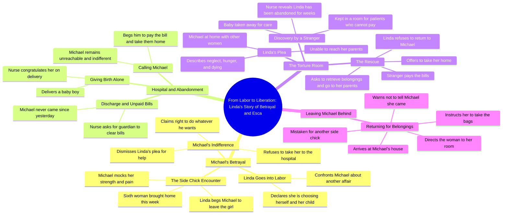

# Woman Chooses Herself Over Cheating Husband

> 🌐 **Read this in:** **English** · [中文](../../zh-CN/2026-09/tiktok-transcript-part-one-the-strong-woman-s-tears-africanfolklore-africanfol-19f7.md)

> **Creator:** [@storiesby___stan](https://www.tiktok.com/@storiesby___stan) · **Views:** 1.9M · **Posted:** 2026-09-16 · **Niche:** entertainment
>
> **TL;DR:** Immediately establishes high-stakes conflict by juxtaposing imminent childbirth with infidelity.

[Watch original video →](https://vm.tiktok.com/ZN86JK21d/)

## Why This Went Viral

## Hook (first 3 seconds)
- Verbatim: "Michael, I'm going into labor tomorrow. And there you are again with another side chick."
- Pattern: **Contrast + stakes** (life event vs. betrayal in the same breath)
- Why it stops the scroll: Two high-voltage nouns — "labor" and "side chick" — collide in one sentence. The viewer instantly has a villain, a victim, and a ticking clock. No setup required.

## Emotional Rhythm
- **Curiosity** (0–5s): Who is Michael? Why is she calm while announcing labor?
- **Tension** (5–25s): Husband dismisses her, brings a 6th woman home, refuses the hospital run.
- **Resonance** (25–40s): "I'm begging you… let's have this baby" — the humiliation is specific and relatable.
- **Dread** (40–60s): Cut to hospital. "Nobody came." The abandonment lands.
- **Despair peak** (60–90s): The unpaid-bill room, "no care and no food. I'm dying."
- **Relief / twist** (90–110s): A stranger pays the bill, takes her home.
- **Climax moment:** "You can take me there to take my belongings… Don't even tell Michael I came." — quiet exit, maximum power.
- **Twist landing:** She doesn't reconcile. She retrieves her bags and leaves. The revenge is silence, not shouting.

## Keyword Density
- "Michael" (anchor name — repetition builds villain identity)
- "side chick" / "women" / "cheating" (betrayal cluster)
- "labor" / "baby" / "hospital" / "bills" (stakes cluster)
- "strong woman" (ironic callback used twice)
- "please" (repeated begging = emotional pressure)
- "husband" / "wife" (role contrast)
- "room" / "house" (spatial entrapment)
- **Algorithmic reach drivers:** "labor," "side chick," "cheating," "hospital bills" — high-search, high-engagement terms that trigger comment-section debate.
- **Emotional pull drivers:** "strong woman," "please," "I'm dying," "my baby" — these convert passive viewers into commenters and sharers.

## Why It Spreads
- **Instant villain + victim framing** — "another side chick" in line one gives the audience someone to hate and someone to defend, which is the #1 driver of comment-section activity.
- **Escalating injustice ladder** — each beat one-ups the last: dismisses labor → brings 6th woman → refuses hospital → abandons her → unpaid-bill room. Viewers stay to see how much worse it gets.
- **Ironic callback** — "You have always claimed to be a strong woman" is weaponized by Michael, then flipped by the nurse ("You are indeed a strong woman, Linda"). This wordplay gives viewers a quotable line to repost.
- **Delayed payoff / rescue beat** — the stranger paying the bill satisfies the justice craving without resolving the marriage, leaving the ending open enough to fuel "what happens next" comments.
- **Silent exit ending** — "Don't even tell Michael I came" is a clean, shareable mic-drop that rewards viewers who watched to the end (retention + rewatch).

## What You Can Steal
1. **Collide two opposite stakes in your first sentence.** Don't open with context — open with a life event crashing into a betrayal, a deadline, or a loss. (e.g., "I got the promotion today, and my boss just fired my best friend.")
2. **Make injustice escalate, not repeat.** Each beat should be measurably worse than the last. Same conflict, bigger cost.
3. **End on a quiet, quotable line, not a loud one.** The line viewers screenshot is the one they'll share. Write your last sentence for the caption, not the scene.

## Mind Map

## Full Transcript (Generated by [analyze your own TikToks](https://toktranscript.com/?utm_source=github&utm_medium=breakdown&utm_campaign=tool_attribution))

> 📝 Transcripts on this page are auto-generated and show the first 60%. Want to transcribe any TikTok in 30 seconds and get the full version? [Try TokTranscript free →](https://toktranscript.com/?utm_source=github&utm_medium=breakdown&utm_campaign=transcript_cta)

Michael, I'm going into labor tomorrow. And there you are again with another side chick. I'm not surprised, and I'm not going to argue with you. I've made up my mind, and this time I'm choosing myself and my child. Oh, please, Linda, spare me the speech. You're going into labor tomorrow. So what? You think that suddenly gives you the right to question me? I'll do whatever I want in my own house. If you don't like it, you know where the door is. Michael, is that your wife? Yes, side chick. I'm his wife. And you are the sixth woman he's bringing home this week. Anyways, you both should have a great time. I've got better things to do than worry about who Michael brings through that door. Michael, please. For the first time in all these years of cheating, I'm begging you. Leave that girl and come take me to the hospital. Let's have this baby. I'm in so much pain. Linda, I don't care. My mother gave birth to 7 children, and on no occasion did she ask my dad to take her to the hospital. You have always claimed to be a strong woman. Please leave here and don't interrupt our moment. Michael, since you brought me to this house, all you do is cheat and cheat, bringing different women to this home. And now I'm telling you to help me. Let's birth this baby, and you are saying no? It's okay. I already made A mistake. Mrs. Linda, congratulations on the delivery of your baby boy. You could be discharged now. And we would appreciate it if you would call your guardian or husband to come and clear the bills, take you home and give you full postpartum care. Nurse, are you trying to tell me my husband Michael haven't come since yesterday to see me and the child? Yes, Mrs. Nobody came. You are indeed a strong woman, Linda. Hello? Hello, Michael. Were you too busy cheating that you forgot me and your baby are still in the hospital? Michael, please come and clear the Bill so we would come back home. That's all I'm asking. Hello, my baby. I'm so sorry for bringing you into this type of chaos. Yes, sir. She's Mrs. Linda, one of the patients that nobody has come to ask for since weeks now.

*[Read the full transcript on TokTranscript →](https://toktranscript.com/plaza/tiktok-transcript-part-one-the-strong-woman-s-tears-africanfolklore-africanfol-19f7?utm_source=github&utm_medium=breakdown&utm_campaign=transcript_full)*

## Browse More

- All [entertainment](../../by-niche/en/entertainment.md) breakdowns
- All [Urgent Confrontation](../../by-pattern/en/hook-urgent-confrontation.md) examples

## Video Info

| | |
|---|---|
| Creator | [@storiesby___stan](https://www.tiktok.com/@storiesby___stan) |
| Original video | [https://vm.tiktok.com/ZN86JK21d/](https://vm.tiktok.com/ZN86JK21d/) |
| Original title | PART ONE: The Strong Woman’s Tears 🤲🏿 #africanfolklore #africanfolkta... |
| Views | 1.9M (1900000) |
| Posted | 2026-09-16 |
| Duration | 0s |
| Niche | `entertainment` |
| Hook pattern | `Urgent Confrontation` |
| Original language | `en` |
| Available languages | en, zh-CN |
| Generated | 2026-09-17 by [TokTranscript](https://toktranscript.com/) |

---

*This breakdown is for educational analysis under fair use. Original video © [@storiesby___stan](https://www.tiktok.com/@storiesby___stan). All transcripts are auto-generated and may contain errors.*

*Want to analyze your own TikToks like this? [TokTranscript →](https://toktranscript.com/viral-breakdown?utm_source=github&utm_medium=breakdown&utm_campaign=footer_cta)*