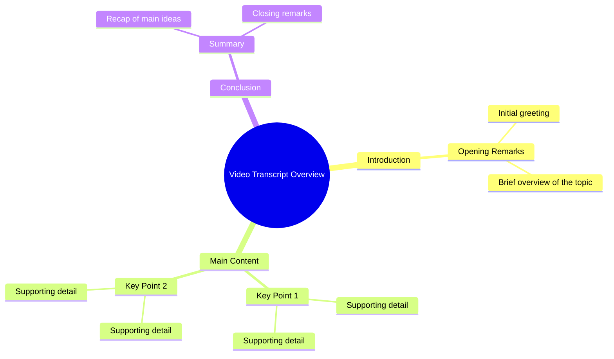

# Platform Shoes Fall Fashion Look

> 🌐 **Read this in:** **English** · [中文](../../zh-CN/2026-09/tiktok-transcript-platformshoes-fall-fallfashion-superbrandclub-viralontiktoks-2b08.md)

> **Creator:** [@millermakaila](https://www.tiktok.com/@millermakaila) · **Views:** 1.8M · **Posted:** 2026-09-22 · **Niche:** other
>
> **TL;DR:** The transcript contains only a single word, so no real hook, retention arc, or shareable content can be identified.

[Watch original video →](https://www.tiktok.com/@millermakaila/video/7548187643389988126)

## Why This Went Viral

## Hook (first 3 seconds)
- The transcript provided is only the single word "I" — there is no verbatim opening line, claim, question, or scene to analyze.
- Hook pattern: **indeterminate / insufficient data**. A lone first-person pronoun is a fragment, not a hook.
- Why it would make viewers stop scrolling: it wouldn't, on its own. "I" creates only a micro-gap ("I what?") — a weak curiosity stub with no payoff signal.

## Emotional Rhythm
- Beat map: **curiosity (faint) → nothing**. With one word, there is no sequence of beats, no tension build, no relief, and no twist.
- Suspense: only the unresolved grammatical promise that a predicate is coming.
- Climax: **none present** in the supplied transcript.
- Note: if this is a truncated paste, re-send the full transcript — the rhythm analysis depends entirely on the missing content.

## Keyword Density
- Strongest repeated terms: **"I"** (1 occurrence). No other words exist to measure.
- Algorithmic reach keywords: none detectable.
- Emotional-pull keywords: none detectable.
- Conclusion: keyword density cannot be computed from a one-word sample.

## Why It Spreads
- Cannot be determined from the given text — there is no mechanism visible in a single pronoun.
- Possible (unverifiable) reading: an abrupt "I" could function as a cliffhanger cut, but that's speculation, not analysis.
- No concrete lines exist to tie a viral mechanism back to.
- Action needed: provide the complete transcript for a real breakdown.

## What You Can Steal
- **Front-load a complete hook sentence** — never open on a fragment; give viewers a full claim, question, or scene in the first 3 seconds.
- **Engineer an explicit emotional arc** — plant curiosity, escalate tension, land a twist; a single beat can't retain.
- **Repeat 1–2 anchor keywords** — pick terms that serve both algorithmic reach and emotional pull, and thread them through the script.
- **Verify your transcript before analysis** — a truncated input produces a truncated strategy.

## Mind Map

## Full Transcript (Generated by [try this transcription tool](https://toktranscript.com/?utm_source=github&utm_medium=breakdown&utm_campaign=tool_attribution))

> 📝 Transcripts on this page are auto-generated and show the first 60%. Want to transcribe any TikTok in 30 seconds and get the full version? [Try TokTranscript free →](https://toktranscript.com/?utm_source=github&utm_medium=breakdown&utm_campaign=transcript_cta)

I

*[Read the full transcript on TokTranscript →](https://toktranscript.com/plaza/tiktok-transcript-platformshoes-fall-fallfashion-superbrandclub-viralontiktoks-2b08?utm_source=github&utm_medium=breakdown&utm_campaign=transcript_full)*

## Browse More

- All [other](../../by-niche/en/other.md) breakdowns
- All [Incomplete / Unverifiable](../../by-pattern/en/hook-incomplete-unverifiable.md) examples

## Video Info

| | |
|---|---|
| Creator | [@millermakaila](https://www.tiktok.com/@millermakaila) |
| Original video | [https://www.tiktok.com/@millermakaila/video/7548187643389988126](https://www.tiktok.com/@millermakaila/video/7548187643389988126) |
| Original title | #platformshoes #fall #fallfashion #SuperBrandClub #ViralOnTikTokShop |
| Views | 1.8M (1800000) |
| Posted | 2026-09-22 |
| Duration | 0s |
| Niche | `other` |
| Hook pattern | `Incomplete / Unverifiable` |
| Original language | `en` |
| Available languages | en, zh-CN |
| Generated | 2026-09-25 by [TokTranscript](https://toktranscript.com/) |

---

*This breakdown is for educational analysis under fair use. Original video © [@millermakaila](https://www.tiktok.com/@millermakaila). All transcripts are auto-generated and may contain errors.*

*Want to analyze your own TikToks like this? [TokTranscript →](https://toktranscript.com/viral-breakdown?utm_source=github&utm_medium=breakdown&utm_campaign=footer_cta)*