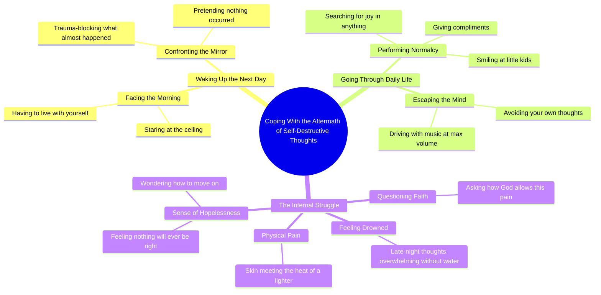

# Spoken Word Poem About Living With Trauma

> 🌐 **Read this in:** **English** · [中文](../../zh-CN/2026-09/tiktok-transcript-poetry-poem-poems-poet-writer-7e92.md)

> **Creator:** [@mia_emiliaa](https://www.tiktok.com/@mia_emiliaa) · **Views:** 744.0K · **Posted:** 2026-09-23 · **Niche:** entertainment
>
> **TL;DR:** It immediately presents the aftermath of a traumatic event, creating intrigue and emotional weight.

[Watch original video →](https://vm.tiktok.com/ZGdQbpTfJ/)

## Why This Went Viral

## Hook (first 3 seconds)
- **Verbatim opening line:** "After all that, you have to wake up fine the next day, staring at the ceiling."
- **Hook pattern:** *In medias res / aftermath drop* — the video starts *after* an unnamed event, forcing the viewer to reverse-engineer what happened.
- **Why it stops the scroll:** "After all that" is an unresolved reference. The brain can't leave a dangling antecedent alone. Pairing a vague catastrophe with a hyper-relatable image ("staring at the ceiling") creates instant personal projection — every viewer fills the blank with their own worst night.

## Emotional Rhythm
- **0–5s — Curiosity + dread:** "wake up fine the next day" implies the night before was *not* fine. Withholding the event is the engine.
- **5–15s — Shame spiral:** "live with yourself," "trauma block what almost could have happened," "pretending that you didn't just do what you did." Tension builds through repetition of *you* — accusatory, intimate, second-person.
- **15–25s — Masking / dissonance:** "give people compliments and you smile at little kids" — the contrast between inner chaos and outward normalcy is the emotional pivot. This is where resonance lands hardest.
- **25–35s — Escalation into despair:** "music to the max to avoid your own brain," "how does god allow me to feel this way?" — rhetorical questions stack, each darker than the last.
- **Climax:** "How do you move on when even your skin met the heat of the lighter?" — the first concrete, physical detail in the entire script. It retroactively reframes everything before it and lands as the twist.
- **Final beat — No relief:** The video ends on an unanswered question. That withholding is deliberate — it drives comments and rewatches.

## Keyword Density
- **"you / your"** — second-person address, the dominant word class. Drives parasocial intimacy.
- **"move on"** — repeated 3x near the end. The thematic anchor.
- **"how do you"** — anaphora pattern; signals the emotional climax section.
- **"feel this way"** — emotional-pull keyword; high relatability index.
- **"pretending" / "trauma block" / "avoid"** — masking vocabulary; algorithmic reach via mental-health-adjacent terms.
- **"god"** — reach driver; triggers faith + crisis comment threads.
- **"lighter" / "skin" / "heat"** — sensory specificity; converts abstract pain into a scroll-stopping image.
- **Algorithmic vs. emotional:** "trauma," "god," "move on," "feel this way" drive reach via search/interest clustering. "Staring at the ceiling," "music to the max," "smile at little kids" drive *emotional pull* — those are the lines people quote in comments and stitch.

## Why It Spreads
- **Second-person immersion forces identification.** Every sentence starts with "you." There is no narrator, no story, no "I" — the viewer *is* the subject. "You have to live with yourself after" is impossible to watch passively.
- **Strategic ambiguity invites projection.** "What almost could have happened here" is never defined. Viewers supply their own event — breakup, relapse, self-harm, near-miss — which means the same video speaks to a dozen different audiences and gets shared into a dozen different communities.
- **The masking sequence is the shareable mirror.** "You give people compliments and you smile at little kids" is the line that gets screenshotted. It names the exact experience of high-functioning depression — the thing people recognize but rarely see articulated.
- **The lighter line is the twist that earns the rewatch.** It's the only concrete image in an abstract monologue. On first watch it shocks; on rewatch it recontextualizes every earlier line. Rewatches are a top-tier algorithmic signal.
- **It ends on an unanswered question, not a resolution.** "How do you continue…" with no answer forces the viewer to either comment, save, or send it to someone who feels the same. All three are engagement actions.

## What You Can Steal
- **Open in the aftermath, not the event.** Start your story *after* the thing happened. "After all that…" makes the viewer do the work of reconstructing the setup — and that work is what keeps them watching.
- **Use second-person anaphora to build a rhythm.** Stack 4–6 sentences that all begin with "You…" or "How do you…". The repetition creates a hypnotic cadence that carries viewers through heavy emotional content without them noticing the length.
- **Land one concrete, physical detail at the climax.** Abstract emotion ("I felt awful") doesn't spread. A single sensory image ("your skin met the heat of the lighter") does — it's the line people quote, screenshot, and stitch.

## Mind Map

## Full Transcript (Generated by [free TikTok transcript generator](https://toktranscript.com/?utm_source=github&utm_medium=breakdown&utm_campaign=tool_attribution))

> 📝 Transcripts on this page are auto-generated and show the first 60%. Want to transcribe any TikTok in 30 seconds and get the full version? [Try TokTranscript free →](https://toktranscript.com/?utm_source=github&utm_medium=breakdown&utm_campaign=transcript_cta)

After all that, you have to wake up fine the next day, staring at the ceiling. You have to live with yourself after. You have to look in the mirror trying to trauma block what almost could have happened here. You have to go on with your day pretending that you didn't just do what you did. So you give people compliments and you smile at little kids. You try to find joy or something, anything to lighten your day. You would give anything not to feel this way.

*[Read the full transcript on TokTranscript →](https://toktranscript.com/plaza/tiktok-transcript-poetry-poem-poems-poet-writer-7e92?utm_source=github&utm_medium=breakdown&utm_campaign=transcript_full)*

## Browse More

- All [entertainment](../../by-niche/en/entertainment.md) breakdowns
- All [Consequence Hook](../../by-pattern/en/hook-consequence-hook.md) examples

## Video Info

| | |
|---|---|
| Creator | [@mia_emiliaa](https://www.tiktok.com/@mia_emiliaa) |
| Original video | [https://vm.tiktok.com/ZGdQbpTfJ/](https://vm.tiktok.com/ZGdQbpTfJ/) |
| Original title | #poetry #poem #poems #poet #writer  |
| Views | 744.0K (744000) |
| Posted | 2026-09-23 |
| Duration | 0s |
| Niche | `entertainment` |
| Hook pattern | `Consequence Hook` |
| Original language | `en` |
| Available languages | en, zh-CN |
| Generated | 2026-09-26 by [TokTranscript](https://toktranscript.com/) |

---

*This breakdown is for educational analysis under fair use. Original video © [@mia_emiliaa](https://www.tiktok.com/@mia_emiliaa). All transcripts are auto-generated and may contain errors.*

*Want to analyze your own TikToks like this? [TokTranscript →](https://toktranscript.com/viral-breakdown?utm_source=github&utm_medium=breakdown&utm_campaign=footer_cta)*