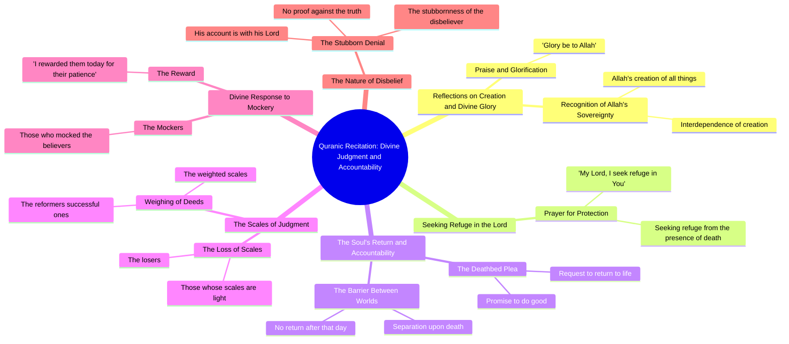

# Quran Verse 84: Who Owns the Earth and All in It

> 🌐 **Read this in:** **English** · [中文](../../zh-CN/2026-09/tiktok-transcript-say-5958.md)

> **Creator:** [@adh_su](https://www.tiktok.com/@adh_su) · **Views:** 5.9M · **Posted:** 2026-09-12 · **Niche:** other
>
> **TL;DR:** The hook immediately confronts the audience with a provocative label and a divine mystery, sparking curiosity and emotional engagement.

[Watch original video →](https://www.tiktok.com/@adh_su/video/7676659264894717204)

## Why This Went Viral

## Hook (first 3 seconds)
- **Verbatim opening:** "Liars, what Allah took from a boy" — a direct accusation ("Liars") followed immediately by a divine/religious claim about loss and a "boy."
- **Hook pattern:** **Bold claim + contrast** (accusation vs. sacred reference), wrapped in a religious-recitation cadence rather than a conversational one.
- **Why it stops the scroll:** The word "Liars" is an aggression trigger — it forces a fight-or-flight micro-decision. Pairing it with "Allah" and "a boy" creates instant cognitive dissonance (who is lying? what boy? which loss?). The viewer isn't given context, so the brain stays to resolve the gap. Religious-audio hooks also ride on existing identity-driven attention: believers stop, skeptics stop to argue.

## Emotional Rhythm
- **Beat 1 — Confrontation (0–3s):** "Liars" → shock, defensiveness, curiosity.
- **Beat 2 — Reverence (3–10s):** "Glory be to Allah," "my Lord, I seek refuge" → shifts to solemnity, lowers the viewer's guard, signals authenticity.
- **Beat 3 — Tension / plea (10–20s):** "Someone death said… my Lord, come back, I do good" → a deathbed reversal, the classic "too late" trope. Suspense peaks here.
- **Beat 4 — Judgment imagery (20–30s):** "weighted scales," "Those are reformers," "who slipped his scales… those who lost" → moral stakes crystallize. This is the **resonance beat** — viewers map it onto their own life.
- **Beat 5 — Twist / mockery (30–40s):** "Some of them are mocking / I rewarded them today with what they were patient" → the reversal: mockers get exposed, the patient get rewarded. **This is the climax** — the emotional payoff that makes people rewatch or comment.
- **Beat 6 — Warning close:** "his account is the stubbornness of his Lord" → leaves an unresolved threat, driving comments and shares.

## Keyword Density
- **Allah / God / my Lord** — identity anchor; drives algorithmic reach via religious-audio clustering.
- **Liars** — highest emotional-pull word; the accusation that opens the loop.
- **Scales / weighted / slipped** — the moral metaphor; carries the "judgment" theme.
- **Come back / I do good** — the regret motif; the most quotable, shareable line.
- **Patience / patient** — the virtue payoff; converts the video from accusation to lesson.
- **Mocking** — the antagonist label; gives viewers someone to root against.
- **Refuge / seek refuge** — ritual language; signals sincerity and boosts religious-audio retention.
- **Death / account** — stakes words; keep viewers watching to the end.

**Algorithmic drivers:** "Allah," "Lord," "refuge" — these cluster the video into a high-retention religious-content feed.
**Emotional drivers:** "Liars," "come back," "mocking," "patient" — these are what get typed into comments and DMs.

## Why It Spreads
- **Identity-bait opening.** "Liars, what Allah took from a boy" forces every viewer into a side (believer / skeptic / curious) within one second — and identity-driven content gets shared to signal belonging.
- **Unresolved narrative gap.** The transcript never explains who the "boy" is or who the "liars" are. That missing context is the engine: comments fill the gap, and comment volume is the strongest ranking signal.
- **Deathbed regret trope.** "My Lord, come back, I do good" is a universally legible emotional unit — it works across languages and religions, so the video travels past its core audience.
- **Moral reversal payoff.** "Some of them are mocking / I rewarded them today with what they were patient" delivers a clean comeuppance arc — the exact structure that makes people screenshot and repost.
- **Open-ended threat close.** "His account is the stubbornness of his Lord" ends on warning, not resolution — viewers rewatch to decode it and share it as a warning to others.

## What You Can Steal
1. **Open with an accusation, not a question.** "Liars…" outperforms "Have you ever wondered…" because it forces a stance. Start your next video by naming a group or behavior your audience already has an opinion about.
2. **Withhold the context on purpose.** Never explain the "boy," the "liars," or the "scales" in the video. Leave one concrete noun unexplained so the comments become the second act of your content.
3. **Build a reversal, not a lesson.** Structure: accusation → solemnity → regret → judgment → reversal → open warning. The twist ("I rewarded them today") is what converts a lecture into a shareable story — plan that line before you write anything else.

## Mind Map

## Full Transcript (Generated by [the tool we used to generate this](https://toktranscript.com/?utm_source=github&utm_medium=breakdown&utm_campaign=tool_attribution))

> 📝 Transcripts on this page are auto-generated and show the first 60%. Want to transcribe any TikTok in 30 seconds and get the full version? [Try TokTranscript free →](https://toktranscript.com/?utm_source=github&utm_medium=breakdown&utm_campaign=transcript_cta)

Liars, what Allah took from a boy And what was with him from God So go all what created And put each other on each other Glory be to Allah And say my Lord, I seek refuge in you And I seek refuge in you, my Lord, that attend Someone death said He said, my Lord, come back I do good Saab between them on that day And they don't wonder weighted scales Those are reformers. And who slipped his scales?

*[Read the full transcript on TokTranscript →](https://toktranscript.com/plaza/tiktok-transcript-say-5958?utm_source=github&utm_medium=breakdown&utm_campaign=transcript_full)*

## Browse More

- All [other](../../by-niche/en/other.md) breakdowns
- All [Direct Address with Controversy](../../by-pattern/en/hook-direct-address-with-controversy.md) examples

## Video Info

| | |
|---|---|
| Creator | [@adh_su](https://www.tiktok.com/@adh_su) |
| Original video | [https://www.tiktok.com/@adh_su/video/7676659264894717204](https://www.tiktok.com/@adh_su/video/7676659264894717204) |
| Original title | قُل لِّمَنِ ٱلْأَرْضُ وَمَن فِيهَآ إِن كُنتُمْ تَعْلَمُونَ ۝٨٤/Say... |
| Views | 5.9M (5900000) |
| Posted | 2026-09-12 |
| Duration | 0s |
| Niche | `other` |
| Hook pattern | `Direct Address with Controversy` |
| Original language | `en` |
| Available languages | en, zh-CN |
| Generated | 2026-09-13 by [TokTranscript](https://toktranscript.com/) |

---

*This breakdown is for educational analysis under fair use. Original video © [@adh_su](https://www.tiktok.com/@adh_su). All transcripts are auto-generated and may contain errors.*

*Want to analyze your own TikToks like this? [TokTranscript →](https://toktranscript.com/viral-breakdown?utm_source=github&utm_medium=breakdown&utm_campaign=footer_cta)*