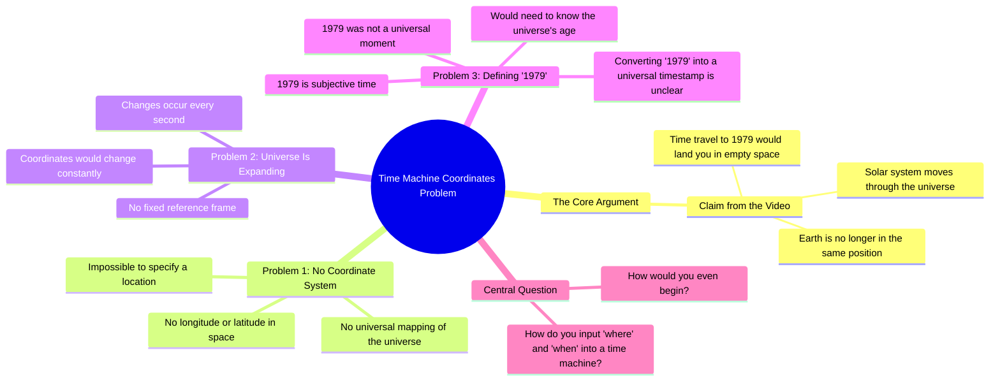

# Time Travel Question About Earth's Position in 1979

> 🌐 **Read this in:** **English** · [中文](../../zh-CN/2026-09/tiktok-transcript-the-time-travel-questions-never-end-timetravel-timetraveler-43c7.md)

> **Creator:** [@junkmotherjess](https://www.tiktok.com/@junkmotherjess) · **Views:** 2.9M · **Posted:** 2026-09-29 · **Niche:** entertainment
>
> **TL;DR:** The hook presents a shocking, counterintuitive consequence of time travel that immediately grabs attention and sets up the logical problem.

[Watch original video →](https://vm.tiktok.com/ZSbBW1rKn)

## Why This Went Viral

## Hook (first 3 seconds)
- **Verbatim opening line:** "I just saw a video of a guy saying that because our solar system is moving through universe, if you got in a time machine right now and asked it to take you back to 1979, you would appear in space because the earth is in a different place now than it was in 1979."
- **Hook pattern:** Scene-setting / secondhand claim relay ("I just saw a video of a guy saying…") — a borrowed-premise hook that piggybacks on someone else's viral idea.
- **Why it stops the scroll:** It opens mid-thought with a vivid, absurd image (you materialize in empty space) and a concrete anchor year (1979). The brain is forced to picture the failure before it can decide whether to keep watching.

## Emotional Rhythm
- **Curiosity (0–5s):** The 1979 space-death premise plants a "wait, is that true?" itch.
- **Tension / escalation (5–20s):** Rapid-fire rhetorical questions stack up — coordinates? mapping? expansion? Each one adds pressure without resolving.
- **Resonance beat (~15s):** "1979 subjective time, right? 1979 was not a time in the universe." This is the intellectual gut-punch — it reframes the whole premise as category error.
- **Climax (~20–25s):** "So how do you put where and when you're going into your time machine? Serious question. How would you even begin to do that?" — the rhetorical pile-up peaks and the video ends unresolved.
- **No relief / deliberate anti-resolution:** The video refuses to answer. That open loop is the engine.

## Keyword Density
- **"Time machine"** — the load-bearing SEO phrase; drives search + suggested reach.
- **"1979"** — specific, memorable, quote-able number; anchors the mental image.
- **"Coordinates"** — the logical wedge; converts a sci-fi premise into a puzzle.
- **"Where and when"** — the rhetorical thesis in two words; highly repeatable.
- **"Universe" / "expanding"** — cosmic-scale keywords that signal "big idea" content.
- **"Subjective time"** — the intellectual flex word; drives comment-section debate.
- **"How would you even begin"** — the emotional pull phrase; invites the viewer to answer.
- **Algorithmic drivers:** "time machine," "universe," "1979" (search/trending). **Emotional drivers:** "serious question," "how would you even begin" (comment bait).

## Why It Spreads
- **It attacks a beloved sci-fi premise with a mundane logistical objection.** The line "How do you get coordinates for a time machine?" reduces time travel to a GPS problem — instantly shareable as a "never thought of that" take.
- **It stacks questions instead of answers.** "There are no longitude or latitude… wouldn't those coordinates change every second?" Each unanswered question is a comment-section prompt.
- **It contains a reframe that feels like a revelation.** "1979 was not a time in the universe" is the line people screenshot and repost — a compact, quotable insight.
- **It ends on an open loop.** "Serious question. How would you even begin to do that?" gives viewers nothing to close, so they close it themselves in the comments — the strongest engagement signal.
- **It borrows virality.** Opening with "I just saw a video of a guy saying…" rides an existing trend while adding a distinct POV, so it gets recommended alongside the original.

## What You Can Steal
- **Open with a borrowed premise, then add your own twist.** "I just saw a video of a guy saying X…" lets you enter an existing conversation and inherit its momentum.
- **Stack rhetorical questions instead of delivering answers.** Each unanswered question is a comment. End on "How would you even begin to do that?" — never resolve.
- **Plant one quotable reframe.** Build the whole video toward a single screenshot-able line ("1979 was not a time in the universe") that viewers will repost out of context.

## Mind Map

## Full Transcript (Generated by [free TikTok transcript generator](https://toktranscript.com/?utm_source=github&utm_medium=breakdown&utm_campaign=tool_attribution))

> 📝 Transcripts on this page are auto-generated and show the first 60%. Want to transcribe any TikTok in 30 seconds and get the full version? [Try TokTranscript free →](https://toktranscript.com/?utm_source=github&utm_medium=breakdown&utm_campaign=transcript_cta)

I just saw a video of a guy saying that because our solar system is moving through universe, if you got in a time machine right now and asked it to take you back to 1979, you would appear in space because the earth is in a different place now than it was in 1979. And. Yeah, quick question. How do you get coordinates for a time machine? There are no longitude or latitude, no mapping of our universe.

*[Read the full transcript on TokTranscript →](https://toktranscript.com/plaza/tiktok-transcript-the-time-travel-questions-never-end-timetravel-timetraveler-43c7?utm_source=github&utm_medium=breakdown&utm_campaign=transcript_full)*

## Browse More

- All [entertainment](../../by-niche/en/entertainment.md) breakdowns
- All [Mind-Blowing Fact](../../by-pattern/en/hook-mind-blowing-fact.md) examples

## Video Info

| | |
|---|---|
| Creator | [@junkmotherjess](https://www.tiktok.com/@junkmotherjess) |
| Original video | [https://vm.tiktok.com/ZSbBW1rKn](https://vm.tiktok.com/ZSbBW1rKn) |
| Original title | The time travel questions never end #timetravel #timetraveler #timetr... |
| Views | 2.9M (2900000) |
| Posted | 2026-09-29 |
| Duration | 0s |
| Niche | `entertainment` |
| Hook pattern | `Mind-Blowing Fact` |
| Original language | `en` |
| Available languages | en, zh-CN |
| Generated | 2026-09-30 by [TokTranscript](https://toktranscript.com/) |

---

*This breakdown is for educational analysis under fair use. Original video © [@junkmotherjess](https://www.tiktok.com/@junkmotherjess). All transcripts are auto-generated and may contain errors.*

*Want to analyze your own TikToks like this? [TokTranscript.com →](https://toktranscript.com/viral-breakdown?utm_source=github&utm_medium=breakdown&utm_campaign=footer_cta)*