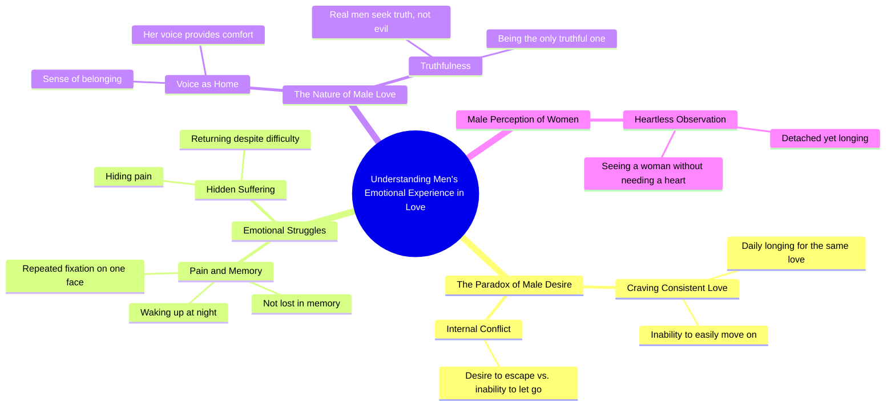

# Man Longing for a Woman's Love Every Day

> 🌐 **Read this in:** **English** · [中文](../../zh-CN/2026-09/tiktok-transcript-tiktok-video-7680354107663715592-ccdd.md)

> **Creator:** [@imranimmighaziani](https://www.tiktok.com/@imranimmighaziani) · **Views:** 1.5M · **Posted:** 2026-09-17 · **Niche:** entertainment
>
> **TL;DR:** The hook uses a cryptic, almost philosophical statement followed by a relatable question to spark curiosity and emotional engagement.

[Watch original video →](https://vt.tiktok.com/ZSqgK2mVE/)

## Why This Went Viral

## Hook (first 3 seconds)
- Verbatim opening: "If only a man had a body. Why does he crave the same love every day?"
- Hook pattern: **Question + paradox** (a rhetorical question built on a contradictory premise)
- Why it stops the scroll: The phrasing is grammatically off ("had a body"), which creates a micro-puzzle the brain wants to resolve. The question "why does he crave the same love every day?" is emotionally loaded and gender-targeted — it forces a self-check ("is that me?") before the viewer consciously decides to stay.

## Emotional Rhythm
- **0–3s — Curiosity:** The paradox question opens a loop ("why the same love?") the viewer needs closed.
- **3–8s — Tension:** "But if he wanted to, he could easily get away with it" introduces forbidden possibility — the viewer braces for a confession or a betrayal.
- **8–14s — Melancholy:** "Not lost in memory. Not to wake up at night. Not a single face repeatedly." Repetition of "not" builds a rhythm of denial — the viewer feels the weight of what he *can't* escape.
- **14–20s — Resonance:** "Their voice is their home. His own pin." This is the emotional anchor — abstract pain becomes a concrete image (home, pin). This is where the viewer feels *seen*.
- **20–26s — Twist / climax:** "Because the real man doesn't just look for evil. He is the only one who is truthful." The video flips from vulnerability to a moral claim — this is the **climax**, where the emotional payoff lands.
- **26–30s — Relief / resolution:** "When a man sees a woman, He doesn't need a heart." A cold, almost nihilistic closing line — leaves the viewer unsettled, which drives rewatches and comments.

- Climax moment: **"He is the only one who is truthful."** — this is the line that gets quoted, screenshotted, and stitched.

## Keyword Density
- **man / he / his** — anchors the target identity; drives algorithmic reach by signaling a clear audience segment.
- **love / loved / loves** — the emotional core; highest pull for saves and shares.
- **same / every day / repeatedly** — repetition words that mirror the video's own structure; reinforce the "loyalty vs. suffering" theme.
- **wake up at night / memory / face** — sensory keywords that trigger personal recall; drive comments ("this is literally me").
- **home / pin / voice** — concrete nouns that convert abstraction into image; these are the lines people quote.
- **truthful / real man** — moral keywords; drive debate in comments, which boosts engagement.
- **heart / pain / hides** — vulnerability keywords; drive emotional resonance and saves.

- Algorithmic reach drivers: "man," "real man," "love" — broad, high-volume terms that push the video into gender-relationship feeds.
- Emotional pull drivers: "wake up at night," "voice is their home," "hides his pain" — these are the lines that make viewers feel personally addressed.

## Why It Spreads
- **It flatters a specific identity while accusing it.** "The real man doesn't just look for evil. He is the only one who is truthful." Men share it to signal depth; women share it to signal they understand men. Both sides feel addressed.
- **The grammar is slightly broken, which makes it feel raw and translated.** Lines like "If only a man had a body" and "Their voice is their home" read like poetry or a subtitle — viewers interpret ambiguity as depth and fill in their own meaning. This is a **projection engine**.
- **It ends on an unresolved, almost contradictory line.** "He doesn't need a heart" contradicts the entire setup about craving love. That contradiction forces a rewatch and a comment ("wait, what does this mean?"), which the algorithm reads as high engagement.
- **Every line is quotable.** "Their voice is their home." "He hides his pain. Then he returns." The video is essentially a stack of caption-ready lines — perfect for TikTok/Reels text overlays and screenshot shares.
- **It targets a universal pain point (loyalty that goes unrewarded) without naming a specific story.** No names, no plot — just archetype. That makes it infinitely remixable across languages, edits, and audio tracks.

## What You Can Steal
- **Open with a paradox question, not a statement.** "Why does he crave the same love every day?" beats "Men crave loyalty." A paradox forces the brain to stay until it resolves — and it never fully does, which is the point.
- **Build the middle with negation rhythm.** "Not lost in memory. Not to wake up at night. Not a single face." Three "not" lines in a row create a drumbeat. Use this pattern to stack emotional weight before your climax.
- **End on a contradiction, not a conclusion.** The last line should slightly break the logic of the rest. That unresolved tension is what drives comments, rewatches, and shares — the three signals the algorithm rewards most.

## Mind Map

## Full Transcript (Generated by [the tool we used to generate this](https://toktranscript.com/?utm_source=github&utm_medium=breakdown&utm_campaign=tool_attribution))

> 📝 Transcripts on this page are auto-generated and show the first 60%. Want to transcribe any TikTok in 30 seconds and get the full version? [Try TokTranscript free →](https://toktranscript.com/?utm_source=github&utm_medium=breakdown&utm_campaign=transcript_cta)

If only a man had a body. Why does he crave the same love every day? But if he wanted to, he could easily get away with it. Not lost in memory. Not to wake up at night. Not a single face repeatedly. But he longs. He doesn’t just want to be with her. Their voice is their home. His own pin.

*[Read the full transcript on TokTranscript →](https://toktranscript.com/plaza/tiktok-transcript-tiktok-video-7680354107663715592-ccdd?utm_source=github&utm_medium=breakdown&utm_campaign=transcript_full)*

## Browse More

- All [entertainment](../../by-niche/en/entertainment.md) breakdowns
- All [Provocative Question](../../by-pattern/en/hook-provocative-question.md) examples

## Video Info

| | |
|---|---|
| Creator | [@imranimmighaziani](https://www.tiktok.com/@imranimmighaziani) |
| Original video | [https://vt.tiktok.com/ZSqgK2mVE/](https://vt.tiktok.com/ZSqgK2mVE/) |
| Original title | TikTok video #7680354107663715592 |
| Views | 1.5M (1500000) |
| Posted | 2026-09-17 |
| Duration | 0s |
| Niche | `entertainment` |
| Hook pattern | `Provocative Question` |
| Original language | `en` |
| Available languages | en, zh-CN |
| Generated | 2026-09-18 by [TokTranscript](https://toktranscript.com/) |

---

*This breakdown is for educational analysis under fair use. Original video © [@imranimmighaziani](https://www.tiktok.com/@imranimmighaziani). All transcripts are auto-generated and may contain errors.*

*Want to analyze your own TikToks like this? [TokTranscript.com →](https://toktranscript.com/viral-breakdown?utm_source=github&utm_medium=breakdown&utm_campaign=footer_cta)*