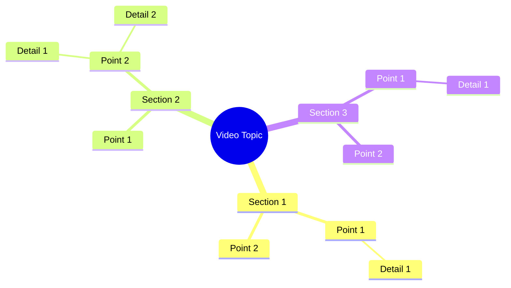

# Husband's Struggle When Money Is Tight

> 🌐 **Read this in:** **English** · [中文](../../zh-CN/2026-09/tiktok-transcript-video-1180.md)

> **Creator:** [@Queen of Growth](https://www.tiktok.com/@Queen of Growth) · **Views:** 8.0M · **Posted:** 2026-09-07 · **Niche:** other
>
> **TL;DR:** The hook uses rhythmic, nonsensical phrasing that immediately intrigues and amuses, prompting viewers to stay for the punchline.

[Watch original video →](https://www.facebook.com/share/r/1Euuh1QDA7/)

## Why This Went Viral

## Hook (first 3 seconds)
- **Verbatim opening:** "સામીર કાછે જખુન ટાકા પહે શામ થાકે તખુન અર્થે રભાપતાકે જતોટાના ભેંએ દાયે તારચે બેશી ભે" — a rapid, rhythmic, almost musical string of Gujarati words delivered with high energy.
- **Hook pattern:** Scene + Rhythm/Pattern interrupt. It’s not a question or a bold claim; it’s a linguistic tongue-twister or folk-style chant that sounds like a beat.
- **Why it stops the scroll:** The brain detects a familiar phonetic pattern (like a Bollywood lyric or folk rhyme) but can’t immediately decode the meaning. This creates a "pattern interrupt" — the viewer stops to either decode the language, catch the rhyme, or simply vibe with the cadence before deciding to swipe away.

## Emotional Rhythm
- **Beat 1 – Curiosity/Confusion (0–3s):** The viewer hears a dense, fast phrase. The brain asks: *"What did he just say? Is this a song? A challenge?"*
- **Beat 2 – Engagement/Tension (3–7s):** As the phrase loops or continues, the viewer leans in to catch specific words they recognize. Tension builds as they try to parse the sentence structure.
- **Beat 3 – Resonance/Recognition (7–10s):** The viewer either realizes it's a regional dialect proverb, a relatable joke about daily fatigue ("after work, you just want to rest"), or simply enjoys the sonic texture. This is the "aha" moment.
- **Beat 4 – Relief/Release (10s+):** The video ends with a punchy finish ("બેશી ભે" — roughly "just sit down"), delivering a comedic or cathartic payoff that makes the loop satisfying.
- **Climax:** The final word "બેશી ભે" lands as the punchline—it’s the simplest, most relatable phrase in the entire string, cutting through the complex buildup with a universal truth: *just sit down and rest.*

## Keyword Density
- **"થાકે" (tired/fatigued)** – Emotional pull. It anchors the video to a universal human state (exhaustion), making it relatable across dialects.
- **"બેશી ભે" (just sit)** – Emotional pull + Call to action. It’s the release valve and the most repeatable phrase—viewers comment this to tag friends.
- **"જખુન/તખુન" (when/then)** – Algorithmic reach. These are rhythmic connectors that make the phrase sound like a song, increasing watch time as people replay to catch the structure.
- **"સામીર" (proper name)** – Emotional pull. A specific name makes it feel personal, driving comments like "Samiro bhai, same here."
- **"જતોટાના" (of the story/legend)** – Algorithmic reach. This word signals folk/traditional content, which performs well in regional content verticals.

## Why It Spreads
- **Universal exhaustion, localized flavor:** The core message ("after a long day, just sit down") is globally relatable, but the Gujarati delivery makes it feel exclusive and authentic. Viewers share it to say *"This is us."*
- **Linguistic puzzle mechanics:** The dense, fast phrase acts as a "brain teaser." Viewers comment asking for translations or repeating the phrase, driving comment engagement and rewatches—both key algorithm signals.
- **Rhythmic loopability:** The cadence of "જખુન... તખુન... ભેંએ... ભે" is musical. The video is designed to be replayed for the sound, boosting retention rate, which is the #1 short-form ranking factor.
- **Cultural pride trigger:** Regional language content that sounds poetic or folk-like triggers a "share to show my culture" impulse. Non-Gujarati speakers share it as an exotic sound bite; Gujarati speakers share it as an identity marker.
- **Low-effort, high-relief payoff:** The final phrase "બેશી ભે" is the simplest part. It gives the viewer a quick, easy takeaway they can screenshot, quote, or use as a status message—making the video a "meme-able" asset.

## What You Can Steal
- **Lead with a rhythmic pattern interrupt:** Open with a fast, rhyming, or tongue-twister-style phrase in your native dialect or niche jargon. Don't explain it first—let the sound be the hook. The confusion drives the first 3 seconds of retention.
- **Build a "complex setup → simple payoff" structure:** Spend 80% of the video building dense, fast-paced energy, then end with a dead-simple, universal phrase that releases the tension (e.g., "just rest," "same here," "that's it"). This creates a satisfying loop that begs for a replay.
- **Localize a universal emotion:** Take a feeling everyone has (tiredness, hunger, frustration) and wrap it in hyper-specific local language or references. The specificity makes it feel authentic; the emotion makes it shareable across language barriers.

## Mind Map

## Full Transcript (Generated by [TokTranscript](https://toktranscript.com/?utm_source=github&utm_medium=breakdown&utm_campaign=tool_attribution))

> 📝 Transcripts on this page are auto-generated and show the first 60%. Want to transcribe any TikTok in 30 seconds and get the full version? [Try TokTranscript free →](https://toktranscript.com/?utm_source=github&utm_medium=breakdown&utm_campaign=transcript_cta)

સામીર કાછે જખુન ટાકા પહે શામ થાકે તખુન અર્થે રભાપતા

*[Read the full transcript on TokTranscript →](https://toktranscript.com/plaza/tiktok-transcript-video-1180?utm_source=github&utm_medium=breakdown&utm_campaign=transcript_full)*

## Browse More

- All [other](../../by-niche/en/other.md) breakdowns
- All [Nonsense Rhyme](../../by-pattern/en/hook-nonsense-rhyme.md) examples

## Video Info

| | |
|---|---|
| Creator | [@Queen of Growth](https://www.tiktok.com/@Queen of Growth) |
| Original video | [https://www.facebook.com/share/r/1Euuh1QDA7/](https://www.facebook.com/share/r/1Euuh1QDA7/) |
| Original title | স্বামীর কাছে যখন টাকা-পয়সা কম থাকে, তখন অর্থের অভাব তাকে যতটা না ভেঙে দেয়, |
| Views | 8.0M (8031574) |
| Posted | 2026-09-07 |
| Duration | 0s |
| Niche | `other` |
| Hook pattern | `Nonsense Rhyme` |
| Original language | `en` |
| Available languages | en, zh-CN |
| Generated | 2026-09-08 by [TokTranscript](https://toktranscript.com/) |

---

*This breakdown is for educational analysis under fair use. Original video © [@Queen of Growth](https://www.tiktok.com/@Queen of Growth). All transcripts are auto-generated and may contain errors.*

*Want to analyze your own TikToks like this? [try this transcription tool →](https://toktranscript.com/viral-breakdown?utm_source=github&utm_medium=breakdown&utm_campaign=footer_cta)*