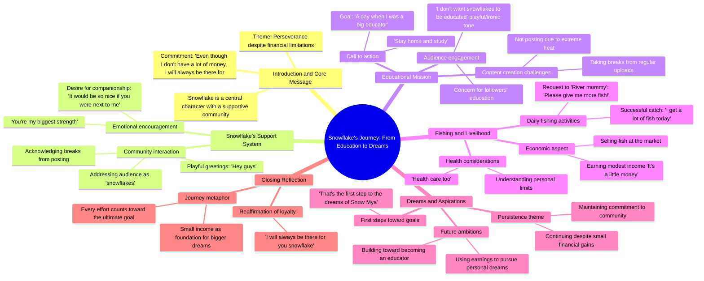

# Snowflake Part 2: A Promise of Support and Study

> 🌐 **Read this in:** **English** · [中文](../../zh-CN/2026-09/tiktok-transcript-video-403c.md)

> **Creator:** [@hninmya641](https://www.tiktok.com/@hninmya641) · **Views:** 1.6M · **Posted:** 2026-09-08 · **Niche:** other
>
> **TL;DR:** Directly addresses the audience as 'snowflake' and makes a heartfelt promise, instantly creating intimacy and curiosity.

[Watch original video →](https://vt.tiktok.com/ZSqhYmL9j/)

## Why This Went Viral

## Hook (first 3 seconds)
- **Verbatim opening:** "snowflake. even though i dont have a lot of money i will always be there for you snowflake"
- **Hook pattern:** Emotional promise + identity call-out (directly addressing the audience as "snowflake" — a term of endearment/loyalty)
- **Why it stops scroll:** It creates instant parasocial intimacy. The creator speaks *to* the viewer, not *at* them. The phrase "I don't have a lot of money" signals humility and relatability, while "I will always be there for you" triggers a loyalty response — viewers feel seen and personally valued within 3 seconds.

## Emotional Rhythm
1. **Warmth/Intimacy** — "snowflake... I will always be there for you" (creates a personal bond)
2. **Aspiration/Determination** — "Stay home and study, I'll go to the place only over laughed" (underdog narrative begins)
3. **Vulnerability** — "you're my biggest strength... A day when I was a big educator" (dreams stated, fragility implied)
4. **Humor/Levity** — "haha Hey guys only over Take a break for a while" (breaks tension, keeps it casual)
5. **Frustration/Relatability** — "I'm not posting because it's too hot... health care too u understand" (everyday struggles)
6. **Playful Escalation** — "River mommy! Please give me more fish! Haha I get a lot of fish today" (comic relief, absurdity)
7. **Triumph/Climax** — "Get these back in the market and I'm gonna do what I want to be a snowflake" (transformation from passive to active)
8. **Resolution/Hope** — "Even though it's a little money, that's the first step to the dreams of Snow Mya" (victory lap, emotional payoff)

**Climax moment:** "I'm gonna do what I want to be a snowflake" — this is the pivot where the creator reclaims agency. The viewer has been on a journey from "I have nothing" to "I'm building something."

## Keyword Density
- **"snowflake"** (6 occurrences) — *Emotional pull:* creates in-group identity, a tribe name. *Algorithmic:* low competition keyword, highly branded.
- **"money"** (3 occurrences) — *Emotional pull:* universal financial anxiety. *Algorithmic:* broad reach, triggers financial-content recommendation clusters.
- **"dreams"** (2 occurrences) — *Emotional pull:* aspirational core. *Algorithmic:* high-engagement "motivation" category.
- **"fish"** (3 occurrences) — *Emotional pull:* metaphor for daily hustle/earnings. *Algorithmic:* niche but memorable, boosts comment engagement.
- **"study/educated/educator"** (3 occurrences) — *Emotional pull:* self-improvement narrative. *Algorithmic:* connects to "productivity" and "study" content verticals.
- **"always be there"** (1 occurrence, but emotionally dense) — *Emotional pull:* loyalty promise. *Algorithmic:* triggers comment threads about community.

## Why It Spreads
- **Identity creation:** The repeated "snowflake" naming gives viewers a label to adopt. People share content that makes them feel part of a group — comments fill with "I'm a snowflake too."
- **Underdog-to-winner arc in 60 seconds:** The transcript moves from "I don't have money" to "first step to dreams." This compressed rags-to-riches arc is the most shareable emotional structure on short-form video.
- **Imperfect, raw delivery:** Grammar errors and fragmented sentences ("Cold people I m not posting because it s too hot") signal authenticity. Polish would kill the virality — viewers trust this more than a slick production.
- **Self-deprecating humor + ambition combo:** Lines like "River mommy! Please give me more fish!" make the creator lovable, while "I'm gonna do what I want" makes them admirable. The contrast is magnetic.
- **Direct audience address throughout:** Every beat speaks to "snowflake" or "you." This isn't a monologue — it's a conversation. Viewers feel compelled to respond, driving comment velocity (a top algorithmic signal).

## What You Can Steal
1. **Invent a tribe name and repeat it relentlessly.** Call your audience something specific ("snowflake," "hustler," "dreamer") and use it in the first and last 10 seconds. It turns passive viewers into community members who self-identify and return.
2. **Structure your video as a 60-second emotional rollercoaster.** Open with vulnerability, insert humor mid-way, and end on a triumphant, forward-looking line. Don't stay in one emotional register for more than 15 seconds.
3. **Leave grammar and polish imperfect if it buys authenticity.** Fragmented sentences and casual typos signal "real person talking to a friend," not "brand broadcasting." If your content is too clean, viewers don't trust the struggle narrative.

## Mind Map

## Full Transcript (Generated by [TokTranscript.com](https://toktranscript.com/?utm_source=github&utm_medium=breakdown&utm_campaign=tool_attribution))

> 📝 Transcripts on this page are auto-generated and show the first 60%. Want to transcribe any TikTok in 30 seconds and get the full version? [Try TokTranscript free →](https://toktranscript.com/?utm_source=github&utm_medium=breakdown&utm_campaign=transcript_cta)

snowflake. even though i dont have a lot of money i will always be there for you snowflake Stay home and study, I'll go to the place only over laughed. you're my biggest strength A day when I was a big educator It would be so nice if you were next to me haha Hey guys only over Take a break for a while, didn't you send me a snow rice? Cold people I m not posting because it s too hot Are you going to fish for pride now?

*[Read the full transcript on TokTranscript →](https://toktranscript.com/plaza/tiktok-transcript-video-403c?utm_source=github&utm_medium=breakdown&utm_campaign=transcript_full)*

## Browse More

- All [other](../../by-niche/en/other.md) breakdowns
- All [Emotional direct address](../../by-pattern/en/hook-emotional-direct-address.md) examples

## Video Info

| | |
|---|---|
| Creator | [@hninmya641](https://www.tiktok.com/@hninmya641) |
| Original video | [https://vt.tiktok.com/ZSqhYmL9j/](https://vt.tiktok.com/ZSqhYmL9j/) |
| Original title | #နှင်းမြ ဒုတိယပိုင်းလေး တင်ပေးမယ်နော်  နောင်တနဲ့အတူ နှင်းမြ ဇာတ်လမ်းလ... |
| Views | 1.6M (1600000) |
| Posted | 2026-09-08 |
| Duration | 0s |
| Niche | `other` |
| Hook pattern | `Emotional direct address` |
| Original language | `en` |
| Available languages | en, zh-CN |
| Generated | 2026-09-09 by [TokTranscript](https://toktranscript.com/) |

---

*This breakdown is for educational analysis under fair use. Original video © [@hninmya641](https://www.tiktok.com/@hninmya641). All transcripts are auto-generated and may contain errors.*

*Want to analyze your own TikToks like this? [TokTranscript →](https://toktranscript.com/viral-breakdown?utm_source=github&utm_medium=breakdown&utm_campaign=footer_cta)*