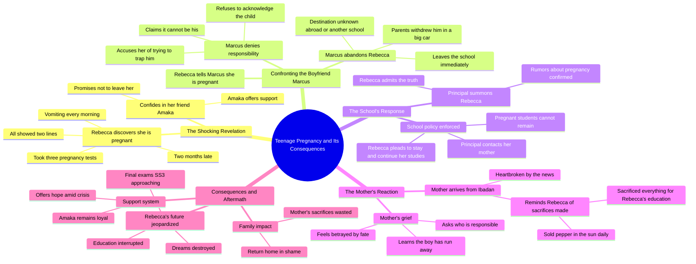

# Rebecca Episode 1: Pregnant After Just the Tip

> 🌐 **Read this in:** **English** · [中文](../../zh-CN/2026-09/tiktok-transcript-video-c218.md)

> **Creator:** [@storysthetic_](https://www.tiktok.com/@storysthetic_) · **Views:** 358.6K · **Posted:** 2026-09-08 · **Niche:** entertainment
>
> **TL;DR:** The hook uses a raw, shocking denial that immediately raises questions and hooks the viewer.

[Watch original video →](https://vm.tiktok.com/ZN82UMbWU/)

## Why This Went Viral

## Hook (first 3 seconds)
- **Verbatim opening line:** "What do you mean you're pregnant? It was just the tip and I didn't even come."
- **Hook pattern:** Bold claim + shock dialogue (contrast between denial and reality).
- **Why it stops scroll:** It drops viewers mid-argument with raw, explicit denial — instantly creating a "wait, what?" moment. The taboo topic and blunt language force an emotional reaction (shock, judgment, curiosity) within 2 seconds, making it impossible to scroll past without knowing the outcome.

## Emotional Rhythm
1. **Shock/Disbelief** — Opening argument: "It was just the tip" sets a provocative, tense tone.
2. **Anxiety** — Rebecca's confession to Amaka: "I did the test three times… I'm 2 months late." Builds dread through physical symptoms.
3. **Hope/Relief (false)** — Amaka's reassurance: "Then he will take responsibility… He loves you." Creates a false peak of comfort.
4. **Tension Spike** — Confrontation with Marcus: "You want to trap me." Twist: the boyfriend denies and abandons her.
5. **Despair** — Rebecca learns Marcus fled: "He has packed everything, gone." Emotional low point; viewers feel her isolation.
6. **Resonance/Compassion** — Amaka's loyalty: "Whatever happens, I'm not leaving you, Rebecca." A brief emotional anchor.
7. **Climax — Public Shame** — Principal's expulsion: "A pregnant girl cannot remain here." The system turns against her.
8. **Tragic Payoff** — Mother's arrival: "I sold pepper in the sun… so you would not end up like me." The climax lands here — generational sacrifice meets betrayal, delivering the gut-punch that makes viewers share it.

## Keyword Density
- **"Pregnant"** (6×) — Drives the core conflict; high search/algorithmic relevance for drama content.
- **"Sorry"** (4×) — Emotional pull; signals guilt, shame, and sympathy — triggers empathy-driven engagement.
- **"Mother/Mommy"** (5×) — Ties to family sacrifice; emotional resonance, especially for African diaspora audiences.
- **"Gone"** (3×) — Reinforces abandonment; creates a sense of loss that viewers feel viscerally.
- **"Tip"** (1×) — Provocative, taboo; drives initial curiosity and comment-section debate (high engagement).
- **"Sold"** (2×) — Anchors sacrifice; makes the mother's pain tangible and shareable.
- **"School"** (4×) — Relatable setting; broadens reach beyond niche audiences (education, teen pregnancy topics).

## Why It Spreads
- **Universal taboo + specific cultural context** — Teen pregnancy, denial, and parental sacrifice resonate globally, but the Nigerian boarding-school setting (SS3, Ibadan, "Chineke") gives it authentic specificity that drives niche virality and cross-cultural curiosity.
- **Comment-bait dialogue** — Lines like "It was just the tip" and "You want to trap me" are engineered to spark outrage and debate. Viewers flood comments with judgments, personal stories, and defenses — boosting engagement signals.
- **Emotional whiplash in under 60 seconds** — The script compresses a full tragedy arc (hope → betrayal → shame → sacrifice) into one clip. Viewers rewatch to catch emotional shifts, and share it as a "warning story" or "tearjerker."
- **Relatable archetypes** — The "denying boyfriend," "loyal best friend," "strict principal," and "struggling mother" are instantly recognizable. Viewers tag friends ("this is us") or share as moral lessons, multiplying reach.
- **Open-ended cliffhanger** — "Come, let's go home" leaves the future unresolved. Viewers comment "Part 2?" and creators follow up, creating serialized engagement that keeps the original video circulating.

## What You Can Steal
1. **Start mid-crisis, not at the beginning** — Open with the most explosive line of dialogue. Don't set the scene; drop viewers into the argument and let them piece together context through emotional reactions.
2. **Use a "false hope" beat before the twist** — Have a supporting character offer reassurance ("He loves you") right before the betrayal lands. This makes the emotional crash harder and the clip more rewatchable.
3. **End on a parent's sacrifice line** — The most shareable moment is when a secondary character (the mother) delivers a line that reframes the entire story's stakes. Craft one sentence that summarizes the cost ("I sold pepper in the sun") — that's the line viewers quote in comments and captions.

## Mind Map

## Full Transcript (Generated by [TokTranscript](https://toktranscript.com/?utm_source=github&utm_medium=breakdown&utm_campaign=tool_attribution))

> 📝 Transcripts on this page are auto-generated and show the first 60%. Want to transcribe any TikTok in 30 seconds and get the full version? [Try TokTranscript free →](https://toktranscript.com/?utm_source=github&utm_medium=breakdown&utm_campaign=transcript_cta)

What do you mean you're pregnant? It was just the tip and I didn't even come. So how come you don't mean that? Rebecca, what is it? You've been shaking since prep time, Amaka. I did the test three times, two lines every time. Ah, Rebecca, no. Are you sure? Maybe the test is. I'm 2 months late, Amaka. I've been vomiting every morning. I know my body. Chineke, what are you going to do? I don't know. I don't know anything anymore. Is it, is it Marcus? Then he will take responsibility. He has to. You think so? I know. So tell him tomorrow. He loves you. I need to talk to you. It's important. Rebecca, my baby. What is it? You look serious. I'm pregnant. You're what? I'm pregnant. It's yours. Two months. Mine. How is it mine? What do you mean how? There's nobody else you know that. Don't start this nonsense. You want to trap me. I'm carrying your child. I'm not trying to trap anybody. Keep your voice down. I don't know what you did or who you were with. This thing isn't my business. Don't call my name. Don't come near me. Rebecca, Rebecca, what is it? What is it? He's gone. His parents came this morning with a big car. They withdrew him from the school. He has packed everything, gone. Gone where? Nobody knows. Some say abroad. Some say another school in Abuja. What am I going to do, Amaka? What am I going to tell my mother. She sold everything to put me here. Everything. We'll think of something. You're not alone. Do you hear me? Whatever happens, I'm not leaving you, Rebecca. DM me.

*[Read the full transcript on TokTranscript →](https://toktranscript.com/plaza/tiktok-transcript-video-c218?utm_source=github&utm_medium=breakdown&utm_campaign=transcript_full)*

## Browse More

- All [entertainment](../../by-niche/en/entertainment.md) breakdowns
- All [Shocking denial](../../by-pattern/en/hook-shocking-denial.md) examples

## Video Info

| | |
|---|---|
| Creator | [@storysthetic_](https://www.tiktok.com/@storysthetic_) |
| Original video | [https://vm.tiktok.com/ZN82UMbWU/](https://vm.tiktok.com/ZN82UMbWU/) |
| Original title | 𝐑𝐄𝐁𝐄𝐂𝐂𝐀   | 𝐄𝐩𝐢𝐬𝐨𝐝𝐞 𝟏  𝐓𝐡𝐢𝐬 𝐢𝐬 𝐚 𝐟𝐢𝐜𝐭𝐢𝐨𝐧𝐚𝐥 𝐬𝐭𝐨𝐫𝐲 𝐜𝐫𝐞𝐚𝐭𝐞𝐝 𝐟𝐨𝐫 𝐞𝐧𝐭𝐞𝐫𝐭𝐚𝐢... |
| Views | 358.6K (358600) |
| Posted | 2026-09-08 |
| Duration | 0s |
| Niche | `entertainment` |
| Hook pattern | `Shocking denial` |
| Original language | `en` |
| Available languages | en, zh-CN |
| Generated | 2026-09-09 by [TokTranscript](https://toktranscript.com/) |

---

*This breakdown is for educational analysis under fair use. Original video © [@storysthetic_](https://www.tiktok.com/@storysthetic_). All transcripts are auto-generated and may contain errors.*

*Want to analyze your own TikToks like this? [free TikTok transcript generator →](https://toktranscript.com/viral-breakdown?utm_source=github&utm_medium=breakdown&utm_campaign=footer_cta)*