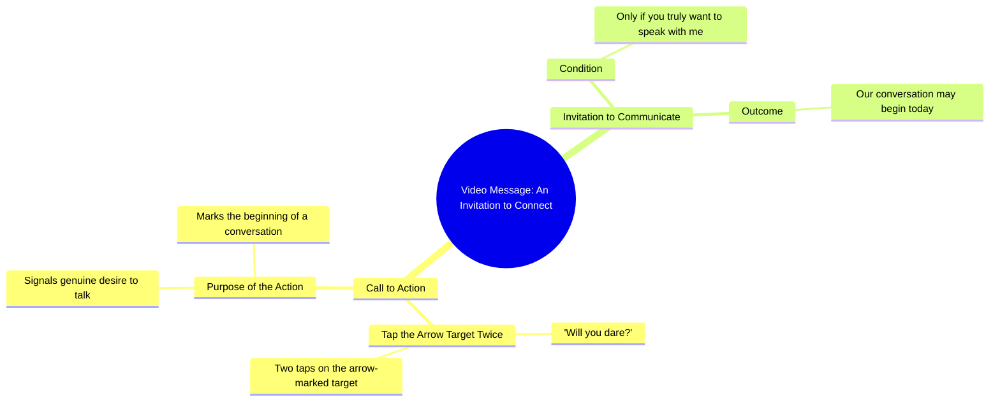

# Will You Dare Touch the Arrow Target Twice

> 🌐 **Read this in:** **English** · [中文](../../zh-CN/2026-10/tiktok-transcript-10m-views-163k-reactions-03045658506-1e58.md)

> **Creator:** [@03045658506](https://www.tiktok.com/@03045658506) · **Views:** 4.1M · **Posted:** 2026-10-03 · **Niche:** other
>
> **TL;DR:** The hook directly challenges the viewer's courage, compelling them to engage.

[Watch original video →](https://www.facebook.com/share/r/1FvTbg8Z3M/)

## Why This Went Viral

## Hook (first 3 seconds)
- **Verbatim opening line:** "क्या आप हिम्मत करेंगे?" ("Would you dare?") followed immediately by "इस तीर वाले निसान पर दो बार टच करके देखो" ("Touch this arrow-marked target twice and see").
- **Hook pattern:** Direct challenge / dare + curiosity gap ("क्या आप हिम्मत करेंगे?") combined with an instruction-based command ("टच करके देखो").
- **Why it stops the scroll:** It flips the passive viewer into an active participant within one second. A dare triggers ego and self-identification ("Am I brave enough?"), and the imperative "touch twice" forces a physical micro-action, which the algorithm reads as engagement. The unresolved promise ("शायद आज से हमारी बातचीत की सुरुवात हो जाए") creates an open loop the brain wants to close.

## Emotional Rhythm
- **Beat 1 – Challenge/ego spike (0–1s):** "क्या आप हिम्मत करेंगे?" — provokes pride and defensiveness.
- **Beat 2 – Curiosity/instruction (1–3s):** "तीर वाले निसान पर दो बार टच करो" — a concrete, low-effort action that keeps attention anchored.
- **Beat 3 – Intimacy/anticipation (3–6s):** "अगर आप सच में मुझसे बात करना चाहते हैं" — shifts from dare to personal connection, implying a reward for the brave.
- **Beat 4 – Promise/twist (final line):** "शायद आज से हमारी बातचीत की सुरुवात हो जाए" — reframes the whole video as the beginning of a relationship, not a trick.
- **Climax moment:** The final line — the reveal that the "dare" was actually an invitation to a conversation. The tension built by the dare resolves into emotional payoff, which is what drives rewatches and comments.

## Keyword Density
- **हिम्मत** (courage/dare) — emotional pull; triggers ego.
- **टच** (touch) — algorithmic reach; drives physical engagement signals.
- **तीर वाले निसान** (arrow-marked target) — visual anchor; keeps eyes on screen.
- **बात करना / बातचीत** (talk/conversation) — emotional pull; promises connection.
- **सच में** (really/truly) — emotional pull; adds sincerity and stakes.
- **आज से** (from today) — algorithmic + emotional; implies a turning point.
- **सुरुवात** (beginning) — emotional pull; open-loop word that demands resolution.
- **दो बार** (twice) — algorithmic; specific number increases compliance and comment debates ("I did it twice, now what?").

## Why It Spreads
- **Dare mechanics force participation:** "क्या आप हिम्मत करेंगे?" and "दो बार टच करके देखो" turn viewers into actors. Comments flood with "मैंने किया" ("I did it"), which the algorithm reads as high engagement.
- **Open loop with no immediate payoff:** The video never shows what happens after touching twice — it only promises "शायद आज से हमारी बातचीत की सुरुवात हो जाए." Viewers rewatch and comment asking "क्या हुआ?" ("What happened?"), boosting watch time and comment count.
- **Parasocial bait:** "अगर आप सच में मुझसे बात करना चाहते हैं" makes the viewer feel personally chosen. This drives shares to friends with the tag "तुम भी टच करो."
- **Low-friction, high-identity action:** Touching the screen twice costs nothing but signals bravery. It's a shareable identity test — "I'm the type who dares."
- **Cliffhanger ending invites duets/stitches:** The unresolved "शायद" ("maybe") leaves room for reaction videos, duets, and follow-up content, extending the video's lifecycle.

## What You Can Steal
- **Open with a dare, not a description.** Replace "Here's a tip about X" with "Would you dare to try X?" — it converts passive viewers into participants in under two seconds.
- **Give a tiny physical instruction.** "Touch twice," "tap the screen," "hold your breath" — micro-actions boost engagement signals and make the viewer feel involved before the payoff.
- **End on an unresolved promise, not a conclusion.** "Maybe today is the start of our conversation" leaves a loop open. Viewers comment, rewatch, and share to find out what happens next — which is exactly what the algorithm rewards.

## Mind Map

## Full Transcript (Generated by [TokTranscript](https://toktranscript.com/?utm_source=github&utm_medium=breakdown&utm_campaign=tool_attribution))

> 📝 Transcripts on this page are auto-generated and show the first 60%. Want to transcribe any TikTok in 30 seconds and get the full version? [Try TokTranscript free →](https://toktranscript.com/?utm_source=github&utm_medium=breakdown&utm_campaign=transcript_cta)

क्या आप हिम्मत करेंगे? इस तीर वाले निसान पर दो बार टच करके देखो.

*[Read the full transcript on TokTranscript →](https://toktranscript.com/plaza/tiktok-transcript-10m-views-163k-reactions-03045658506-1e58?utm_source=github&utm_medium=breakdown&utm_campaign=transcript_full)*

## Browse More

- All [other](../../by-niche/en/other.md) breakdowns
- All [Challenge Hook](../../by-pattern/en/hook-challenge-hook.md) examples

## Video Info

| | |
|---|---|
| Creator | [@03045658506](https://www.tiktok.com/@03045658506) |
| Original video | [https://www.facebook.com/share/r/1FvTbg8Z3M/](https://www.facebook.com/share/r/1FvTbg8Z3M/) |
| Original title | 10M views · 163K reactions | کیا آپ ہمت کریں گے | 03045658506 |
| Views | 4.1M (4064505) |
| Posted | 2026-10-03 |
| Duration | 0s |
| Niche | `other` |
| Hook pattern | `Challenge Hook` |
| Original language | `en` |
| Available languages | en, zh-CN |
| Generated | 2026-10-04 by [TokTranscript](https://toktranscript.com/) |

---

*This breakdown is for educational analysis under fair use. Original video © [@03045658506](https://www.tiktok.com/@03045658506). All transcripts are auto-generated and may contain errors.*

*Want to analyze your own TikToks like this? [try this transcription tool →](https://toktranscript.com/viral-breakdown?utm_source=github&utm_medium=breakdown&utm_campaign=footer_cta)*