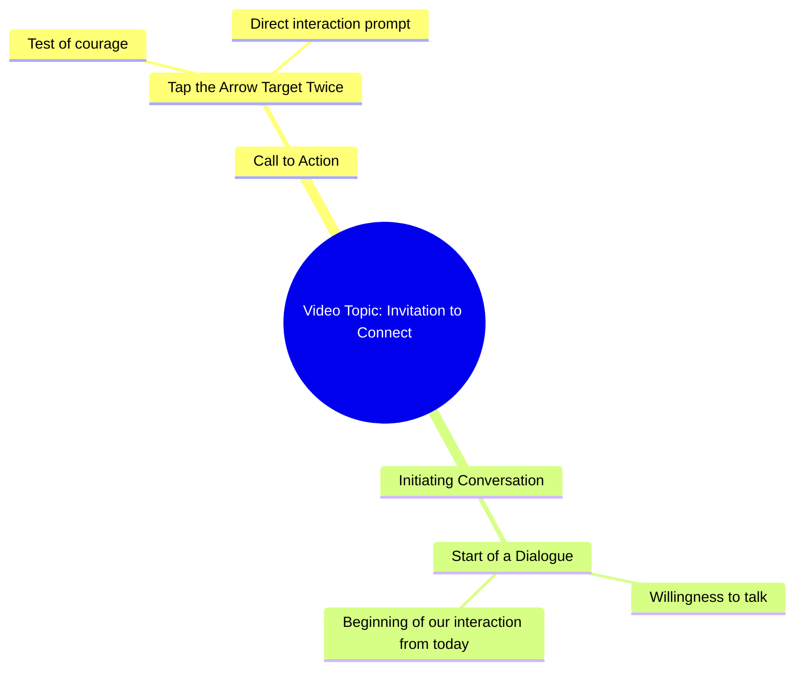

# Would You Touch This Arrow Mark Twice

> 🌐 **Read this in:** **English** · [中文](../../zh-CN/2026-10/tiktok-transcript-10m-views-171k-reactions-03045658506-5568.md)

> **Creator:** [@03045658506](https://www.tiktok.com/@03045658506) · **Views:** 4.3M · **Posted:** 2026-10-05 · **Niche:** other
>
> **TL;DR:** Poses a daring question that challenges the viewer's courage, compelling them to engage.

[Watch original video →](https://www.facebook.com/share/r/1Hq5QPQK7c/)

## Why This Went Viral

## Hook (first 3 seconds)
- Verbatim: "क्या आप हिम्मत करेंगे? इस तीर वाले निसान पर दो बार टच करके देखो." (Will you dare? Try touching this arrow-marked target twice.)
- Pattern: **Direct challenge / dare** wrapped in a question — a "courage test" hook.
- Why it stops the scroll: It issues a personal, second-person dare ("आप... हिम्मत करेंगे?") that demands an immediate self-check ("would I?"). The physical instruction ("touch twice") creates a micro-commitment loop — the viewer's thumb is already on the screen, so the action feels one tap away. Curiosity + ego + interactivity in one line.

## Emotional Rhythm
- **0–2s — Challenge/curiosity:** "क्या आप हिम्मत करेंगे?" triggers ego + intrigue.
- **2–5s — Instruction/tension:** "दो बार टच करके देखो" converts passive watching into a pending action; suspense builds around what happens *if* you touch.
- **5–10s — Promise/relief:** "अगर आप सच में मुझसे बात करना चाहते हैं..." reframes the dare as an invitation — the tension resolves into intimacy and reward.
- **Climax:** The pivot line "शायद आज से हमारी बातचीत की सुरुवात हो जाए" — the twist that the "dare" was actually a doorway to a relationship. This is where meaning flips from game to connection.
- Resonance lands on the final word "सुरुवात" (beginning) — it leaves an open loop the viewer wants to close by engaging.

## Keyword Density
- **हिम्मत** (courage/dare) — emotional pull; triggers ego.
- **टच / टच करके** (touch) — algorithmic reach; platform-native action word tied to engagement.
- **निसान / तीर** (target / arrow) — visual/curiosity keyword; concrete and scroll-stopping.
- **दो बार** (twice) — specificity; makes the instruction feel real and testable.
- **सच में** (really/truly) — emotional pull; signals authenticity.
- **बात करना / बातचीत** (talk / conversation) — emotional pull; promises connection.
- **आज से** (from today) — urgency + freshness.
- **सुरुवात** (beginning) — emotional payoff word; implies a new chapter.

Algorithmic drivers: *टच, दो बार, आज* (action + specificity + recency). Emotional drivers: *हिम्मत, सच में, बातचीत, सुरुवात* (dare + sincerity + relationship).

## Why It Spreads
- **Second-person dare forces self-projection.** "क्या आप हिम्मत करेंगे?" makes every viewer the protagonist — people share content that feels like it was aimed at them personally.
- **A physical CTA hidden inside a riddle.** "दो बार टच करके देखो" turns passive viewing into a tap, and taps feed the algorithm — engagement begets reach.
- **The bait-and-switch payoff.** The dare looks like a game but resolves into "शायद आज से हमारी बातचीत की सुरुवात हो जाए" — a soft, emotional twist that makes viewers re-watch and comment ("I touched, now what?").
- **Open loop = comment fuel.** The video never explains what touching *does* — that ambiguity is the comment section's job, and comments are the strongest distribution signal.
- **Low-production, high-intimacy tone.** The line "अगर आप सच में मुझसे बात करना चाहते हैं" positions the creator as accessible, which drives follows and DMs — the two metrics that push a reel into wider feeds.

## What You Can Steal
- **Open with a dare, not a description.** Replace "Here's a tip about X" with "Would you dare to try X?" — ego-driven hooks outperform informational ones.
- **Bury a physical action inside the hook.** Give viewers something to *do* in the first 3 seconds (tap, comment a word, screenshot). Actions train the algorithm to keep serving your video.
- **End on an unresolved emotional promise.** Don't close the loop — leave a line like "maybe today is where it begins" so viewers comment, rewatch, or DM to find out what happens next.

## Mind Map

## Full Transcript (Generated by [TokTranscript.com](https://toktranscript.com/?utm_source=github&utm_medium=breakdown&utm_campaign=tool_attribution))

> 📝 Transcripts on this page are auto-generated and show the first 60%. Want to transcribe any TikTok in 30 seconds and get the full version? [Try TokTranscript free →](https://toktranscript.com/?utm_source=github&utm_medium=breakdown&utm_campaign=transcript_cta)

क्या आप हिम्मत करेंगे? इस तीर वाले निसान पर दो बार टच करके देखो.

*[Read the full transcript on TokTranscript →](https://toktranscript.com/plaza/tiktok-transcript-10m-views-171k-reactions-03045658506-5568?utm_source=github&utm_medium=breakdown&utm_campaign=transcript_full)*

## Browse More

- All [other](../../by-niche/en/other.md) breakdowns
- All [Challenge Question](../../by-pattern/en/hook-challenge-question.md) examples

## Video Info

| | |
|---|---|
| Creator | [@03045658506](https://www.tiktok.com/@03045658506) |
| Original video | [https://www.facebook.com/share/r/1Hq5QPQK7c/](https://www.facebook.com/share/r/1Hq5QPQK7c/) |
| Original title | 10M views · 171K reactions | کیا آپ ہمت کریں گے | 03045658506 |
| Views | 4.3M (4328992) |
| Posted | 2026-10-05 |
| Duration | 0s |
| Niche | `other` |
| Hook pattern | `Challenge Question` |
| Original language | `en` |
| Available languages | en, zh-CN |
| Generated | 2026-10-06 by [TokTranscript](https://toktranscript.com/) |

---

*This breakdown is for educational analysis under fair use. Original video © [@03045658506](https://www.tiktok.com/@03045658506). All transcripts are auto-generated and may contain errors.*

*Want to analyze your own TikToks like this? [the tool we used to generate this →](https://toktranscript.com/viral-breakdown?utm_source=github&utm_medium=breakdown&utm_campaign=footer_cta)*