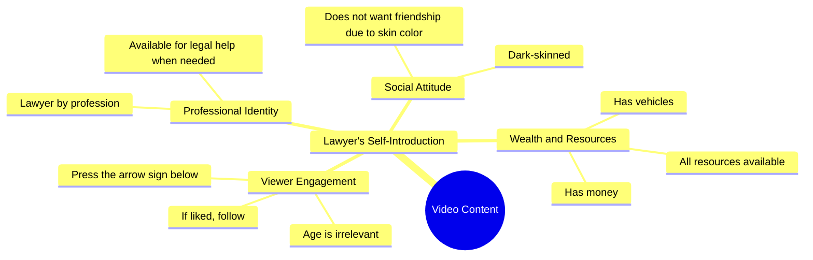

# Lawyer Seeks Friendship Despite Color Bias

> 🌐 **Read this in:** **English** · [中文](../../zh-CN/2026-10/tiktok-transcript-10m-views-251k-reactions-wafa-world-facebookreels-reels-tren-1e59.md)

> **Creator:** [@Sifa Ansari](https://www.tiktok.com/@Sifa Ansari) · **Views:** 3.7M · **Posted:** 2026-10-08 · **Niche:** other
>
> **TL;DR:** The hook presents a personal problem (skin color affecting friendship) and implies a solution (offering help as a lawyer) while evoking empathy.

[Watch original video →](https://www.facebook.com/reel/1064161166385847/?app=fbl)

## Why This Went Viral

## Hook (first 3 seconds)
- Verbatim opening line: "वकील हूँ, किसी काम में जरूरत पड़े तो बता देना, पैसा, गाड़ी सब है" ("I'm a lawyer, tell me if you ever need anything — I have money, a car, everything")
- Hook pattern: **Status flex + open invitation** (authority + resource claim), immediately undercut by a self-deprecating contrast in the next line
- Why it stops the scroll: It front-loads a high-status identity (lawyer, money, car) that triggers curiosity and social comparison, then the very next beat ("काली हूँ इसलिए कोई दोस्ती नहीं करना चाहता" — "I'm dark-skinned, so nobody wants to be friends") creates a jarring emotional whiplash. That contrast between power and vulnerability is what freezes the thumb.

## Emotional Rhythm
- **Beat 1 – Curiosity/status pull:** "वकील हूँ… पैसा, गाड़ी सब है" → viewer expects a flex or a flex-humble brag
- **Beat 2 – Tension/emotional gut-punch:** "काली हूँ इसलिए कोई दोस्ती नहीं करना चाहता" → sudden shift to rejection and loneliness; suspense lands here because the viewer now wants to know *why* this contradiction exists
- **Beat 3 – Resonance:** "उमर कितनी भी हो, पसंद हूँ तो…" → universal appeal, age-agnostic, invites the viewer to identify
- **Beat 4 – Twist / climax:** "फॉलो करके नीचे तीर के निशान पर दबाओ" → the emotional build-up is converted into a direct CTA; the climax is the pivot from pain to action
- **Climax moment:** The transition from "nobody wants to be friends with me" to "if you like me, follow and hit the arrow below" — the vulnerability becomes the conversion trigger

## Keyword Density
- **वकील** (lawyer) – authority keyword; drives credibility and algorithmic interest in "professional" content
- **पैसा, गाड़ी** (money, car) – status/aspiration keywords; high emotional pull, signal "success story"
- **काली** (dark-skinned) – the emotional core; drives resonance and comment-section debate, which fuels algorithmic reach
- **दोस्ती** (friendship) – universal emotional keyword; broadens relatability beyond any niche
- **उमर** (age) – inclusivity keyword; signals "this applies to you regardless of age"
- **पसंद** (like) – engagement keyword; directly primes the like/follow action
- **फॉलो** (follow) – explicit CTA keyword; algorithmic reach driver
- **तीर के निशान** (arrow mark) – platform-specific CTA; drives tap-through and watch-time completion

Which drive reach vs. pull: **वकील, फॉलो, तीर के निशान** drive algorithmic reach (they signal professional content + explicit engagement commands). **काली, दोस्ती, पैसा, गाड़ी** drive emotional pull (they trigger identity, aspiration, and insecurity).

## Why It Spreads
- **Contrast hook = pattern interrupt.** The line "पैसा, गाड़ी सब है" immediately followed by "काली हूँ इसलिए कोई दोस्ती नहीं करता" creates cognitive dissonance — viewers rewatch or pause to process the contradiction, boosting watch time.
- **Identity-based relatability.** "काली हूँ" taps into a widely shared but rarely voiced insecurity in Indian short-form content; viewers who relate comment, share, or tag friends, which signals the algorithm to push it further.
- **Status + vulnerability combo.** "वकील हूँ" gives authority, "कोई दोस्ती नहीं करता" gives vulnerability — this dual signal makes the creator feel both aspirational and approachable, increasing follow intent.
- **Age-agnostic inclusion.** "उमर कितनी भी हो" explicitly removes demographic filters, widening the potential audience to nearly everyone on the platform.
- **Direct, low-friction CTA.** "फॉलो करके नीचे तीर के निशान पर दबाओ" is a clear, two-step action instruction placed right after the emotional peak — maximum compliance at maximum emotional readiness.

## What You Can Steal
1. **Open with a status flex, then immediately undercut it.** Lead with your strongest credential or asset, then pivot to a personal vulnerability in the same breath. The whiplash is the hook.
2. **Make your pain universal, not niche.** Replace specific details with broad identity markers ("उमर कितनी भी हो") so anyone watching feels personally addressed.
3. **Place your CTA at the emotional climax, not the end.** Don't wait for a natural pause — convert the moment of highest emotional resonance directly into "follow / tap the arrow."

## Mind Map

## Full Transcript (Generated by [TokTranscript](https://toktranscript.com/?utm_source=github&utm_medium=breakdown&utm_campaign=tool_attribution))

> 📝 Transcripts on this page are auto-generated and show the first 60%. Want to transcribe any TikTok in 30 seconds and get the full version? [Try TokTranscript free →](https://toktranscript.com/?utm_source=github&utm_medium=breakdown&utm_campaign=transcript_cta)

वकील हूँ, किसी काम में जरूरत पड़े तो बता देना, पैसा, गाड़ी सब है, काली हूँ इसले कोई दोस्ती नहीं करना च

*[Read the full transcript on TokTranscript →](https://toktranscript.com/plaza/tiktok-transcript-10m-views-251k-reactions-wafa-world-facebookreels-reels-tren-1e59?utm_source=github&utm_medium=breakdown&utm_campaign=transcript_full)*

## Browse More

- All [other](../../by-niche/en/other.md) breakdowns
- All [Problem-Solution with Vulnerability](../../by-pattern/en/hook-problem-solution-with-vulnerability.md) examples

## Video Info

| | |
|---|---|
| Creator | [@Sifa Ansari](https://www.tiktok.com/@Sifa Ansari) |
| Original video | [https://www.facebook.com/reel/1064161166385847/?app=fbl](https://www.facebook.com/reel/1064161166385847/?app=fbl) |
| Original title | 10M views · 251K reactions | Wafa World 😘🥀 #FacebookReels #Reels #TrendingReels #ReelsVideo #ShortVideo #ViralVideo #Explore #ForYou #Dosti #Friendship #OnlineDosti #DesiVibes #UrduPosts #followformoreL | Sifa Ansari |
| Views | 3.7M (3745926) |
| Posted | 2026-10-08 |
| Duration | 0s |
| Niche | `other` |
| Hook pattern | `Problem-Solution with Vulnerability` |
| Original language | `en` |
| Available languages | en, zh-CN |
| Generated | 2026-10-08 by [TokTranscript](https://toktranscript.com/) |

---

*This breakdown is for educational analysis under fair use. Original video © [@Sifa Ansari](https://www.tiktok.com/@Sifa Ansari). All transcripts are auto-generated and may contain errors.*

*Want to analyze your own TikToks like this? [TokTranscript.com →](https://toktranscript.com/viral-breakdown?utm_source=github&utm_medium=breakdown&utm_campaign=footer_cta)*