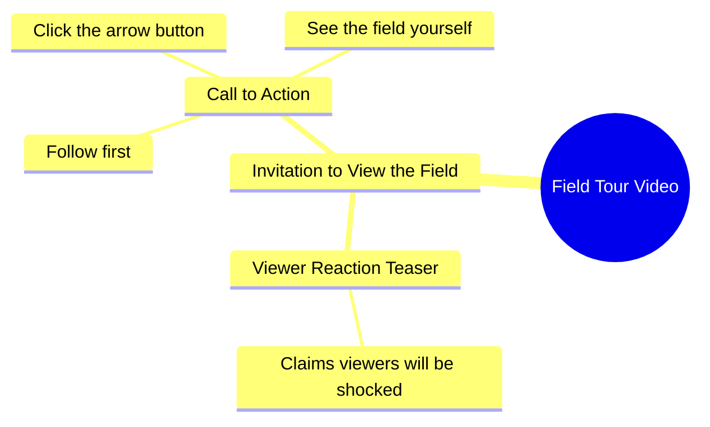

# Woman Shows Her Lush Green Farm Field

> 🌐 **Read this in:** **English** · [中文](../../zh-CN/2026-10/tiktok-transcript-16m-views-213k-reactions-wafa-world-facebookreelsviral-reels-9831.md)

> **Creator:** [@Sujata ](https://www.tiktok.com/@Sujata ) · **Views:** 5.7M · **Posted:** 2026-10-09 · **Niche:** other
>
> **TL;DR:** The hook uses a shocking claim about the field and a direct challenge to the viewer to follow and watch, creating curiosity and engagement.

[Watch original video →](https://www.facebook.com/share/r/1BgEoFAZoj/)

## Why This Went Viral

## Hook (first 3 seconds)
- Verbatim opening line: "जो खेत में आपको दिखाने वाली हूँ, आप मेरा खेत देखकर शायद आपके होश उड़ जाएंगे." (What I'm about to show you in my field—seeing my field might blow your mind.)
- Hook pattern: **Bold claim + withheld reveal.** A promise of something shocking, deliberately not shown yet.
- Why it stops the scroll: It creates an open information gap ("what's in the field?") in the same breath as an emotional stake ("your mind will blow"). The brain can't leave a promised payoff unresolved, so the thumb freezes.

## Emotional Rhythm
- **Beat 1 – Curiosity spike:** "आपके होश उड़ जाएंगे" sets an expectation of shock before any visual is delivered.
- **Beat 2 – Challenge/ego bait:** "हिम्मत है तो पहले फॉलो करो" flips the viewer into a dare. Pride gets activated.
- **Beat 3 – Micro-commitment:** "फिर तीर के बटन पे क्लिक करके" turns the dare into a required action (follow → tap arrow).
- **Beat 4 – Delayed payoff:** "खुद खेत देख लो" hands the reveal to the viewer, sustaining suspense right to the cut.
- **Climax:** The line "आपके होश उड़ जाएंगे" is the emotional peak—everything after is a funnel toward the reveal.
- Suspense lands on the *withheld visual*, not on any event. The tension is manufactured, not shown.

## Keyword Density
- **खेत** (field) — anchor keyword; drives topical/algorithmic targeting for agriculture content.
- **आपको / आप** (you) — direct-address pronoun; forces personal relevance, boosts retention.
- **होश उड़ जाएंगे** (mind will blow) — emotional-pull phrase; the clickbait engine.
- **हिम्मत** (courage) — ego trigger; converts passive viewers into commenters.
- **फॉलो** (follow) — explicit algorithmic CTA.
- **तीर का बटन** (arrow button) — native-platform instruction; boosts watch-through and taps.
- **देख लो / दिखाने** (see/show) — repeated verb of reveal; reinforces the promise.
- **Drives reach:** खेत, फॉलो, तीर का बटन (topical + engagement signals).
- **Drives emotion:** होश उड़ जाएंगे, हिम्मत, आप (shock + ego + direct address).

## Why It Spreads
- **Manufactured curiosity gap:** "जो खेत में आपको दिखाने वाली हूँ" promises a reveal that is never shown in the clip—viewers must follow/watch more to close the loop.
- **Ego-based dare mechanic:** "हिम्मत है तो पहले फॉलो करो" weaponizes pride. People follow to prove they're not scared, and comment to call out the bluff.
- **Explicit two-step CTA:** "पहले फॉलो करो, फिर तीर के बटन पे क्लिक करके" bundles follow + tap into one instruction, spiking both follower count and engagement signals in a single beat.
- **Hyperbolic emotional promise:** "आपके होश उड़ जाएंगे" is shareable language—viewers forward it to friends to say "watch this, it's crazy."
- **Direct-address intimacy:** Repeated "आप" makes each viewer feel personally challenged, which raises comment and reply rates—the strongest distribution lever on short-form platforms.

## What You Can Steal
1. **Open with a withheld promise, not the payoff.** State the shocking thing exists ("you won't believe what's in my field") and delay showing it—curiosity beats delivery in the first 3 seconds.
2. **Use an ego dare as your CTA.** Replace "please follow" with "if you've got the guts, follow first"—pride converts far better than politeness.
3. **Stack your CTAs into one sentence.** "Follow, then tap the arrow" chains two actions in a single breath so viewers execute both without deciding twice.

## Mind Map

## Full Transcript (Generated by [TokTranscript.com](https://toktranscript.com/?utm_source=github&utm_medium=breakdown&utm_campaign=tool_attribution))

> 📝 Transcripts on this page are auto-generated and show the first 60%. Want to transcribe any TikTok in 30 seconds and get the full version? [Try TokTranscript free →](https://toktranscript.com/?utm_source=github&utm_medium=breakdown&utm_campaign=transcript_cta)

जो खेत में आपको दिखाने वाली हूँ, आप मेरा खेत देखकर शायद आपके होश उड़ जाएंगे.

*[Read the full transcript on TokTranscript →](https://toktranscript.com/plaza/tiktok-transcript-16m-views-213k-reactions-wafa-world-facebookreelsviral-reels-9831?utm_source=github&utm_medium=breakdown&utm_campaign=transcript_full)*

## Browse More

- All [other](../../by-niche/en/other.md) breakdowns
- All [Shock + Challenge](../../by-pattern/en/hook-shock-challenge.md) examples

## Video Info

| | |
|---|---|
| Creator | [@Sujata ](https://www.tiktok.com/@Sujata ) |
| Original video | [https://www.facebook.com/share/r/1BgEoFAZoj/](https://www.facebook.com/share/r/1BgEoFAZoj/) |
| Original title | 16M views · 213K reactions | Wafa World 🥀 #facebookreelsviral #reelsfb #trendingreelsvideo #reelsvideo #shortvideofbreels #viralvideo #explore #dosti #friendshipgoals #OnlineDosti #DesiVibe #urdupostdaily #followformore | Sujata |
| Views | 5.7M (5715992) |
| Posted | 2026-10-09 |
| Duration | 0s |
| Niche | `other` |
| Hook pattern | `Shock + Challenge` |
| Original language | `en` |
| Available languages | en, zh-CN |
| Generated | 2026-10-10 by [TokTranscript](https://toktranscript.com/) |

---

*This breakdown is for educational analysis under fair use. Original video © [@Sujata ](https://www.tiktok.com/@Sujata ). All transcripts are auto-generated and may contain errors.*

*Want to analyze your own TikToks like this? [free TikTok transcript generator →](https://toktranscript.com/viral-breakdown?utm_source=github&utm_medium=breakdown&utm_campaign=footer_cta)*