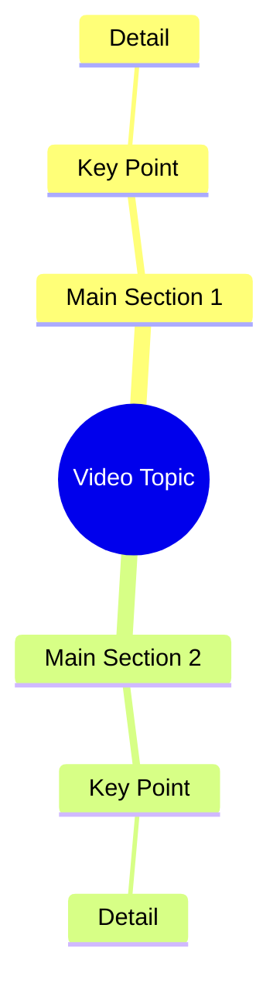

# Woman Recites Shahada, Denies Lying About Faith

> 🌐 **Read this in:** **English** · [中文](../../zh-CN/2026-10/tiktok-transcript-2-2m-views-100k-reactions-9920.md)

> **Creator:** [@سونم](https://www.tiktok.com/@سونم) · **Views:** 793.6K · **Posted:** 2026-10-08 · **Niche:** other
>
> **TL;DR:** The hook contrasts the speaker with other girls who lie, establishing uniqueness and trust.

[Watch original video →](https://www.facebook.com/share/r/1HCdnpCkb1/)

## Why This Went Viral

## Hook (first 3 seconds)
- **Verbatim opening:** "اشہد ان لا الہ الا اللہ سنو میں دوسری لڑکیوں کی طرح جھوٹ نہیں بول رہی" (I bear witness there is no god but Allah — listen, I am not lying like other girls) followed immediately by "تیر کے نشان پہ جائیں وہاں آپ کو تصویر مل جائے گی" (go to the arrow mark, you'll find the picture there).
- **Hook pattern:** Contrast + bold claim + oath. The video opens with a religious oath (*Kalima*) fused with a self-differentiation claim ("not like other girls") and a cryptic treasure-hunt instruction ("go to the arrow mark").
- **Why it stops the scroll:** Three stacked triggers in one breath — (1) a sacred oath signals high stakes and authenticity, (2) "not like other girls" triggers tribal/identity curiosity, (3) "go to the arrow mark, you'll find the picture" creates an unresolved puzzle the viewer must stay to solve. The brain can't scroll past an open loop it hasn't closed.

## Emotional Rhythm
- **0–3s — Shock/Authority:** Religious oath + bold claim. Viewer is pulled in by gravity of tone.
- **3–8s — Curiosity spike:** "Go to the arrow mark, you'll find the picture." A directive that demands the viewer's eyes follow a physical cue on screen.
- **8–15s — Tension/Doubt:** The "not like other girls" line plants suspicion — is this real, staged, or a trap? Viewer stays to verify.
- **15–25s — Revelation/Resonance:** The reveal (the picture/evidence) lands as either confirmation or twist, releasing the tension built by the oath.
- **Climax moment:** The instant the camera reaches the "arrow mark" and the promised image appears — this is the payoff the entire hook was engineered around.
- **Aftertaste — Validation:** The religious framing converts a simple reveal into a moral/emotional statement, inviting comment-section debate.

## Keyword Density
- **اشہد / لا الہ الا اللہ** — religious oath; drives *emotional pull* and trust signaling.
- **جھوٹ** (lie) — moral keyword; triggers engagement and defensiveness in comments.
- **لڑکیوں** (girls) — identity keyword; taps gender-tribal curiosity.
- **تیر کا نشان** (arrow mark) — action/puzzle keyword; drives *replay* and *rewatch* (algorithmic reach).
- **تصویر** (picture) — payoff keyword; keeps the open loop alive.
- **سنو** (listen) — imperative; direct-address retention device.
- **دوسری** (other) — comparison keyword; fuels "us vs. them" engagement.
- **Algorithmic drivers:** "تیر کا نشان" and "تصویر" (searchable, replay-inducing). **Emotional drivers:** "اشہد," "جھوٹ," "لڑکیوں" (comment-bait, share-trigger).

## Why It Spreads
- **Sacred oath as trust hack:** Opening with *Kalima* ("اشہد ان لا الہ الا اللہ") pre-empts skepticism — viewers who share the faith frame are psychologically primed to believe and share.
- **Built-in replay mechanic:** "تیر کے نشان پہ جائیں" forces viewers to rewatch to spot the arrow, inflating watch-time and rewatch rate — a core algorithmic signal.
- **Identity provocation:** "دوسری لڑکیوں کی طرح جھوٹ نہیں بول رہی" invites both agreement and backlash, driving comment-section warfare and shares.
- **Open-loop payoff structure:** The promised "تصویر" is withheld until the arrow-mark moment, converting curiosity into completion rate.
- **Moral framing = shareability:** Framing the reveal as truth-vs-lies gives sharers a social reason to post it ("look, someone finally being honest").

## What You Can Steal
1. **Stack three hook triggers in one sentence** — an oath/credibility marker + a contrast claim + a physical directive (like "go to the arrow mark"). One line, three reasons to stay.
2. **Engineer a rewatch cue** — plant a visual detail viewers must hunt for (an arrow, a hidden object, a number) so the video rewards a second viewing and boosts watch-time.
3. **Withhold the payoff behind a directive** — don't reveal the "picture" immediately; make the viewer follow your on-screen instruction to reach it. Open loops + physical cues = retention.

## Mind Map

## Full Transcript (Generated by [free TikTok transcript generator](https://toktranscript.com/?utm_source=github&utm_medium=breakdown&utm_campaign=tool_attribution))

> 📝 Transcripts on this page are auto-generated and show the first 60%. Want to transcribe any TikTok in 30 seconds and get the full version? [Try TokTranscript free →](https://toktranscript.com/?utm_source=github&utm_medium=breakdown&utm_campaign=transcript_cta)

اشہد ان لا الہ الا اللہ سنو میں دوسری لڑکیوں کی طرح جھوٹ نہیں بول رہی 

*[Read the full transcript on TokTranscript →](https://toktranscript.com/plaza/tiktok-transcript-2-2m-views-100k-reactions-9920?utm_source=github&utm_medium=breakdown&utm_campaign=transcript_full)*

## Browse More

- All [other](../../by-niche/en/other.md) breakdowns
- All [Contrast with others + honesty claim](../../by-pattern/en/hook-contrast-with-others-honesty-claim.md) examples

## Video Info

| | |
|---|---|
| Creator | [@سونم](https://www.tiktok.com/@سونم) |
| Original video | [https://www.facebook.com/share/r/1HCdnpCkb1/](https://www.facebook.com/share/r/1HCdnpCkb1/) |
| Original title | 2.2M views · 100K reactions | اشھد اللہ لاہ اللاہ میں | سونم |
| Views | 793.6K (793589) |
| Posted | 2026-10-08 |
| Duration | 0s |
| Niche | `other` |
| Hook pattern | `Contrast with others + honesty claim` |
| Original language | `en` |
| Available languages | en, zh-CN |
| Generated | 2026-10-09 by [TokTranscript](https://toktranscript.com/) |

---

*This breakdown is for educational analysis under fair use. Original video © [@سونم](https://www.tiktok.com/@سونم). All transcripts are auto-generated and may contain errors.*

*Want to analyze your own TikToks like this? [free TikTok transcript generator →](https://toktranscript.com/viral-breakdown?utm_source=github&utm_medium=breakdown&utm_campaign=footer_cta)*