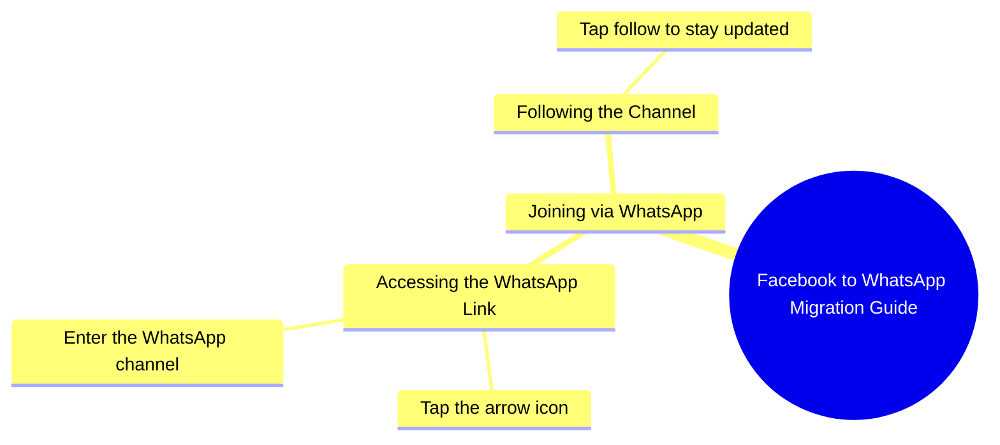

# Samina Rani Invites Followers to WhatsApp

> 🌐 **Read this in:** **English** · [中文](../../zh-CN/2026-10/tiktok-transcript-2-2m-views-56k-reactions-hi-samina-rani-07e9.md)

> **Creator:** [@Samina Rani](https://www.tiktok.com/@Samina Rani) · **Views:** 799.0K · **Posted:** 2026-10-03 · **Niche:** other
>
> **TL;DR:** The hook directly acknowledges viewers from Facebook and invites them to WhatsApp, creating a sense of personal connection and curiosity.

[Watch original video →](https://www.facebook.com/share/r/1EBJv93D55/)

## Why This Went Viral

## Hook (first 3 seconds)
- **Verbatim opening:** "اچھا تو فیس بک پہ تو ملی گئے ہو آجاؤ میری ووٹس ایپ پر" ("So you found me on Facebook — now come to my WhatsApp")
- **Hook pattern:** Direct call-out + platform migration command (a "you're here, now go there" pattern).
- **Why it stops the scroll:** It addresses the viewer as if they were personally caught mid-scroll ("تو ملی گئے ہو" — "so you *did* find me"). This creates instant second-person recognition, and the promise of something *more* on WhatsApp triggers curiosity + FOMO in under 3 seconds.

## Emotional Rhythm
- **Beat 1 – Recognition/Curiosity:** "So you found me on Facebook" → viewer feels seen, leans in.
- **Beat 2 – Command/Urgency:** "آجاؤ میری ووٹس ایپ پر" → momentum builds, a clear action demanded.
- **Beat 3 – Promise/Tension:** "میں آپ کو بتاتی ہوں ووٹس ایپ پر کیسے آنا ہے" → she promises to *teach* something, creating a micro-cliffhanger.
- **Beat 4 – Instruction/Relief:** "اس تیر کے نشان کے اوپر دبا کر" → the "arrow" instruction resolves the tension with a concrete step.
- **Beat 5 – Close/Commitment:** "فالو کر لیں" → final CTA, converts curiosity into an action.
- **Climax:** The line "میں آپ کو بتاتی ہوں... کیسے آنا ہے" — this is where the promise peaks and the viewer's thumb hovers, deciding to follow.

## Keyword Density
- **فیس بک** (Facebook) — platform anchor, drives cross-platform reach.
- **ووٹس ایپ** (WhatsApp) — repeated 3x; the core destination keyword, algorithmically powerful because it signals off-platform migration.
- **آجاؤ / آنا** (come / to come) — action verb, drives CTA energy.
- **تیر کا نشان** (arrow sign) — UI instruction keyword; boosts watch-time because viewers rewatch to locate it.
- **فالو کر لیں** (follow) — direct engagement keyword, feeds the algorithm's follow-signal.
- **میں آپ کو بتاتی ہوں** (I'll tell you) — promise phrase, emotional pull.
- **Algorithmic drivers:** "WhatsApp," "follow," "Facebook" — these trigger distribution because platforms reward cross-app migration cues and explicit CTAs.
- **Emotional pull:** "میں آپ کو بتاتی ہوں" and "آجاؤ" — these create intimacy and urgency, keeping viewers watching.

## Why It Spreads
- **Personal call-out creates parasocial intimacy:** "فیس بک پہ تو ملی گئے ہو" makes each viewer feel individually addressed, so they share it as if it were "for them."
- **Cross-platform migration is a viral loop:** By pushing Facebook viewers to WhatsApp, she converts one platform's audience into another's — and WhatsApp forwards are the strongest distribution channel in South Asia.
- **Instructional micro-tutorial = high completion rate:** "اس تیر کے نشان کے اوپر دبا کر" forces viewers to watch to the end to find the arrow, boosting watch-time (a top ranking signal).
- **Low-friction CTA stacking:** "آ جائیں اور فالو کر لیں" — two actions in one breath, so even passive viewers convert.
- **Language + tone match the audience:** Pure Urdu, casual female voice, no jargon — perfect fit for the target demographic, so it feels native and shareable.

## What You Can Steal
1. **Open with a "you found me" call-out.** Start your video by acknowledging where the viewer came from ("So you're here from TikTok…") — it makes them feel personally seen and stops the scroll.
2. **Promise a micro-tutorial inside the video.** Say "I'll show you how to…" and then deliver the step on-screen. The promise hooks; the instruction retains.
3. **Stack two CTAs in one sentence.** Don't say "follow me" alone — say "come here and follow" so you capture both migration and engagement in a single beat.

## Mind Map

## Full Transcript (Generated by [free TikTok transcript generator](https://toktranscript.com/?utm_source=github&utm_medium=breakdown&utm_campaign=tool_attribution))

> 📝 Transcripts on this page are auto-generated and show the first 60%. Want to transcribe any TikTok in 30 seconds and get the full version? [Try TokTranscript free →](https://toktranscript.com/?utm_source=github&utm_medium=breakdown&utm_campaign=transcript_cta)

اچھا تو فیس بک پہ تو ملی گئے ہو آجاؤ میری ووٹس ایپ پر میں آپ کو بتاتی ہوں ووٹس ایپ پر کیسے آنا ہے اس

*[Read the full transcript on TokTranscript →](https://toktranscript.com/plaza/tiktok-transcript-2-2m-views-56k-reactions-hi-samina-rani-07e9?utm_source=github&utm_medium=breakdown&utm_campaign=transcript_full)*

## Browse More

- All [other](../../by-niche/en/other.md) breakdowns
- All [Direct Address & Platform Transition](../../by-pattern/en/hook-direct-address-platform-transition.md) examples

## Video Info

| | |
|---|---|
| Creator | [@Samina Rani](https://www.tiktok.com/@Samina Rani) |
| Original video | [https://www.facebook.com/share/r/1EBJv93D55/](https://www.facebook.com/share/r/1EBJv93D55/) |
| Original title | 2.2M views · 56K reactions | Hi | Samina Rani |
| Views | 799.0K (798960) |
| Posted | 2026-10-03 |
| Duration | 0s |
| Niche | `other` |
| Hook pattern | `Direct Address & Platform Transition` |
| Original language | `en` |
| Available languages | en, zh-CN |
| Generated | 2026-10-04 by [TokTranscript](https://toktranscript.com/) |

---

*This breakdown is for educational analysis under fair use. Original video © [@Samina Rani](https://www.tiktok.com/@Samina Rani). All transcripts are auto-generated and may contain errors.*

*Want to analyze your own TikToks like this? [TokTranscript →](https://toktranscript.com/viral-breakdown?utm_source=github&utm_medium=breakdown&utm_campaign=footer_cta)*