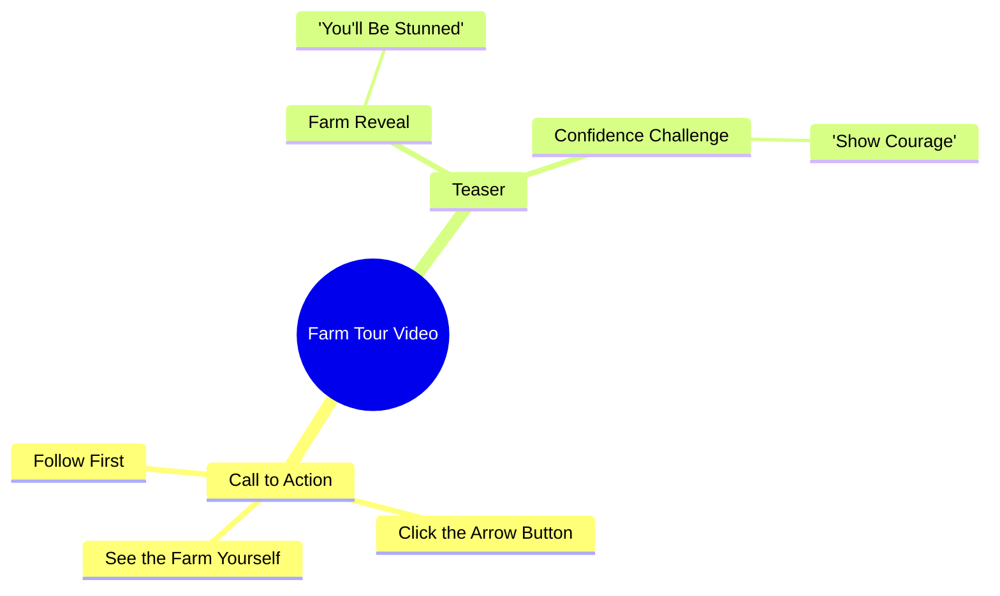

# Farmer Shows Off Her Field in Viral Video

> 🌐 **Read this in:** **English** · [中文](../../zh-CN/2026-10/tiktok-transcript-2-7m-views-47k-reactions-03456585060-5155.md)

> **Creator:** [@03456585060](https://www.tiktok.com/@03456585060) · **Views:** 1.1M · **Posted:** 2026-10-07 · **Niche:** other
>
> **TL;DR:** The hook uses exaggerated shock language and a direct challenge to compel viewers to follow and watch.

[Watch original video →](https://www.facebook.com/share/r/1CPN7KhcFE/)

## Why This Went Viral

## Hook (first 3 seconds)
- **Verbatim opening line:** "जो खेत में आपको दिखाने वाली हूं आप मेरा खेत देखकर शायद आपके होश उड़ जाएंगे" ("What I'm about to show you in the field — seeing my field, your senses might just fly away.")
- **Hook pattern:** Bold claim + shock promise, immediately chained to a challenge ("हिम्मत है तो पहले फॉलो करो" — "If you have the courage, follow first").
- **Why it stops the scroll:** It front-loads an extreme emotional promise ("होश उड़ जाएंगे" = you'll be stunned) with zero visual payoff yet, creating an information gap the viewer must close. The dare ("हिम्मत है तो") flips the viewer into a challenger role, and the follow-gate converts curiosity into an action before the reveal.

## Emotional Rhythm
- **0–2s — Curiosity spike:** "होश उड़ जाएंगे" plants an exaggerated payoff promise.
- **2–5s — Challenge / ego trigger:** "हिम्मत है तो पहले फॉलो करो" dares the viewer; mild tension (am I brave enough?).
- **5–8s — Instruction / commitment:** "तीर के बटन पे क्लिक करके" (click the arrow button) — ritualizes the action, builds anticipation.
- **8s+ — Deferred reveal:** "खुद खेत देख लो" (see the field yourself) — the payoff is handed back to the viewer, extending suspense into the visual.
- **Climax:** The moment the field is actually shown — the entire script is engineered to make that reveal land as the emotional peak.
- **Twist mechanic:** The "reward" (the field) is gated behind a follow, so the twist is structural, not narrative.

## Keyword Density
- **खेत** (field) — repeated 3×, anchors the topic and search/interest signal.
- **देखना / देखकर / देख लो** (see/seeing) — 3×, drives the "reveal" curiosity loop.
- **होश उड़ जाएंगे** (you'll be stunned) — the emotional payload phrase.
- **हिम्मत** (courage) — ego-bait keyword.
- **फॉलो** (follow) — explicit CTA, algorithmic engagement driver.
- **तीर के बटन** (arrow button) — platform-native action cue.
- **आप / आपके** (you/your) — direct address, personalizes and boosts retention.
- **Algorithmic reach words:** फॉलो, तीर के बटन, खेत (topic signal).
- **Emotional pull words:** होश उड़ जाएंगे, हिम्मत — these create the stop-and-watch impulse; the CTA words convert it.

## Why It Spreads
- **Curiosity gap with a hard gate:** "होश उड़ जाएंगे" promises a shock reveal but withholds it — viewers must follow/watch to resolve the gap, driving completion rate.
- **Ego challenge as engagement bait:** "हिम्मत है तो" dares the viewer, converting passive scrolling into an active follow — challenges trigger identity-based compliance.
- **Explicit platform-native CTA:** "तीर के बटन पे क्लिक करके" tells users exactly what to tap, lowering friction for the algorithm's key signals (follows, taps).
- **Direct second-person address:** Repeated "आप/आपके" makes the viewer the protagonist, raising personal relevance and watch time.
- **Deferred payoff structure:** "खुद खेत देख लो" hands the reveal to the viewer, so the video's value is unlocked only by staying — maximizing retention.

## What You Can Steal
- **Open with a shock-promise + dare combo:** Pair an exaggerated payoff ("you'll be stunned") with an ego challenge ("if you dare…") to convert curiosity into action in under 3 seconds.
- **Gate the payoff behind a native action:** Name the exact button/gesture ("click the arrow") so the CTA is frictionless and platform-friendly.
- **Speak in second person throughout:** Repeated "you/your" makes the viewer the hero and lifts retention — then hand the reveal back to them ("see it yourself") to extend watch time.

## Mind Map

## Full Transcript (Generated by [the tool we used to generate this](https://toktranscript.com/?utm_source=github&utm_medium=breakdown&utm_campaign=tool_attribution))

> 📝 Transcripts on this page are auto-generated and show the first 60%. Want to transcribe any TikTok in 30 seconds and get the full version? [Try TokTranscript free →](https://toktranscript.com/?utm_source=github&utm_medium=breakdown&utm_campaign=transcript_cta)

जो खेत में आपको दिखाने वाली हूं आप मेरा खेत देखकर शायद आपके होश उड़ जाएंगे हिम्मत है तो

*[Read the full transcript on TokTranscript →](https://toktranscript.com/plaza/tiktok-transcript-2-7m-views-47k-reactions-03456585060-5155?utm_source=github&utm_medium=breakdown&utm_campaign=transcript_full)*

## Browse More

- All [other](../../by-niche/en/other.md) breakdowns
- All [Shock + Challenge + Follow CTA](../../by-pattern/en/hook-shock-challenge-follow-cta.md) examples

## Video Info

| | |
|---|---|
| Creator | [@03456585060](https://www.tiktok.com/@03456585060) |
| Original video | [https://www.facebook.com/share/r/1CPN7KhcFE/](https://www.facebook.com/share/r/1CPN7KhcFE/) |
| Original title | 2.7M views · 47K reactions | جو کھیت میں آپ کو | 03456585060 |
| Views | 1.1M (1059170) |
| Posted | 2026-10-07 |
| Duration | 0s |
| Niche | `other` |
| Hook pattern | `Shock + Challenge + Follow CTA` |
| Original language | `en` |
| Available languages | en, zh-CN |
| Generated | 2026-10-09 by [TokTranscript](https://toktranscript.com/) |

---

*This breakdown is for educational analysis under fair use. Original video © [@03456585060](https://www.tiktok.com/@03456585060). All transcripts are auto-generated and may contain errors.*

*Want to analyze your own TikToks like this? [try this transcription tool →](https://toktranscript.com/viral-breakdown?utm_source=github&utm_medium=breakdown&utm_campaign=footer_cta)*