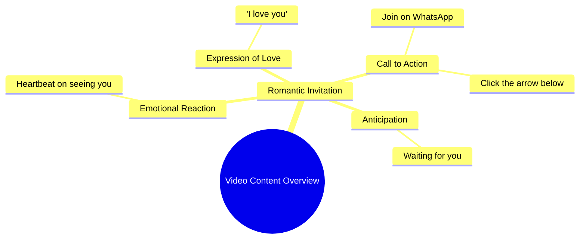

# Sheetal Devi Wins Para Archery Gold at Khelo India

> 🌐 **Read this in:** **English** · [中文](../../zh-CN/2026-10/tiktok-transcript-3-5m-views-114k-reactions-jammu-and-kashmir-s-armless-archer-0e19.md)

> **Creator:** [@Neha ](https://www.tiktok.com/@Neha ) · **Views:** 1.3M · **Posted:** 2026-10-08 · **Niche:** entertainment
>
> **TL;DR:** The hook uses a heartfelt confession to evoke emotion and curiosity, drawing viewers in.

[Watch original video →](https://www.facebook.com/reel/29186029990994560/?app=fbl)

## Why This Went Viral

## Hook (first 3 seconds)
- Verbatim opening: "आपको देखकर दिल धड़क गया" ("My heart skipped a beat seeing you")
- Hook pattern: **Direct emotional confession / bold romantic claim** aimed straight at the viewer
- Why it stops the scroll: It weaponizes second-person address ("आपको") — the viewer is personally "seen" and implicated in under 2 seconds. The confession is so sudden and intimate it triggers a reflexive "wait, me?" pause before the brain catches up.

## Emotional Rhythm
- **0–2s — Flattery spike:** Instant romantic validation ("दिल धड़क गया").
- **2–4s — Confession peak:** "I love you" drops in English, escalating intimacy and adding a code-switch jolt.
- **4–7s — Command/CTA turn:** "नीचे तीर पे क्लिक करके WhatsApp पे आ जाओ ना" pivots from emotion to instruction — mild tension as the viewer realizes there's an ask.
- **7–9s — Vulnerability close:** "मैं आपका इंतिजार कर रही हूं" ("I'm waiting for you") lands as the emotional climax — longing, not demand.
- **Climax:** The final line. "Waiting for you" converts a generic pickup line into a personalized, almost desperate plea — that's the beat that gets screenshotted and shared.

## Keyword Density
- **आपको / आपका** (you / your) — second-person saturation; drives parasocial pull
- **दिल** (heart) — emotional trigger word
- **I love you** — English code-switch; boosts reach across language feeds
- **WhatsApp** — platform-specific CTA keyword; triggers off-platform intent
- **क्लिक** (click) — action verb; algorithmic engagement signal
- **इंतिजार** (waiting) — longing keyword; the emotional anchor
- **आ जाओ ना** (come, please) — soft imperative; tenderness marker

**Algorithmic reach drivers:** "WhatsApp," "click," "I love you" (English) — these match high-volume search/feed tokens and cross-language recommendation pools.
**Emotional pull drivers:** "दिल," "इंतिजार," "आ जाओ ना" — these create the parasocial bond that converts a scroll into a DM.

## Why It Spreads
- **Parasocial targeting:** "आपको देखकर" makes every viewer feel individually addressed — the line only works if *you* are the "you," which forces personal identification.
- **Code-switch bait:** Dropping "I love you" in English inside a Hindi sentence signals "modern, accessible, shareable" — it widens the audience beyond native Hindi speakers and reads as a meme-able phrase.
- **Built-in off-platform funnel:** "WhatsApp पे आ जाओ ना" gives viewers a concrete next action, so the video doesn't just get watched — it generates DMs, which the algorithm reads as high-intent engagement.
- **Vulnerability loop:** "मैं आपका इंतिजार कर रही हूं" ends on an unresolved emotional note — viewers rewatch or share to resolve the tension, and rewatches are a top ranking signal.
- **Low-production, high-emotion contrast:** The message is maximal romance with minimal setup — easy to duet, stitch, caption, or reply to, which multiplies derivative content.

## What You Can Steal
1. **Open with second-person emotion, not context.** Start with a line that makes the viewer the subject ("You made my heart…") — no intro, no setup.
2. **Code-switch one key phrase.** Insert a single high-recognition English (or other-language) line at the emotional peak to widen reach and make the moment quotable.
3. **End on an unresolved plea + a concrete CTA.** Pair a vulnerable closing line ("I'm waiting") with one specific action ("come to WhatsApp / comment / DM") so emotion converts into measurable engagement.

## Mind Map

## Full Transcript (Generated by [free TikTok transcript generator](https://toktranscript.com/?utm_source=github&utm_medium=breakdown&utm_campaign=tool_attribution))

> 📝 Transcripts on this page are auto-generated and show the first 60%. Want to transcribe any TikTok in 30 seconds and get the full version? [Try TokTranscript free →](https://toktranscript.com/?utm_source=github&utm_medium=breakdown&utm_campaign=transcript_cta)

आपको देखकर दिल धड़क गया I love you नीचे तीर पे क्लिक करके Whats

*[Read the full transcript on TokTranscript →](https://toktranscript.com/plaza/tiktok-transcript-3-5m-views-114k-reactions-jammu-and-kashmir-s-armless-archer-0e19?utm_source=github&utm_medium=breakdown&utm_campaign=transcript_full)*

## Browse More

- All [entertainment](../../by-niche/en/entertainment.md) breakdowns
- All [Emotional Confession](../../by-pattern/en/hook-emotional-confession.md) examples

## Video Info

| | |
|---|---|
| Creator | [@Neha ](https://www.tiktok.com/@Neha ) |
| Original video | [https://www.facebook.com/reel/29186029990994560/?app=fbl](https://www.facebook.com/reel/29186029990994560/?app=fbl) |
| Original title | 3.5M views · 114K reactions | "🌹🙏🏻 Jammu and Kashmir's armless archer and Paralympics medallist Sheetal Devi edged out quadruple amputee Payal Nag of Odisha to win the gold in a much-anticipated clash of the Khelo India Para Games on Sunday. In the battle between two teenagers, defending champion Sheetal came from behind to successfully bag her second gold medal of the Games at the Jawaharlal Nehru Stadium. | Neha |
| Views | 1.3M (1308907) |
| Posted | 2026-10-08 |
| Duration | 0s |
| Niche | `entertainment` |
| Hook pattern | `Emotional Confession` |
| Original language | `en` |
| Available languages | en, zh-CN |
| Generated | 2026-10-08 by [TokTranscript](https://toktranscript.com/) |

---

*This breakdown is for educational analysis under fair use. Original video © [@Neha ](https://www.tiktok.com/@Neha ). All transcripts are auto-generated and may contain errors.*

*Want to analyze your own TikToks like this? [the tool we used to generate this →](https://toktranscript.com/viral-breakdown?utm_source=github&utm_medium=breakdown&utm_campaign=footer_cta)*