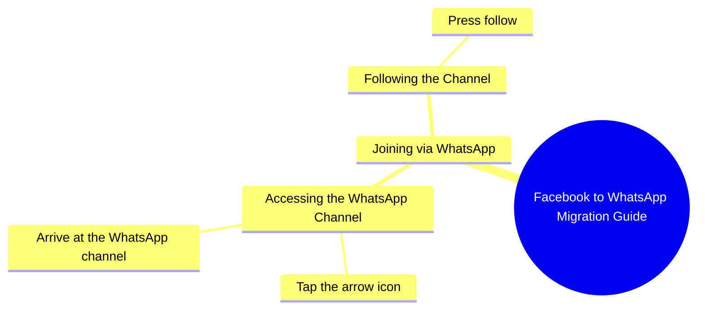

# Samina Rani Invites Followers to WhatsApp

> 🌐 **Read this in:** **English** · [中文](../../zh-CN/2026-10/tiktok-transcript-5-7m-views-143k-reactions-hi-samina-rani-9c9e.md)

> **Creator:** [@Samina Rani](https://www.tiktok.com/@Samina Rani) · **Views:** 2.3M · **Posted:** 2026-10-04 · **Niche:** marketing
>
> **TL;DR:** The hook directly acknowledges the viewer's presence on Facebook and invites them to WhatsApp, creating a personal connection and curiosity about the next step.

[Watch original video →](https://www.facebook.com/share/r/1FLyabqPAE/)

## Why This Went Viral

## Hook (first 3 seconds)
- **Verbatim opening:** "اچھا تو فیس بک پہ تو ملی گئے ہو آجاؤ میری ووٹس ایپ پر" ("Okay, so you found me on Facebook — now come to my WhatsApp")
- **Hook pattern:** Direct call-out + platform migration command (a "summon" hook). It opens mid-conversation, as if resuming a relationship the viewer already has.
- **Why it stops the scroll:** It uses second-person accusation-by-implication ("تو ملی گئے ہو" = "so you *did* find me"). The viewer feels personally addressed and slightly caught. The promise of a payoff ("میں آپ کو بتاتی ہوں" = "I'll tell you how") creates an open loop in under 3 seconds with zero setup cost.

## Emotional Rhythm
- **Beat 1 — Recognition (0–2s):** "You found me on Facebook" → warmth, familiarity, mild flattery.
- **Beat 2 — Curiosity gap (2–4s):** "Come to my WhatsApp, I'll tell you how" → unresolved instruction; viewer needs the *how*.
- **Beat 3 — Micro-tension (4–7s):** "اس تیر کے نشان کے اوپر دبا کر" ("press on that arrow sign") → the viewer is now hunting for a UI element, physically engaged.
- **Beat 4 — Relief/resolution (7–10s):** "آ جائیں اور فالو کر لیں" ("come over and follow") → the ask is completed, tension released.
- **Climax:** The instruction "اس تیر کے نشان کے اوپر دبا کر" — this is the functional peak. Everything before it is bait; this is the payload.
- **Twist:** There is no twist. The "reveal" is deliberately anticlimactic — the whole video is a soft CTA disguised as a personal message. That flatness is the point: it feels like a DM, not an ad.

## Keyword Density
- **فیس بک** (Facebook) — platform-anchor keyword; triggers cross-platform recommendation and search.
- **ووٹس ایپ / واٹس ایپ** (WhatsApp) — the destination keyword; drives the migration intent.
- **آجاؤ / آ جائیں** (come) — imperative verb repeated; emotional pull, creates urgency.
- **میں آپ کو بتاتی ہوں** (I'll tell you) — promise/authority phrase; retains attention.
- **فالو کر لیں** (follow) — the conversion keyword; algorithmic reach signal.
- **تیر کے نشان** (arrow sign) — specificity keyword; makes the instruction feel concrete and actionable.
- **ملی گئے ہو** (you found [me]) — intimacy keyword; builds parasocial closeness.

**Algorithmic drivers:** فیس بک, واٹس ایپ, فالو کر لیں — these are high-intent, platform-named tokens that platforms surface to users already engaging with those ecosystems.
**Emotional drivers:** آجاؤ, ملی گئے ہو, میں بتاتی ہوں — these create the feeling of a personal invitation and carry the retention.

## Why It Spreads
- **It converts a passive viewer into a "found" person.** The line "فیس بک پہ تو ملی گئے ہو" reframes the viewer as someone who was *already looking for her* — this flips the usual follower-begging dynamic and makes following feel like a mutual discovery, not a favor.
- **It is a tutorial disguised as intimacy.** "میں آپ کو بتاتی ہوں ووٹس ایپ پر کیسے آنا ہے" positions the creator as a helper, not a promoter. Viewers share "how-to" content to look useful to their own network.
- **The instruction is hyper-specific and visual.** "اس تیر کے نشان کے اوپر دبا کر" names a literal UI element. Specificity makes the video re-watchable (people pause, rewind, follow along) — and re-watches are a strong ranking signal.
- **The ask is layered, not single.** Facebook → WhatsApp → follow. Each step is a micro-commitment, and completion of the first (finding her) primes the second (following). This is a funnel compressed into 10 seconds.
- **It works as a DM substitute.** The tone mimics a private voice note. Viewers screenshot or forward it to friends with "see, this is how you add her" — turning the video itself into a shareable utility.

## What You Can Steal
1. **Open mid-relationship, not mid-introduction.** Start with "So you finally found me here…" instead of "Hi guys, welcome." Assume the viewer already knows you — it collapses the distance and buys you 2 extra seconds of attention.
2. **Turn your CTA into a mini-tutorial.** Instead of "follow me," say "tap the arrow up there, then hit follow — I'll show you why." Naming the exact UI element makes the ask feel like a service, and services get shared.
3. **Use platform-migration as a hook, not a footnote.** "You're on X, but the real stuff is on Y — here's how to get there" gives viewers a reason to move *and* a reason to keep watching until the instruction lands.

## Mind Map

## Full Transcript (Generated by [TokTranscript](https://toktranscript.com/?utm_source=github&utm_medium=breakdown&utm_campaign=tool_attribution))

> 📝 Transcripts on this page are auto-generated and show the first 60%. Want to transcribe any TikTok in 30 seconds and get the full version? [Try TokTranscript free →](https://toktranscript.com/?utm_source=github&utm_medium=breakdown&utm_campaign=transcript_cta)

اچھا تو فیس بک پہ تو ملی گئے ہو آجاؤ میری ووٹس ایپ پر میں آپ کو بتاتی ہوں ووٹس ایپ پر کیسے آنا ہے اس

*[Read the full transcript on TokTranscript →](https://toktranscript.com/plaza/tiktok-transcript-5-7m-views-143k-reactions-hi-samina-rani-9c9e?utm_source=github&utm_medium=breakdown&utm_campaign=transcript_full)*

## Browse More

- All [marketing](../../by-niche/en/marketing.md) breakdowns
- All [Direct Address & Platform Transition](../../by-pattern/en/hook-direct-address-platform-transition.md) examples

## Video Info

| | |
|---|---|
| Creator | [@Samina Rani](https://www.tiktok.com/@Samina Rani) |
| Original video | [https://www.facebook.com/share/r/1FLyabqPAE/](https://www.facebook.com/share/r/1FLyabqPAE/) |
| Original title | 5.7M views · 143K reactions | Hi | Samina Rani |
| Views | 2.3M (2266410) |
| Posted | 2026-10-04 |
| Duration | 0s |
| Niche | `marketing` |
| Hook pattern | `Direct Address & Platform Transition` |
| Original language | `en` |
| Available languages | en, zh-CN |
| Generated | 2026-10-05 by [TokTranscript](https://toktranscript.com/) |

---

*This breakdown is for educational analysis under fair use. Original video © [@Samina Rani](https://www.tiktok.com/@Samina Rani). All transcripts are auto-generated and may contain errors.*

*Want to analyze your own TikToks like this? [the tool we used to generate this →](https://toktranscript.com/viral-breakdown?utm_source=github&utm_medium=breakdown&utm_campaign=footer_cta)*