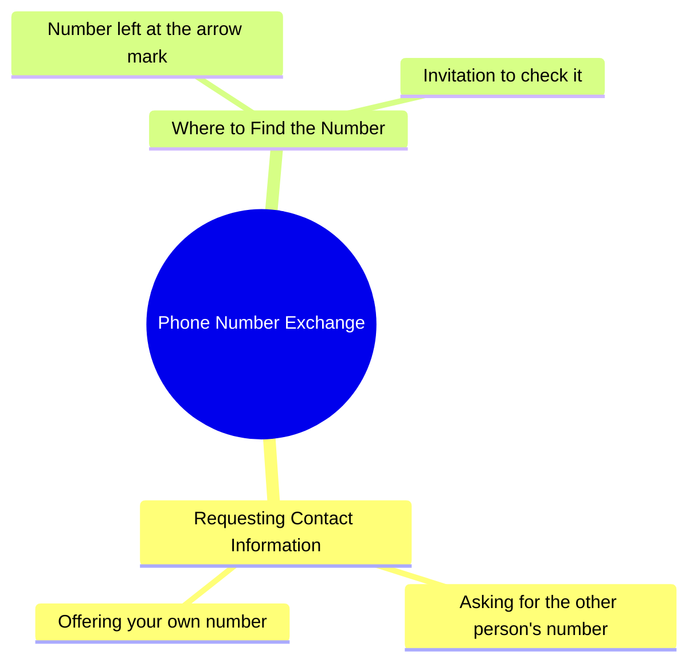

# Woman Asks for Phone Number in Hindi Reel

> 🌐 **Read this in:** **English** · [中文](../../zh-CN/2026-10/tiktok-transcript-5-9m-views-103k-reactions-aaria-minnal-on-reels-5a88.md)

> **Creator:** [@Aaria minnal](https://www.tiktok.com/@Aaria minnal) · **Views:** 2.2M · **Posted:** 2026-10-07 · **Niche:** other
>
> **TL;DR:** The hook directly asks for a number but then adds a humorous twist about leaving it on a target, creating curiosity and amusement.

[Watch original video →](https://www.facebook.com/share/r/1KQD2xkgsD/)

## Why This Went Viral

## Hook (first 3 seconds)
- Verbatim opening: "अपना नंबर दे दीजिए या तो मेरा नंबर ले लीजिए" ("Give me your number, or take mine")
- Hook pattern: **Direct command + bold proposition** (imperative demand framed as a flirtatious dare)
- Why it stops the scroll: It opens mid-conversation with zero setup, forcing the viewer to ask "wait, who is this and why is she asking for a number?" The either/or framing creates instant tension — a stranger making a bold, intimate ask is socially risky, and viewers stay to see how it plays out.

## Emotional Rhythm
- **0–2s — Curiosity/shock:** The blunt number request lands before context exists. Viewer is disoriented but hooked.
- **2–5s — Tension + intrigue:** "मैंने तीर वाले निशान पर अपना नंबर छोड़ रखा है" ("I left my number on the arrow mark") introduces a puzzle. Where is this arrow? Why there?
- **5–8s — Playful suspense:** "देख लीजिए" ("go look") hands the ball to the viewer — a soft cliffhanger that invites participation.
- **Climax moment:** The reveal of the *location* of the number (the arrow mark) — this is the payoff line, turning a generic pickup line into a specific, repeatable "quest."
- **Resolution:** No hard resolution — the video ends on an open invitation, which is exactly what drives comments and rewatches.

## Keyword Density
- **नंबर** (number) — core emotional + algorithmic keyword; repeated and instantly legible
- **दीजिए / लीजिए** (give / take) — the transactional verb pair that creates the either/or tension
- **तीर** (arrow) — the curiosity keyword; unusual, memorable, drives "what arrow?" comments
- **निशान** (mark) — pairs with तीर to form a concrete image
- **छोड़ रखा है** (have left) — implies premeditation, adds intrigue
- **देख लीजिए** (go look) — call-to-action keyword, drives engagement
- **अपना / मेरा** (yours / mine) — personal pronoun contrast that personalizes the ask

Algorithmic drivers: **नंबर**, **दीजिए/लीजिए**, **देख लीजिए** (high search/comment frequency, common in romantic/dating content).
Emotional pull: **तीर**, **निशान**, **छोड़ रखा है** — these make the line specific and quotable rather than generic.

## Why It Spreads
- **The line is instantly quotable.** "अपना नंबर दे दीजिए या तो मेरा नंबर ले लीजिए" is short, rhythmic, and repeatable — perfect for comment-section remixing and stitch/duet responses.
- **It creates a mystery the viewer wants solved.** "मैंने तीर वाले निशान पर अपना नंबर छोड़ रखा है" plants a specific, visual puzzle (an arrow mark with a number) that viewers rewatch to catch or comment to ask about.
- **It flips the script on gender norms.** A woman making the bold first move inverts the usual dating-content dynamic, which triggers both admiration and debate in comments.
- **The open ending invites participation.** "देख लीजिए" is a soft CTA — viewers respond with "kahan hai arrow?" or tag friends, feeding the algorithm.
- **Low production, high personality.** The entire value is in delivery and phrasing, so it's easy to imitate — copycats multiply reach.

## What You Can Steal
- **Open mid-action with a bold either/or demand.** Skip the intro. Start with the most socially risky or unexpected line you can say — it forces the viewer to stay for context.
- **Plant one specific, visual mystery.** Instead of a vague tease, name a concrete object or place ("तीर वाले निशान"). Specificity makes the hook memorable and comment-worthy.
- **End on an open invitation, not a conclusion.** Use a soft CTA like "देख लीजिए" that hands agency to the viewer — it converts passive watching into comments, stitches, and shares.

## Mind Map

## Full Transcript (Generated by [TokTranscript](https://toktranscript.com/?utm_source=github&utm_medium=breakdown&utm_campaign=tool_attribution))

> 📝 Transcripts on this page are auto-generated and show the first 60%. Want to transcribe any TikTok in 30 seconds and get the full version? [Try TokTranscript free →](https://toktranscript.com/?utm_source=github&utm_medium=breakdown&utm_campaign=transcript_cta)

अपना नंबर दे दीजिए या तो मेरा नंबर ले लीजिए मैंने तीर वाले 

*[Read the full transcript on TokTranscript →](https://toktranscript.com/plaza/tiktok-transcript-5-9m-views-103k-reactions-aaria-minnal-on-reels-5a88?utm_source=github&utm_medium=breakdown&utm_campaign=transcript_full)*

## Browse More

- All [other](../../by-niche/en/other.md) breakdowns
- All [Direct request with unexpected twist](../../by-pattern/en/hook-direct-request-with-unexpected-twist.md) examples

## Video Info

| | |
|---|---|
| Creator | [@Aaria minnal](https://www.tiktok.com/@Aaria minnal) |
| Original video | [https://www.facebook.com/share/r/1KQD2xkgsD/](https://www.facebook.com/share/r/1KQD2xkgsD/) |
| Original title | 5.9M views · 103K reactions | Aaria minnal on Reels |
| Views | 2.2M (2213049) |
| Posted | 2026-10-07 |
| Duration | 0s |
| Niche | `other` |
| Hook pattern | `Direct request with unexpected twist` |
| Original language | `en` |
| Available languages | en, zh-CN |
| Generated | 2026-10-08 by [TokTranscript](https://toktranscript.com/) |

---

*This breakdown is for educational analysis under fair use. Original video © [@Aaria minnal](https://www.tiktok.com/@Aaria minnal). All transcripts are auto-generated and may contain errors.*

*Want to analyze your own TikToks like this? [try this transcription tool →](https://toktranscript.com/viral-breakdown?utm_source=github&utm_medium=breakdown&utm_campaign=footer_cta)*