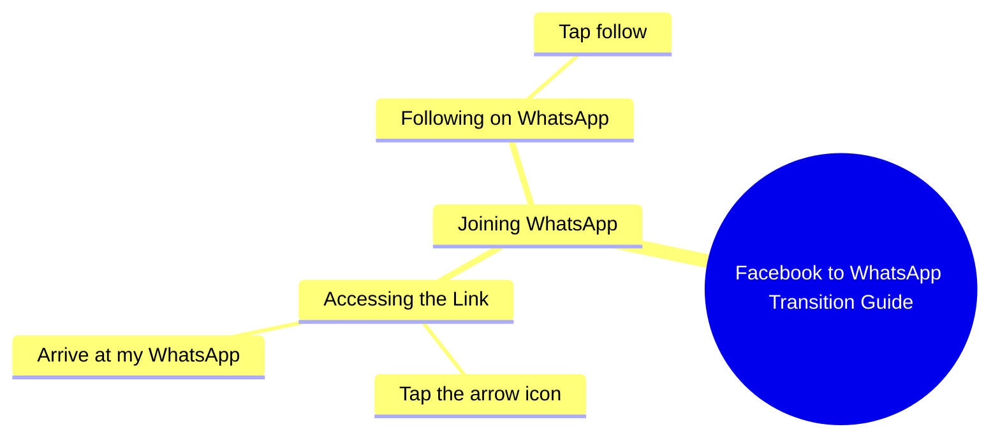

# Samina Rani Invites Followers to WhatsApp

> 🌐 **Read this in:** **English** · [中文](../../zh-CN/2026-10/tiktok-transcript-6m-views-147k-reactions-hi-samina-rani-38a6.md)

> **Creator:** [@Samina Rani](https://www.tiktok.com/@Samina Rani) · **Views:** 2.4M · **Posted:** 2026-10-07 · **Niche:** other
>
> **TL;DR:** The speaker directly addresses viewers who found her on Facebook and invites them to WhatsApp, creating a sense of exclusivity and curiosity.

[Watch original video →](https://www.facebook.com/share/r/1DJ8KUjopp/)

## Why This Went Viral

## Hook (first 3 seconds)
- Verbatim opening: "اچھا تو فیس بک پہ تو ملی گئے ہو آجاؤ میری ووٹس ایپ پر میں آپ کو بتاتی ہوں ووٹس ایپ پر کیسے آنا ہے" ("So you found me on Facebook — come to my WhatsApp, I'll tell you how to get there")
- Hook pattern: **Direct call-out + platform pivot + promise of instruction** (a "you're here, now follow me there" command hook)
- Why it stops the scroll: It addresses the viewer as if they already know her ("تو ملی گئے ہو" / "so you *did* find me"), creating instant familiarity and mild FOMO. The promise of a *how-to* ("میں آپ کو بتاتی ہوں کیسے آنا ہے") makes leaving feel like missing instructions.

## Emotional Rhythm
- **0–2s — Recognition/curiosity:** "So you found me on Facebook" — feels personal, like a reunion.
- **2–5s — Mild tension/urgency:** "Come to my WhatsApp" — a redirect demand creates a small "wait, what's happening?" pull.
- **5–10s — Relief/instruction:** "Press the arrow icon and come to my WhatsApp and follow" — the tension resolves into a simple, doable action.
- **Climax:** The moment she says "اس تیر کے نشان کے اوپر دبا کر" ("press on the arrow icon") — the concrete gesture is the payoff; it's the line viewers rewatch to copy.
- No dramatic twist; the "twist" is structural — a soft-sell funnel disguised as a friendly chat.

## Keyword Density
- **ووٹس ایپ / WhatsApp** (repeated 3×) — primary algorithmic + intent keyword; signals platform migration.
- **فیس بک / Facebook** (1×) — context anchor, tells the algorithm the audience source.
- **آجاؤ / come** — imperative, drives action.
- **فالو کر لیں / follow** — the explicit CTA keyword.
- **بتاتی ہوں / I'll tell you** — trust/promise keyword, emotional pull.
- **تیر کے نشان / arrow icon** — micro-instruction keyword; high retention driver because viewers pause to locate it.
- **ملی گئے ہو / you found me** — intimacy keyword, builds parasocial connection.
- **Algorithmic reach drivers:** WhatsApp, Facebook, follow (platform + action terms the algorithm uses to classify and distribute).
- **Emotional pull drivers:** "ملی گئے ہو," "بتاتی ہوں" (familiarity + promise).

## Why It Spreads
- **Parasocial reconnection framing:** "اچھا تو فیس بک پہ تو ملی گئے ہو" treats the viewer as someone who was already looking for her — this flatters the audience and triggers a "she noticed me" response that drives shares within her existing Facebook community.
- **Platform-migration as content:** The video's entire premise is moving an audience from Facebook to WhatsApp — this creates a self-replicating loop, because every new follower on WhatsApp is incentivized to share the video with others still on Facebook.
- **Micro-instruction retention hook:** "اس تیر کے نشان کے اوپر دبا کر" forces viewers to pause and look for the arrow — boosting watch-time and rewatches, which the algorithm rewards.
- **Low-friction CTA:** "فالو کر لیں" is a single, simple ask delivered warmly — no complex steps, so conversion (and thus engagement signals) stays high.
- **Curiosity gap without clickbait:** The promise "میں آپ کو بتاتی ہوں کیسے آنا ہے" implies there's a *method* to learn — viewers stay to the end to hear it, lifting completion rate.

## What You Can Steal
1. **Open with "you found me" framing.** Address your audience as if they've been searching for you — it creates instant intimacy and stops the scroll faster than a generic "hi guys."
2. **Turn a platform pivot into the content itself.** If you're moving audiences (FB→WhatsApp, IG→newsletter, TikTok→YouTube), make the migration the *video*, not a caption note. It self-replicates.
3. **Give one physical micro-action.** "Press the arrow icon" style instructions boost retention because viewers pause to perform the action — engineer at least one such moment in every CTA video.

## Mind Map

## Full Transcript (Generated by [analyze your own TikToks](https://toktranscript.com/?utm_source=github&utm_medium=breakdown&utm_campaign=tool_attribution))

> 📝 Transcripts on this page are auto-generated and show the first 60%. Want to transcribe any TikTok in 30 seconds and get the full version? [Try TokTranscript free →](https://toktranscript.com/?utm_source=github&utm_medium=breakdown&utm_campaign=transcript_cta)

اچھا تو فیس بک پہ تو ملی گئے ہو آجاؤ میری ووٹس ایپ پر میں آپ کو بتاتی ہوں ووٹس ایپ پر کیسے آنا ہے اس

*[Read the full transcript on TokTranscript →](https://toktranscript.com/plaza/tiktok-transcript-6m-views-147k-reactions-hi-samina-rani-38a6?utm_source=github&utm_medium=breakdown&utm_campaign=transcript_full)*

## Browse More

- All [other](../../by-niche/en/other.md) breakdowns
- All [Direct Call to Action with Curiosity](../../by-pattern/en/hook-direct-call-to-action-with-curiosity.md) examples

## Video Info

| | |
|---|---|
| Creator | [@Samina Rani](https://www.tiktok.com/@Samina Rani) |
| Original video | [https://www.facebook.com/share/r/1DJ8KUjopp/](https://www.facebook.com/share/r/1DJ8KUjopp/) |
| Original title | 6M views · 147K reactions | Hi | Samina Rani |
| Views | 2.4M (2378800) |
| Posted | 2026-10-07 |
| Duration | 0s |
| Niche | `other` |
| Hook pattern | `Direct Call to Action with Curiosity` |
| Original language | `en` |
| Available languages | en, zh-CN |
| Generated | 2026-10-08 by [TokTranscript](https://toktranscript.com/) |

---

*This breakdown is for educational analysis under fair use. Original video © [@Samina Rani](https://www.tiktok.com/@Samina Rani). All transcripts are auto-generated and may contain errors.*

*Want to analyze your own TikToks like this? [TokTranscript →](https://toktranscript.com/viral-breakdown?utm_source=github&utm_medium=breakdown&utm_campaign=footer_cta)*