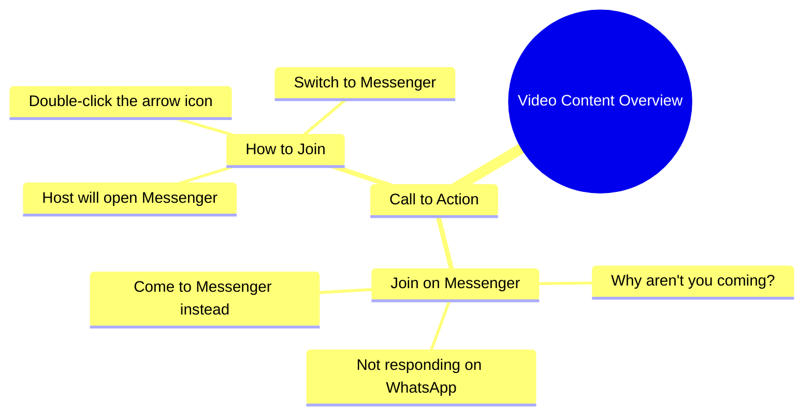

# Woman Asks Why You Don't Message Her on Messenger

> 🌐 **Read this in:** **English** · [中文](../../zh-CN/2026-10/tiktok-transcript-7-8m-views-88k-reactions-trendingreels-viral-viralreels-tren-0f00.md)

> **Creator:** [@aqsa abbas](https://www.tiktok.com/@aqsa abbas) · **Views:** 2.6M · **Posted:** 2026-10-01 · **Niche:** entertainment
>
> **TL;DR:** The hook immediately engages viewers by asking a relatable question about why people don't respond on messaging apps.

[Watch original video →](https://www.facebook.com/reel/2069553387258139/?app=fbl)

## Why This Went Viral

## Hook (first 3 seconds)
- Verbatim opening line: "आप लोग क्यों नहीं आते हो, वाटसेप पे तो नहीं आ रहे हो, मैसिंजर पे तो आ जाओ" ("Why don't you people come? You're not coming on WhatsApp, at least come on Messenger")
- Hook pattern: **Direct accusation + call-out question** (confrontational second-person address)
- Why it stops the scroll: It opens mid-argument with an unnamed "you," creating instant parasocial tension — the viewer feels personally addressed and needs to know *who* she's scolding and *why*. The complaint is relatable (being ignored on messaging apps), so it triggers both curiosity and self-recognition.

## Emotional Rhythm
- **Beat 1 — Confrontation/curiosity (0–2s):** "Why don't you come?" — mild accusation, viewer leans in.
- **Beat 2 — Escalation (2–5s):** "WhatsApp pe toh nahi aa rahe ho" — specific, familiar grievance; builds mild guilt/amusement.
- **Beat 3 — Pivot to instruction (5–8s):** "Messenger pe aa jao, teer ke nishaan pe do baar click karo" — shifts from complaint to a literal how-to, which is absurd and funny.
- **Beat 4 — Climax / punchline (8–10s):** "मैं मैसिंजर खुल के आती हूँ" ("I'll come open on Messenger") — the broken/ambiguous phrasing lands as the twist. The grammatical oddity is the emotional peak — it's the line people quote and re-share.
- **Climax moment:** The final line. The comedy is in the unintended double meaning ("I'll come open"), which turns a mundane plea into a meme-able punchline.

## Keyword Density
- **आओ / आ जाओ (come)** — repeated imperative; drives the call-to-action energy.
- **मैसिंजर (Messenger)** — repeated 3x; the platform name is the algorithmic keyword.
- **वाटसेप (WhatsApp)** — high-recognition brand term; boosts discoverability.
- **क्यों नहीं (why not)** — the emotional hook word; signals grievance.
- **क्लिक करो (click)** — instructional verb; adds a "how-to" texture.
- **तीर के निशान (arrow mark)** — visual cue; makes the instruction concrete.
- **खुल के आती हूँ (come open)** — the viral phrase; pure emotional/meme pull, not algorithmic.

Algorithmic reach: brand names (WhatsApp, Messenger) + imperative verbs. Emotional pull: "kyun nahi aate ho" and the final malapropism.

## Why It Spreads
- **Relatable grievance as entry point:** "आप लोग क्यों नहीं आते हो" mirrors the universal feeling of being ignored or having to chase people — viewers tag friends who "never reply."
- **Absurd specificity:** "तीर के निशान पे दो बार क्लिक करो" turns a vague plea into a fake-precise instruction, which reads as unintentional comedy and invites parody.
- **The malapropism punchline:** "मैं मैसिंजर खुल के आती हूँ" is grammatically off in a way that creates a double entendre — the exact kind of line that becomes a caption, a sound, and a duet prompt.
- **Second-person address = direct engagement:** Every line says "you," so viewers feel spoken to, boosting comments ("main aa gaya didi") and reply-video culture.
- **Low production, high personality:** No setup, no context — just raw emotion and a confusing instruction. This "authentic chaos" format is highly remixable and travels across language communities via translation.

## What You Can Steal
- **Open mid-conflict, not mid-context.** Start your video with a complaint or accusation aimed at "you" — skip the intro, let the viewer infer the story.
- **Give a fake-precise instruction.** "Click the arrow twice" style directives feel actionable and absurd at once; they create comment bait and screen-record shares.
- **Engineer one quotable, slightly broken line.** A grammatically odd or double-meaning phrase at the end becomes your sound, your caption, and your meme — plan for it, don't leave it to chance.

## Mind Map

## Full Transcript (Generated by [the tool we used to generate this](https://toktranscript.com/?utm_source=github&utm_medium=breakdown&utm_campaign=tool_attribution))

> 📝 Transcripts on this page are auto-generated and show the first 60%. Want to transcribe any TikTok in 30 seconds and get the full version? [Try TokTranscript free →](https://toktranscript.com/?utm_source=github&utm_medium=breakdown&utm_campaign=transcript_cta)

आप लोग क्यों नहीं आते हो, वाटसेप पे तो नहीं आ रहे हो, मैसिंजर पे तो आ जाओ, तीर के निशान पे द

*[Read the full transcript on TokTranscript →](https://toktranscript.com/plaza/tiktok-transcript-7-8m-views-88k-reactions-trendingreels-viral-viralreels-tren-0f00?utm_source=github&utm_medium=breakdown&utm_campaign=transcript_full)*

## Browse More

- All [entertainment](../../by-niche/en/entertainment.md) breakdowns
- All [Direct Question](../../by-pattern/en/hook-direct-question.md) examples

## Video Info

| | |
|---|---|
| Creator | [@aqsa abbas](https://www.tiktok.com/@aqsa abbas) |
| Original video | [https://www.facebook.com/reel/2069553387258139/?app=fbl](https://www.facebook.com/reel/2069553387258139/?app=fbl) |
| Original title | 7.8M views · 88K reactions | #trendingreels #viral #viralreels #trending | aqsa abbas |
| Views | 2.6M (2627056) |
| Posted | 2026-10-01 |
| Duration | 0s |
| Niche | `entertainment` |
| Hook pattern | `Direct Question` |
| Original language | `en` |
| Available languages | en, zh-CN |
| Generated | 2026-10-02 by [TokTranscript](https://toktranscript.com/) |

---

*This breakdown is for educational analysis under fair use. Original video © [@aqsa abbas](https://www.tiktok.com/@aqsa abbas). All transcripts are auto-generated and may contain errors.*

*Want to analyze your own TikToks like this? [analyze your own TikToks →](https://toktranscript.com/viral-breakdown?utm_source=github&utm_medium=breakdown&utm_campaign=footer_cta)*