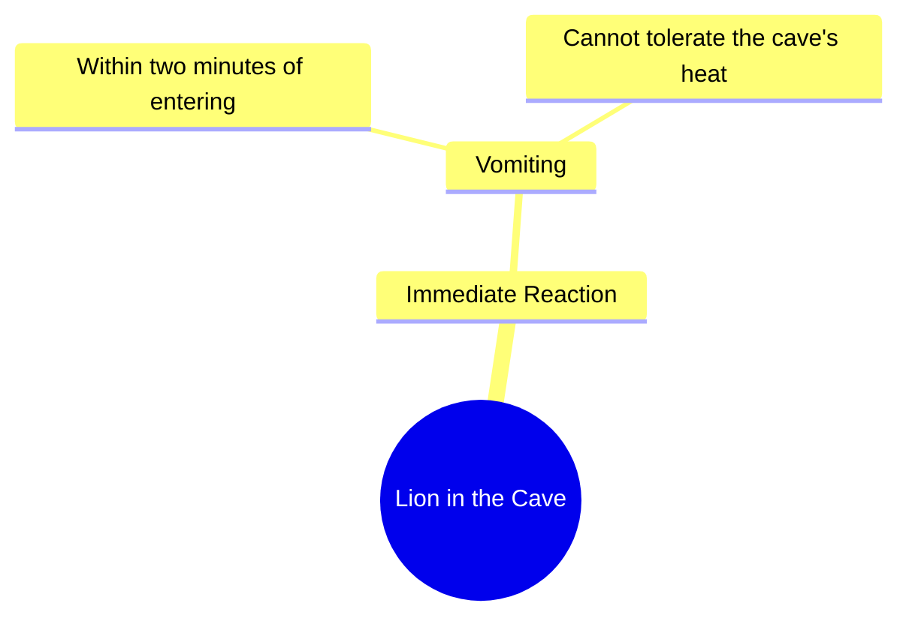

# Lion Cannot Stand Heat Inside Our Cave

> 🌐 **Read this in:** **English** · [中文](../../zh-CN/2026-10/tiktok-transcript-dear-tiktok-please-don-t-underview-my-videos-foryoupage-fyp-e308.md)

> **Creator:** [@kamana_writex](https://www.tiktok.com/@kamana_writex) · **Views:** 252.0K · **Posted:** 2026-10-02 · **Niche:** other
>
> **TL;DR:** The unexpected claim that a lion vomits within two minutes grabs attention immediately.

[Watch original video →](https://vt.tiktok.com/ZSb5N4Wqd/)

## Why This Went Viral

## Hook (first 3 seconds)
- Verbatim opening: "شیر جب ہماری گفا میں آتا ہے ہاں تو دو منٹ میں ہی الٹی کرنے لگتا ہے" ("When the lion enters our cave, within just two minutes it starts vomiting.")
- Hook pattern: **Contrast + bold claim** — a predator at the top of the food chain is instantly defeated by something as passive as *heat*.
- Why it stops the scroll: It inverts a universal power hierarchy (lion = apex predator → lion = vomiting victim) in under three seconds. The brain can't reconcile "lion" with "vomiting in two minutes," so it stays to resolve the contradiction.

## Emotional Rhythm
- **Beat 1 – Curiosity (0–2s):** "شیر… ہماری گفا میں آتا ہے" — who is "we," and why would a lion enter a cave?
- **Beat 2 – Absurd image / micro-twist (2–4s):** "الٹی کرنے لگتا ہے" — the vomiting detail lands as a shock-comedy spike.
- **Beat 3 – Tension build (4–7s):** "ہماری گفا کی گرمی" — the cave's heat is introduced as the unseen weapon.
- **Beat 4 – Climax / punchline (7–10s):** "بیچارہ شیر بھی برداشت نہیں کر پاتا" — the word **بیچارہ** ("poor thing") flips the lion from monster to victim. This is the emotional peak.
- **Beat 5 – Resonance:** Pride in the cave's lethality — the speaker's environment is stronger than any predator. Viewers feel vicarious dominance.
- **Climax moment:** "بیچارہ شیر" — the pity-slap on the lion. Everything before it is setup for this reversal.

## Keyword Density
- **شیر** (lion) — drives reach; high-search, high-emotion animal keyword.
- **گفا / غار** (cave) — anchors the setting; unusual word that makes the story memorable.
- **گرمی** (heat) — the causal mechanism; carries the "why."
- **الٹی** (vomit) — the shock keyword; drives shares and comments.
- **دو منٹ** (two minutes) — specificity that makes the claim feel factual.
- **برداشت نہیں کر پاتا** (can't tolerate) — the defeat phrase; emotional pull.
- **بیچارہ** (poor thing) — the empathy flip; emotional pull.
- **ہماری** (our) — tribal ownership; creates in-group resonance.
- **Algorithmic drivers:** شیر, الٹی, گرمی — high-engagement nouns that trigger comments ("is this real?").
- **Emotional drivers:** بیچارہ, ہماری, برداشت — build pride, pity, and belonging.

## Why It Spreads
- **Power inversion in one sentence:** "شیر… الٹی کرنے لگتا ہے" collapses the strongest animal into the weakest state — the single most shareable image in the clip.
- **Specificity sells the absurdity:** "دو منٹ میں ہی" (within just two minutes) makes an unbelievable claim sound measured and observed, not exaggerated.
- **Empathy flip creates comment bait:** "بیچارہ شیر" invites viewers to argue — some laugh, some defend the lion, some ask if it's true. All three reactions feed the algorithm.
- **Tribal pride hook:** "ہماری گفا" (our cave) frames the speaker's environment as superior to nature's apex predator — viewers from similar regions share it as identity content.
- **Self-contained punchline:** The whole clip is one setup + one twist, so it's quotable, re-tellable, and loop-friendly — no context needed to enjoy it.

## What You Can Steal
1. **Open with a power inversion.** Take the strongest thing in your niche (a CEO, a champion, a genius) and show it defeated by something trivial in the first line. Contradiction = retention.
2. **Use one absurd, concrete detail.** "Vomiting in two minutes" beats "the lion can't handle it." Specific, physical, slightly gross details are what get screenshotted and repeated.
3. **End on an empathy flip.** The word "بیچارہ" turns a villain into a victim in one syllable. Find the moment in your story where you can make the audience feel *sorry* for the thing they were just afraid of — that's the share trigger.

## Mind Map

## Full Transcript (Generated by [TokTranscript.com](https://toktranscript.com/?utm_source=github&utm_medium=breakdown&utm_campaign=tool_attribution))

> 📝 Transcripts on this page are auto-generated and show the first 60%. Want to transcribe any TikTok in 30 seconds and get the full version? [Try TokTranscript free →](https://toktranscript.com/?utm_source=github&utm_medium=breakdown&utm_campaign=transcript_cta)

شیر جب ہماری گفا میں آتا ہے ہاں تو دو منٹ میں ہی الٹی کرنے لگتا ہے ہمار

*[Read the full transcript on TokTranscript →](https://toktranscript.com/plaza/tiktok-transcript-dear-tiktok-please-don-t-underview-my-videos-foryoupage-fyp-e308?utm_source=github&utm_medium=breakdown&utm_campaign=transcript_full)*

## Browse More

- All [other](../../by-niche/en/other.md) breakdowns
- All [shocking fact](../../by-pattern/en/hook-shocking-fact.md) examples

## Video Info

| | |
|---|---|
| Creator | [@kamana_writex](https://www.tiktok.com/@kamana_writex) |
| Original video | [https://vt.tiktok.com/ZSb5N4Wqd/](https://vt.tiktok.com/ZSb5N4Wqd/) |
| Original title | Dear Tiktok please Don't Underview My Videos~😂🤣😀🤣#foryoupage #fypシ #f... |
| Views | 252.0K (252000) |
| Posted | 2026-10-02 |
| Duration | 0s |
| Niche | `other` |
| Hook pattern | `shocking fact` |
| Original language | `en` |
| Available languages | en, zh-CN |
| Generated | 2026-10-03 by [TokTranscript](https://toktranscript.com/) |

---

*This breakdown is for educational analysis under fair use. Original video © [@kamana_writex](https://www.tiktok.com/@kamana_writex). All transcripts are auto-generated and may contain errors.*

*Want to analyze your own TikToks like this? [TokTranscript →](https://toktranscript.com/viral-breakdown?utm_source=github&utm_medium=breakdown&utm_campaign=footer_cta)*