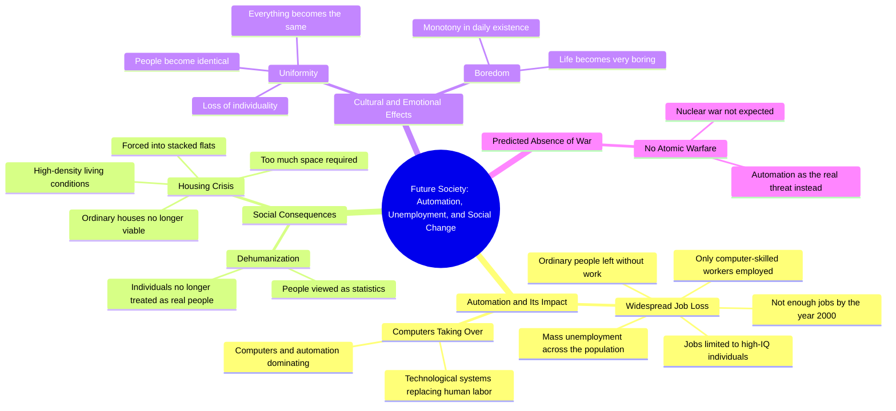

# 1966 Kids Predict Automation and Job Loss

> 🌐 **Read this in:** **English** · [中文](../../zh-CN/2026-10/tiktok-transcript-future-according-to-kids-documentary-from-1966-ai-future-une-5eea.md)

> **Creator:** [@wersalek420](https://www.tiktok.com/@wersalek420) · **Views:** 1.8M · **Posted:** 2026-10-03 · **Niche:** other
>
> **TL;DR:** It flips the common fear of nuclear war into a more relatable, creeping fear of automation, instantly grabbing attention.

[Watch original video →](https://vt.tiktok.com/ZSbuMnvwM/)

## Why This Went Viral

## Hook (first 3 seconds)
- **Verbatim opening line:** "I don't think there is going to be atomic warfare, but I think there's is going to be all this automation."
- **Hook pattern:** Contrast + bold claim (rejects the expected apocalypse, substitutes a quieter, more insidious one).
- **Why it stops the scroll:** It hijacks a familiar fear (nuclear war) and swaps in a *different* threat in the same breath. The viewer's brain registers "this isn't the doom I expected" — an unresolved pattern that demands the next sentence. The casual, unpolished delivery ("I don't think… but I think") reads as genuine prediction, not scripted content.

## Emotional Rhythm
- **0–3s — Disorientation/curiosity:** Nuclear war is dismissed, automation is named. Tension is set without resolution.
- **3–12s — Dread escalation:** "People are going to be out of work," "regarded more as statistics than as actual people." Dehumanization beat lands here.
- **12–22s — Claustrophobic imagery:** "flats piled on top of one another," "very boring," "everything will be the same." Sensory, visual, dystopian — this is where resonance hits hardest.
- **22–35s — Cold logic:** "high IQ… work computers… other people just not gonna have jobs." The twist: it's not violence that kills you, it's *redundancy*.
- **Climax moment:** "They just aren't gonna be jobs for you to have." The blunt, second-person collapse — the viewer is personally addressed as obsolete.

## Keyword Density
- **automation / computers** — algorithmic reach (tech-panic SEO terms).
- **jobs / out of work / no jobs** — highest emotional pull; universal anxiety anchor.
- **people** (repeated 6+ times) — frames the stakes as human, not economic.
- **statistics** — the single sharpest word in the transcript; carries the dehumanization thesis.
- **high IQ / HQ** — memorable slip that signals authenticity (unscripted speaker).
- **flats / piled on top of one another** — visual keyword; drives comment-section imagery.
- **boring / the same** — underrated; converts fear into *ennui*, a rarer emotional register.
- **year 2000** — timestamp anchor that makes the prediction falsifiable and shareable.

## Why It Spreads
- **It's a "failed prophecy" that partially came true.** The "year 2000" timestamp lets viewers measure the prediction against reality — automation anxiety, gig work, AI layoffs. Comment sections become scoreboards.
- **It reframes apocalypse as boredom.** "It's going to be very boring, and everything will be the same" is the line people quote. It's counterintuitive — dystopia as monotony, not fire.
- **Second-person gut-punch.** "They just aren't gonna be jobs for you to have" turns a macro prediction into a personal verdict. That's the screenshot line.
- **Unpolished authenticity.** The "HQ" slip, the ums, the run-ons — viewers trust it more than a polished AI-voiceover version. It reads as a real person from the past warning the present.
- **Pre-echoes of AI discourse.** Every "automation will take jobs" debate in 2024–2025 retroactively validates this clip, so it resurfaces with each news cycle.

## What You Can Steal
- **Open by rejecting the obvious fear, then naming the real one.** "It's not X you should worry about — it's Y." Instant contrast, instant retention.
- **End on a second-person verdict.** Convert your thesis into a sentence that points at the viewer: "…and it's coming for *you*." That's your shareable line.
- **Let imperfection stay in.** One slip, one hesitation, one run-on sentence signals a real human. Polish kills virality in talking-head content.

## Mind Map

## Full Transcript (Generated by [try this transcription tool](https://toktranscript.com/?utm_source=github&utm_medium=breakdown&utm_campaign=tool_attribution))

> 📝 Transcripts on this page are auto-generated and show the first 60%. Want to transcribe any TikTok in 30 seconds and get the full version? [Try TokTranscript free →](https://toktranscript.com/?utm_source=github&utm_medium=breakdown&utm_campaign=transcript_cta)

I don't think there is going to be atomic warfare, but I think there's is going to be all this automation. People are going to be out of work and a great population, and I think something has to be done about it. I think it'll be a, um, people will be regarded more as statistics and as actual people. People can't live in, wouldn't be able to live in ordinary houses because I would take up too much room. It'd have to be in flats piled on top of one another. I think it's going to be very boring, and everything will be the same.

*[Read the full transcript on TokTranscript →](https://toktranscript.com/plaza/tiktok-transcript-future-according-to-kids-documentary-from-1966-ai-future-une-5eea?utm_source=github&utm_medium=breakdown&utm_campaign=transcript_full)*

## Browse More

- All [other](../../by-niche/en/other.md) breakdowns
- All [Expectation Subversion](../../by-pattern/en/hook-expectation-subversion.md) examples

## Video Info

| | |
|---|---|
| Creator | [@wersalek420](https://www.tiktok.com/@wersalek420) |
| Original video | [https://vt.tiktok.com/ZSbuMnvwM/](https://vt.tiktok.com/ZSbuMnvwM/) |
| Original title | Future according to kids. Documentary from 1966. #ai #future #unemplo... |
| Views | 1.8M (1800000) |
| Posted | 2026-10-03 |
| Duration | 0s |
| Niche | `other` |
| Hook pattern | `Expectation Subversion` |
| Original language | `en` |
| Available languages | en, zh-CN |
| Generated | 2026-10-04 by [TokTranscript](https://toktranscript.com/) |

---

*This breakdown is for educational analysis under fair use. Original video © [@wersalek420](https://www.tiktok.com/@wersalek420). All transcripts are auto-generated and may contain errors.*

*Want to analyze your own TikToks like this? [free TikTok transcript generator →](https://toktranscript.com/viral-breakdown?utm_source=github&utm_medium=breakdown&utm_campaign=footer_cta)*