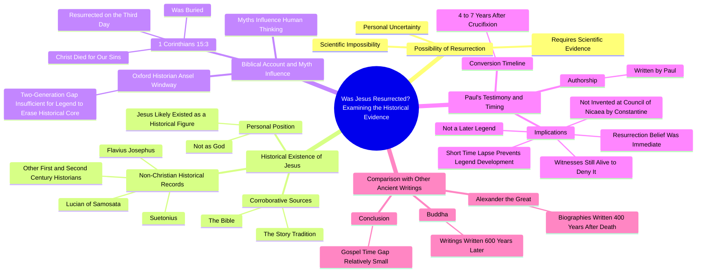

# Street Interview: Was Jesus Resurrected?

> 🌐 **Read this in:** **English** · [中文](../../zh-CN/2026-10/tiktok-transcript-jes-s-resucit-dios-biblia-paratii-entrevista-tiktok-2996.md)

> **Creator:** [@oficial.angelrodriguez](https://www.tiktok.com/@oficial.angelrodriguez) · **Views:** 529.6K · **Posted:** 2026-10-02 · **Niche:** entertainment
>
> **TL;DR:** The hook immediately engages viewers with a controversial and personal question, sparking curiosity and debate.

[Watch original video →](https://vt.tiktok.com/ZSbf4LjQr/)

## Why This Went Viral

## Hook (first 3 seconds)
- Opening line, verbatim: "Do you think Jesus was resurrected? It is not possible for 1 human being."
- Hook pattern: **Direct question + immediate bold counter-claim** (question-to-contradiction combo).
- Why it stops the scroll: It forces a binary self-answer in under two seconds ("yes/no"), then the speaker instantly rejects the premise. That creates cognitive dissonance — the viewer either agrees and stays to see the argument, or disagrees and stays to argue back. Both reactions feed watch time.

## Emotional Rhythm
- **0–5s — Provocation:** "It is not possible for 1 human being." Viewer is baited into a defensive or curious stance.
- **5–20s — Concession loop:** "I cannot know… I would need 1 piece of evidence." Speaker appears neutral/skeptical, disarming religious viewers and atheist viewers simultaneously.
- **20–45s — Setup of tension:** "Did Jesus exist?" + "not as 1 God." Splits the audience into two camps who both now want resolution.
- **45–90s — Evidence stacking:** Josephus, Luciano, Suetonius, then 1 Corinthians 15:3. Suspense builds via accumulation — "will the evidence hold?"
- **90–110s — Twist / climax:** "This was written by Pablo… 4 to 7 years after the crucifixion." This is the **climax moment** — the "gotcha" that reframes the whole video from "did Jesus exist" to "was the resurrection an early belief, not a later legend."
- **110–130s — Relief / payoff:** Alexander (400 yrs) and Buddha (600 yrs) comparison. Tension releases into a satisfying "so the timeline is actually short" conclusion.
- **Resonance beat:** "the witnesses were still alive to deny it" — lands as the emotional/legal gut-punch.

## Keyword Density
- **Jesus** (highest frequency — anchors topic for algorithmic topic-matching)
- **resurrection / resurrected** (core search term, drives religious + historical search traffic)
- **evidence / scientific / prove** (drives skepticism-audience reach; signals "rational" framing)
- **Bible / 1 Corinthians 15:3 / Pablo (Paul)** (niche authority markers — pull in Christian viewers)
- **legend / myth** (the framing keyword that makes the argument feel academic, not preachy)
- **1 / 2 / 4 to 7 years / 400 / 600** (numbers — the retention engine; each number resets attention)
- **historians / Josephus / Suetonius** (credibility keywords — algorithmic "educational" signal)
- **witnesses / alive / deny** (emotional pull — legal-drama vocabulary)

Algorithmic reach drivers: *Jesus, resurrection, evidence, historians* (search + topic clustering).
Emotional pull drivers: *witnesses alive to deny, legend, impossible* (these are what get replayed and quoted in comments).

## Why It Spreads
- **It weaponizes the "I'm just asking questions" frame.** Lines like "I cannot know" and "I would need 1 piece of evidence" let both believers and skeptics feel the video is on their side — so both share it.
- **The twist is a named-source reveal.** "This was written by Pablo" converts a vague theological claim into a checkable fact. Shareable content needs a "wait, really?" moment — this is it.
- **Numbers create retention scaffolding.** "4 to 7 years," "400 years," "600 years" — each number is a mini-hook that resets attention and makes the comparison feel empirical rather than emotional.
- **It pre-empts the strongest counter-argument.** "the witnesses were still alive to deny it" answers the objection the viewer was about to type in the comments — which kills the "well actually" reply and boosts comment-section agreement.
- **It borrows authority from outside religion.** Josephus, Suetonius, "Oxford historian" — this signals "secular evidence," which makes the clip shareable in non-religious spaces (history, debate, atheist, apologetics communities all at once).

## What You Can Steal
- **Open with a question, then immediately contradict it.** The question pulls both sides in; the contradiction makes them stay to see how you'll resolve it.
- **Stack named sources as visual/verbal beats.** Every proper noun (Josephus, Suetonius, 1 Corinthians 15:3) is a retention checkpoint — viewers wait for the next one.
- **End with a comparison number that reframes the whole argument.** "400 years vs. 4–7 years" is the shareable soundbite. Build your video so the last 15 seconds contain a single, quotable numeric contrast.

## Mind Map

## Full Transcript (Generated by [analyze your own TikToks](https://toktranscript.com/?utm_source=github&utm_medium=breakdown&utm_campaign=tool_attribution))

> 📝 Transcripts on this page are auto-generated and show the first 60%. Want to transcribe any TikTok in 30 seconds and get the full version? [Try TokTranscript free →](https://toktranscript.com/?utm_source=github&utm_medium=breakdown&utm_campaign=transcript_cta)

Do you think Jesus was resurrected? It is not possible for 1 human being. I cannot know. To believe me, I would need 1 piece of evidence, but make it scientific. It is impossible for it to happen. To test the resurrection, we should accept some previous premises, Did Jesus exist? I believe that it could have existed, but that what was later created It still doesn't have much to do with what really happened. I feel that Jesus did exist, but not as 1 God. To demonstrate the existence of Jesus we should appeal to 2 corroborative sources. The first is the story and the second the Bible. If Jesus were only to appear in the Bible, we might think it was the invention of its authors. However, there is 1 extensive record of historians. not Christians who prove it, first and second century historians as were Flavius Josephus,, Luciano Linio, young Suetonius, among many others. Now, what does the Bible say? Do you think the original story was influenced by myths? Man, of course, in the end, the myths They have always influenced 1 lot in the way people think. Oxford historian Ansel Windway, says 2-generation El Paso is not enough time for 1 legend to erase 1 core of historical truth.

*[Read the full transcript on TokTranscript →](https://toktranscript.com/plaza/tiktok-transcript-jes-s-resucit-dios-biblia-paratii-entrevista-tiktok-2996?utm_source=github&utm_medium=breakdown&utm_campaign=transcript_full)*

## Browse More

- All [entertainment](../../by-niche/en/entertainment.md) breakdowns
- All [Provocative Question](../../by-pattern/en/hook-provocative-question.md) examples

## Video Info

| | |
|---|---|
| Creator | [@oficial.angelrodriguez](https://www.tiktok.com/@oficial.angelrodriguez) |
| Original video | [https://vt.tiktok.com/ZSbf4LjQr/](https://vt.tiktok.com/ZSbf4LjQr/) |
| Original title | ¿Jesús resucitó? #dios #biblia #paratii #entrevista #tiktok  |
| Views | 529.6K (529600) |
| Posted | 2026-10-02 |
| Duration | 0s |
| Niche | `entertainment` |
| Hook pattern | `Provocative Question` |
| Original language | `en` |
| Available languages | en, zh-CN |
| Generated | 2026-10-02 by [TokTranscript](https://toktranscript.com/) |

---

*This breakdown is for educational analysis under fair use. Original video © [@oficial.angelrodriguez](https://www.tiktok.com/@oficial.angelrodriguez). All transcripts are auto-generated and may contain errors.*

*Want to analyze your own TikToks like this? [try this transcription tool →](https://toktranscript.com/viral-breakdown?utm_source=github&utm_medium=breakdown&utm_campaign=footer_cta)*