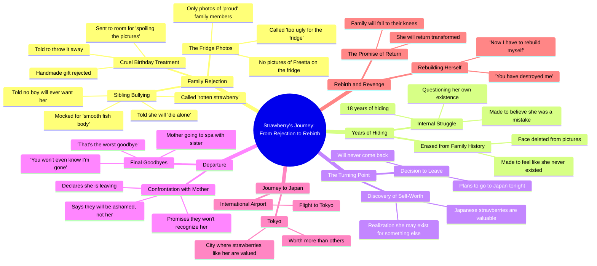

# Fruit Drama: Mom Rejects Ugly Daughter

> 🌐 **Read this in:** **English** · [中文](../../zh-CN/2026-10/tiktok-transcript-partie-1-la-diff-rence-de-fraisita-fruitdrama-fruitanimation-498a.md)

<a href="https://www.tiktok.com/@fruit.drama.studi6/video/7632734366652779798?_r=1&u_code=f613i7e0907b2d&preview_pb=0&sharer_language=fr&_d=f613hjj4fjgmh1&share_item_id=7632734366652779798&source=h5_m&timestamp=1791585537&user_id=7693143281581065238&sec_user_id=MS4wLjABAAAA0zLR9nqeHy-bmAVfb-b17Qq32YbVfTmyajtdWZNrx0lhxlRlVSfmU1p6D01BZfs5&social_share_type=0&utm_source=copy&utm_campaign=client_share&utm_medium=android&share_iid=7693737648188426017&share_link_id=a76c0028-88ed-433c-adee-8059fbdaca65&share_app_id=1233&ugbiz_name=MAIN&ug_btm=b2878%2Cb2878&sp_root_share_link_id=a76c0028-88ed-433c-adee-8059fbdaca65&link_reflow_popup_iteration_sharer=%7B%22click_empty_to_play%22%3A1%2C%22dynamic_cover%22%3A1%2C%22follow_to_play_duration%22%3A-1.0%2C%22profile_clickable%22%3A1%7D&panel_source_v2=share_panel&share_enter_from=others_homepage&item_author_type=2&enable_checksum=1&sp_level=1&sp_root_u=f613i7e0907b2d&sp_root_d=f613hjj4fjgmh1" target="_blank"></a>

> **Creator:** [@fruit.drama.studi6](https://www.tiktok.com/@fruit.drama.studi6) · **Views:** 15.4M · **Posted:** 2026-10-09 · **Niche:** entertainment
>
> **TL;DR:** Opens with a poignant question that immediately reveals family rejection and sparks curiosity.

[Watch original video →](https://www.tiktok.com/@fruit.drama.studi6/video/7632734366652779798?_r=1&u_code=f613i7e0907b2d&preview_pb=0&sharer_language=fr&_d=f613hjj4fjgmh1&share_item_id=7632734366652779798&source=h5_m&timestamp=1791585537&user_id=7693143281581065238&sec_user_id=MS4wLjABAAAA0zLR9nqeHy-bmAVfb-b17Qq32YbVfTmyajtdWZNrx0lhxlRlVSfmU1p6D01BZfs5&social_share_type=0&utm_source=copy&utm_campaign=client_share&utm_medium=android&share_iid=7693737648188426017&share_link_id=a76c0028-88ed-433c-adee-8059fbdaca65&share_app_id=1233&ugbiz_name=MAIN&ug_btm=b2878%2Cb2878&sp_root_share_link_id=a76c0028-88ed-433c-adee-8059fbdaca65&link_reflow_popup_iteration_sharer=%7B%22click_empty_to_play%22%3A1%2C%22dynamic_cover%22%3A1%2C%22follow_to_play_duration%22%3A-1.0%2C%22profile_clickable%22%3A1%7D&panel_source_v2=share_panel&share_enter_from=others_homepage&item_author_type=2&enable_checksum=1&sp_level=1&sp_root_u=f613i7e0907b2d&sp_root_d=f613hjj4fjgmh1)

## Why This Went Viral

## Hook (first 3 seconds)
- **Verbatim opening line:** "mom why don't you have pictures of me on the fridge because the photos we are the ones we are proud of"
- **Hook pattern:** Cold-open emotional confrontation — a child asking a parent a raw, accusatory question. It's a **scene/conflict hook** (in-medias-res family cruelty), not a claim or question-to-camera.
- **Why it stops the scroll:** It drops the viewer into an active family rejection with zero setup. The line "the photos we are the ones we are proud of" implies the speaker is *not* one of them — instantly readable as "unloved child" in under 2 seconds. The fridge is a universally understood status symbol of family belonging, so the wound lands before the viewer decides to keep watching.

## Emotional Rhythm
- **Curiosity** (0–3s): Why no photos? Who is talking?
- **Tension** (3–15s): Escalating cruelty — "too ugly for the fridge," "mom is ugly I can throw it away," "go wait in your room you spoil the pictures."
- **Humiliation peak** (15–25s): The "smooth fish body under his sweater" / "rotten 1 day strawberry" insults — dehumanization via a repeated slur ("strawberry").
- **Despair → resolve** (25–40s): "you will die alone" → "they deleted my face from the pictures as if I had never existed" → pivot: "maybe I exist for something else."
- **Twist/reveal** (40–50s): "in Japan there are strawberries like me and they are worth 1 fortune" — the insult becomes the identity and the asset.
- **Climax:** "I'm going to Japan tonight and I will never come back" — the escape declaration. This is the emotional apex; everything after is revenge-fantasy denouement.
- **Resolution/tag** (50s–end): "the day I come home you will fall to your knees before me" — a promise of future reversal, which is what makes viewers want a sequel.

## Keyword Density
- **"strawberry / strawberries"** — the central motif; carries both the insult and the redemption.
- **"mom / mommy"** — anchors the family-conflict frame.
- **"ugly"** — the core wound.
- **"pictures / photos / fridge"** — the concrete symbol of exclusion.
- **"Japan / Tokyo"** — the escape and status-reversal destination.
- **"hide / hiding / hiding"** — the shame theme.
- **"worth / fortune / more than others"** — the value-reversal payoff.
- **"goodbye"** — the turning-point marker.
- **"ashamed / regret"** — the revenge-promise vocabulary.
- **Algorithmic drivers:** "Japan," "Tokyo," "strawberry" — high-search, high-visual, easy to caption/hashtag, and "strawberry" is a hook word that makes the video searchable and meme-able.
- **Emotional drivers:** "mom," "ugly," "hiding," "ashamed" — these are the words that make viewers *feel* and comment ("this is my childhood").

## Why It Spreads
- **Universal family-rejection wound, hyper-specific delivery.** "why don't you have pictures of me on the fridge" and "they deleted my face from the pictures as if I had never existed" turn a private pain into a shareable, recognizable scene — viewers tag friends who "get it."
- **The insult becomes the brand.** "strawberry" is repeated as a slur ("rotten 1 day strawberry," "no boy will ever want a strawberry without a seed") and then flipped into a flex ("in Japan there are strawberries like me and they are worth 1 fortune"). That reversal is the shareable twist.
- **A clean, quotable revenge arc.** "I'm going to Japan tonight and I will never come back" and "you will fall to your knees before me" are screenshot-ready lines — built for comments, duets, and stitches.
- **Cliffhanger ending engineered for a sequel.** "the next time you see me it won't be like this" and the airport scene ("international airport flight to Tokyo") leave the transformation unresolved, driving follows, saves, and part-2 demand.
- **High-contrast emotional polarity.** Cruelty ("you spoil the pictures," "you will die alone") vs. self-worth ("maybe I exist for something else," "worth 1 fortune") creates the kind of whiplash that triggers the algorithm's completion-rate signal.

## What You Can Steal
- **Open inside the conflict, not before it.** Start on the most painful line ("why don't you have pictures of me on the fridge") — no context, no intro. Let the viewer catch up.
- **Give the wound a repeatable symbol.** Pick one word or object (here: "strawberry") and use it as insult *and* redemption. A single motif makes the video quotable, searchable, and meme-able.
- **End on a promise, not a resolution.** Close with a future-tense threat or transformation ("the day I come home you will fall to your knees before me") so viewers need the next video and the algorithm gets a follow.

## Mind Map

## Full Transcript (Generated by [TokTranscript.com](https://toktranscript.com/?utm_source=github&utm_medium=breakdown&utm_campaign=tool_attribution))

> 📝 Transcripts on this page are auto-generated and show the first 60%. Want to transcribe any TikTok in 30 seconds and get the full version? [Try TokTranscript free →](https://toktranscript.com/?utm_source=github&utm_medium=breakdown&utm_campaign=transcript_cta)

mom why don't you have pictures of me on the fridge because the photos we are the ones we are proud of my dear mommy is right you are too ugly for the fridge happy birthday freetta I made your gift myself mom is ugly I can throw it away of course my dear and you go wait in your room you spoil the pictures look at my so-called sister tries to hide his smooth fish body under his sweater rotten 1 day strawberry 1 day you will regret every word no boy will ever want a strawberry without a seed you will die alone my poor 18 years hiding they deleted my face from the pictures as if I had never existed maybe I exist for something else in Japan there are strawberries like me and they are worth 1 fortune all my life I've been hiding here all my life they made me think I was a mistake I'm going to Japan tonight and I will never come back like before mommy strawberry you told

*[Read the full transcript on TokTranscript →](https://toktranscript.com/plaza/tiktok-transcript-partie-1-la-diff-rence-de-fraisita-fruitdrama-fruitanimation-498a?utm_source=github&utm_medium=breakdown&utm_campaign=transcript_full)*

## Browse More

- All [entertainment](../../by-niche/en/entertainment.md) breakdowns
- All [Question-Answer Emotional Hook](../../by-pattern/en/hook-question-answer-emotional-hook.md) examples

## Video Info

| | |
|---|---|
| Creator | [@fruit.drama.studi6](https://www.tiktok.com/@fruit.drama.studi6) |
| Original video | [https://www.tiktok.com/@fruit.drama.studi6/video/7632734366652779798?_r=1&u_code=f613i7e0907b2d&preview_pb=0&sharer_language=fr&_d=f613hjj4fjgmh1&share_item_id=7632734366652779798&source=h5_m&timestamp=1791585537&user_id=7693143281581065238&sec_user_id=MS4wLjABAAAA0zLR9nqeHy-bmAVfb-b17Qq32YbVfTmyajtdWZNrx0lhxlRlVSfmU1p6D01BZfs5&social_share_type=0&utm_source=copy&utm_campaign=client_share&utm_medium=android&share_iid=7693737648188426017&share_link_id=a76c0028-88ed-433c-adee-8059fbdaca65&share_app_id=1233&ugbiz_name=MAIN&ug_btm=b2878%2Cb2878&sp_root_share_link_id=a76c0028-88ed-433c-adee-8059fbdaca65&link_reflow_popup_iteration_sharer=%7B%22click_empty_to_play%22%3A1%2C%22dynamic_cover%22%3A1%2C%22follow_to_play_duration%22%3A-1.0%2C%22profile_clickable%22%3A1%7D&panel_source_v2=share_panel&share_enter_from=others_homepage&item_author_type=2&enable_checksum=1&sp_level=1&sp_root_u=f613i7e0907b2d&sp_root_d=f613hjj4fjgmh1](https://www.tiktok.com/@fruit.drama.studi6/video/7632734366652779798?_r=1&u_code=f613i7e0907b2d&preview_pb=0&sharer_language=fr&_d=f613hjj4fjgmh1&share_item_id=7632734366652779798&source=h5_m&timestamp=1791585537&user_id=7693143281581065238&sec_user_id=MS4wLjABAAAA0zLR9nqeHy-bmAVfb-b17Qq32YbVfTmyajtdWZNrx0lhxlRlVSfmU1p6D01BZfs5&social_share_type=0&utm_source=copy&utm_campaign=client_share&utm_medium=android&share_iid=7693737648188426017&share_link_id=a76c0028-88ed-433c-adee-8059fbdaca65&share_app_id=1233&ugbiz_name=MAIN&ug_btm=b2878%2Cb2878&sp_root_share_link_id=a76c0028-88ed-433c-adee-8059fbdaca65&link_reflow_popup_iteration_sharer=%7B%22click_empty_to_play%22%3A1%2C%22dynamic_cover%22%3A1%2C%22follow_to_play_duration%22%3A-1.0%2C%22profile_clickable%22%3A1%7D&panel_source_v2=share_panel&share_enter_from=others_homepage&item_author_type=2&enable_checksum=1&sp_level=1&sp_root_u=f613i7e0907b2d&sp_root_d=f613hjj4fjgmh1) |
| Original title | Partie 1 | La différence de Fraisita | #fruitdrama #fruitanimation #f... |
| Views | 15.4M (15400000) |
| Posted | 2026-10-09 |
| Duration | 0s |
| Niche | `entertainment` |
| Hook pattern | `Question-Answer Emotional Hook` |
| Original language | `en` |
| Available languages | en, zh-CN |
| Generated | 2026-10-10 by [TokTranscript](https://toktranscript.com/) |

---

*This breakdown is for educational analysis under fair use. Original video © [@fruit.drama.studi6](https://www.tiktok.com/@fruit.drama.studi6). All transcripts are auto-generated and may contain errors.*

*Want to analyze your own TikToks like this? [analyze your own TikToks →](https://toktranscript.com/viral-breakdown?utm_source=github&utm_medium=breakdown&utm_campaign=footer_cta)*