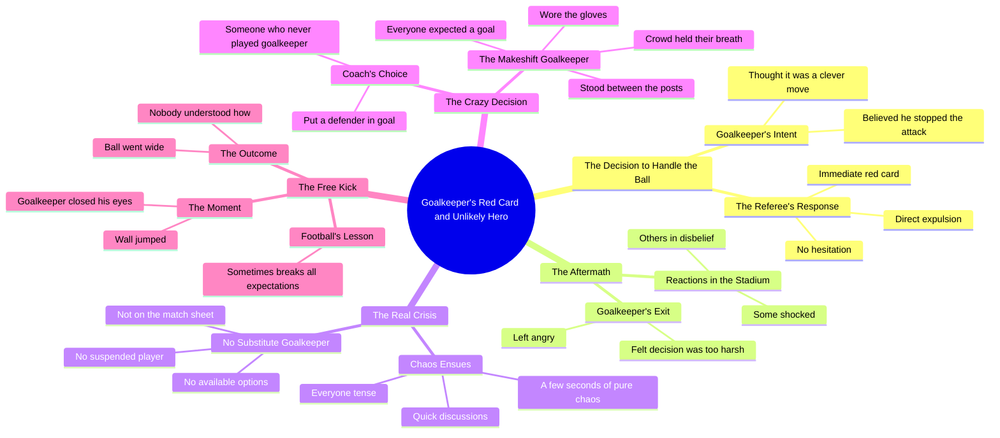

# Goalkeeper Sent Off With No Substitute on Bench

> 🌐 **Read this in:** **English** · [中文](../../zh-CN/2026-10/tiktok-transcript-video-042a.md)

> **Creator:** [@kickoffkoora](https://www.tiktok.com/@kickoffkoora) · **Views:** 5.0M · **Posted:** 2026-10-07 · **Niche:** entertainment
>
> **TL;DR:** Sets up a relatable moment of overconfidence that immediately grabs attention.

[Watch original video →](https://vm.tiktok.com/ZN8kV1Hf2/)

## Why This Went Viral

## Hook (first 3 seconds)
- **Verbatim opening line:** "عندما قرر الحارس ان يكون ذكيا ويمسك الكرة بيده خارج منطقة الجزاء" — "When the goalkeeper decided to be clever and catch the ball with his hand outside the penalty area…"
- **Hook pattern:** Contrast/irony setup — a "smart move" that is instantly framed as a catastrophic mistake. It's a *narrative premise hook*, not a question or a number.
- **Why it stops the scroll:** It opens mid-action with a decision already made and a consequence implied ("he thought he calculated it perfectly"). The brain is wired to resolve an unfinished cause-effect loop, so the viewer stays to see the payoff of the "clever" choice.

## Emotional Rhythm
- **Curiosity** → the "smart" handball and the immediate red card ("الحكم لم يتردد… اخرج البطاقة الحمراء فورا").
- **Shock / freeze** → the whole stadium freezes; some are stunned, others in disbelief ("الملعب كله تجمد").
- **Escalation into dread** → the real disaster is revealed: *there is no substitute goalkeeper* ("لم يكن هناك حارس مرمى بديل… لا شيء").
- **Chaos / tension peak** → seconds of pure chaos, tense discussion, the coach's "crazy decision" to put a defender in goal ("قرارا مجنونا").
- **Suspense hold** → the crowd holds its breath; everyone is certain a goal is coming ("الجمهور حبس انفاسه… كان مجرد مسالة وقت").
- **Climax moment** → the free kick is taken, the makeshift keeper closes his eyes, and the ball goes wide — "no one understood how" ("خرجت الكرة خارج المرمى ولا احد فهم كيف").
- **Relief + twist** → the payoff line: "football sometimes loves to break all expectations."

## Keyword Density
- **الكرة / المرمى** (ball / goal) — anchors the topic for algorithmic sports-feed matching.
- **الحارس** (goalkeeper) — the subject noun repeated throughout; drives topical relevance.
- **البطاقة الحمراء / طرد** (red card / sending off) — high-engagement football trigger words.
- **لم يكن هناك حارس مرمى بديل** (no substitute goalkeeper) — the emotional pivot phrase.
- **قرارا مجنونا** (a crazy decision) — emotional amplifier, not an SEO term.
- **حارس مرمى** repeated as a motif — algorithmic reach (search/topic clustering).
- **التوقعات** (expectations) — the thematic closer; emotional pull, not reach.
- **Drive reach:** الكرة، المرمى، الحارس، البطاقة الحمراء — these match football search and recommendation clusters.
- **Drive emotion:** "قرارا مجنونا"، "حبس انفاسه"، "لا احد فهم كيف" — these create the shareable feeling, not the discovery.

## Why It Spreads
- **A self-contained "impossible" story arc** — setup ("حركة ذكية"), reversal (red card), crisis (no keeper), climax (ball goes wide). Every line in the transcript advances one clean narrative beat, so it's watchable with zero context.
- **The "no substitute goalkeeper" reveal is a genuine knowledge gap** — most viewers don't know this rule loophole, so the line "لم يكن هناك حارس مرمى بديل… لا شيء" triggers a "wait, is that even possible?" comment impulse.
- **The underdog-defender moment is emotionally satisfying** — "وضع مدافعا شخصا لم يلعب كحارس مرمى في حياته" sets up a low-probability hero, and the payoff ("خرجت الكرة خارج المرمى") delivers the twist viewers want to retell.
- **Built-in reaction bait** — "ولا احد فهم كيف" and "كرة القدم احيانا تحب ان تكسر كل التوقعات" invite viewers to argue about luck vs. skill in the comments.
- **Short, punchy Arabic sentences** — the staccato rhythm ("بضع ثوان من الفوضى الخالصة") keeps retention high and makes it easy to clip, subtitle, and re-share across platforms.

## What You Can Steal
- **Open on the decision, not the context.** Start with "he thought it was smart" — drop the viewer into a choice that's already going wrong, and let curiosity do the retention work.
- **Withhold the real stakes until the midpoint.** The red card is the visible event; the *no substitute keeper* is the hidden disaster. Save your biggest reveal for after the first emotional beat lands.
- **End on a philosophical one-liner.** "Football sometimes loves to break all expectations" gives viewers a quotable, screenshot-able closing line — the kind that fuels shares and comment debates.

## Mind Map

## Full Transcript (Generated by [analyze your own TikToks](https://toktranscript.com/?utm_source=github&utm_medium=breakdown&utm_campaign=tool_attribution))

> 📝 Transcripts on this page are auto-generated and show the first 60%. Want to transcribe any TikTok in 30 seconds and get the full version? [Try TokTranscript free →](https://toktranscript.com/?utm_source=github&utm_medium=breakdown&utm_campaign=transcript_cta)

عندما قرر الحارس ان يكون ذكيا ويمسك الكرة بيده خارج منطقة الجزاء كان يعتقد انه حسبها بشكل مثالي قال في نفسه انها حركة ذكية اوقف الهجمة وافلت منها لم يكن يعلم ما الذي كان على وشك ان يحدث له الحكم لم يتردد ولو لثانية 1 واخرج البطاقة الحمراء فورا طرد مباشر الملعب كله تجمد بعض الناس صدموا واخرون لم يصدقوا الحارس غادر الملعب غاضبا مقتنعا بان القرار كان قاسيا جدا وهنا بدات الكارثة الحقيقية اللاعبون على دكة البدلاء ادركوا فجاة شيئا لا يصدق لم يكن هناك حارس مرمى بديل لا في ورقة المباراة لا موقوف لا شيء لم تبقى اي حلول بضع ثوان من الفوضى ال

*[Read the full transcript on TokTranscript →](https://toktranscript.com/plaza/tiktok-transcript-video-042a?utm_source=github&utm_medium=breakdown&utm_campaign=transcript_full)*

## Browse More

- All [entertainment](../../by-niche/en/entertainment.md) breakdowns
- All [When [someone] decided to be smart and [action]](../../by-pattern/en/hook-when-someone-decided-to-be-smart-and-action.md) examples

## Video Info

| | |
|---|---|
| Creator | [@kickoffkoora](https://www.tiktok.com/@kickoffkoora) |
| Original video | [https://vm.tiktok.com/ZN8kV1Hf2/](https://vm.tiktok.com/ZN8kV1Hf2/) |
| Original title | تخيل ماذا سيحدث لو تم طرد حارس المرمى ولم يكن هناك حارس بديل أصلا؟ 🤯 |
| Views | 5.0M (5000000) |
| Posted | 2026-10-07 |
| Duration | 0s |
| Niche | `entertainment` |
| Hook pattern | `When [someone] decided to be smart and [action]` |
| Original language | `en` |
| Available languages | en, zh-CN |
| Generated | 2026-10-08 by [TokTranscript](https://toktranscript.com/) |

---

*This breakdown is for educational analysis under fair use. Original video © [@kickoffkoora](https://www.tiktok.com/@kickoffkoora). All transcripts are auto-generated and may contain errors.*

*Want to analyze your own TikToks like this? [the tool we used to generate this →](https://toktranscript.com/viral-breakdown?utm_source=github&utm_medium=breakdown&utm_campaign=footer_cta)*