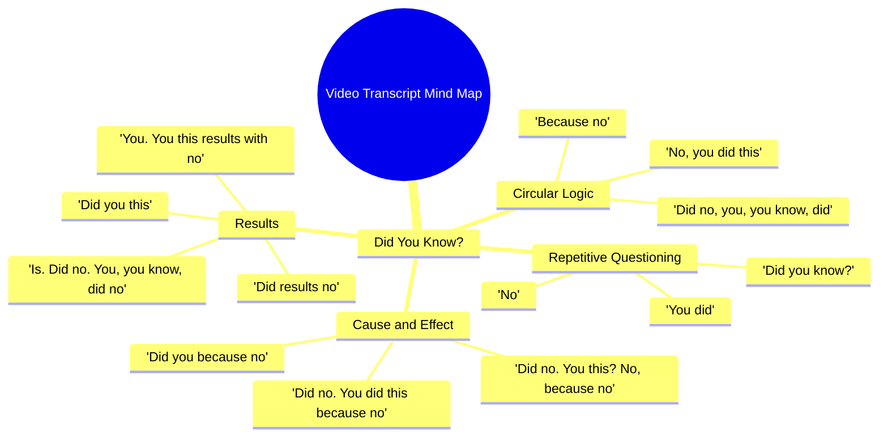

# Aceh Floods Reach Unimaginable Heights on December 6

> 🌐 **Read this in:** [English](../../en/2026-05/tiktok-transcript-6-december-25-aceh-taming-can-not-imagine-this-high-of-the-f-f7b4.md) · **中文**

> **Creator:** [@lux.fact](https://www.tiktok.com/@lux.fact) · **Views:** 1.7M · **Posted:** 2026-05-24 · **Niche:** other
>
> **TL;DR:** The hook starts with a common question but immediately contradicts it, creating confusion and curiosity.

[Watch original video →](https://vm.tiktok.com/ZNRnCnpVP/)

## Why This Went Viral

## 钩子（前3秒）
- **逐字开场白：**“你知道吗？不。你做了。不，你，你，知道，做了。不，你做了这是因为不。”
- **钩子模式：荒诞/逻辑断裂**——一种刻意的、令人困惑的循环，模仿卡顿或口吃。
- **为何能阻止滑动：**大脑检测到异常。观众期待一个正常的“你知道吗？”事实，却得到一句破碎、循环的句子。认知失调迫使观众重看或暂停以解码这无意义的内容。

## 情绪节奏
- **节拍1 – 好奇（0–1秒）：**“你知道吗？”触发熟悉模式（期待一个事实）。
- **节拍2 – 困惑/紧张（1–3秒）：**句子碎裂成片段（“不。你做了。不，你……”）。观众感到不安。
- **节拍3 – 挫败/悬念（3–6秒）：**循环略有变化地重复。大脑试图寻找意义但失败。
- **节拍4 – 解脱/荒诞（6–8秒）：**短语“结果与不”出现。感觉像一句笑点，尽管仍是胡言乱语。
- **节拍5 – 高潮/释放（8–10秒）：**最后一句“你做了这个？”最为破碎。观众要么笑出声，要么放弃——两者都是情绪释放。
- **高潮时刻：**最后2秒，循环崩塌为纯粹胡话（“不。你。你这些结果与不。”）。

## 关键词密度
| 词/短语 | 计数（约） | 作用 |
|---------|-----------|------|
| **“做”** | 8 | 算法覆盖（高频、短词、易于加字幕）。 |
| **“不”** | 7 | 情感牵引——否定制造紧张和困惑。 |
| **“你”** | 6 | 直接称呼——模仿互动诱饵，即使破碎。 |
| **“知道”** | 2 | 钩住“你知道吗？”模式（高分享性）。 |
| **“结果”** | 2 | 暗示有回报，尽管是假的——让观众继续观看。 |
| **“这个”** | 3 | 模糊代词——迫使大脑填补空白（互动循环）。 |

- **算法驱动因素：**“做”、“不”、“你”——短小重复的词，字幕系统和搜索机器人容易索引。
- **情感驱动因素：**“不”、“结果”——持续的否定和虚假的结论承诺让观众处于未解决的紧张状态。

## 为何能传播
1. **“大脑宕机”效应**——这段文字完美模仿了语言卡顿或AI故障。观众分享它，因为感觉像共同的内梗：“这就是我凌晨3点大脑的声音。”*证据：*整段文字只是“不你做这个”的循环——没有实际信息，只有模式失败。
2. **强制重看循环**——前3秒如此令人困惑，大多数观众至少看两遍试图理解。这瞬间加倍观看时长。*证据：*开场“你知道吗？不。你做了。”是一个需要解码的悖论。
3. **通过困惑引发评论**——观众涌入评论区：“我刚才看了什么？”或“这是故障吗？”视频设计为不可理解，从而产生高评论互动。*证据：*“你做了这个？”这句话语法上不可能——迫使观众脑中产生疑问。
4. **低门槛模仿**——任何人都可以录下自己结巴地说“你知道吗？不。你做了。”——这种形式零成本、零技能，作为梗模板高度可分享。*证据：*文字只是5个词重新排列。没有信息，没有制作价值。

## 你可以借鉴的
1. **使用“断裂循环”钩子**——以正常模式开始视频（如“你知道吗？”），然后立即打破为口吃或循环。这迫使大脑停顿并重看。
2. **为困惑设计，而非清晰**——如果目标是病毒式传播，有时最好的钩子是毫无意义的。观众分享令人困惑的内容是为了问朋友“这是什么意思？”——这是社交货币。
3. **以崩塌结尾**——这个视频的高潮是最破碎的句子（“你做了这个？”）。以最大荒诞或不完整时刻结束你的短视频——这会引发“等等，什么？”的反应，推动评论和分享。

## Mind Map

## Full Transcript (Generated by [免费 TikTok 文稿生成器](https://toktranscript.com/?utm_source=github&utm_medium=breakdown&utm_campaign=tool_attribution))

> 📝 Transcripts on this page are auto-generated and show the first 60%. Want to transcribe any TikTok in 30 seconds and get the full version? [Try TokTranscript free →](https://toktranscript.com/?utm_source=github&utm_medium=breakdown&utm_campaign=transcript_cta)

Did you know? No. You did. Did no, you, you know, did. No, you did this is because no. Did. No. You did this because no. Did no. You this? No, because no. Did yo

*[Read the full transcript on TokTranscript →](https://toktranscript.com/plaza/tiktok-transcript-6-december-25-aceh-taming-can-not-imagine-this-high-of-the-f-f7b4?utm_source=github&utm_medium=breakdown&utm_campaign=transcript_full)*

## Browse More

- All [other](../../by-niche/zh-CN/other.md) breakdowns
- All [Question-Answer Mismatch](../../by-pattern/zh-CN/hook-question-answer-mismatch.md) examples

## Video Info

| | |
|---|---|
| Creator | [@lux.fact](https://www.tiktok.com/@lux.fact) |
| Original video | [https://vm.tiktok.com/ZNRnCnpVP/](https://vm.tiktok.com/ZNRnCnpVP/) |
| Original title | 6 December 25 Aceh Taming 🥀can not imagine this high of the floods as... |
| Views | 1.7M (1700000) |
| Posted | 2026-05-24 |
| Duration | 0s |
| Niche | `other` |
| Hook pattern | `Question-Answer Mismatch` |
| Original language | `en` (this page translated by AI) |
| Available languages | en, zh-CN |
| Generated | 2026-05-25 by [TokTranscript](https://toktranscript.com/) |

---

*This breakdown is for educational analysis under fair use. Original video © [@lux.fact](https://www.tiktok.com/@lux.fact). All transcripts are auto-generated and may contain errors.*

*Want to analyze your own TikToks like this? [TokTranscript →](https://toktranscript.com/viral-breakdown?utm_source=github&utm_medium=breakdown&utm_campaign=footer_cta)*