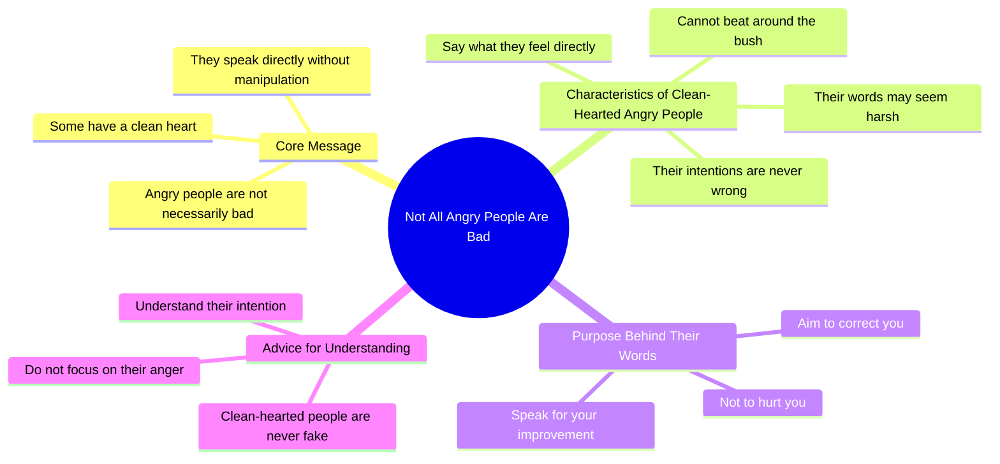

# Not Everyone Who Gets Angry Is Bad

> 🌐 **Read this in:** [English](../../en/2026-05/tiktok-transcript-984k-views-453k-reactions-trendingreels-reelitfeelit-hindire-eb72.md) · **中文**

> **Creator:** [@crowdworkmaayra ](https://www.tiktok.com/@crowdworkmaayra ) · **Views:** 9.1M · **Posted:** 2026-05-30 · **Niche:** other
>
> **TL;DR:** Challenges a common negative assumption about angry people by revealing a hidden positive trait.

[Watch original video →](https://www.facebook.com/share/r/1Ly8HAyAvA/?mibextid=wwXIfr)

## Why This Went Viral

## 钩子（前3秒）
- **逐字开场白：** "हर गुस्सा करने वाला इंसान बुरा नहीं होता"（每个生气的人都不坏）
- **钩子模式：** 大胆断言 + 对比（生气 ≠ 坏）
- **为何能让人停下：** 它颠覆了人们对愤怒的普遍负面假设。那些自认"脾气不好但心地善良"的观众瞬间感到被理解，而习惯评判愤怒者的人则感到被挑战——两种反应都迫使他们暂停。

## 情感节奏
1. **好奇 + 认同**（0–3秒）：愤怒不等于坏的主张，让所有曾感到被误解的人产生好奇。
2. **张力**（3–8秒）："有些人虽然生气，但内心纯净……他们不会拐弯抹角"——为直率的人建立共情。
3. **共鸣**（8–12秒）："他们直接说出感受，所以话语显得刺耳"——直来直去的观众会感到被精准描述。
4. **转折/高潮**（12–15秒）："他们说话不是为了伤害你，而是为了纠正你"——将愤怒重新定义为关心，形成情感转折点。
5. **收束**（15–18秒）："不要看他们的愤怒，要理解他们的意图"——给出令人难忘、值得引用的道理。
6. **最终共鸣**（18–20秒）："内心纯净的人从不虚伪"——以坚定有力的肯定句收尾。

## 关键词密度
| 关键词/短语 | 出现次数（约） | 驱动因素 |
|---|---|---|
| गुस्सा / गुस्से（愤怒/生气的） | 4 | 算法驱动——高搜索量的情感关键词 |
| दिल का साफ（内心纯净） | 3 | 情感驱动——定义核心身份 |
| नियत（意图） | 2 | 情感驱动——重构评判 |
| बोलते / बोल देते（直接说/说出来） | 2 | 情感驱动——引发共鸣的特质 |
| बुरा / बुरी（坏） | 2 | 对比钩子——算法+情感驱动 |
| सच（真相） | 1 | 情感驱动——权威信号 |
| फेक（虚伪） | 1 | 情感驱动——现代俚语，高共鸣 |

**算法驱动因素：** "गुस्सा"和"बुरा"是高搜索量的印地语关键词。**情感驱动因素：** "दिल का साफ"和"नियत"创造基于身份的共鸣，激发评论和分享。

## 为何能广泛传播
1. **为被误解群体提供身份认同**——"有些生气的人内心纯净"直接验证了直率、脾气急躁者的自我形象。他们将其作为个人标签分享。
2. **重构创造可教时刻**——"不要看他们的愤怒，要理解他们的意图"将常见缺点转化为美德。观众将其作为"智慧"分享给他人，让自己显得有洞察力。
3. **普遍的人际关系冲突钩子**——几乎每个人都认识一个曾被自己评判为"只是脾气差"的人。视频提供了新视角，引发朋友群和家庭聊天中的分享。
4. **简短、有节奏、可引用的结构**——像"जो दिल का साफ होता है वो फेक नहीं होता"这样的句子易于记忆，可被转发为状态或标题。
5. **20秒内的高情感反差**——在不到20秒内从"愤怒是坏的"转向"愤怒是爱"。这种情感冲击使其更令人难忘、更值得分享。

## 你可以借鉴的
1. **将负面特质转化为美德**——选择一个普遍不受欢迎的行为（固执、害羞、过度思考），将其重新定义为隐藏的优势。对比钩子之所以有效，是因为它挑战了现有信念。
2. **用一句像谚语的话收尾**——最后一句"जो दिल का साफ होता है वो फेक नहीं होता"简单、押韵、可引用。设计一句能用作WhatsApp状态的收尾语。
3. **使用"你"的语言创造个人关联**——整个脚本都在对"你"说话（你的意图、你的愤怒、你的内心）。这让观众感觉视频在直接对他们说话，从而提高互动率和收藏量。

## Mind Map

## Full Transcript (Generated by [TikTok 转录工具](https://toktranscript.com/?utm_source=github&utm_medium=breakdown&utm_campaign=tool_attribution))

> 📝 Transcripts on this page are auto-generated and show the first 60%. Want to transcribe any TikTok in 30 seconds and get the full version? [Try TokTranscript free →](https://toktranscript.com/?utm_source=github&utm_medium=breakdown&utm_campaign=transcript_cta)

हर गुष्सा करने वाला इंसान बुरा नहीं होता कुछ लोग गुष्से वाले जरूर होते हैμं पर दिल के बहुत साफ होते हैं उन्हें बाते गुमा फिरा करना नहीं आता जो महसूस करते हैं सीधा बोल देते हैं इसलिए उनकी बाते बुरी लग जाती हैं पर सच ये है उनकी नियत कभी गल

*[Read the full transcript on TokTranscript →](https://toktranscript.com/plaza/tiktok-transcript-984k-views-453k-reactions-trendingreels-reelitfeelit-hindire-eb72?utm_source=github&utm_medium=breakdown&utm_campaign=transcript_full)*

## Browse More

- All [other](../../by-niche/zh-CN/other.md) breakdowns
- All [Contrasting Assumption](../../by-pattern/zh-CN/hook-contrasting-assumption.md) examples

## Video Info

| | |
|---|---|
| Creator | [@crowdworkmaayra ](https://www.tiktok.com/@crowdworkmaayra ) |
| Original video | [https://www.facebook.com/share/r/1Ly8HAyAvA/?mibextid=wwXIfr](https://www.facebook.com/share/r/1Ly8HAyAvA/?mibextid=wwXIfr) |
| Original title | 984K views · 453K reactions | “जो सीधा बोलता है… वो गलत नहीं होता…” #trendingreels #reelitfeelit #hindireels #emotionalreels #lifetruth | crowdworkmaayra |
| Views | 9.1M (9054945) |
| Posted | 2026-05-30 |
| Duration | 0s |
| Niche | `other` |
| Hook pattern | `Contrasting Assumption` |
| Original language | `en` (this page translated by AI) |
| Available languages | en, zh-CN |
| Generated | 2026-05-31 by [TokTranscript](https://toktranscript.com/) |

---

*This breakdown is for educational analysis under fair use. Original video © [@crowdworkmaayra ](https://www.tiktok.com/@crowdworkmaayra ). All transcripts are auto-generated and may contain errors.*

*Want to analyze your own TikToks like this? [免费 TikTok 文稿生成器 →](https://toktranscript.com/viral-breakdown?utm_source=github&utm_medium=breakdown&utm_campaign=footer_cta)*