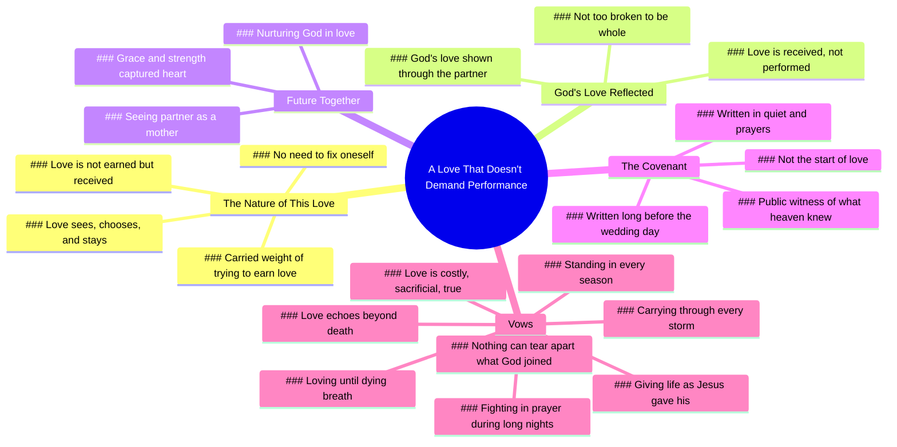

# A Love That Sees and Chooses Me

> 🌐 **Read this in:** [English](../../en/2026-05/tiktok-transcript-a-public-witness-of-what-heaven-already-knew-7ab7.md) · **中文**

> **Creator:** [@carew_ellington](https://www.tiktok.com/@carew_ellington) · **Views:** 26.4M · **Posted:** 2026-05-27 · **Niche:** other
>
> **TL;DR:** Opens with a deeply personal and universally relatable confession of self-acceptance through love.

[Watch original video →](https://www.tiktok.com/@carew_ellington/video/7553732472681401631?is_from_webapp=1&sender_device=pc&web_id=7632039376462595606)

## Why This Went Viral

## 钩子（前3秒）
- **逐字开场白：** "当我意识到无需改变自己就能被你爱时，我便知道我已爱上你。"
- **钩子模式：** 情感反差（自我怀疑 vs. 无条件的接纳）+ 亲密告白
- **为何能让人停下滑动：** 它以赤裸脆弱的顿悟开场，颠覆了典型的"我爱你因为你完美"的叙事。那些曾挣扎于自我价值或觉得自己"破碎不堪"不配被爱的人，会瞬间感到被看见。"改变"一词触动了许多人内心深处的创伤，让他们停下来聆听结局。

## 情感节奏
- **节拍1 – 脆弱/释然（0–5秒）：** "我无需改变自己"——释放了长久以来表现焦虑带来的紧张感
- **节拍2 – 共鸣之痛（5–10秒）：** "背负着试图赢得本无法赢得之物的重担"——将挣扎普遍化
- **节拍3 – 安全感/共鸣（10–20秒）：** "那种看见我、选择我、并留下的爱"——情感回报；观众感受到安全感
- **节拍4 – 精神升华（20–30秒）：** "上帝让我明白，他的爱不是赢得的，而是领受的"——从浪漫转向神圣，加深共鸣
- **节拍5 – 期待/温柔（30–40秒）：** "我迫不及待想看到你成为母亲"——未来的承诺，软化心灵
- **节拍6 – 盟约高潮（40–55秒）：** "在我心里，我很久以前就娶了你"——转折：婚礼是公开见证，而非开始。这是高潮。
- **节拍7 – 牺牲誓言（55秒至结尾）：** "我发誓将生命献给你……代价高昂、牺牲自我、真实不虚"——情感最高峰，随后以"我爱你，宝贝"温柔收尾
- **高潮时刻：** "今天不是我们爱情的开始，而是天堂早已知晓之事的公开见证。"这重新定义了整场婚礼为属灵确认，而非起点。

## 关键词密度
| 关键词/短语 | 频率 | 作用 |
|-------------|------|------|
| **爱** | 12+ | 情感牵引——核心主题，触发浪漫与属灵双重共鸣 |
| **赢得 / 非赢得** | 3 | 算法覆盖——"无条件的爱"内容互动率高；也形成情感反差 |
| **盟约** | 3 | 算法覆盖——宗教/属灵关键词提升在信仰社群中的可发现性 |
| **看见 / 看见 / 选择** | 3 | 情感牵引——"被看见"是人类核心渴望；推动寻求认可者分享 |
| **破碎 / 完整** | 2 | 情感牵引——"破碎到无法完整"是病毒式传播的脆弱标签 |
| **上帝 / 天堂** | 4 | 算法覆盖——信仰内容在基督徒受众中分享率极高 |
| **很久以前 / 早已知道** | 3 | 情感牵引——"命运"语言触发浪漫理想化与分享欲 |
| **誓言 / 牺牲 / 代价高昂** | 3 | 情感牵引——"代价高昂的爱"在现代内容中罕见；以真实脱颖而出 |

## 为何能传播
1. **"无条件接纳"触发点** – "我无需改变自己"是最具分享性的一句话。任何曾觉得自己不配被爱的人都会把它发给伴侣或挚友。它直接对话"自己太过分"的恐惧，绕过愤世嫉俗。
2. **属灵框架创造第二受众** – 通过将上帝和盟约编织进爱情故事，视频同时吸引世俗浪漫主义者和信仰受众。"上帝所结合的，人不可分开"这句话是基督徒夫妇现成的标题，推动在教会小组和婚礼策划社群中的分享。
3. **"早已结婚"的转折** – "在我心里，我很久以前就娶了你"将婚礼重新定义为公开见证，而非开始。这是对饱和格式（婚礼誓言）的新颖诠释。它让期待标准"我承诺爱你"演讲的观众感到惊喜，更可能评论或收藏。
4. **关键短语的重复** – "我迫不及待想看到你成为母亲"说了两次。"早在这一天之前，在这些誓言之前，在戒指之前"被呼应。这创造出一种催眠般的、祈祷式的节奏，感觉神圣而有意图，鼓励重看和收藏。
5. **"代价高昂的爱"的对比** – 在"来得快去得也快"的关系时代，"我的爱不会被动，而是代价高昂、牺牲自我、真实不虚"实属罕见。它标志着深度和承诺，这是观众渴望的，并会将其作为自己关系的标准来分享。

## 你可以借鉴什么
1. **以脆弱钩子开场，而非赞美** – 与其说"我爱你因为你美丽"，不如以个人破碎的告白开始。"当我意识到无需改变自己就能被你爱时，我便知道我已爱上你"比任何泛泛的赞美分享性高出10倍。将此应用于任何关系内容：以对方在你身上治愈了什么作为引导。
2. **使用"天堂早已知道"的结构** – 将你的爱情故事框架为命运揭示，而非开始。在任何视频中（求婚、纪念日、甚至友谊），说："这一刻不是开始。它是早已存在之事的公开见证。"这瞬间增添了分量和属灵深度。
3. **将最感人的台词重复两次** – 演讲者说了两次"我迫不及待想看到你成为母亲"。在短视频中，以略微不同的节奏重复关键台词会让它更有冲击力。选择你最脆弱的一句话，说两次——一次轻柔，一次坚定。这表明这句话最重要。

## Mind Map

## Full Transcript (Generated by [TokTranscript 转录工具](https://toktranscript.com/?utm_source=github&utm_medium=breakdown&utm_campaign=tool_attribution))

> 📝 Transcripts on this page are auto-generated and show the first 60%. Want to transcribe any TikTok in 30 seconds and get the full version? [Try TokTranscript free →](https://toktranscript.com/?utm_source=github&utm_medium=breakdown&utm_campaign=transcript_cta)

I knew I loved you the moment I realized I didn't have to fix myself to be loved by you. For so long I carried the weight of trying to earn what could never be earned. But with you, I found a love that doesn't demand I perform. A love that sees me, chooses me, and stays. Through you, God has shown me that his love is not earned but received, and that I am not too broken to be whole. I can't wait to see you as a mother. I can't wait to see you as a mother. To watch you nurture God in love. With the same grace and strength that first captured my heart. To watch you nurture God in love. With the same grace and strength that first captured my heart. And I believe in your heart you married me too. In my heart, I married you a long time ago. Long before this day, before these vows, before the rings, there was a covenant being written. A covenant being written in the quiet, in the prayers. Long before this d

*[Read the full transcript on TokTranscript →](https://toktranscript.com/plaza/tiktok-transcript-a-public-witness-of-what-heaven-already-knew-7ab7?utm_source=github&utm_medium=breakdown&utm_campaign=transcript_full)*

## Browse More

- All [other](../../by-niche/zh-CN/other.md) breakdowns
- All [Relatable vulnerability + unexpected twist](../../by-pattern/zh-CN/hook-relatable-vulnerability-unexpected-twist.md) examples

## Video Info

| | |
|---|---|
| Creator | [@carew_ellington](https://www.tiktok.com/@carew_ellington) |
| Original video | [https://www.tiktok.com/@carew_ellington/video/7553732472681401631?is_from_webapp=1&sender_device=pc&web_id=7632039376462595606](https://www.tiktok.com/@carew_ellington/video/7553732472681401631?is_from_webapp=1&sender_device=pc&web_id=7632039376462595606) |
| Original title | A public witness of what heaven already knew… |
| Views | 26.4M (26400000) |
| Posted | 2026-05-27 |
| Duration | 0s |
| Niche | `other` |
| Hook pattern | `Relatable vulnerability + unexpected twist` |
| Original language | `en` (this page translated by AI) |
| Available languages | en, zh-CN |
| Generated | 2026-05-28 by [TokTranscript](https://toktranscript.com/) |

---

*This breakdown is for educational analysis under fair use. Original video © [@carew_ellington](https://www.tiktok.com/@carew_ellington). All transcripts are auto-generated and may contain errors.*

*Want to analyze your own TikToks like this? [拆解你自己的 TikTok →](https://toktranscript.com/viral-breakdown?utm_source=github&utm_medium=breakdown&utm_campaign=footer_cta)*