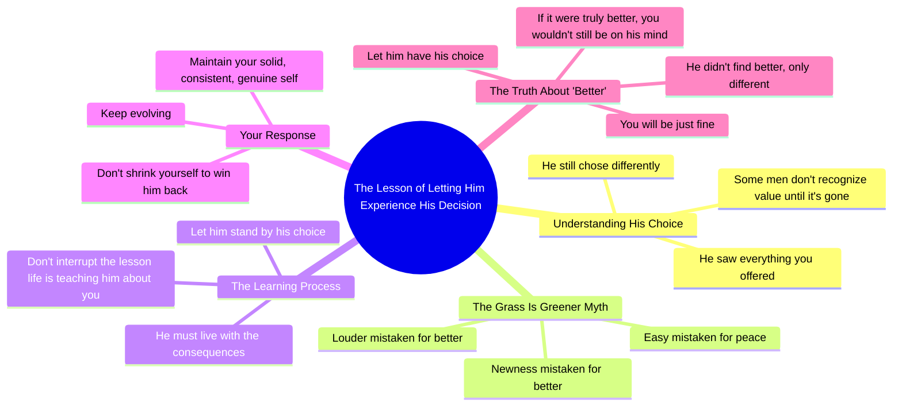

# Let Him Fully Experience That Decision

> 🌐 **Read this in:** [English](../../en/2026-05/tiktok-transcript-baby-let-him-experience-that-decision-fully-nopryorwarning-a115.md) · **中文**

> **Creator:** [@thearielpryor](https://www.tiktok.com/@thearielpryor) · **Views:** 6.3M · **Posted:** 2026-05-25 · **Niche:** other
>
> **TL;DR:** Poses a relatable scenario and immediately offers a counterintuitive action, creating curiosity.

[Watch original video →](https://www.tiktok.com/@thearielpryor/video/7616817814384446750?is_from_webapp=1&sender_device=pc&web_id=7569766293202830868)

## Why This Went Viral

## 钩子（前3秒）
- **逐字开场白：** "如果他审视了你带来的一切，却仍然选择了不同，那就让他彻底体验那个决定。"
- **钩子模式：** 大胆断言 + 直接称呼（"你"）+ 隐含对比（你带来的 vs. 他选择的）
- **为何能让人停下滑动：** 它用一句话点出了痛苦而普遍的经历（在关系中不被重视），瞬间引发情感共鸣。"让他彻底体验那个决定"这句话听起来像是一种许可，而非建议——从而触发"再多说点"的反应。

## 情感节奏
- **节拍1（0–3秒）：** 认可——"如果他审视了你带来的一切……"——观众感到被看见。
- **节拍2（3–8秒）：** 紧张——"有些男人直到失去才懂得价值"——引入冲突。
- **节拍3（8–15秒）：** 释放挫败感——"他们以为 louder 就是更好…… easier 就是平静"——点明对方的错误逻辑。
- **节拍4（15–20秒）：** 升华的智慧——"不要打断上帝正在教给某人的关于你的那一课"——精神/权威性的转折。
- **节拍5（20–28秒）：** 赋权转变——"让他坚持那个选择。与此同时，你继续进化。"——将痛苦转化为主动权。
- **高潮（28–34秒）：** 反转——"他没有找到更好的。他找到了不同的。"——重新定义整个叙事，带来令人满足的"麦克风掉落"时刻。

## 关键词密度
| 关键词/短语 | 频率 | 功能 |
|---|---|---|
| "更好" | 4次 | 算法驱动（对比关键词）+ 情感驱动（核心痛点） |
| "不同" | 3次 | 算法驱动（区分关键词）+ 情感驱动（重新定义） |
| "让他" | 3次 | 情感驱动——给予许可、抽离 |
| "价值" | 2次 | 情感驱动——核心自我价值概念 |
| "进化 / 不断进化" | 2次 | 情感驱动 + 志向驱动——成长心态 |
| "你没有失去" | 1次 | 病毒式金句——绝对断言 |
| "一课" | 1次 | 算法驱动（智慧内容）+ 情感驱动 |

- **算法驱动因素：** "更好"、"不同"、"一课"——这些都是平台会推送的高搜索量关系类词汇。
- **情感驱动因素：** "让他"、"价值"、"进化"——这些触发身份认同和分享欲（观众会标记那些"需要听到这个"的朋友）。

## 为何能传播
1. **重新定义的反转具有分享性。** "他没有找到更好的。他找到了不同的。"这句话本身就是一句病毒式金句——观众会截图、转发或发给朋友。它将痛苦的叙事翻转成一种力量之举。
2. **给予许可的语言推动互动。** "让他彻底体验那个决定"和"让他坚持那个选择"听起来像教练在允许你停止追逐。这会触发诸如"我需要听到这个"的评论和收藏。
3. **精神权威建立信任。** "上帝正在教给某人的关于你的那一课"增加了更高层次的框架。这让建议显得无可辩驳，增加了在信仰社群中分享的可能性。
4. **"你没有失去"的绝对断言引发讨论。** "如果你坚定、一致、真诚，你在这种情况下不会失去"这一说法故意带有挑衅性——一些观众会在评论中反驳，从而推动算法。
5. **普遍痛点 + 具体敌人。** 视频点名了一个具体的"他"（那个低估你的男人），但没有过度性别化，使其对任何感到被拒绝的人都具有共鸣。敌人明确，因此建议显得有针对性。

## 你可以借鉴什么
1. **"重新定义"结构。** 将一个常见的痛苦信念（例如"我不够好"）翻转成赋权的真相（"你不是错误的选择——你是不同的选择"）。这创造了一种可分享的思维转变。
2. **给予许可的措辞。** 与其说"你应该离开他"，不如说"让他彻底体验那个决定"。"让他"的框架消除了压力，让观众感到掌控感。
3. **"上帝的一课"权威层。** 如果你的领域允许，在中间部分加入一句精神或普遍智慧的句子。它将内容从"观点"提升到"真理"，并增加基于信任的收藏和分享。

## Mind Map

## Full Transcript (Generated by [免费 TikTok 文稿生成器](https://toktranscript.com/?utm_source=github&utm_medium=breakdown&utm_campaign=tool_attribution))

> 📝 Transcripts on this page are auto-generated and show the first 60%. Want to transcribe any TikTok in 30 seconds and get the full version? [Try TokTranscript free →](https://toktranscript.com/?utm_source=github&utm_medium=breakdown&utm_campaign=transcript_cta)

If he looked at everything you brought to the table and still chose different, let him experience that decision fully. Some men don't understand value until they lose it. They think the grass is greener because it's new. They think louder means better. They think easy means peace. And sometimes the only way they learn is by living it. You don't interrupt the lesson that god is teaching somebody about you. If he thought she was better, okay, cool. Let him stand on that. Meanwh

*[Read the full transcript on TokTranscript →](https://toktranscript.com/plaza/tiktok-transcript-baby-let-him-experience-that-decision-fully-nopryorwarning-a115?utm_source=github&utm_medium=breakdown&utm_campaign=transcript_full)*

## Browse More

- All [other](../../by-niche/zh-CN/other.md) breakdowns
- All [Conditional Challenge](../../by-pattern/zh-CN/hook-conditional-challenge.md) examples

## Video Info

| | |
|---|---|
| Creator | [@thearielpryor](https://www.tiktok.com/@thearielpryor) |
| Original video | [https://www.tiktok.com/@thearielpryor/video/7616817814384446750?is_from_webapp=1&sender_device=pc&web_id=7569766293202830868](https://www.tiktok.com/@thearielpryor/video/7616817814384446750?is_from_webapp=1&sender_device=pc&web_id=7569766293202830868) |
| Original title | Baby let him experience that decision fully ! @Nopryorwarning  |
| Views | 6.3M (6300000) |
| Posted | 2026-05-25 |
| Duration | 0s |
| Niche | `other` |
| Hook pattern | `Conditional Challenge` |
| Original language | `en` (this page translated by AI) |
| Available languages | en, zh-CN |
| Generated | 2026-05-26 by [TokTranscript](https://toktranscript.com/) |

---

*This breakdown is for educational analysis under fair use. Original video © [@thearielpryor](https://www.tiktok.com/@thearielpryor). All transcripts are auto-generated and may contain errors.*

*Want to analyze your own TikToks like this? [TokTranscript 转录工具 →](https://toktranscript.com/viral-breakdown?utm_source=github&utm_medium=breakdown&utm_campaign=footer_cta)*