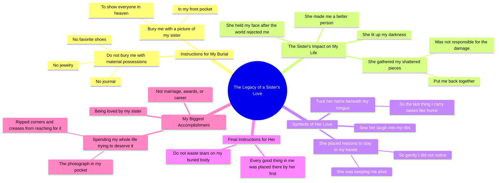

# Bury Me With a Picture of My Sister in My Front Pocket

> 🌐 **Read this in:** [English](../../en/2026-05/tiktok-transcript-bury-me-with-a-picture-of-my-sister-in-my-front-pocket-inspo-4ad4.md) · **中文**

> **Creator:** [@hayleygracepoetry](https://www.tiktok.com/@hayleygracepoetry) · **Views:** 3.2M · **Posted:** 2026-05-29 · **Niche:** entertainment
>
> **TL;DR:** The hook subverts expectations by listing typical sentimental items then immediately rejecting them, creating curiosity.

[Watch original video →](https://www.tiktok.com/t/ZP8pwYdpY/)

## Why This Went Viral

## 钩子（前3秒）
- **逐字开场白：**“当我死时，不要将我与我的珠宝、日记或我最爱的鞋子一同埋葬。”
- **钩子模式：** **对比**（拒绝预期中的情感物品）+ **场景设定**（以死亡作为叙事框架）
- **为何能阻止滑动：** 突兀、病态的前提（“当我死时”）加上对典型纪念品的意外拒绝（“珠宝……日记……鞋子”），立即引发好奇。观众的大脑会停顿：*那他们想要什么？* 这种空白迫使观众多停留一秒。

## 情感节奏
- **节拍1 — 好奇 + 紧张：** “当我死时，不要将我与……”（观众身体前倾，感到困惑）
- **节拍2 — 情感锚点（共鸣）：** “……将一张我姐姐的照片放在我前胸口袋”（具体、个人化、可共鸣的兄弟姐妹纽带）
- **节拍3 — 感官亲密：** “将她的笑声原声缝入……将她的名字藏于我的舌下”（发自肺腑、诗意，将陈述提升为感受）
- **节拍4 — 脆弱 + 痛苦：** “在世界早已将我唾弃之后，她用双手捧起我的脸”（共同创伤，暗示黑暗背景故事）
- **节拍5 — 救赎：** “她拾起我每一片破碎的碎片，将我重新拼凑完整”（情感回报）
- **节拍6 — 转折/高潮：** “告诉她不必为那具被埋葬的身体浪费眼泪——因为人们曾爱我的所有美好，都是她先放置在那里的”（反转：说话者将整个身份归功于她）
- **节拍7 — 最终情感冲击（共鸣 + 解决）：** “我最大的成就是被姐姐爱着，并用一生去努力配得上这份爱”（谦逊、励志、催人泪下）

## 关键词密度
| 词语/短语 | 频率（约） | 算法覆盖驱动 | 情感拉动驱动 |
|-------------|---------------------|--------------------------|------------------------|
| **姐姐** | 6 | 高（可共鸣的家庭关键词） | 高（核心情感锚点） |
| **死 / 死去 / 埋葬 / 大地 / 天堂** | 8 | 高（死亡 = 高参与度） | 高（普遍、严肃基调） |
| **我 / 我的** | 20+ | 低（通用） | 高（个人化、忏悔式） |
| **告诉他们 / 告诉她** | 6 | 中（直接称呼 = 可分享性） | 高（创造亲密感，听众感觉被对话） |
| **爱 / 被爱** | 4 | 高（爱 = 永恒情感关键词） | 高（核心主题） |
| **成就** | 2 | 中（自我提升细分领域） | 高（对比物质与关系成功） |
| **家 / 尝起来像家** | 1 | 低（诗意，不可搜索） | 高（感官、怀旧） |
| **破碎 / 损坏 / 伤害** | 3 | 中（心理健康细分领域） | 高（脆弱、共同痛苦） |

**关键洞察：** “姐姐” + “死/埋葬/天堂” + “爱” 构成了病毒式传播的三要素——家庭 + 死亡 + 爱。这三个集群在算法上具有优势（高分享率、高评论可能性），且情感上极具感染力。

## 为何能传播
1. **伪装成个人诗歌的普遍情感钩子。** 这段文字读起来像是对兄弟姐妹的悼词，但情感如此具体，以至于显得普遍。任何有亲密兄弟姐妹（或希望有）的人都会立即分享。*具体台词：* “她拾起我每一片破碎的碎片，将我重新拼凑完整。”
2. **转折颠覆了预期叙事。** 大多数“当我死时”的内容都关于说话者自己的生活。在这里，说话者将全部美好归功于姐姐。这种反转令人惊讶且难忘——它迫使观众重看。*具体台词：* “人们曾爱我的所有美好，都是她先放置在那里的。”
3. **高情感投入 + 低评论门槛。** 这首诗邀请人们标记自己的兄弟姐妹。评论区充斥着“@你的姐姐”或“我哭了”。这推动了参与信号。*具体台词：* “让我指向口袋里那张皱巴巴的照片……让我说我最大的成就是被姐姐爱着。”
4. **诗意节奏 + 短视频节奏。** 这段文字使用了重复（“告诉他们……告诉他们……告诉她……”）和短小精悍的从句。这完美适用于TikTok/Reels——每一行都可以是一个新的视觉剪辑，保持高留存率。*具体台词：* “告诉他们，在我已将自己判入黑暗之后，是她为我点亮了世界。”
5. **死亡 + 感恩 = 可分享的悲伤。** 以感恩（而非绝望）结尾的关于死亡的视频被分享为“治愈内容”。人们将其发送给正在经历失去的朋友。*具体台词：* “告诉她不必为那具被埋葬的身体浪费眼泪。”

## 你可以借鉴什么
1. **“拒绝 + 替代”钩子模式。** 以拒绝一个常见期望开场（“不要将我与……一同埋葬”），然后立即提供一个令人惊讶的替代方案（“将一张我姐姐的照片与我一同埋葬”）。这种模式适用于任何主题：“不要告诉我冷静——告诉我你为什么生气。”
2. **“反向归功”情感转折。** 不要列出自己的成就，而是将成就归功于他人。这创造了谦逊和情感深度。在关于导师、伴侣或朋友的视频中，可以说：“我所有的成功都是他们先放置在那里的。”
3. **感官具体性作为情感粘合剂。** “将她的笑声原声缝入我的肋骨中央”——使用一个具体、略带超现实的感官细节（声音、气味、触觉）让抽象的情感变得真实。在你的下一个视频中，选择一个感官，通过它描述一个记忆。

## Mind Map

## Full Transcript (Generated by [TokTranscript](https://toktranscript.com/?utm_source=github&utm_medium=breakdown&utm_campaign=tool_attribution))

> 📝 Transcripts on this page are auto-generated and show the first 60%. Want to transcribe any TikTok in 30 seconds and get the full version? [Try TokTranscript free →](https://toktranscript.com/?utm_source=github&utm_medium=breakdown&utm_campaign=transcript_cta)

When I die, do not bury me with my jewelry or my journal or my favourite pair of shoes. When I die, bury me with a picture of my sister in my front pocket so I can show everyone in heaven who made me a better person. Sew the soundtrack of her laugh in the center of my ribs and tuck her name beneath my tongue so the last thing I carry with me can taste like home. Tell them this is the girl who held my face in her hands after the world had already spit me back out. Tell them she lit the world up for me after I had already condemned to the darkness. Tell them she gathered every shattered piece of me and put me back together, even when she wasn't responsible for the damage. Tell them she is the reason I had many tomorrows. Tell them she placed little reasons to stay into the palms of my hands so gently I did not even realise she was keeping me alive. And when they 

*[Read the full transcript on TokTranscript →](https://toktranscript.com/plaza/tiktok-transcript-bury-me-with-a-picture-of-my-sister-in-my-front-pocket-inspo-4ad4?utm_source=github&utm_medium=breakdown&utm_campaign=transcript_full)*

## Browse More

- All [entertainment](../../by-niche/zh-CN/entertainment.md) breakdowns
- All [Unexpected Reversal](../../by-pattern/zh-CN/hook-unexpected-reversal.md) examples

## Video Info

| | |
|---|---|
| Creator | [@hayleygracepoetry](https://www.tiktok.com/@hayleygracepoetry) |
| Original video | [https://www.tiktok.com/t/ZP8pwYdpY/](https://www.tiktok.com/t/ZP8pwYdpY/) |
| Original title | bury me with a picture of my sister in my front pocket…🌷🤍 inspo: @hea... |
| Views | 3.2M (3200000) |
| Posted | 2026-05-29 |
| Duration | 0s |
| Niche | `entertainment` |
| Hook pattern | `Unexpected Reversal` |
| Original language | `en` (this page translated by AI) |
| Available languages | en, zh-CN |
| Generated | 2026-05-30 by [TokTranscript](https://toktranscript.com/) |

---

*This breakdown is for educational analysis under fair use. Original video © [@hayleygracepoetry](https://www.tiktok.com/@hayleygracepoetry). All transcripts are auto-generated and may contain errors.*

*Want to analyze your own TikToks like this? [TikTok 转录工具 →](https://toktranscript.com/viral-breakdown?utm_source=github&utm_medium=breakdown&utm_campaign=footer_cta)*