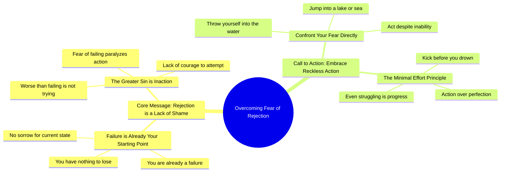

# ✨consejo de hoy✨

> 🌐 **Read this in:** [English](../../en/2026-05/tiktok-transcript-consejo-de-hoy-5a21.md) · **中文**

> **Creator:** [@locodelaselva504](https://www.tiktok.com/@locodelaselva504) · **Views:** 3.1M · **Posted:** 2026-05-22 · **Niche:** other
>
> **TL;DR:** Directly challenges the viewer's self-perception with an aggressive, unexpected twist.

[Watch original video →](https://vt.tiktok.com/ZSxUYptN4/)

## Why This Went Viral

## 钩子（前3秒）
- **逐字开场白：** "你对被拒绝的恐惧纯粹是缺乏羞耻感。"
- **钩子模式：** 大胆断言 + 侮辱（直接对抗）。
- **为何能阻止滑动：** "纯粹是缺乏羞耻感"这句话将一种常见的恐惧重新定义为性格缺陷。它出人意料、咄咄逼人，挑战了观众的自我认知——迫使人们立即产生"等等，什么？"的反应。

## 情感节奏
- **节拍1 – 震惊/对抗：** "你对被拒绝的恐惧纯粹是缺乏羞耻感。狗娘养的。" — 观众被猛然惊醒。
- **节拍2 – 矛盾/好奇：** "你没有悲伤吗？你因为害怕失败而什么都不做。" — 制造认知失调（恐惧 vs. 羞耻）。
- **节拍3 – 升级/侮辱：** "Cerote。Maje。Culero。" — 未经翻译的西班牙语脏话增添了真实感和紧张感。
- **节拍4 – 转折/重构：** "比失败更糟糕的是连尝试都不尝试。" — 从羞耻转向行动。
- **节拍5 – 高潮/命令：** "跳进水里，你这狗娘养的。跳进湖里。跳进海里。" — 冒险的隐喻，以暴力的命令形式呈现。
- **节拍6 – 解决/解脱：** "即使你不会游泳，但至少在你淹死之前，你会拼命蹬腿。土豆。" — 黑色幽默（"土豆"）释放了紧张感，使信息令人难忘。

## 关键词密度
- **"恐惧" / "害怕"** — 重复3次（通过高唤醒情绪推动算法覆盖）
- **"羞耻" / "缺乏羞耻感"** — 重复2次（情感吸引：将恐惧重新定义为弱点）
- **"失败" / "失败"** — 重复3次（算法覆盖 + 普遍痛点）
- **"跳进"** — 重复3次（行动号召，高记忆度）
- **"狗娘养的" / "Culero" / "Cerote"** — 重复4次（情感吸引：震惊、真实、原始）
- **"没什么可失去的"** — 重复2次（情感吸引：将风险重新定义为自由）
- **"蹬腿" / "土豆"** — 重复2次（情感吸引：荒诞幽默，让隐喻深入人心）

## 为何能传播
1. **对普遍痛点的激进重构** — "你对被拒绝的恐惧纯粹是缺乏羞耻感"将一种常见的恐惧翻转成道德缺陷。观众分享它，因为它感觉像是一个他们需要听到的真相（或一记警钟）。
2. **语码转换 + 原始语言** — 西班牙语脏话（"Cerote。Maje。Culero。"）和英语的混合创造了真实感，并发出"无过滤"的信号。这引发了更高的参与度（评论、收藏、分享），因为它感觉真实，而非照本宣科。
3. **高潮隐喻 + 荒诞转折** — "跳进水里……即使你不会游泳，但至少在你淹死之前，你会拼命蹬腿。土豆。" 出人意料的"土豆"使这个隐喻变得粘性十足且易于分享——既暴力又有趣。
4. **高唤醒情绪过山车** — 震惊 → 侮辱 → 重构 → 命令 → 黑色幽默。这个序列让观众一直看到最后（高留存率），从而触发算法进一步推广。
5. **嵌入侮辱中的直接行动号召** — "Hartate。你妈。跳进水里。" 这个命令让人无法忽视。它迫使观众做出反应（评论、收藏或重看）——这些都是病毒式传播的信号。

## 你可以借鉴什么
1. **以重构而非问题开场。** 不要说"你害怕被拒绝吗？"而要说"你对被拒绝的恐惧纯粹是缺乏羞耻感。"大胆断言模式能立即吸引注意力。
2. **使用语码转换或原始语言来营造真实感。** 即使是一个未经翻译的词或母语中的轻微侮辱，也能发出"无过滤"的信号，并增强情感共鸣。
3. **以一个荒诞、令人难忘的隐喻结尾。** 不要只说"冒险"。要说"跳进水里，即使你不会游泳——至少你会拼命蹬腿。土豆。" 这个奇怪的细节让它深入人心。

## Mind Map

## Full Transcript (Generated by [TokTranscript 转录工具](https://toktranscript.com/?utm_source=github&utm_medium=breakdown&utm_campaign=tool_attribution))

> 📝 Transcripts on this page are auto-generated and show the first 60%. Want to transcribe any TikTok in 30 seconds and get the full version? [Try TokTranscript free →](https://toktranscript.com/?utm_source=github&utm_medium=breakdown&utm_campaign=transcript_cta)

Your fear of rejection is pure lack of shame. Son of a bitch. You have no sorrow? You do nothing for fear of failing. If you are already a failure. Cerote. Maje. You have nothing to lose. Culero. You don't have shit. Worse than failing is not even not trying. You haven't had the balls to try something. Hartate

*[Read the full transcript on TokTranscript →](https://toktranscript.com/plaza/tiktok-transcript-consejo-de-hoy-5a21?utm_source=github&utm_medium=breakdown&utm_campaign=transcript_full)*

## Browse More

- All [other](../../by-niche/zh-CN/other.md) breakdowns
- All [unknown](../../by-pattern/zh-CN/hook-unknown.md) examples

## Video Info

| | |
|---|---|
| Creator | [@locodelaselva504](https://www.tiktok.com/@locodelaselva504) |
| Original video | [https://vt.tiktok.com/ZSxUYptN4/](https://vt.tiktok.com/ZSxUYptN4/) |
| Views | 3.1M (3100000) |
| Posted | 2026-05-22 |
| Duration | 0s |
| Niche | `other` |
| Hook pattern | `unknown` |
| Original language | `en` (this page translated by AI) |
| Available languages | en, zh-CN |
| Generated | 2026-05-24 by [TokTranscript](https://toktranscript.com/) |

---

*This breakdown is for educational analysis under fair use. Original video © [@locodelaselva504](https://www.tiktok.com/@locodelaselva504). All transcripts are auto-generated and may contain errors.*

*Want to analyze your own TikToks like this? [TokTranscript →](https://toktranscript.com/viral-breakdown?utm_source=github&utm_medium=breakdown&utm_campaign=footer_cta)*