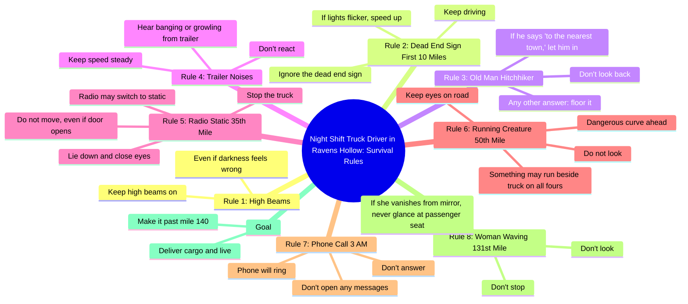

# Night Shift Truck Driver Rules for Surviving Ravens Hollow

> 🌐 **Read this in:** [English](../../en/2026-05/tiktok-transcript-could-you-survive-the-road-tiktokhorror-horror-horrortok-cre-5b01.md) · **中文**

> **Creator:** [@final.instructions](https://www.tiktok.com/@final.instructions) · **Views:** 18.8M · **Posted:** 2026-05-25 · **Niche:** entertainment
>
> **TL;DR:** Immediately places the viewer in a specific, eerie scenario with a mundane yet ominous job.

[Watch original video →](https://www.tiktok.com/@final.instructions/video/7555298672037154061)

## Why This Went Viral

## 钩子（前3秒）
- **逐字开场白：**“恭喜。你被录用为一名夜班卡车司机，负责将肉干运往内华达沙漠深处乌鸦谷的一个小镇。”
- **钩子模式：**场景设定 + 直接称呼（“你”）+ 不祥的世界构建
- **为何能让人停下刷屏：**即时的第二人称框架（“你被录用了”）瞬间制造了个人利害关系。具体而诡异的细节（“肉干”、“乌鸦谷”、“内华达沙漠”）暗示了一个令人毛骨悚然、基于规则的生存故事——这是在TikTok和YouTube Shorts上已被验证的爆款格式。

## 情感节奏
- **节拍：**好奇（工作机会）→ 不安（黑暗感觉不对劲）→ 紧张（死路标志）→ 恐惧（灯光闪烁，加速）→ 悬念（搭便车者测试）→ 惊惧（拖车传来撞击声）→ 恐怖（静止，躺下，别动）→ 骇人（有东西四肢着地奔跑）→ 偏执（电话响了，别接）→ 最终高潮（女人消失，永远别瞥向副驾驶座）→ 解脱/收尾（撑过140英里，你就能活）
- **悬念落地：**每条规则都引入了一个新的威胁，并附有具体、可操作的指示——观众会在脑中模拟“我会怎么做？”
- **高潮时刻：**“如果她从镜子里消失，永远别瞥向副驾驶座。”——转折点在于威胁现在已*进入车内*。
- **共鸣：**这些规则感觉像电子游戏或creepypasta，利用了“规则恐怖”这一共享文化语言。

## 关键词密度
| 关键词/短语 | 次数 | 功能 |
|---|---|---|
| “规则第X条” | 8 | 算法结构（清晰、可扫描的列表格式） |
| “别” | 6 | 情感牵引（指令制造紧张和恐惧） |
| “保持” / “不要” | 5 | 情感牵引（指令性，制造紧迫感） |
| “英里” | 4 | 算法 + 情感（倒计时结构驱动留存） |
| “看” / “回头看” | 3 | 情感（禁忌行为 = 原始恐惧） |
| “加速” / “踩油门” | 2 | 情感（行动 = 肾上腺素飙升） |
| “门开了” | 1 | 情感（单一画面，最大恐惧） |
| “副驾驶座” | 1 | 情感（高潮转折，令人难忘） |

- **算法驱动因素：**“规则第X条”和数字（英里、时间）创建了一个清晰、可重复的格式，平台会因此奖励观看时长和完成率。
- **情感牵引：**“别”、“不要”、“回头看”——否定性指令引发焦虑和期待，让观众欲罢不能。

## 为何能传播
1. **基于规则的格式天然具有分享性。**编号列表（“规则第1条……第2条……第3条……”）是短视频爆款的成熟模板——它创造了一种完成的承诺，观众会感到必须看到最后才能“幸存”于故事。*具体台词：“规则第1条，即使黑暗感觉不对劲，也要保持远光灯亮着。”*
2. **第二人称视角（“你”）强制沉浸。**观众不是被动观察者——他们就是卡车司机。这触发了心理上的“自我参照效应”，让恐惧感变得个人化且即时。*具体台词：“你被录用为一名夜班卡车司机……”*
3. **不断升级的利害关系加上清晰的倒计时。**每条规则都与特定的英里标记或时间挂钩（10英里、第35英里、第50英里、凌晨3点、第131英里、第140英里）。这创造了一个滴答作响的时钟，驱动留存——观众必须观看才能“到达140英里”。*具体台词：“撑过140英里，你就能活下来交付货物。”*
4. **结局反转（威胁进入车辆）鼓励重看。**最后一条规则颠覆了危险在车外的预期。这让视频具有“粘性”——观众会重看以寻找早期线索，评论者则争论各种解读。*具体台词：“如果她从镜子里消失，永远别瞥向副驾驶座。”*
5. **开放式设定激发用户生成内容。**这个世界（乌鸦谷、肉干、拖车里的东西）从未被完全解释。这引发了诸如“拖车里是什么？”和“第二部？”之类的评论——推动算法互动并催生模仿视频。*具体台词：“你可能会听到拖车里传来撞击声或咆哮声。”*

## 你可以借鉴什么
1. **使用编号规则列表作为视频的主干。**它给观众一个明确的理由看到最后（列表完成），并且易于复制。适用于任何高风险场景：“鬼屋生存规则”、“和我妹妹约会的规则”等。
2. **从第一句话开始就用第二人称（“你”）写作。**它能瞬间将被动观众转变为主动参与者。以“你被录用了……”或“你在一间房间里醒来……”开头——永远不要用“一个男人被录用了……”
3. **用具体数字构建倒计时。**将每条规则与一个具体的单位挂钩（英里、分钟、楼层、天数）。这创造了一个心理上的“进度条”，观众会下意识地追踪，从而增加观看时长和完成率。

## Mind Map

## Full Transcript (Generated by [免费 TikTok 文稿生成器](https://toktranscript.com/?utm_source=github&utm_medium=breakdown&utm_campaign=tool_attribution))

> 📝 Transcripts on this page are auto-generated and show the first 60%. Want to transcribe any TikTok in 30 seconds and get the full version? [Try TokTranscript free →](https://toktranscript.com/?utm_source=github&utm_medium=breakdown&utm_campaign=transcript_cta)

Congratulations. You've been hired as a night shift truck driver hauling dried meat to a small town in Ravens Hollow, deep in the Nevada desert. Your pay is good, but to survive the road, you must follow the rules. Rule No. 1, keep your high beams on even if the darkness feels wrong. Rule No. 2, within the first 10 miles, you may see a dead end sign. Ignore it and keep driving. If your lights start to flicker, speed up. Rule No. 3, you may see an old man hitchhiking. If he says to the nearest town, let him in. Any other answer, floor it. Don't look back. Rule No. 4, if you hear banging or growling from the trailer, don't react. Just keep your speed steady. Rule No. 5, by the 35th mile, your radio may suddenly switch to static. Stop the truck, lie down, close your 

*[Read the full transcript on TokTranscript →](https://toktranscript.com/plaza/tiktok-transcript-could-you-survive-the-road-tiktokhorror-horror-horrortok-cre-5b01?utm_source=github&utm_medium=breakdown&utm_campaign=transcript_full)*

## Browse More

- All [entertainment](../../by-niche/zh-CN/entertainment.md) breakdowns
- All [Second-person immersive setup](../../by-pattern/zh-CN/hook-second-person-immersive-setup.md) examples

## Video Info

| | |
|---|---|
| Creator | [@final.instructions](https://www.tiktok.com/@final.instructions) |
| Original video | [https://www.tiktok.com/@final.instructions/video/7555298672037154061](https://www.tiktok.com/@final.instructions/video/7555298672037154061) |
| Original title | Could you survive the road? #tiktokhorror #horror #horrortok #creepyp... |
| Views | 18.8M (18800000) |
| Posted | 2026-05-25 |
| Duration | 0s |
| Niche | `entertainment` |
| Hook pattern | `Second-person immersive setup` |
| Original language | `en` (this page translated by AI) |
| Available languages | en, zh-CN |
| Generated | 2026-05-26 by [TokTranscript](https://toktranscript.com/) |

---

*This breakdown is for educational analysis under fair use. Original video © [@final.instructions](https://www.tiktok.com/@final.instructions). All transcripts are auto-generated and may contain errors.*

*Want to analyze your own TikToks like this? [TokTranscript →](https://toktranscript.com/viral-breakdown?utm_source=github&utm_medium=breakdown&utm_campaign=footer_cta)*