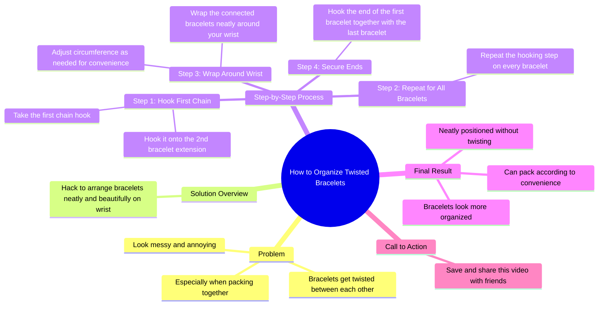

# Bracelet Hack to Prevent Twisting When Packing

> 🌐 **Read this in:** [English](../../en/2026-05/tiktok-transcript-dan-kongsikan-ini-dengan-rakan-rakan-anda-yang-pasti-akan-m-0475.md) · **中文**

> **Creator:** [@habibjewelsofficial](https://www.tiktok.com/@habibjewelsofficial) · **Views:** 960.8K · **Posted:** 2026-05-22 · **Niche:** beauty
>
> **TL;DR:** Starts with a relatable problem to hook viewers who face bracelet tangling.

[Watch original video →](https://vt.tiktok.com/ZSxyNrMTG/)

## Why This Went Viral

## 钩子（前3秒）
- **逐字开场白：** "你的手链有没有缠在一起过？尤其是收纳在一起的时候。"
- **钩子类型：** 提问 + 痛点（共情驱动）
- **为何能阻止滑动：** 它瞬间触发了一种熟悉的挫败感——任何戴多条手链的人都经历过缠绕的混乱。这个问题制造了一个"对，就是我"的时刻，迫使观众停下来寻找解决方案。

## 情绪节奏
1. **好奇 / 共情**（0–3秒）—— "你的手链有没有缠在一起过？" 观众感到被理解。
2. **挫败 / 共鸣**（3–6秒）—— "有时候手链看起来又乱又烦人，对吧？" 强化共同的痛点。
3. **期待**（6–10秒）—— "这是一个小技巧，教你如何整理手链……" 承诺解决方案。
4. **满足 / 解脱**（10–20秒）—— 分步演示营造出"啊哈，真聪明"的感觉。
5. **高潮**（20–22秒）—— "你的手现在看起来更整齐了。整齐有序地摆放，互不缠绕。" —— 视觉回报 + 情绪收尾。
6. **行动号召 / 紧迫感**（22–24秒）—— "收藏并分享这个视频给你的朋友。" 将满足感转化为社交分享。

## 关键词密度
- **手链**（7次）—— 核心产品；驱动搜索和标签覆盖。
- **缠绕**（3次）—— 情绪痛点；触发共鸣。
- **整齐**（3次）—— 期望结果；励志关键词。
- **钩子 / 吸引**（3次）—— 具体动作；教学清晰度。
- **收纳**（2次）—— 场景（旅行/存储）；扩展使用场景覆盖。
- **收藏 / 分享**（2次）—— 算法互动信号；驱动传播。

*算法覆盖驱动因素：* "手链"、"收纳"、"小技巧" —— 高搜索量关键词。
*情绪吸引驱动因素：* "缠绕"、"烦人"、"整齐" —— 触发痛苦与解脱。

## 为何能传播
1. **普遍痛点 → 即时共鸣。** 开场问题（"你的手链有没有缠在一起过？"）是一个"是/否"陷阱，99%戴手链的人都会回答"是"。这迫使他们观看解决方案。
2. **简单、可视化的解决方案，无需额外工具。** 这个技巧只使用手链本身——无需剪刀、胶带或购买任何东西。这降低了尝试的门槛，增加了收藏和分享。
3. **清晰的"前后"情绪回报。** 脚本明确对比了"又乱又烦人"和"整齐有序地摆放"。观众间接感受到解脱，从而促使他们收藏以备后用。
4. **在满足感高峰时直接号召行动。** "收藏并分享这个视频给你的朋友"紧跟在"准备好了"的时刻之后——此时观众最感激，也最愿意配合。
5. **可重复、可分享的格式。** 这个"小技巧"由4个简单步骤组成，任何人都能记住并向朋友演示——非常适合口口相传和转发。

## 你可以借鉴什么
1. **以痛点问题开场**，迫使目标受众回答"是"。例如："你的耳机有没有在口袋里缠成一团过？" —— 瞬间吸引任何带耳机的人。
2. **承诺零成本、零工具的解决方案。** 最火的技巧都使用人们已有的东西。在你的脚本中，尽早明确说明"无需额外材料"，以增加观看时长。
3. **在情绪满足感最高的时刻**（就在"准备好了"揭示之后）**以直接的"收藏和分享"指令结尾**。不要假设观众会主动行动——明确告诉他们该做什么。

## Mind Map

## Full Transcript (Generated by [免费 TikTok 文稿生成器](https://toktranscript.com/?utm_source=github&utm_medium=breakdown&utm_campaign=tool_attribution))

> 📝 Transcripts on this page are auto-generated and show the first 60%. Want to transcribe any TikTok in 30 seconds and get the full version? [Try TokTranscript free →](https://toktranscript.com/?utm_source=github&utm_medium=breakdown&utm_campaign=transcript_cta)

Have your bracelets ever been twisted? between each other Especially when packing together. sometimes bracelets You look messy and annoying, don't you? this is a hack how to start your bracelets to make them visible Neat and beautiful on your wrist. first you take the first chain hook and hook it on The 2nd bracelet extension. Repeat this step on all your bracelets. then wrapped neatly around the wrist You can change the circumference of your br

*[Read the full transcript on TokTranscript →](https://toktranscript.com/plaza/tiktok-transcript-dan-kongsikan-ini-dengan-rakan-rakan-anda-yang-pasti-akan-m-0475?utm_source=github&utm_medium=breakdown&utm_campaign=transcript_full)*

## Browse More

- All [beauty](../../by-niche/zh-CN/beauty.md) breakdowns
- All [Problem-Agitation](../../by-pattern/zh-CN/hook-problem-agitation.md) examples

## Video Info

| | |
|---|---|
| Creator | [@habibjewelsofficial](https://www.tiktok.com/@habibjewelsofficial) |
| Original video | [https://vt.tiktok.com/ZSxyNrMTG/](https://vt.tiktok.com/ZSxyNrMTG/) |
| Original title | 𝘚𝘢𝘷𝘦 dan kongsikan 𝘩𝘢𝘤𝘬 ini dengan rakan-rakan anda yang pasti akan m... |
| Views | 960.8K (960800) |
| Posted | 2026-05-22 |
| Duration | 0s |
| Niche | `beauty` |
| Hook pattern | `Problem-Agitation` |
| Original language | `en` (this page translated by AI) |
| Available languages | en, zh-CN |
| Generated | 2026-05-25 by [TokTranscript](https://toktranscript.com/) |

---

*This breakdown is for educational analysis under fair use. Original video © [@habibjewelsofficial](https://www.tiktok.com/@habibjewelsofficial). All transcripts are auto-generated and may contain errors.*

*Want to analyze your own TikToks like this? [TokTranscript →](https://toktranscript.com/viral-breakdown?utm_source=github&utm_medium=breakdown&utm_campaign=footer_cta)*