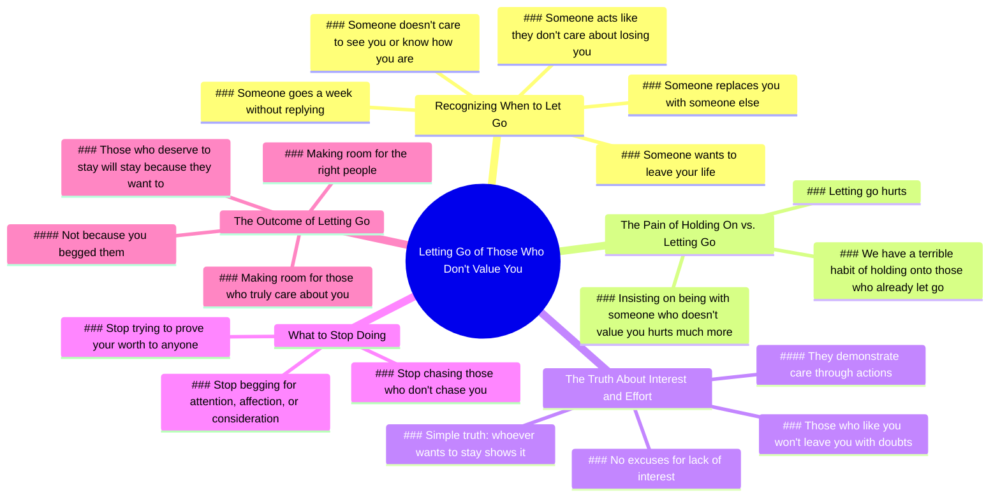

# Let Go When Someone Replaces You

> 🌐 **Read this in:** [English](../../en/2026-05/tiktok-transcript-deixa-ir-coringa-motiva-o-reflexaododia-videostatus-capcut-8a03.md) · **中文**

> **Creator:** [@_coringasemfiltro](https://www.tiktok.com/@_coringasemfiltro) · **Views:** 8.3M · **Posted:** 2026-05-26 · **Niche:** other
>
> **TL;DR:** A series of relatable 'if' scenarios builds urgency and personal relevance.

[Watch original video →](https://www.tiktok.com/@_coringasemfiltro/video/7618763017961999624?is_from_webapp=1&sender_device=pc)

## Why This Went Viral

## 钩子（前3秒）
- **逐字原文：** "如果有人用别人取代你，就放手吧；如果有人一周都不回复你；如果有人不在乎见你、不想知道你好不好；如果有人表现得好像不在乎失去你；如果有人想离开你的生活、走远——打开门，你懂的。"
- **钩子模式：场景+对比** — 一连串快速列举的痛苦关系场景（被取代、被冷落、被漠视），紧接着用"打开门"这一指令形成鲜明对比。
- **为何能阻止滑动：** 它以残酷的精准度映照出观众自身未愈合的伤痛。"如果有人"的重复营造出一种催眠般的节奏，让人感觉像是一份针对个人的诊断。观众会想：*"他们描述的就是我的情况。"* 它绕过逻辑，直接击中情感伤口。

## 情感节奏
- **节拍1 – 认同（0–5秒）：** 列举的场景触发即时认同。观众感到被看见。
- **节拍2 – 确认（5–10秒）：** "很痛，很痛"——重复让痛苦正常化。有人承认伤口的深度，带来解脱感。
- **节拍3 – 重构（10–15秒）：** "但坚持和一个不珍惜你的人在一起……更痛。"——一个转折，将叙事从受害者身份翻转成自我施加的痛苦。
- **节拍4 – 觉醒（15–25秒）：** "我们有个坏习惯，总想抓住那些已经放手的人。"——集体责任。悬念累积，观众感到被点名。
- **节拍5 – 高潮（25–35秒）：** "想留下的人……会用行动证明。喜欢你的人不会让你心存疑虑。"——核心真相清晰落地。情感峰值。
- **节拍6 – 释放（35–45秒）：** "别再追逐。别再乞求。"——宣泄式的允许停止。解脱。
- **节拍7 – 希望（45–60秒）：** "当你不再坚持……为对的人腾出空间。"——解决。面向未来的回报。

## 关键词密度
| 关键词/短语 | 次数（约） | 驱动因素 |
|-------------|-----------|----------|
| "如果有人" | 6 | **算法触达** — 高召回率，通过条件式"如果"模式触发搜索和观看时长。 |
| "放手"/"离开"/"走远" | 5 | **情感拉力** — 核心失去锚点。驱动分享，因为人们会代入自己的故事。 |
| "痛" | 4 | **情感拉力** — 降低心理防御。创造共鸣。 |
| "不在乎"/"不珍惜" | 4 | **情感拉力** — 说出未言明的恐惧。驱动评论。 |
| "别再"/"别再追逐"/"别再乞求" | 4 | **算法触达** — 祈使动词提高留存率和点击率。 |
| "你" | 10+ | **算法触达** — 第二人称最大化个性化，提升观看时长和完成率。 |
| "值得的人"/"对的人" | 3 | **情感拉力** — 希望锚点。驱动收藏和分享以备将来参考。 |

## 为何能传播
1. **痛苦镜像 → 病毒式共情循环**  
   开头的列举如此具体（"取代你"、"一周不回复"），让观众觉得这是写给*他们的*前任、朋友或家人的。这立即触发分享冲动：*"这正是我正在经历的。"* 观众变成了传播者。

2. **祈使结构迫使行动**  
   "打开门"、"别再追逐"、"别再乞求"——这些不是建议，而是命令。这制造了心理紧迫感，驱动高完成率（算法喜欢这个），并让观众评论"我需要听到这个"。

3. **从痛苦到自我责任的转折**  
   "我们有个坏习惯，总想抓住那些已经放手的人"这句话将观众从受害者重新定位为参与者。这是一个认知失调的时刻——不舒服但解放。观众分享它来表明成长，或让*别人*意识到自己的模式。

4. **希望作为结尾奖励**  
   最后一句——"为对的人腾出空间"——提供了回报。这就是为什么它会被收藏和反复观看。它不只是诊断痛苦，还开出了未来的处方。收藏 = 算法提升。

5. **高评论性**  
   视频邀请两种评论：  
   - *个人见证：* "这上个月发生在我身上。"  
   - *标记他人：* "这是给你的 @朋友名。"  
   两者都增加互动信号（评论、分享），从而喂养算法。

## 你可以借鉴什么

1. **"如果有人……"的级联**  
   以一连串快速列举的3–5个痛苦场景开头，让观众*立即*认出。使用相同的句法模式（例如："如果你曾感到……如果你曾疑惑……如果你曾停留太久……"）。这建立催眠节奏，并在几秒内迫使自我认同。

2. **"但真相是"的转折**  
   在命名痛苦之后，插入一句话，将责备从外部转向内部（例如："但真正的问题不是他们——而是你还在坚持。"）。这创造认知失调，驱动分享和收藏。

3. **以"允许"结尾**  
   用一个指令结束，释放观众从他们的模式中，并提供未来回报（例如："别再追逐。别再乞求。当你这样做时，对的人会出现。"）。这赋予视频实用性——观众收藏它以便以后提醒自己，从而提升算法信号。

## Mind Map

## Full Transcript (Generated by [拆解你自己的 TikTok](https://toktranscript.com/?utm_source=github&utm_medium=breakdown&utm_campaign=tool_attribution))

> 📝 Transcripts on this page are auto-generated and show the first 60%. Want to transcribe any TikTok in 30 seconds and get the full version? [Try TokTranscript free →](https://toktranscript.com/?utm_source=github&utm_medium=breakdown&utm_campaign=transcript_cta)

if someone replaces you with someone else let go if someone goes a week without replying to you if someone doesn't care to see you and to know how you are if someone acts like they don't care about losing you if someone wants to leave your life and go away Open the door and you already know. It hurts, it hurts. But insisting on being with someone who doesn't value you. .. It hurts much more. We have the terrible habit of trying To hold onto those who have already let go of our hand. some time ago to create sorry to justify the lack of interest from others But the truth is simple. whoever wants to stay Who cares? demonstrates Those who like you

*[Read the full transcript on TokTranscript →](https://toktranscript.com/plaza/tiktok-transcript-deixa-ir-coringa-motiva-o-reflexaododia-videostatus-capcut-8a03?utm_source=github&utm_medium=breakdown&utm_campaign=transcript_full)*

## Browse More

- All [other](../../by-niche/zh-CN/other.md) breakdowns
- All [conditional cascade](../../by-pattern/zh-CN/hook-conditional-cascade.md) examples

## Video Info

| | |
|---|---|
| Creator | [@_coringasemfiltro](https://www.tiktok.com/@_coringasemfiltro) |
| Original video | [https://www.tiktok.com/@_coringasemfiltro/video/7618763017961999624?is_from_webapp=1&sender_device=pc](https://www.tiktok.com/@_coringasemfiltro/video/7618763017961999624?is_from_webapp=1&sender_device=pc) |
| Original title | Deixa ir.. #coringa #motivação #reflexaododia #videostatus #capcut  |
| Views | 8.3M (8300000) |
| Posted | 2026-05-26 |
| Duration | 0s |
| Niche | `other` |
| Hook pattern | `conditional cascade` |
| Original language | `en` (this page translated by AI) |
| Available languages | en, zh-CN |
| Generated | 2026-05-27 by [TokTranscript](https://toktranscript.com/) |

---

*This breakdown is for educational analysis under fair use. Original video © [@_coringasemfiltro](https://www.tiktok.com/@_coringasemfiltro). All transcripts are auto-generated and may contain errors.*

*Want to analyze your own TikToks like this? [TokTranscript →](https://toktranscript.com/viral-breakdown?utm_source=github&utm_medium=breakdown&utm_campaign=footer_cta)*