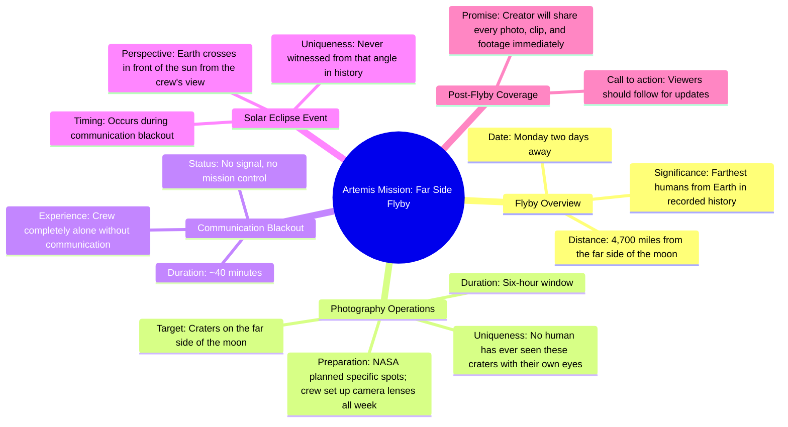

# Artemis Crew Flying Behind the Moon Monday

> 🌐 **Read this in:** [English](../../en/2026-05/tiktok-transcript-don-t-miss-it-8da8.md) · **中文**

> **Creator:** [@niickjackson](https://www.tiktok.com/@niickjackson) · **Views:** 4.1M · **Posted:** 2026-05-28 · **Niche:** other
>
> **TL;DR:** Creates immediate FOMO by framing the content as unmissable and historically important.

[Watch original video →](https://www.tiktok.com/@niickjackson/video/7625074773273480461?q=vlog%20about%20ARTEMIS%20II&t=1779980995009)

## Why This Went Viral

## 钩子（前3秒）
- **逐字开场白：** "请务必不要错过这个，因为这将是整个阿尔忒弥斯任务中最重要的一部分。"
- **钩子模式：** 紧迫感 + 大胆断言（"整个阿尔忒弥斯任务中最重要的一部分"）
- **为何能阻止滑动：** 创作者发出直接指令（"请务必不要错过这个"），并配以最高级断言，承诺独家、高风险内容。这瞬间制造了错失恐惧症——观众会觉得如果滑过去，就会错过历史性时刻。

## 情感节奏
- **节拍1——紧迫/好奇：** "请务必不要错过这个" + "最重要的一部分" → 观众被锁定。
- **节拍2——升级：** "画面……将会绝对疯狂" → 提高赌注。
- **节拍3——具体性/规模：** "有史以来人类离地球最远" → 敬畏 + 紧张。
- **节拍4——悬念/孤立：** "失去所有通讯……完全孤独……没有信号，没有任务控制中心" → 制造脆弱感和情感分量。
- **节拍5——转折/高潮：** "他们将看到日食……从来没有人能从那个角度见证过" → 极致敬畏 + 独家性。
- **节拍6——行动号召：** "现在就关注我……我会给你展示每一张照片" → 紧迫感 + 奖励。

**高潮时刻：** 从月球背面揭示日食——一个前所未有的视角，将孤立（通讯中断）与奇观（日食）结合在一起。

## 关键词密度
- **"月球"**（7次）——核心主题，驱动太空/NASA内容的算法发现。
- **"阿尔忒弥斯"**（3次）——高搜索量的品牌词，算法覆盖。
- **"从未"/"没有人"/"从来"**（4次）——独家性和稀有性，情感吸引力。
- **"疯狂"**（2次）——情感放大器，激发好奇心。
- **"孤独"/"没有通讯"**（2次）——脆弱感，情感共鸣。
- **"周一"**（3次）——特定时间紧迫感，驱动即时行动。
- **"画面"/"照片"/"片段"**（4次）——视觉奖励的承诺，针对"病毒式画面"搜索的算法。

**算法驱动因素：** "阿尔忒弥斯"、"月球"、"NASA"、"周一"——高搜索量、与新闻相关的关键词。
**情感吸引力：** "从未"、"孤独"、"疯狂"、"从来没有人"——独家性和敬畏感。

## 为何能传播
1. **从第一个字开始的紧迫感+错失恐惧症：** "请务必不要错过这个"是一个直接指令，触发错失恐惧症。关心太空的观众会感到必须观看和分享。
2. **敬畏感的逐步升级：** 每句话都增加一层不可能性——"人类有史以来最远"、"没有人见过的陨石坑"、"完全孤独"、"没有人见证过的日食"。视频像倒计时一样构建，让观众感觉自己在见证历史。
3. **"通讯中断"转折制造情感张力：** 40分钟的通讯中断引入了危险和孤立，使机组人员人性化，让日食的揭示显得来之不易。这种情感高峰具有可分享性，因为它是一个故事，而不仅仅是事实。
4. **清晰、有时限的行动号召：** "周一还有两天" + "现在就关注我"创造了具体的截止日期。观众更有可能关注/订阅，因为奖励（独家画面）即将到来且稀缺。
5. **独家视觉内容的承诺：** "每一张照片，每一个片段"——创作者将自己定位为前所未见画面的唯一策展人。这使得该账号成为一个目的地，增加了关注度和可分享性。

## 你可以借鉴什么
1. **以指令+最高级开场：** 以"请务必不要错过这个，因为这将是[最大/最稀有/最疯狂]的[事物]"开始你的视频。这能瞬间制造错失恐惧症和赌注感。
2. **构建"敬畏倒计时"结构：** 不要立即揭示高潮。层层递进地加入细节（距离、孤立、稀有性），让最终的揭示显得来之不易。使用"在那次通讯中断期间……"这样的短语来保持观众的兴趣。
3. **将行动号召锚定在特定的、即将发生的事件上：** "周一还有两天——现在就关注我，这样你就能在照片传回的第一时间看到每一张。"这将一个普通的"关注我"变成了一个有时限的独家访问承诺。

## Mind Map

## Full Transcript (Generated by [TokTranscript](https://toktranscript.com/?utm_source=github&utm_medium=breakdown&utm_campaign=tool_attribution))

> 📝 Transcripts on this page are auto-generated and show the first 60%. Want to transcribe any TikTok in 30 seconds and get the full version? [Try TokTranscript free →](https://toktranscript.com/?utm_source=github&utm_medium=breakdown&utm_campaign=transcript_cta)

Make sure that you do not miss this, because this is about to be the biggest part of the entire Artemis mission. And the footage that comes back from Monday is going to be absolutely insane. So, happening on Monday, the Artemis crew is going to be flying behind the moon, and this is everything that is about to happen. They are going to pass 4,700 miles from the far side of the moon, which will officially make them the farthest humans from earth in all of recorded history. During a six our window, they're gonna be photographing craters from the far side of the moon that no human being has actually ever been able to see before with their own eyes. NASA has already been planning which exact spots that they're going to be shooting, and the crew has been setting up camera lenses all week. So they're ready for this moment. Whenever the Artemis crew is behind the moon, they are gonna be losing all communication with

*[Read the full transcript on TokTranscript →](https://toktranscript.com/plaza/tiktok-transcript-don-t-miss-it-8da8?utm_source=github&utm_medium=breakdown&utm_campaign=transcript_full)*

## Browse More

- All [other](../../by-niche/zh-CN/other.md) breakdowns
- All [Urgency + Promise of Significance](../../by-pattern/zh-CN/hook-urgency-promise-of-significance.md) examples

## Video Info

| | |
|---|---|
| Creator | [@niickjackson](https://www.tiktok.com/@niickjackson) |
| Original video | [https://www.tiktok.com/@niickjackson/video/7625074773273480461?q=vlog%20about%20ARTEMIS%20II&t=1779980995009](https://www.tiktok.com/@niickjackson/video/7625074773273480461?q=vlog%20about%20ARTEMIS%20II&t=1779980995009) |
| Original title | DON’T MISS IT! 🤩 |
| Views | 4.1M (4100000) |
| Posted | 2026-05-28 |
| Duration | 0s |
| Niche | `other` |
| Hook pattern | `Urgency + Promise of Significance` |
| Original language | `en` (this page translated by AI) |
| Available languages | en, zh-CN |
| Generated | 2026-05-29 by [TokTranscript](https://toktranscript.com/) |

---

*This breakdown is for educational analysis under fair use. Original video © [@niickjackson](https://www.tiktok.com/@niickjackson). All transcripts are auto-generated and may contain errors.*

*Want to analyze your own TikToks like this? [TokTranscript 转录工具 →](https://toktranscript.com/viral-breakdown?utm_source=github&utm_medium=breakdown&utm_campaign=footer_cta)*