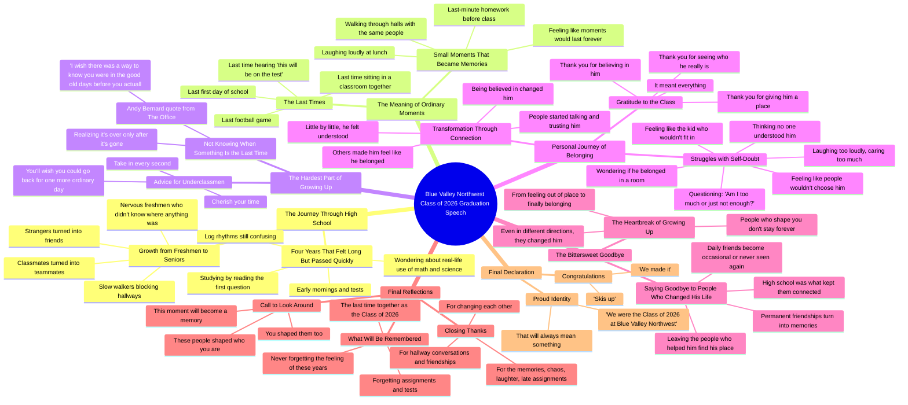

# Sharing My Story at Blue Valley Northwest Graduation

> 🌐 **Read this in:** [English](../../en/2026-05/tiktok-transcript-dream-come-true-getting-to-share-my-story-in-front-of-people-a9cc.md) · **中文**

> **Creator:** [@dylanbarness](https://www.tiktok.com/@dylanbarness) · **Views:** 1.9M · **Posted:** 2026-05-27 · **Niche:** entertainment
>
> **TL;DR:** The hook immediately creates a sense of collective nostalgia and anticipation, drawing the audience into a shared emotional experience.

[Watch original video →](https://www.tiktok.com/t/ZTB2n3hmT/)

## Why This Went Viral

## 开场钩子（前3秒）
- **逐字开场白：** "晚上好，各位教职员工、家人、朋友，最重要的是，蓝谷西北高中2026届的同学们。"
- **钩子模式：** **场景设定 + 直接称呼**——演讲者立即以递进式的具体性称呼听众（"教职员工、家人、朋友，最重要的是……"），营造出一种仪式感且亲切的氛围。
- **为何能阻止刷屏：** "最重要的是"这个短语表明，这场演讲是 *为* 学生们而讲，而不是 *对着* 他们讲。它让人感觉亲切且包容——那些对毕业或归属感有共鸣的观众会立刻感到被看见。停顿和刻意放缓的节奏也营造出一种"这很重要"的分量感，打断了无意识的刷屏行为。

## 情感节奏
- **依次出现的节拍：**
  1. **怀旧与共同记忆** —— "我们曾把毕业说得像某个遥远的终点线" → 唤起集体体验。
  2. **幽默与自嘲** —— "翻开学习指南，读了第一道题，然后只希望剩下的都是选择题" → 缓和气氛，建立共鸣。
  3. **紧张与反思** —— "你永远不知道某件事是最后一次，直到它已经结束" → 引入苦乐参半的分量。
  4. **脆弱感爆发** —— "也许我根本不是那种别人会真正选择的孩子" → 赤裸、私人的坦白，将演讲从泛泛之谈转变为亲密故事。
  5. **共鸣与感恩** —— "你让我感觉我属于这里" → 情感回报，宣泄。
  6. **高潮** —— "那些帮助你塑造自我的人，不可能永远留在你身边" → 最残酷的真相，以平静的方式道出。
  7. **行动号召 + 最终升华** —— "看看这个房间里的每一个人……真正地去看" → 集体时刻，然后"恭喜2026届的同学们，我们做到了" → 胜利的释放。

- **高潮时刻：** "我希望有一种方法，能让你在身处美好旧时光时就知道它，而不是在离开之后才明白" —— 一句广为流传的名言，凝聚了整个演讲的主题。它是情感的锚点。

## 关键词密度
| 词语/短语 | 出现次数（约） | 驱动因素 |
|---|---|---|
| "最后一次" | 7 | **算法覆盖** —— 情感搜索量高，触发怀旧内容推荐 |
| "归属" / "曾归属" | 6 | **情感吸引力** —— 核心人类需求，推动曾感到被排斥的观众分享 |
| "改变" / "改变了我" | 5 | **两者兼具** —— 标志着转变（算法喜欢成长弧线）和深刻的个人影响 |
| "时刻" | 5 | **情感吸引力** —— 足够模糊以具有普遍性，又足够具体以感觉真实 |
| "人们" | 8 | **算法覆盖** —— 高频词，标志着社区内容，提升分类效果 |
| "谢谢" | 6 | **情感吸引力** —— 感恩触发互惠心理，让观众想要分享，作为对自己身边人的一种"感谢" |
| "成长" | 3 | **两者兼具** —— 永恒话题，搜索量高 + 情感深刻 |
| "2026届" | 4 | **算法覆盖** —— 超具体的地点/班级标签，推动本地和校友发现 |

## 为何能广泛传播
1. **普遍怀旧 + 超具体细节** —— "最后一次听到'嘿，这个考试会考'"，是 *每个* 毕业生都认得的台词，但"蓝谷西北高中"这个具体名称让它感觉真实，而非泛泛而谈。观众分享是因为它感觉像 *他们自己的* 故事，但视频显然是真实的。

2. **脆弱感作为分享触发器** —— "我开始问自己一些问题，比如'是我太过了，还是我根本不够好'"，这是大多数人从未说出口的坦白。当演讲者冒着真正的羞耻风险时，观众会情感投入，并感到有必要分享它，作为自己未言明情感的代言。

3. **《办公室》台词作为文化锚点** —— 安迪·伯纳德的那句台词在毕业内容中已经广为流传。通过引用它，演讲者利用了预先存在的情感共鸣。喜欢《办公室》的观众仅凭这一点就会分享——这是一个内置的传播倍增器。

4. **"看看这个房间"的时刻** —— 引导观众实际地互相看看，创造了一个 *共享的仪式*。在家观看的观众会想象自己的房间，自己身边的人。这触发了"@你的伙伴"的冲动——视频变成了一种集体体验，而不仅仅是独白。

5. **情感过山车（幽默 → 痛苦 → 希望）** —— 演讲从"我们翻开学习指南，希望是选择题"（笑）到"也许我根本不是那种别人会真正选择的孩子"（重击），再到"恭喜，我们做到了"（释放）。这种过山车式的体验保持了高留存率——观众不知道接下来会发生什么，所以他们会一直看下去。

## 你可以借鉴什么
1. **从观众开始，而不是从自己开始。** 钩子首先称呼 *他们*（"教职员工、家人、朋友，最重要的是……"）。这标志着视频是关于观众的体验，而不是创作者的自恋。在任何短视频中，都要以观众的问题、身份或欲望开场——而不是你自己的。

2. **嵌入一句广为流传的名言作为叙事支点。** 《办公室》的台词不仅仅是装饰——它是整个演讲的情感支点。使用你的观众已经喜欢的一句名言（来自电视剧、电影、书籍或网络迷因）来凝练你的信息。它给了观众一个现成的分享理由（"这让我想起了《办公室》"）。

3. **运用"一个个人故事"法则。** 演讲大部分是普遍的怀旧，但病毒式传播的爆发点来自于 *那一个具体的、脆弱的故事*（"我想知道是否真的有人理解我"）。创作者应保持80%的内容广泛/有共鸣，但插入一个15-20秒的原始个人时刻。那是值得分享的核心。

## Mind Map

## Full Transcript (Generated by [TokTranscript](https://toktranscript.com/?utm_source=github&utm_medium=breakdown&utm_campaign=tool_attribution))

> 📝 Transcripts on this page are auto-generated and show the first 60%. Want to transcribe any TikTok in 30 seconds and get the full version? [Try TokTranscript free →](https://toktranscript.com/?utm_source=github&utm_medium=breakdown&utm_campaign=transcript_cta)

good evening faculty families friends and most importantly the Blue Valley Northwest Class of 2026 it's strange sitting here right now because for years we've been counting down to this moment we talked about graduation like it was some far away finish line we said things like senior year is gonna fly by or I can't wait to get out of here and now it's actually over and I don't think any of us were really ready for how fast someday could turn into right now four years that felt so long at the beginning somehow turned into just a few short moments moments filled with early mornings we definitely didn't want to wake up for tests we absolutely studied for meaning we opened the study guide read the first question and just hope the rest would be multiple choice and the classic question we all ask ourselves at least once a week in math or science are we ever actually gonna use this in real life and if anyone here ends up using log rhythms after graduation please let the rest of us know because I'm still very confused but in between all of that chaos something important was happening we were growing up these hallways saw us walk in as nervous freshmen who had no idea where anything was and somehow the slowest walkers made the perfect wall across the hallway with not one opening like it was a skill like they were training for it but those awkward first days turned into something so much bigger than we expected strangers turned into friends classmates turned into teammates ordinary moments turned into memories that we didn't realize we'd miss someday because the weird thing about high school is that the moments that seem small while they're happening end up meaning the most later the laughing too loudly at lunch the fantasy punishment the last minute homework before class walking through the halls with the same people every single day those moments felt so normal so permanent like they would just keep happening forever but one day they quietly became the last time the last first day of school the last football game the last time sitting in a classroom together and for most of us the last time hearing hey this will be on the test and suddenly becoming very interested for about five seconds and that's the hardest part about growing up realizing you never know something is the last time until it's already over this reminds me of a quote from a TV show that got me through my hardest days in high school the office Andy Bernard once said I wish there was a way to know you were in the good old days before you actually left them so to any underclassman sitting here tonight take in every second and cherish your time as long as possible because before you know it you'll be sitting in these exact seats wishing you could go back for just one more ordinary day and before you move on there's something I want to share that's a little more personal I wish I was still with you good luck for a while in high school I always thought people would see me as the kid who would never fit in the one who laughed a little too loudly the one who cared a little too much the kind of kid who walks into a room and immediately wonders if he actually belongs there and after a while I started to wonder if I ever would over time I started to question myself I started asking myself questions like am I too much or am I just not enough some days that feeling followed me through these halls sitting in class wondering if anyone actually understood me the way I hoped they would there are moments when I went home turned to my parents and said maybe I'm just not the kind of kid people really chose and that's a hard thought to sit with especially when all you really want is to feel like you matter to anyone and for a while I didn't know if I ever would but something changed over time people started talking to me trusting me with things that matter to them and understanding me and little by little you all helped me realize something that completely changed the way I see myself you made me feel like I belonged and that might sound like a small thing to you but I promise you it isn't because when people believe in

*[Read the full transcript on TokTranscript →](https://toktranscript.com/plaza/tiktok-transcript-dream-come-true-getting-to-share-my-story-in-front-of-people-a9cc?utm_source=github&utm_medium=breakdown&utm_campaign=transcript_full)*

## Browse More

- All [entertainment](../../by-niche/zh-CN/entertainment.md) breakdowns
- All [Shared anticipation](../../by-pattern/zh-CN/hook-shared-anticipation.md) examples

## Video Info

| | |
|---|---|
| Creator | [@dylanbarness](https://www.tiktok.com/@dylanbarness) |
| Original video | [https://www.tiktok.com/t/ZTB2n3hmT/](https://www.tiktok.com/t/ZTB2n3hmT/) |
| Original title | dream come true 🥹 getting to share my story in front of people that c... |
| Views | 1.9M (1900000) |
| Posted | 2026-05-27 |
| Duration | 0s |
| Niche | `entertainment` |
| Hook pattern | `Shared anticipation` |
| Original language | `en` (this page translated by AI) |
| Available languages | en, zh-CN |
| Generated | 2026-05-29 by [TokTranscript](https://toktranscript.com/) |

---

*This breakdown is for educational analysis under fair use. Original video © [@dylanbarness](https://www.tiktok.com/@dylanbarness). All transcripts are auto-generated and may contain errors.*

*Want to analyze your own TikToks like this? [TikTok 转录工具 →](https://toktranscript.com/viral-breakdown?utm_source=github&utm_medium=breakdown&utm_campaign=footer_cta)*