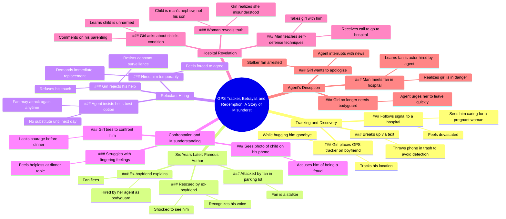

# Girl Plants GPS Tracker on Boyfriend, Finds Him at Hospital

> 🌐 **Read this in:** [English](../../en/2026-05/tiktok-transcript-film-movie-foryou-9be2.md) · **中文**

> **Creator:** [@xuupoaaty](https://www.tiktok.com/@xuupoaaty) · **Views:** 8.8M · **Posted:** 2026-05-24 · **Niche:** entertainment
>
> **TL;DR:** The hook immediately creates intrigue by revealing a secret tracking device, prompting viewers to question the motive.

[Watch original video →](https://vt.tiktok.com/ZSxukyf4x/)

## Why This Went Viral

## 钩子（前3秒）
- **逐字开场白：**"女孩在拥抱男友时，将一个GPS追踪器贴在了他的背上，就在他离开之后。"
- **钩子模式：**场景式叙事钩子（即时行动 + 背叛设定）。
- **为何能阻止滑动：**开场白呈现了一个令人震惊的具体行动（在拥抱时植入GPS追踪器），瞬间传递出高度戏剧性、不信任感以及一个待揭开的秘密。观众被迫想看到这一背叛的后果。

## 情感节奏
- **节拍1 – 好奇 + 悬念：**GPS追踪 → 跟随信号到医院。
- **节拍2 – 紧张 + 震惊：**看到他和一个孕妇在一起 → 情绪崩溃 → 发短信分手 + 扔掉手机。
- **节拍3 – 解脱 + 反转（6年时间跳跃）：**她现在成了著名作家 → 被粉丝袭击 → 被前男友救下。
- **节拍4 – 困惑 + 抗拒：**她拒绝他的帮助，抗拒他的存在，但被迫暂时雇佣他。
- **节拍5 – 误解 + 内疚：**看到孩子的照片 → 指责他欺诈 → 后来得知孩子是他的侄子 → 意识到自己错怪了他。
- **节拍6 – 高潮 + 最终反转：**经纪人透露粉丝是她雇来的演员 → 她现在身处危险之中。
- **高潮时刻：**揭露粉丝是雇佣演员，将整个叙事从浪漫剧翻转成阴谋剧。

## 关键词密度
- **重复最多的词/短语：**
  1. "rastreador gps"（GPS追踪器）——驱动初始悬念和监视主题。
  2. "hospital"（医院）——关键揭露的核心地点（孕妇、孩子、粉丝被捕）。
  3. "agente"（经纪人）——成为反派，通过阴谋驱动算法覆盖。
  4. "fan / admirador"（粉丝/仰慕者）——触发危险和救援，激发保护本能的情感共鸣。
  5. "exnovio"（前男友）——浪漫张力，情感共鸣。
  6. "niño"（孩子）——情感操控，错误假设。
  7. "contratado"（被雇佣）——揭示经纪人的操控，算法覆盖"背叛"模式。
- **算法覆盖驱动因素：**"agente"（经纪人）、"contratado"（被雇佣）、"fan"（粉丝）——创造阴谋和危险标签。
- **情感共鸣驱动因素：**"exnovio"（前男友）、"niño"（孩子）、"rastreador gps"（GPS追踪器）——激发嫉妒、误解和救赎。

## 为何能传播
- **1. 在不到2分钟内设置多个高风险反转：**每个节拍（GPS追踪、怀孕揭露、救援、孩子照片、演员揭露）都是一个小悬念。观众会留下来看下一个反转，然后分享讨论"接下来会发生什么"。
- **2.  relatable 的情感过山车：**叙事触及普遍恐惧（背叛、误判、后悔）和渴望（第二次机会、保护）。"她崩溃了"和"她惊呆了"这样的台词引发共情。
- **3. "误解"套路加上黑暗反转：**经典的"她以为他出轨，但他其实很高尚"被经纪人的阴谋颠覆。这种双层结构（浪漫误解 + 反派经纪人）同时引发"啊"和"什么？！"的反应，推动评论。
- **4. 需要解决的悬念结局：**最后一句"男人意识到女孩现在身处危险"是一个开放循环。观众被驱使评论"接下来发生了什么？"或搜索第二部分，增加观看时间和分享。
- **5. 高密度情感语言：**像"令人作呕的欺诈"、"无能为力"、"无法说服自己"这样的短语放大了戏剧性。这种语言易于引用和制作成梗，鼓励分享。

## 你可以借鉴什么
- **1. 在前3秒以令人震惊的具体行动开场：**不要铺垫背景。直接以最戏剧性的时刻开场（例如，"她在拥抱他时在他身上植入了GPS追踪器"）。这迫使观众问"为什么？"并留下来。
- **2. 使用"时间跳跃"重置风险并增加深度：**跳跃6年（从嫉妒的女友到著名作家）瞬间提升故事的风险，使重逢更加强烈。使用时间跳跃制造对比和新的紧张感。
- **3. 以一个未解决的反转结尾，要求后续：**最后的揭露（经纪人雇佣了粉丝）是一个完全的反转。永远不要解决所有问题。留下一个明确的"现在怎么办？"问题，以推动评论、分享和第二部分观看。

## Mind Map

## Full Transcript (Generated by [免费 TikTok 文稿生成器](https://toktranscript.com/?utm_source=github&utm_medium=breakdown&utm_campaign=tool_attribution))

> 📝 Transcripts on this page are auto-generated and show the first 60%. Want to transcribe any TikTok in 30 seconds and get the full version? [Try TokTranscript free →](https://toktranscript.com/?utm_source=github&utm_medium=breakdown&utm_campaign=transcript_cta)

La chica colocó un rastreador gps en la espalda de su novio mientras lo abrazaba después de que él se marchara. Ella siguió la señal hasta un hospital. Al verlo cuidando a una mujer embarazada, se derrumbó. Le envió un mensaje de texto para romper con él antes de tirar su teléfono a una papelera para evitar ser descubierta. 6 años más tarde, ahora convertida en una autora famosa, fue atacada por un admirador fanático en un aparcamiento. De repente, apareció un hombre y la rescató. Ella reconoció su voz. Era su exnovio, al que había perdido el rastro hacía tiempo. Se quedó atónita al encontrarlo allí. Él le explicó que su agente lo había contratado como su guardaespaldas. El fan huyó. El hombre intentó ayudarla a levantarse, pero ella rechazó su contacto. La chica se resistía a que él la siguiera constantemente, pero su agente insistió en que era el mejor guardaespaldas disponible. No encontraría un sustituto hasta después del mediodía del día siguiente. Como era probable que el fan la acosara de nuevo en cualquier momento, la chica contrató a regañadientes a su exnovio de forma temporal. Le dijo a su agente que debía encontrar un sustituto inmediatamente. No esperaría ni un segundo más. La chica intentó confrontar al hombre por su engaño pasado, pero le faltó el valor para enfrentarse a él antes de la cena. Al ver una fotografía de un niño pequeño en el teléfono del hombre, lo acusó de ser un repulsivo fraude. Sentada Impotente a la mesa del comedor, se encontró incapaz de convencerse a sí misma de dejar atrás sus sentimientos por él. A la mañana siguiente, mientras enseñaba a la chica algunas técni

*[Read the full transcript on TokTranscript →](https://toktranscript.com/plaza/tiktok-transcript-film-movie-foryou-9be2?utm_source=github&utm_medium=breakdown&utm_campaign=transcript_full)*

## Browse More

- All [entertainment](../../by-niche/zh-CN/entertainment.md) breakdowns
- All [Mystery/Deception Hook](../../by-pattern/zh-CN/hook-mystery-deception-hook.md) examples

## Video Info

| | |
|---|---|
| Creator | [@xuupoaaty](https://www.tiktok.com/@xuupoaaty) |
| Original video | [https://vt.tiktok.com/ZSxukyf4x/](https://vt.tiktok.com/ZSxukyf4x/) |
| Original title | #film #movie #foryou  |
| Views | 8.8M (8800000) |
| Posted | 2026-05-24 |
| Duration | 0s |
| Niche | `entertainment` |
| Hook pattern | `Mystery/Deception Hook` |
| Original language | `en` (this page translated by AI) |
| Available languages | en, zh-CN |
| Generated | 2026-05-25 by [TokTranscript](https://toktranscript.com/) |

---

*This breakdown is for educational analysis under fair use. Original video © [@xuupoaaty](https://www.tiktok.com/@xuupoaaty). All transcripts are auto-generated and may contain errors.*

*Want to analyze your own TikToks like this? [TokTranscript 转录工具 →](https://toktranscript.com/viral-breakdown?utm_source=github&utm_medium=breakdown&utm_campaign=footer_cta)*