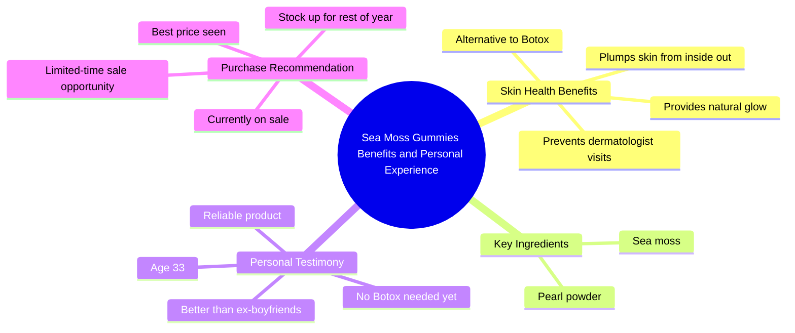

# Sea Moss Gummies for Glowing Clear Skin

> 🌐 **Read this in:** [English](../../en/2026-05/tiktok-transcript-glowier-clearer-skin-from-gummies-that-won-t-let-you-down-li-6742.md) · **中文**

> **Creator:** [@astaxanthin.queen](https://www.tiktok.com/@astaxanthin.queen) · **Views:** 2.5M · **Posted:** 2026-05-29 · **Niche:** beauty
>
> **TL;DR:** Uses a humorous, relatable regret about exes to pivot to a glowing product endorsement.

[Watch original video →](https://www.tiktok.com/@astaxanthin.queen/video/7467254962620271915?is_from_webapp=1&sender_device=pc)

## Why This Went Viral

## 钩子（前3秒）
- **逐字开场白：** "我或许会后悔交往过的一些前任，但我绝不会后悔买过的所有罐海苔软糖"
- **钩子模式：** 反差 / 引发共鸣的坦白
- **为何能留住观众：** 以普遍能引发共鸣的情感创伤（后悔前任）开场，随即转向产品推荐。这种反差（"后悔前任" vs. "绝不后悔软糖"）制造认知失调，迫使观众继续观看以理解其中关联。

## 情感节奏
- **节拍1：引发共鸣的脆弱感**（后悔前任）→ 瞬间建立认同感
- **节拍2：好奇转折**（"绝不后悔那些罐子"）→ 观众需要知道原因
- **节拍3：紧张释放**（"让我不用去皮肤科"）→ 铺垫的回报
- **节拍4：情感共鸣**（"我任何一个前任男友都做不到"）→ 幽默 + 赋权
- **节拍5：社会证明**（"听他们告诉你的时候"）→ 权威转移
- **节拍6：反差高潮**（"以为现在该打肉毒杆菌了……这些软糖拯救了我"）→ 最高情感峰值
- **节拍7：紧迫感飙升**（"趁现在打折"）→ 稀缺性触发
- **节拍8：结尾反转**（"不像我的前任，这是我知道可以信赖的东西"）→ 呼应 + 最终情感冲击
- **高潮时刻：** "这些软糖拯救了我"——"拯救"一词将产品从美容层面提升到改变人生的高度

## 关键词密度
| 词/短语 | 频率 | 功能 |
|---|---|---|
| **容光焕发 / 发光** | 3次 | 情感吸引力 + 视觉益处（皮肤光泽是理想追求） |
| **前任 / 前男友** | 4次 | 引发共鸣的痛点 + 对比机制 |
| **软糖** | 4次 | 核心产品关键词（算法覆盖美容/保健品搜索） |
| **打折** | 2次 | 稀缺性 + 转化触发 |
| **literally（简直）** | 2次 | 口语化强调（增强真实感） |
| **年轻 / 肉毒杆菌** | 2次 | 抗衰老追求（高情感吸引力） |
| **囤货 / 囤积** | 2次 | 紧迫感 + 购买意图信号 |

- **算法驱动因素：** "软糖"、"打折"、"皮肤"、"肉毒杆菌"——美容/保健品领域高搜索量
- **情感驱动因素：** "前任"、"容光焕发"、"拯救"、"年轻"——触发身份认同/虚荣心/共鸣感

## 为何能传播
1. **情感诱饵式钩子**——第一句话利用普遍存在的后悔情绪（前任）让产品推荐显得真实而非推销。对"后悔前任"有共鸣的观众会留下来看结果。
2. **引发共鸣的反派设定**——"我任何一个前任男友都做不到"将产品塑造成英雄，前任成为笑点。这极具分享性，因为它验证了观众自身的情感不满。
3. **稀缺性 + 社会证明融入情感故事**——"趁现在打折……我见过的最低价"在不显得强推的情况下制造紧迫感，因为它嵌入在个人推荐中。
4. **意想不到的年龄揭示**——"我33岁……以为现在该打肉毒杆菌了"让创作者更人性化，使"容光焕发"的说法更可信。30岁以下观众看到可参考路径；30岁以上观众看到自我验证。
5. **呼应式结尾**——"不像我的前任，这是我知道可以信赖的东西"为视频画上句号，使其完整且易于引用。令人难忘的结尾推动分享。

## 可借鉴之处
1. **"后悔X但绝不后悔Y"模式**——以引发共鸣的痛点（前任、糟糕的购物、失败的节食）开场，然后转向你的产品作为例外。反差吸引注意力。
2. **将紧迫感嵌入故事中**——不要孤立地说"打折即将结束"。将其包裹在个人利害关系中："我正准备囤够下半年的量……我不知道他们什么时候会再打折。"
3. **用前任作为陪衬**——将产品与过去的关系进行比较是低成本、高共鸣的喜剧手法。它让产品感觉像"值得保留的"，而观众会觉得自己选择它更明智。

## Mind Map

## Full Transcript (Generated by [我们用的转录工具](https://toktranscript.com/?utm_source=github&utm_medium=breakdown&utm_campaign=tool_attribution))

> 📝 Transcripts on this page are auto-generated and show the first 60%. Want to transcribe any TikTok in 30 seconds and get the full version? [Try TokTranscript free →](https://toktranscript.com/?utm_source=github&utm_medium=breakdown&utm_campaign=transcript_cta)

I may regret some of my exes but I will never regret all the jars of sea Moss gummies I bought because this has literally kept me out of the dermatologist office and given me the best glow literally has me glowing which none of my ex boyfriends could ever do like seriously listen to them when they tell you sea moss and pearl powder is so good for your skin and will literally plump it from the inside out really thought I'd be getting some Botox by now I'm 33 like I thought it'd be time but these gummies have saved me and that's why I will always 

*[Read the full transcript on TokTranscript →](https://toktranscript.com/plaza/tiktok-transcript-glowier-clearer-skin-from-gummies-that-won-t-let-you-down-li-6742?utm_source=github&utm_medium=breakdown&utm_campaign=transcript_full)*

## Browse More

- All [beauty](../../by-niche/zh-CN/beauty.md) breakdowns
- All [Contrast & Relatable Regret](../../by-pattern/zh-CN/hook-contrast-relatable-regret.md) examples

## Video Info

| | |
|---|---|
| Creator | [@astaxanthin.queen](https://www.tiktok.com/@astaxanthin.queen) |
| Original video | [https://www.tiktok.com/@astaxanthin.queen/video/7467254962620271915?is_from_webapp=1&sender_device=pc](https://www.tiktok.com/@astaxanthin.queen/video/7467254962620271915?is_from_webapp=1&sender_device=pc) |
| Original title | Glowier clearer skin from gummies that won't let you down like your e... |
| Views | 2.5M (2500000) |
| Posted | 2026-05-29 |
| Duration | 0s |
| Niche | `beauty` |
| Hook pattern | `Contrast & Relatable Regret` |
| Original language | `en` (this page translated by AI) |
| Available languages | en, zh-CN |
| Generated | 2026-05-31 by [TokTranscript](https://toktranscript.com/) |

---

*This breakdown is for educational analysis under fair use. Original video © [@astaxanthin.queen](https://www.tiktok.com/@astaxanthin.queen). All transcripts are auto-generated and may contain errors.*

*Want to analyze your own TikToks like this? [免费 TikTok 文稿生成器 →](https://toktranscript.com/viral-breakdown?utm_source=github&utm_medium=breakdown&utm_campaign=footer_cta)*