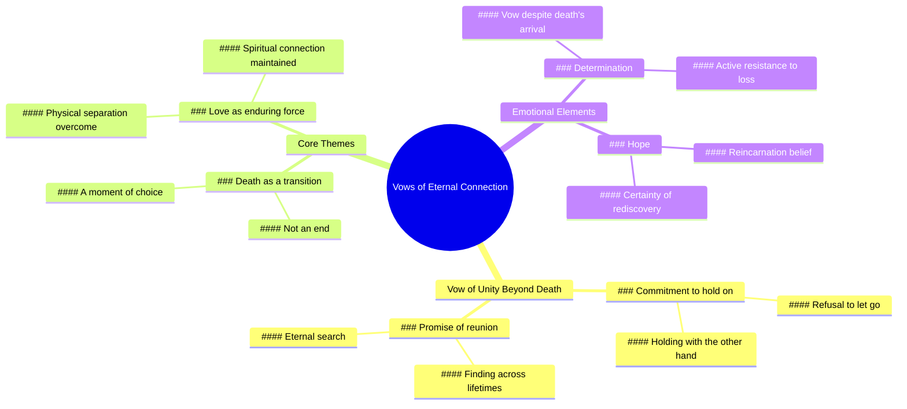

# Sweetest Wedding Vows Made Me Cry While Editing

> 🌐 **Read this in:** [English](../../en/2026-05/tiktok-transcript-i-actually-cried-editing-this-the-sweetest-vows-weddingtikto-6126.md) · **中文**

> **Creator:** [@meganraefilms](https://www.tiktok.com/@meganraefilms) · **Views:** 17.9M · **Posted:** 2026-05-27 · **Niche:** other
>
> **TL;DR:** Creates a powerful emotional contrast by promising to defy death itself.

[Watch original video →](https://www.tiktok.com/@meganraefilms/video/7296262379602480430?is_from_webapp=1&sender_device=pc&web_id=7632039376462595606)

## Why This Went Viral

## 钩子（前3秒）
- **逐字开场：** “最后我发誓，当死亡选择牵起我的手时”
- **钩子模式：** 场景/情感承诺（誓言）+ 对比（死亡 vs. 紧握）
- **为何能阻止滑动：** 它从句子中间开始（“最后”），营造出亲密感和紧迫感。“发誓”一词标志着高风险的情感承诺，而“死亡”则立即引入紧张感。观众会暂停下来，等待这个戏剧性承诺的结局。

## 情感节奏
1. **好奇 + 紧张**（0–3秒）：“最后我发誓，当死亡选择牵起我的手时”——不完整的句子，高风险，观众会凑近观看。
2. **悬念 + 期待**（3–6秒）：“我会用另一只手握住你”——出人意料的转折：死亡牵起一只手，但说话者用另一只手继续紧握。颠覆了“死亡将我们分离”的常见套路。
3. **共鸣 + 情感高峰**（6–9秒）：“我会找到……我会用另一只手握住你”——“我会”的重复构建了确定性。轻微的停顿（“我会找到……我会握住”）增添了未经编排的真实感。
4. **高潮 + 释放**（9–12秒）：“我承诺在每一世都找到你”——最终的回报。将誓言从死亡扩展到轮回，创造出超越性的情感高潮。
5. **余韵**（视频结束后）：“在每一世都找到你”这句话久久萦绕，促使观众重看和分享。

## 关键词密度
| 词语/短语 | 次数（约） | 驱动因素 |
|-----------|-----------|----------|
| **我会** | 3次 | 算法 + 情感——重复表明承诺，创造有节奏的记忆点 |
| **握住你** | 2次 | 情感——触觉上的、亲密的、普遍理解的 |
| **找到你** | 2次 | 情感 + 算法——“找到”触发爱情/失去类内容的搜索相关性 |
| **死亡** | 1次 | 情感——高冲击力，制造紧张感，但谨慎使用以避免过度戏剧化 |
| **发誓 / 承诺** | 2次 | 情感——将内容从随意提升到神圣 |
| **每一世** | 1次 | 算法——轮回、灵魂伴侣和灵性领域的搜索关键词 |
| **牵起我的手** | 1次 | 情感——视觉化的、隐喻的、易于想象 |

**算法驱动因素：** “我会”、“找到你”、“每一世”——在爱情/失去/灵性领域内可搜索、可分享且符合潮流。  
**情感吸引力：** “握住你”、“死亡”、“发誓”——触发深层、普遍的依恋和失去恐惧的情感。

## 为何能传播
1. **不完整的开场迫使完成偏差。** 以“最后”开头让大脑渴望知道开头。观众会看完整个内容以解决认知缺口。*文本证据：“最后我发誓……”*
2. **用转折颠覆普遍恐惧。** 死亡通常意味着分离。“当死亡选择牵起我的手时 / 我会用另一只手握住你”这句话颠覆了剧本：死亡不会分离，只是改变了你握住的方式。这种惊喜触发情感分享。*文本证据：“用另一只手握住你”*
3. **重复创造催眠般的节奏。** 12秒内重复三次“我会”构建了类似吟诵的韵律。这使得这句话容易记住和引用，推动转发和合拍。*文本证据：“我会握住……我会找到……我会握住”*
4. **最后一句是完美的可分享金句。** “我承诺在每一世都找到你”是自成一体的、浪漫的，并且契合“灵魂伴侣”内容生态。它可以作为婚礼、悲伤或重逢视频的画外音。*文本证据：“我承诺在每一世都找到你”*
5. **真实的停顿增加信任。** 轻微的犹豫（“我会找到……我会握住”）表明未经编排的情感。在AI内容精雕细琢的时代，原始的呈现感觉更真实，能获得更高的参与度。*文本证据：“我会找到……我会握住”（停顿）*

## 你可以借鉴什么
1. **从句子中间开始。** 以“和”、“但”或“因为”开头，立即创造好奇心。观众会倒回去看开头，从而提高留存率。
2. **使用“普遍真理的转折”模式。** 选取一个常见的恐惧（死亡、拒绝、失败），并用一个充满希望或出人意料的后续来颠覆它。例如：“当他们转身离开时，我会站在原地——因为我知道门是双向开的。”
3. **重复一个核心承诺三次。** 选择一个简短、情感化的短语（“我会”、“我选择”、“我留下”），并用细微的变化重复它。这会让你的视频易于引用、混音，并且对算法友好（通过节奏提高观看时长）。

## Mind Map

## Full Transcript (Generated by [TokTranscript 转录工具](https://toktranscript.com/?utm_source=github&utm_medium=breakdown&utm_campaign=tool_attribution))

> 📝 Transcripts on this page are auto-generated and show the first 60%. Want to transcribe any TikTok in 30 seconds and get the full version? [Try TokTranscript free →](https://toktranscript.com/?utm_source=github&utm_medium=breakdown&utm_campaign=transcript_cta)

and lastly I vow that when death does choose to take my hand I will hold you with my other I will find I 

*[Read the full transcript on TokTranscript →](https://toktranscript.com/plaza/tiktok-transcript-i-actually-cried-editing-this-the-sweetest-vows-weddingtikto-6126?utm_source=github&utm_medium=breakdown&utm_campaign=transcript_full)*

## Browse More

- All [other](../../by-niche/zh-CN/other.md) breakdowns
- All [conditional promise](../../by-pattern/zh-CN/hook-conditional-promise.md) examples

## Video Info

| | |
|---|---|
| Creator | [@meganraefilms](https://www.tiktok.com/@meganraefilms) |
| Original video | [https://www.tiktok.com/@meganraefilms/video/7296262379602480430?is_from_webapp=1&sender_device=pc&web_id=7632039376462595606](https://www.tiktok.com/@meganraefilms/video/7296262379602480430?is_from_webapp=1&sender_device=pc&web_id=7632039376462595606) |
| Original title | i actually cried editing this 😭 the sweetest vows #weddingtiktok #fyp... |
| Views | 17.9M (17900000) |
| Posted | 2026-05-27 |
| Duration | 0s |
| Niche | `other` |
| Hook pattern | `conditional promise` |
| Original language | `en` (this page translated by AI) |
| Available languages | en, zh-CN |
| Generated | 2026-05-28 by [TokTranscript](https://toktranscript.com/) |

---

*This breakdown is for educational analysis under fair use. Original video © [@meganraefilms](https://www.tiktok.com/@meganraefilms). All transcripts are auto-generated and may contain errors.*

*Want to analyze your own TikToks like this? [免费 TikTok 文稿生成器 →](https://toktranscript.com/viral-breakdown?utm_source=github&utm_medium=breakdown&utm_campaign=footer_cta)*