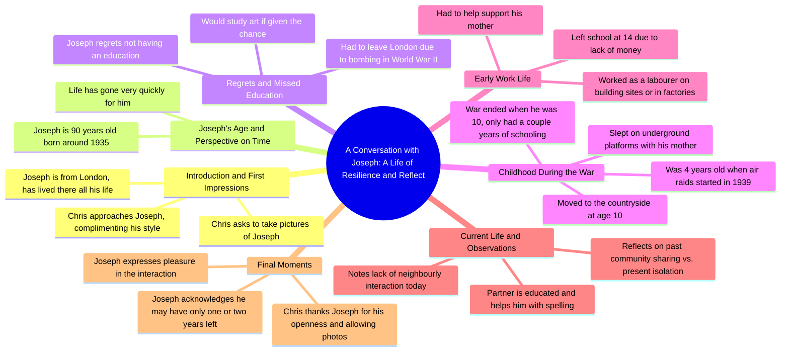

# Model Strangers Street Photography After Three Years

> 🌐 **Read this in:** [English](../../en/2026-05/tiktok-transcript-i-have-been-working-on-model-strangers-for-almost-three-year-df88.md) · **中文**

> **Creator:** [@modelstrangers](https://www.tiktok.com/@modelstrangers) · **Views:** 3.1M · **Posted:** 2026-05-29 · **Niche:** entertainment
>
> **TL;DR:** Opens with a genuine, emphatic compliment that immediately disarms and intrigues the viewer.

[Watch original video →](https://vm.tiktok.com/ZNRWuVT7Q/)

## Why This Went Viral

## 钩子（前3秒）
- **逐字开场白：** "打扰一下先生，我叫克里斯，我觉得你非常有型，非常非常有型"
- **钩子模式类型：** 场景 + 赞美（街头赞美 / 意外善意）
- **为何能阻止滑动：** 即时、真诚的赞美（"非常非常有型"）营造出温暖、意外的瞬间。观众会停下来，因为他们期待一段积极的人际互动，这在短视频内容中既罕见又令人耳目一新。

## 情感节奏
- **好奇 → 温暖 → 脆弱 → 怀旧 → 忧郁 → 感恩 → 情感宣泄**
- **悬念：** 当克里斯问"您多大年纪了？"而约瑟夫回答"90岁"时——年龄差距制造了悬念，让人好奇接下来会有什么智慧或故事。
- **共鸣：** 约瑟夫对错过教育的遗憾以及学习艺术的渴望在情感上能打动人，因为这是普世的（未实现的潜力）。
- **转折：** 从轻松的赞美转向深刻的人生反思（"我没剩下多少年了"）让观众感到意外。
- **高潮：** 约瑟夫说"我没剩下多少年了……我可能还有一年，可能还有两年"——赤裸裸地直面死亡。
- **结局：** 克里斯的感谢和约瑟夫优雅的"很高兴认识你"给观众带来一种圆满和温暖的感觉。

## 关键词密度
- **"教育"**（5次）—— 驱动情感吸引力（遗憾、错失的机会）和算法覆盖（教育类内容标签）
- **"年"**（4次）—— 算法（年龄/人生阶段内容）+ 情感（死亡）
- **"母亲"**（4次）—— 情感吸引力（家庭、脆弱）
- **"战争"**（3次）—— 算法（历史内容）+ 情感（共同创伤）
- **"遗憾"**（2次）—— 高情感共鸣（普世主题）
- **"有型"**（2次）—— 钩子词，激发好奇心
- **"伦敦"**（2次）—— 基于位置的算法覆盖
- **"钱"**（2次）—— 经济脆弱性，情感吸引力
- **"轰炸"**（1次）—— 强烈的历史/情感锚点
- **"地下"**（1次）—— 生动的意象，怀旧触发点

## 为何能传播
1. **从赞美钩子到意想不到的深度：** 视频以轻松、积极的互动开始（"你看起来非常有型"），然后转向深刻的人生故事。这种反差让观众保持参与，因为他们不知道接下来会发生什么。*具体台词："你是伦敦人吗……你一辈子都住在这里吗……这里根本没有钱"*

2. **死亡制造紧迫感：** 约瑟夫承认时间有限（"我没剩下多少年了"）触发情感分享。人们会分享那些让他们反思人生的内容。*具体台词："我可能还有一年，可能还有两年，所以我不知道"*

3. **代际桥梁：** 一个年轻人（克里斯）和一位90岁老人（约瑟夫）之间的互动创造了跨代吸引力。年轻和年长的观众都能看到自己或祖辈的影子。*具体台词："我的伴侣很有教养，她有时会教我"*

4. **脆弱得到回报：** 约瑟夫公开承认遗憾、缺乏教育和孤独。这种情感上的坦诚显得稀有而珍贵，让观众想要通过分享来尊重他的故事。*具体台词："如果有什么让我遗憾的事，我会重来一次，我真的会学习艺术"*

5. **过去与现在的对比：** 约瑟夫将社区价值观（"你们互相帮助"）与现代的孤立（"你得锁好自行车……不和隔壁邻居说话"）进行对比。这种怀旧的批评能引起广泛共鸣。*具体台词："很多年前，你们互相帮助……现在不是这样了"*

## 你可以借鉴什么
1. **以赞美开头，而不是问题：** 与其问"你好吗？"或"我能问你点事吗？"——不如以真诚、具体的赞美开场。这能让对方放下戒备，并立即吸引观众。应用：在你的下一个视频中，在提问之前先以"我喜欢你的[具体细节]"开场。

2. **问一个关于"遗憾"的问题：** 最火爆的瞬间来自"你有什么遗憾吗？"这个问题具有普世性、安全性，同时又极具情感深度。应用：在任何采访或对话视频中，问"你希望自己当初做了什么不同的事？"——这总能带来精彩内容。

3. **让沉默和停顿自然呼吸：** 约瑟夫的停顿（"我没剩下多少年了……我是说……哦，我可能还有一年"）比言语更有力量。应用：不要急于填补空白。在情感表达后留出1-2秒的沉默——这会放大冲击力，给观众时间去感受。

## Mind Map

## Full Transcript (Generated by [拆解你自己的 TikTok](https://toktranscript.com/?utm_source=github&utm_medium=breakdown&utm_campaign=tool_attribution))

> 📝 Transcripts on this page are auto-generated and show the first 60%. Want to transcribe any TikTok in 30 seconds and get the full version? [Try TokTranscript free →](https://toktranscript.com/?utm_source=github&utm_medium=breakdown&utm_campaign=transcript_cta)

excuse me sir my name is Chris I think you look very stylish very very stylish oh thank you are you from London yes have you lived here all your life all my life there's no money at all it's just me taking a pic couple of pictures of you oh hi Joseph Joseph nice to meet you Joseph thank you I'm very selective about who I approach what age of a man are you if you don't mind me asking 90 oh 19 35 has life gone very quickly for you oh god yeah yeah do you have any regrets I never had education I had to leave London and go and live in the country over my mother because of the bombing education is a wonderful thing and unfortunately I missed out on it mm hmm and if there's anything I regret I would do it again I'd really study art you know 1939 I think I was 4 when the air race started we'd go down in the underground and stay there she slept on the platform and in the morning you get up and then it was open so me and my mother and that that that house was still there my mother decided that we should go to the country you have to live with a family that I was 10 when the war finished only done a couple of years I left school at 14 because my mother had no money just had to um find a job and help support my mother do you remember what job then did you get well labouring labouring cause I I never had education you know on a building site or in a factory ye

*[Read the full transcript on TokTranscript →](https://toktranscript.com/plaza/tiktok-transcript-i-have-been-working-on-model-strangers-for-almost-three-year-df88?utm_source=github&utm_medium=breakdown&utm_campaign=transcript_full)*

## Browse More

- All [entertainment](../../by-niche/zh-CN/entertainment.md) breakdowns
- All [Compliment Hook](../../by-pattern/zh-CN/hook-compliment-hook.md) examples

## Video Info

| | |
|---|---|
| Creator | [@modelstrangers](https://www.tiktok.com/@modelstrangers) |
| Original video | [https://vm.tiktok.com/ZNRWuVT7Q/](https://vm.tiktok.com/ZNRWuVT7Q/) |
| Original title | I have been working on Model Strangers for almost three years now, an... |
| Views | 3.1M (3100000) |
| Posted | 2026-05-29 |
| Duration | 0s |
| Niche | `entertainment` |
| Hook pattern | `Compliment Hook` |
| Original language | `en` (this page translated by AI) |
| Available languages | en, zh-CN |
| Generated | 2026-05-30 by [TokTranscript](https://toktranscript.com/) |

---

*This breakdown is for educational analysis under fair use. Original video © [@modelstrangers](https://www.tiktok.com/@modelstrangers). All transcripts are auto-generated and may contain errors.*

*Want to analyze your own TikToks like this? [TokTranscript →](https://toktranscript.com/viral-breakdown?utm_source=github&utm_medium=breakdown&utm_campaign=footer_cta)*